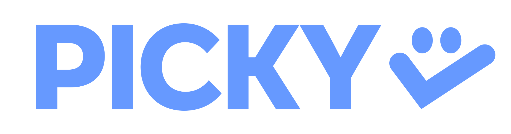

<p align="center">
  
</p>

# Picky

<p align="center">
  <a href="./README.md">English</a>
</p>

**macOS에서 Pi를 커서 옆에 두고 쓰는 로컬 우선 앱.**

Picky는 지금 하고 있는 일의 흐름을 끊지 않고 Pi를 불러올 수 있게 해줍니다. 단축키를 누른 채 말하거나 텍스트를 입력하면, Picky가 커서 옆에 나타나 지금 보고 있는 화면, 현재 URL, 선택한 텍스트, 스크린샷, 작업 공간 같은 컨텍스트를 Pi에게 전달합니다.

번역, 짧은 질문, 작은 수정처럼 가벼운 요청은 Picky가 그 자리에서 바로 도와줄 수 있습니다. 시간이 더 필요한 작업이라면 **Pickle**에게 넘길 수 있어요. Pickle은 Picky Dock에서 계속 실행되는 또 다른 Pi 세션이라, 사용자는 다음 일을 하면서도 작업 상태를 계속 확인할 수 있습니다.

Picky는 일부러 가볍게 만들었습니다. 커서를 따라다니고, 사용자가 시작한 요청에 대해서만 컨텍스트를 수집하며, 작업은 로컬에 유지합니다. Picky를 메인 에이전트, Pickle을 서브 에이전트처럼 이해해도 좋습니다. 핵심은 간단합니다. **둘 다 결국 Pi 세션**입니다.

## 왜 Picky인가요?

에이전트에게 일을 맡기려면 종종 준비 과정이 필요합니다. URL을 복사하고, Slack 스레드를 붙여넣고, Notion 문서를 export하고, 스크린샷을 찍고, 어디를 봐야 하는지 설명한 뒤에야 겨우 질문을 시작하곤 하죠.

Picky는 이 준비 과정을 줄여줍니다. 이미 화면에 있는 맥락을 Pi에게 전달하고, Pi가 요청을 바로 처리할지 아니면 오래 실행되는 Pickle에게 넘길지 결정하도록 돕습니다.

Picky가 도와주는 일:

- **어디서든 시작하기** — 앱을 전환하지 않고 push-to-talk 또는 빠른 텍스트 입력으로 요청을 시작합니다.
- **필요한 컨텍스트 전달하기** — 현재 앱, 창, 선택한 텍스트, 브라우저 페이지, 스크린샷, 작업 디렉터리를 함께 보냅니다.
- **중요한 부분 표시하기** — 말로 길게 설명하지 않고, 화면에서 필요한 부분을 표시해 Pi가 어디를 봐야 하는지 알려줍니다.
- **오래 걸리는 작업 추적하기** — 실행 중인 여러 Pickle을 Picky Dock에서 상태, 로그, 산출물, 후속 요청과 함께 확인합니다.
- **자연스럽게 이어서 요청하기** — Pickle도 Pi 세션이므로 필요한 후속 요청을 그대로 이어서 보낼 수 있습니다.
- **로컬 우선 유지하기** — Picky는 사용자의 로컬 Pi 환경에서 동작하며 별도의 백엔드를 요구하지 않습니다.

## 사용하는 느낌

```text
단축키 누르기 → 화면에서 필요한 부분 표시하기 → Picky에게 요청하기 → Pickle이 일하는 모습 보기
```

1. 음성 또는 텍스트로 Picky를 호출합니다.
2. Picky가 현재 보고 있는 화면의 정보(UI, URL, 선택한 텍스트, 스크린샷 등)와 사용자가 표시한 영역을 확인합니다.
3. Pi가 요청을 바로 처리하거나, 필요하면 모니터링, 다시 열기, 후속 요청, Pi에서 이어 하기가 가능한 Pickle을 시작합니다.

## 주요 기능

| 기능           | 의미                                                  |
| ------------ | --------------------------------------------------- |
| 커서 옆 컴패니언    | 음성/텍스트 입력이 커서 옆에 나타나 현재 흐름을 끊지 않고 도움을 요청할 수 있습니다.   |
| Push-to-talk | 전역 단축키를 누른 채 자연스럽게 말합니다.                            |
| 빠른 텍스트 입력    | 현재 앱을 떠나지 않고 요청을 입력합니다.                             |
| 컨텍스트 캡처      | Picky는 메시지를 보내는 순간에만 컨텍스트를 수집합니다.                   |
| 화면 표시        | 필요한 영역을 표시해 Pi가 화면의 올바른 부분에 집중하도록 돕습니다.             |
| Pickle Dock  | 오래 걸리는 Pi 작업을 상태, 로그, 산출물, 후속 요청 컨트롤이 있는 카드로 보여줍니다. |
| Pi 이어 하기     | 터미널에서 계속 작업하고 싶을 때 TUI로 전환하거나 Pi resume 명령을 복사합니다.  |
| 로컬 우선 설계     | Picky는 얇게 유지되고, Pi가 스킬, 확장, MCP, 도구를 선택합니다.         |

## 시작하기

Picky는 현재 로컬 Pi 사용자와 테스터를 위한 macOS 앱입니다.

필요한 것:

- macOS 14.2 이상
- 로컬에 설치된 Pi
- 프로젝트/테스트 배포 채널의 Picky 빌드 또는 소스에서 직접 빌드한 앱

처음 실행하면 Picky를 열고 설정 체크리스트를 따라가세요. Picky가 필요한 macOS 권한과 Pi 런타임 확인 과정을 안내합니다.

전체 안내는 [사용자 매뉴얼](docs/user-manual.md)을 참고하세요. Picky에는 사용자 매뉴얼을 읽고 설정을 도와줄 수 있는 내장 도구도 있으니, 설정 방법을 Picky에게 직접 물어봐도 됩니다.

## 권한

Picky는 로컬 커맨드 센터로 동작하기 위해 다음 macOS 권한을 요청합니다.

| 권한             | 사용 목적                           |
| -------------- | ------------------------------- |
| 마이크            | Push-to-talk 음성 캡처.             |
| 음성 인식          | Apple Speech 전사를 선택한 경우 사용.     |
| 손쉬운 사용         | 전역 단축키와 상호작용 보조 기능.             |
| 화면 기록 / 화면 콘텐츠 | Picky를 호출했을 때 스크린샷과 화면 컨텍스트 수집. |

Picky는 화면을 계속 캡처하지 않습니다. 컨텍스트는 사용자가 요청한 흐름에 대해서만 수집됩니다.

## 더 알아보기

- [사용자 매뉴얼](docs/user-manual.md) — 설정, 단축키, 설정값, Pickle, 피드백, 일상적인 사용법.
- [아키텍처](ARCHITECTURE.md) — 앱/데몬/Pi 경계와 내부 데이터 흐름.
- [유지보수 가이드](AGENTS.md) — 개발 워크플로우, 빌드/테스트 명령, 에이전트 지침.
- [자동 업데이트 노트](docs/auto-update.md) — Sparkle 업데이트 동작과 배포 세부 사항.
- [알파 테스트 빌드](docs/alpha-test-build.md) / [베타 테스트 빌드](docs/beta-test-build.md) — 패키징과 테스트 배포 노트.

## 라이선스

라이선스 정보는 [LICENSE](LICENSE)를 참고하세요.
