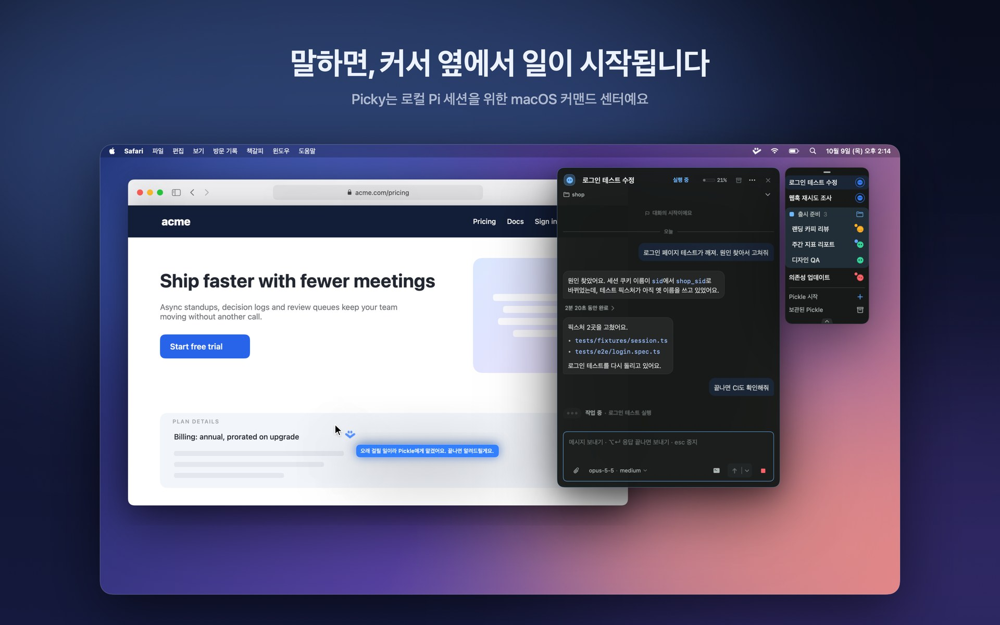
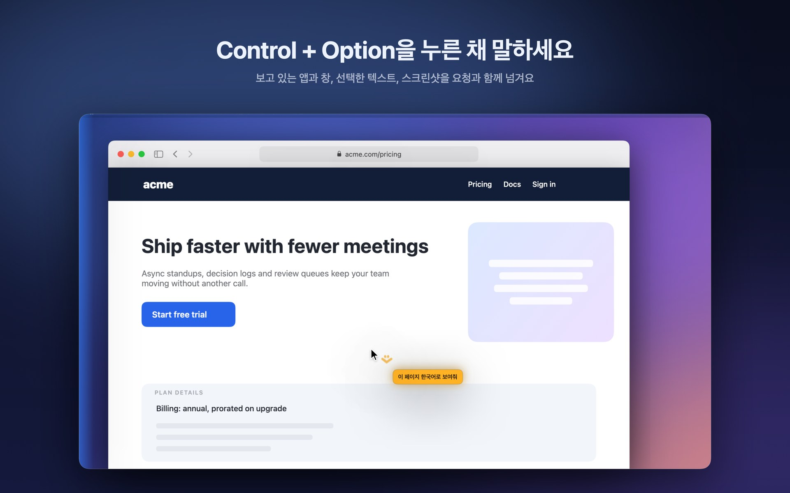
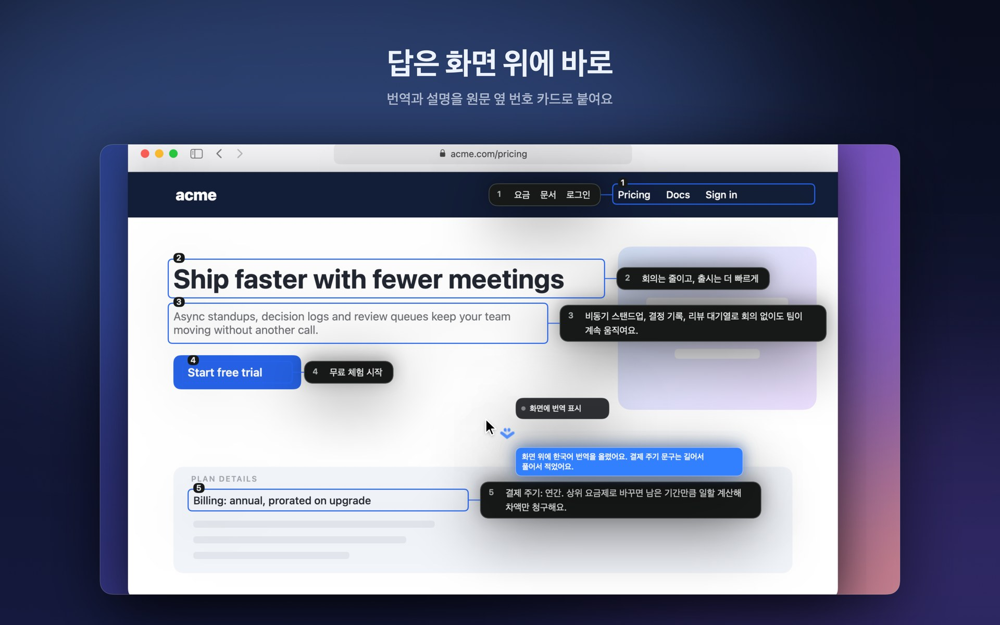
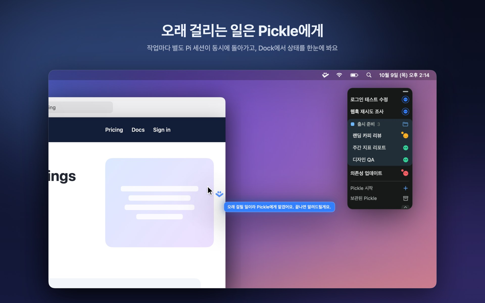
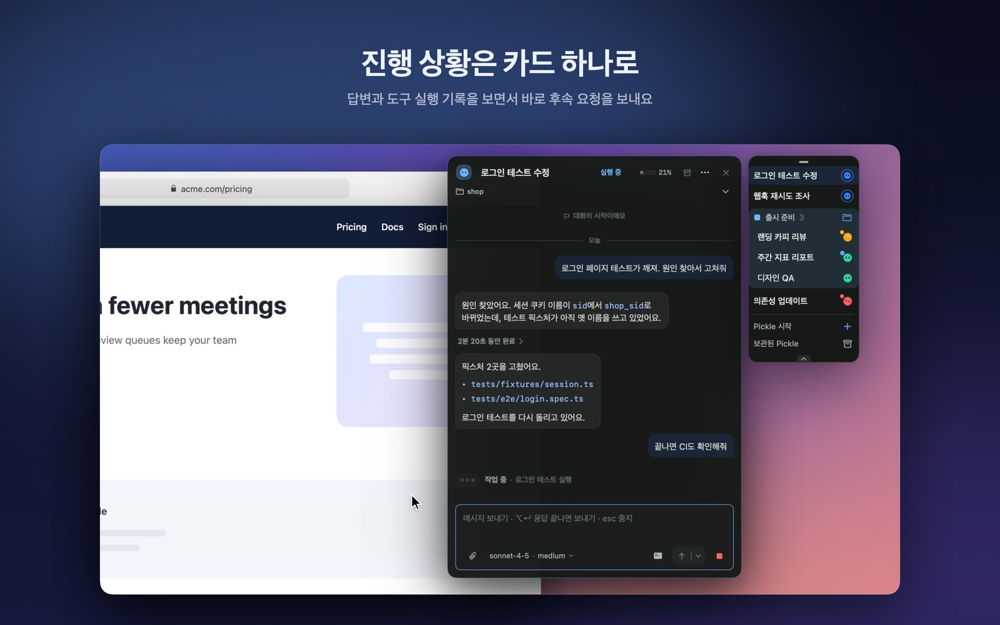
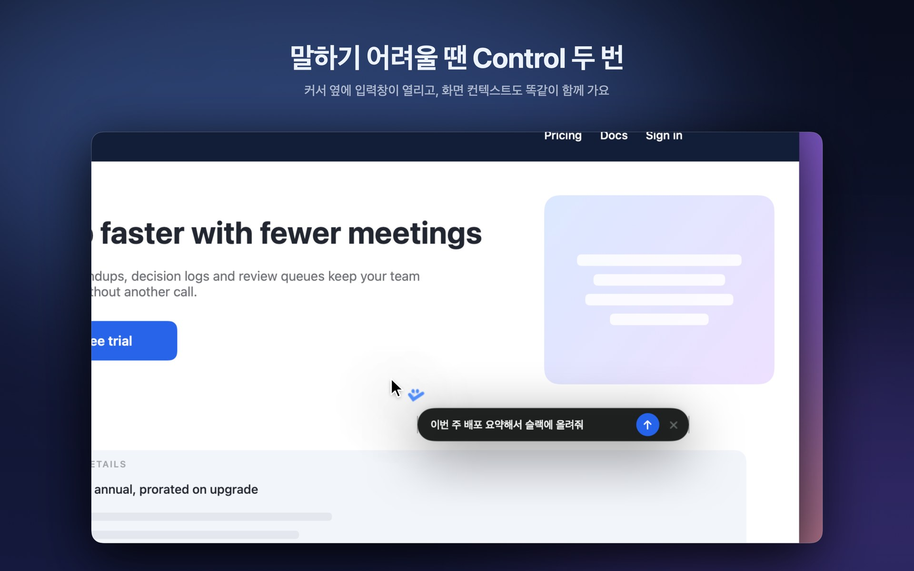
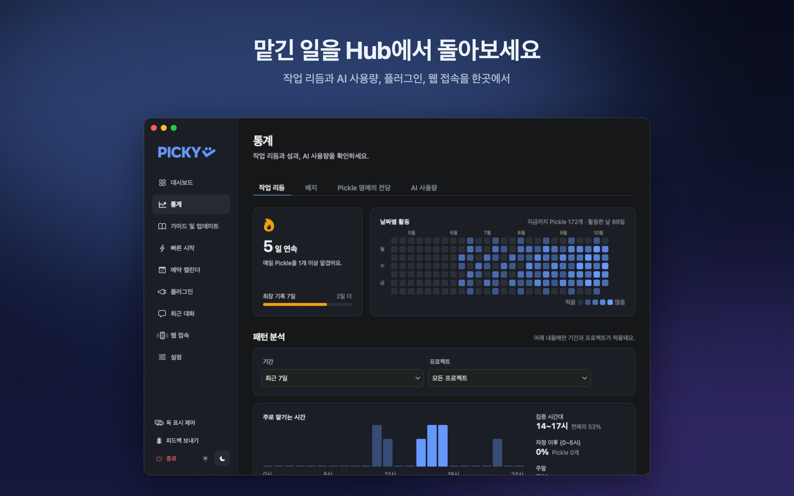
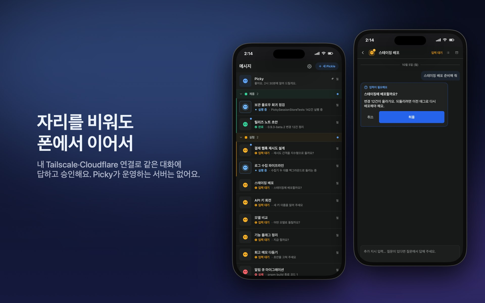

  

  

  

# Picky

  <a href="./README.md">English</a>

**커서 옆에서 로컬 Pi 세션을 쓰는 macOS 클라이언트.**

  

단축키를 누른 채 말하거나 빠른 텍스트 입력을 사용하면 Picky가 커서 옆에 나타납니다. 요청할 때 현재 앱과 창, 브라우저 URL, 선택한 텍스트, 스크린샷, 작업 디렉터리를 권한과 화면 컨텍스트 설정에 따라 수집합니다. 필요한 화면 영역을 직접 표시할 수도 있습니다.

Pi는 요청에 바로 답하거나 오래 걸리는 일을 별도 Pi 세션인 **Pickle**에 맡깁니다. Pickle은 Picky Dock에 아이콘으로 표시됩니다. 열어서 진행 상태와 로그, 산출물을 확인하거나 후속 요청을 보낼 수 있습니다.

Picky는 로컬 Pi 세션의 클라이언트 레이어이며 별도의 텔레메트리를 전송하지 않습니다. 선택한 모델이나 도구는 네트워크를 사용할 수 있습니다.

## 둘러보기

<table>
  <tr>
    <td width="50%" valign="top">
      
      
<b>Control + Option을 누른 채 말하기.</b> 떼면 전송됩니다. 화면 컨텍스트도 요청과 함께 갑니다.

    </td>
    <td width="50%" valign="top">
      
      
<b>화면 위에 바로 답하기.</b> 원문에 박스를 치고 옆에 번호 붙은 번역이나 설명 카드를 붙입니다.

    </td>
  </tr>
  <tr>
    <td width="50%" valign="top">
      
      
<b>오래 걸리는 일은 Pickle에게.</b> Pickle마다 별도 Pi 세션에서 돌아가고, Dock에서 실행·대기·완료·실패를 한눈에 봅니다.

    </td>
    <td width="50%" valign="top">
      
      
<b>진행 상황은 카드 하나로.</b> 답변, 도구 활동, 현재 진행 단계를 한 대화에서 보면서 바로 후속 요청을 보냅니다.

    </td>
  </tr>
  <tr>
    <td width="50%" valign="top">
      
      
<b>빠른 입력.</b> Control을 두 번 누르면 말 대신 글로 요청할 수 있어요. 화면 컨텍스트도 똑같이 함께 갑니다.

    </td>
    <td width="50%" valign="top">
      
      
<b>Hub.</b> 작업 리듬, AI 사용량, 플러그인, 웹 접속, 설정을 한 창에서 관리합니다.

    </td>
  </tr>
</table>

## 폰에서도 같은 작업 이어가기

  

선택 기능인 휴대폰 웹 앱에서 Mac을 떠나서도 같은 Picky·Pickle 대화의 진행 상태를 확인하고, 질문에 답하고, 새 지시를 보낼 수 있습니다. 세션은 계속 Mac에서 실행됩니다. 폰은 별도 에이전트 서비스가 아니라 같은 작업을 조작하는 또 하나의 화면입니다.

Hub의 **웹 접속**을 켜고 사용자의 Tailscale 또는 Cloudflare 연결을 통해 폰을 페어링하세요. 웹 접속은 기본으로 꺼져 있으며, Picky가 실행 중이고 Mac이 깨어 있어야 합니다. Picky가 운영하는 서버는 사용하지 않습니다. 자세한 내용은 [폰 연결과 사용법](docs/user-manual.md#15-web-access-this-macs-browser-and-your-phone)을 참고하세요. 베타 빌드는 [릴리즈 목록](https://github.com/Jonghakseo/picky/releases)에서 받을 수 있습니다.

## 시작하기

macOS 14.2 이상과 로컬에 설치된 Pi가 필요합니다. [Releases](https://github.com/Jonghakseo/picky/releases/latest)에서 Picky를 내려받거나 소스에서 직접 빌드하세요.

처음 실행하면 설정 체크리스트에 따라 macOS 권한을 설정하세요. 자세한 사용법은 [사용자 매뉴얼](docs/user-manual.md)을 참고하세요.

## 권한

Picky는 음성 입력에 마이크, 전역 단축키와 상호작용에 손쉬운 사용, 스크린샷과 화면 컨텍스트 수집에 화면 기록 및 화면 콘텐츠 권한을 사용합니다. Apple Speech 전사를 사용할 때는 음성 인식 권한을 요청합니다. 화면에 주석이 표시된 동안에는 화면 변화를 감지하기 위해 화면을 다시 캡처할 수 있습니다.

## 라이선스

라이선스 정보는 [LICENSE](LICENSE)를 참고하세요.

- [Clicky](https://github.com/farzaa/clicky)에서 영감을 받았습니다.
- [Pi](https://github.com/earendil-works/pi)에서 영감을 받았습니다.
