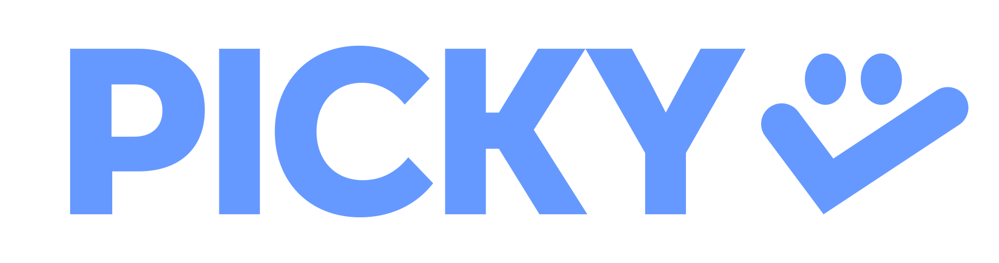
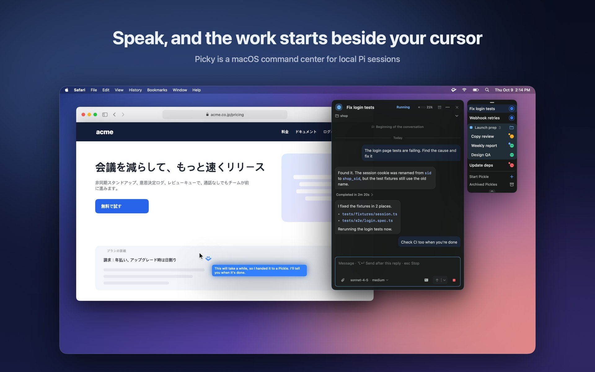
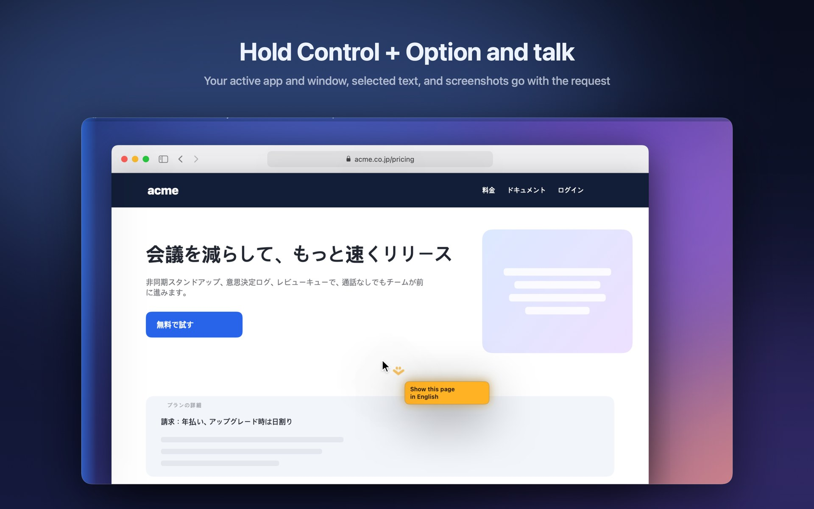
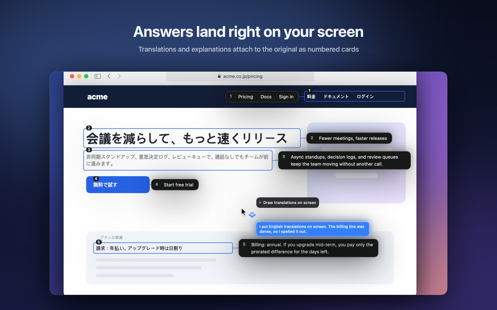
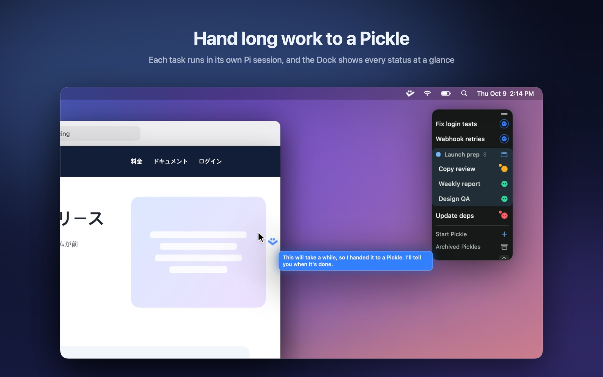
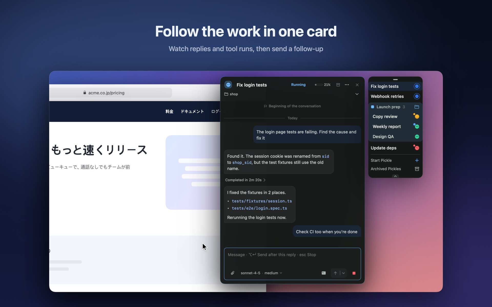
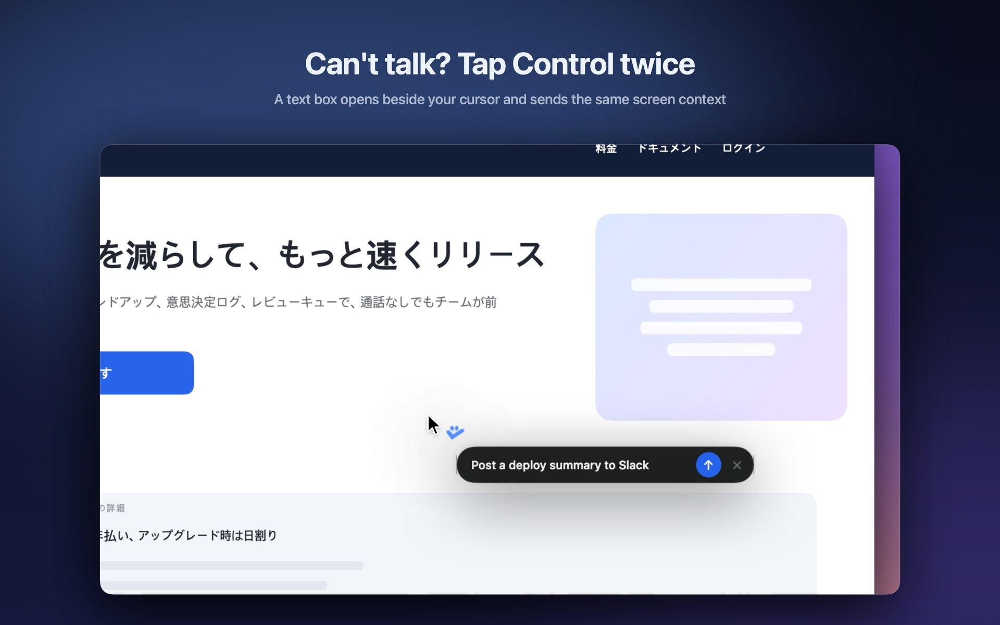
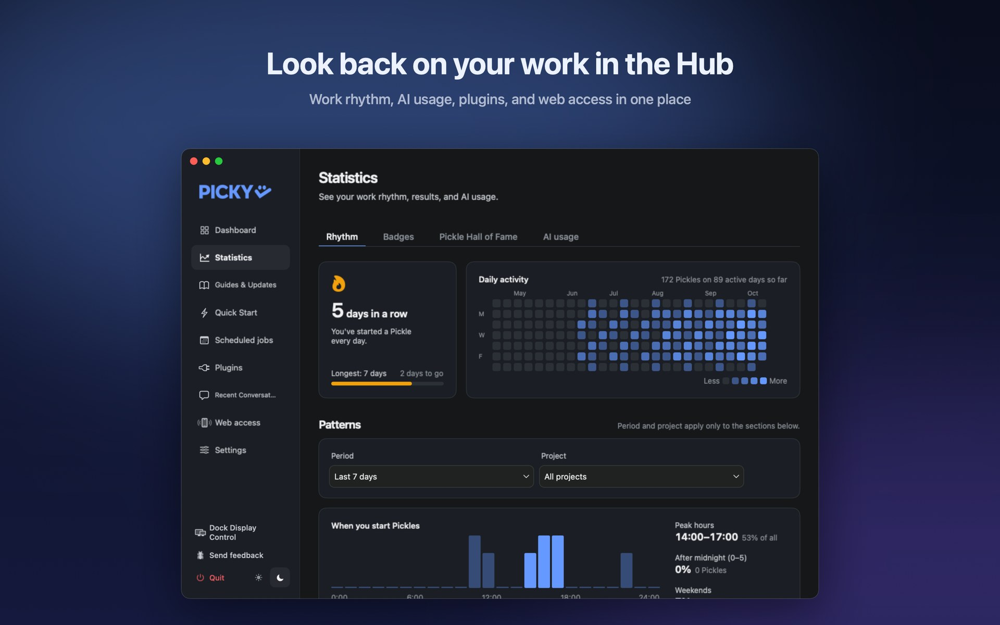
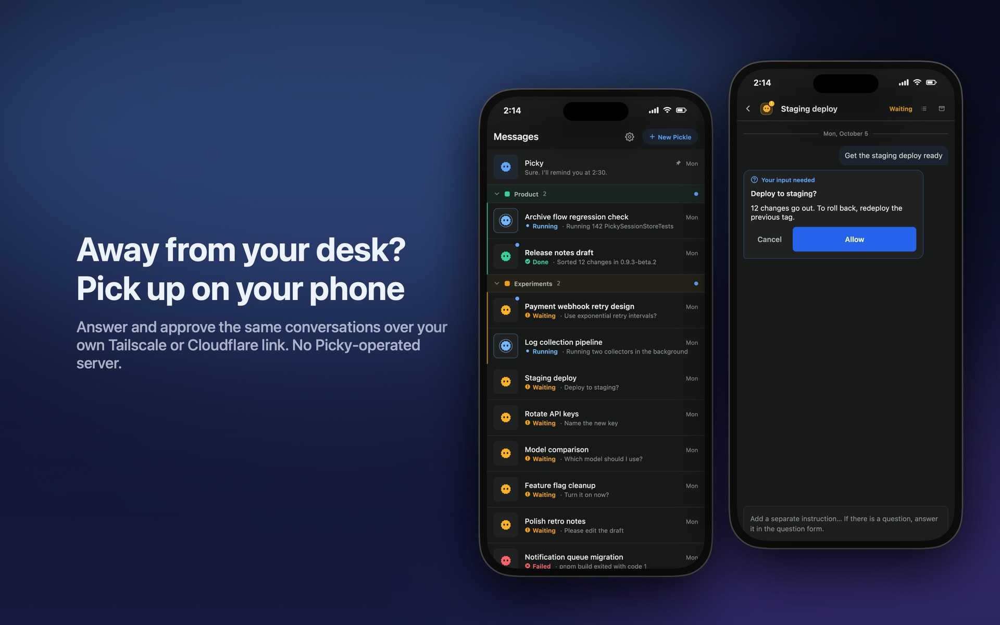

  

  

  

# Picky

  <a href="./README.ko.md">한국어</a>

**A macOS client for local Pi sessions, right beside your cursor.**

  

Use push-to-talk or quick text input without switching apps. For each request, Picky can gather the active app and window, browser URL, selected text, screenshots, and working directory, depending on permissions and screen-context settings. You can also mark the part of the screen you mean.

Pi can answer directly or hand longer work to a **Pickle**, a separate Pi session. Pickles appear as icons in the Picky Dock; open one to check its progress, logs, and artifacts or send a follow-up.

Picky is the client layer for local Pi sessions and sends no separate telemetry. The models and tools you choose may still use the network.

## A quick tour

<table>
  <tr>
    <td width="50%" valign="top">
      
      
<b>Hold Control + Option and talk.</b> Release to send. The request carries your screen context.

    </td>
    <td width="50%" valign="top">
      
      
<b>Answers on the screen.</b> Picky boxes the original text and pins a numbered translation or explanation beside it.

    </td>
  </tr>
  <tr>
    <td width="50%" valign="top">
      
      
<b>Hand long work to a Pickle.</b> Each one runs in its own Pi session. The Dock shows running, waiting, done, and failed at a glance.

    </td>
    <td width="50%" valign="top">
      
      
<b>Follow the work in one card.</b> Replies, tool activity, and the current step stay in one thread, with the composer ready for a follow-up.

    </td>
  </tr>
  <tr>
    <td width="50%" valign="top">
      
      
<b>Quick Input.</b> Double-tap Control to type instead of talking. The same screen context goes along.

    </td>
    <td width="50%" valign="top">
      
      
<b>The Hub.</b> Work rhythm, AI usage, plugins, web access, and settings in one window.

    </td>
  </tr>
</table>

## Continue from your phone

  

The optional phone web app lets you check progress, answer questions, and send instructions to the same Picky and Pickle conversations while away from your Mac. Sessions still run on the Mac; the phone is another way to control them, not a separate agent service.

Enable **Remote access** in the Hub and pair your phone over your own Tailscale or Cloudflare connection. Remote access is off by default, requires Picky to be running and the Mac awake, and uses no Picky-operated server. See [phone setup and usage](docs/user-manual.md#15-remote-access-from-your-phone). For beta builds, use the [release list](https://github.com/Jonghakseo/picky/releases).

## Getting started

You need macOS 14.2 or later and Pi installed locally. Download Picky from [Releases](https://github.com/Jonghakseo/picky/releases/latest) or build it from source.

On first launch, follow the setup checklist for macOS permissions. See the [User Manual](docs/user-manual.md) for setup and usage.

## Permissions

Picky uses Microphone access for voice input, Accessibility for global shortcuts and interactions, and Screen Recording and Screen Content for screenshots and screen context. Apple Speech transcription requests Speech Recognition permission when used. While screen annotations are displayed, Picky may sample the screen to detect changes.

## License

See [LICENSE](LICENSE) for licensing details.

- Inspired by [Clicky](https://github.com/farzaa/clicky).
- Inspired by [Pi](https://github.com/earendil-works/pi).
