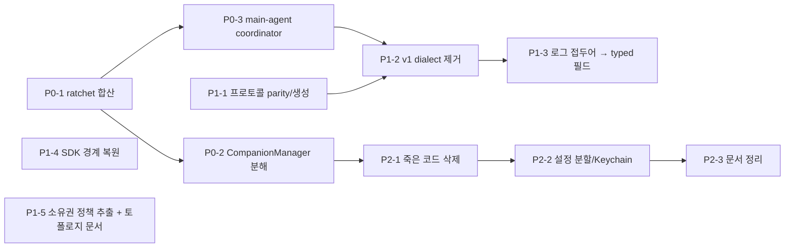

# Picky 아키텍처 유지보수성 리뷰

_작성일: 2026-09-06 · 기준 커밋: `a739298ad`_

이 문서는 저장소 전체 구조를 정적으로 훑어(파일 규모, 변경 빈도, 의존 방향, 경계 위반, 테스트 분포) 유지보수에 악영향을 주는 지점을 근거와 함께 정리하고, 우선순위가 있는 개선안을 제시한다. 근거 수치는 모두 위 커밋에서 `rg`/`wc`/`git log`/`madge`로 직접 측정했다.

## 0. 한 줄 요약

구조 자체(App ↔ agentd ↔ Pi, 도메인/애플리케이션/어댑터 분리, 아키텍처 가드 스크립트)는 건강하다. 문제는 그 구조의 **세 개 파사드에 책임이 계속 쌓이고 있고, 가드가 그 성장을 막지 못하고 있다**는 점이다. 최근 90일 941 커밋 중 `CompanionManager.swift` 100회, `session-supervisor.ts` 98회, `PickySessionViewModel.swift` 90회가 수정됐다. 가장 큰 파일 3개가 가장 자주 바뀌는 파일 3개와 정확히 일치한다.

## 1. 규모 스냅샷

| 영역 | 파일 | 라인 |
|---|---|---|
| `Picky/` (Swift, 프로덕션) | 384 | 108,775 |
| `PickyTests/` + `PickyUITests/` | 204 | 62,099 |
| `agentd/src/` (TS, 프로덕션) | 125 | 23,822 |
| `agentd/src/**/*.test.ts` | – | 27,024 |

디렉터리별로는 `Picky/HUD` 81파일 22,217줄, `Picky/HUD/Conversation` 36파일 12,799줄이 가장 크다. 대형 파일 상위:

| 파일 | 라인 | 90일 변경 횟수 |
|---|---|---|
| `Picky/PickySessionViewModel.swift` | 2,857 (+extension 8파일 ≈ 3,660) | 90 |
| `Picky/CompanionManager.swift` | 2,664 (+extension 10파일 ≈ 4,030) | 100 |
| `agentd/src/session-supervisor.ts` | 2,910 | 98 |
| `Picky/Companion/CompanionPanelSettingsView.swift` | 2,100 | – |
| `Picky/Overlay/BlueCursorView.swift` | 1,749 | 30 |
| `agentd/src/runtime/pi-sdk-runtime.ts` | 1,538 | 44 |
| `Picky/PickyAgentClientRouter.swift` | 1,490 (+120) | – |
| `agentd/src/server.ts` | 1,481 | 64 |
| `Picky/PickyAgentProtocol.swift` | 1,465 | 64 |
| `agentd/src/protocol.ts` | 1,133 | 61 |

## 2. 잘 되어 있는 것 (유지할 것)

짧게만 적는다. 이 항목들은 뒤의 개선안이 기대는 기반이다.

- `scripts/check-architecture-rules.js`가 도메인 순수성(Swift `Domain/`·`Interaction/`의 UI import 금지, agentd `domain/`의 fs/ws/application import 금지), 권한 프롬프트 API 게이트웨이 강제, 프로토콜 버전 parity, reducer 변이 경계, 파일 크기 ratchet, HUD 파사드 관측 ratchet을 CI 전에 검사한다.
- agentd에 순환 의존이 없다 (`madge --circular`: 0건).
- `Picky/Interaction/PickyInteractionReducer.swift`는 순수 reducer + 명시적 effect 패턴의 좋은 예시이고, `docs/refactoring-principles.md`가 "invariant 단위로 쪼개라, 라인 수로 쪼개지 마라"를 명문화하고 있다.
- `contracts/`에 프로토콜·Pi 이벤트·컨텍스트 fixture 107개가 있고 Swift(`ProtocolContractTests`)와 TS(`protocol.test.ts`) 양쪽에서 읽는다.
- 테스트 환경 격리 검사(`scripts/check-test-environment-isolation.py`), 릴리즈·로그 디버깅 runbook, `docs/known-issues/`에 실패한 접근법까지 기록하는 습관.

## 3. 유지보수에 악영향을 주는 지점

각 항목은 **증상 → 근거 → 왜 문제인가** 순서로 적는다. 우선순위는 4절에서 매긴다.

### F1. 세 개의 파사드가 God object로 성장 중이고, ratchet이 우회되고 있다

**근거**

- `CompanionManager`: `@Published` 45개, 저장 프로퍼티 92개, 메서드 89개(본 파일만). MARK 섹션이 `Private`, `Agent Submission Pipeline` 두 개뿐이다. 본 파일이 담당하는 일을 메서드명으로 나열하면 권한 폴링, 오버레이 가시성 이유(reason) 관리, 잉크 캡처, 딕테이션 바인딩, 설정 변경 동기화, 음성 상태 reduce, 퀵 인풋 패널 배선, 메인 취소 pill, 화면 컨텍스트 타겟, 단축키 전이, 전사 라우팅, 메인 에이전트 직접 메시지, TTS 중복 억제, 어노테이션 reveal effect, 연결 손실 복구, 딥링크 자동 디스패치, 온보딩 훅까지 있다.
- `PickySessionListViewModel`(파일명은 `PickySessionViewModel.swift`, 클래스명과 불일치): `@Published` 25개, 저장 프로퍼티 71개, 메서드 180개. 세션 목록·아카이브·선택·음성 팔로업 타겟·슬래시 커맨드 캐시·컴포저 드래프트·인라인 터미널/셸 터미널 attachment·unread·최근 cwd·dock 상태 동기화·v1/v2 projection 적용을 모두 소유한다.
- `SessionSupervisor`: 메서드 169개, import 54개, 생성 옵션 21개. 메인 에이전트 prewarm/rollover/idle compaction, Pickle 생성(handoff/resume/duplicate/pin), 큐 딜리버리, visual DSL lease, 터미널 아티팩트, TTS 설정, 플러그인 리로드, 자동완성, rewind, git diff, user bash 실행까지 한 클래스가 진입점이다.
- ratchet 우회: `checkFileSizeRatchet`은 파일 단위로만 센다. `CompanionManager+*.swift` 10개, `PickySessionViewModel+*.swift` 8개가 존재하며, 이를 합치면 각각 약 4,030줄, 3,660줄이다. `progress.yml`에는 "기존 CompanionManager.swift ratchet error(2680>2671)는 무관, 건드리지 않음"이라고 적혀 있어 ratchet 위반이 이미 상시 상태로 용인되고 있다.

**왜 문제인가**

변경 빈도가 가장 높은 파일이 가장 큰 파일이므로 모든 기능 작업이 같은 파일에서 충돌한다. `+Extension` 분할은 컴파일 단위만 나눌 뿐 상태 소유권은 그대로라(주석에 "state ownership remains here"라고 명시), 읽는 사람은 어느 파일이 어떤 상태를 바꾸는지 10개 파일을 오가며 추적해야 한다. 테스트도 파사드에 붙는다: `PickySessionViewModelTests.swift` 6,355줄, `PickyCompanionManagerTests.swift` 3,403줄, `session-supervisor.test.ts` 9,200줄(agentd 테스트 전체의 34%, 335 케이스).

### F2. 앱–데몬 프로토콜이 165개 메시지를 두 언어로 손으로 미러링한다

**근거**

- `agentd/src/protocol.ts`의 `z.literal("…")` 165개, `Picky/PickyAgentProtocol.swift`의 enum case 165개. 여기에 Swift 쪽 protocol 파일이 10개(총 2,635줄)로 흩어져 있다(`PickyAgentProtocol*.swift`, `PickySessionProjectionProtocol.swift`, `PickyPickleCLIProtocol.swift`, `PickyVisualNarrationProtocol.swift`, `Protocol/PickyExtensionUIProtocolModels.swift`).
- 자동 parity 검사는 **버전 문자열 일치**뿐이다(`checkProtocolParity`). 메시지 집합·필드 형태 동등성은 fixture 87개와 사람의 주의에 의존한다.
- `server.ts`의 `case "…"` 136개가 명령 디스패치와 이벤트 필터를 한 파일에서 처리하고, `protocol.ts`는 agentd 비테스트 파일 66개가 import하는 최대 fan-in 모듈이다.
- 90일간 `PickyAgentProtocol.swift` 64회, `protocol.ts` 61회 변경. 프로토콜이 사실상 매주 바뀌는데 그때마다 Swift, TS, fixture, 양쪽 테스트를 손으로 맞춘다.

**왜 문제인가**

필드 하나 추가가 최소 4곳 편집이고, 누락은 런타임 디코딩 실패로만 드러난다. 165개 메시지는 "thin app"이라는 제품 원칙과도 긴장 관계다. 메시지가 늘수록 앱이 데몬 내부 상태 모델을 그대로 알게 된다.

### F3. 세션 projection v1/v2 dialect가 양쪽에 병존한다

**근거**

- `agentd/src/application/socket-dialect.ts`가 소켓마다 `negotiating | v1 | v2`를 잠그고, `server.ts`는 이벤트 브로드캐스트마다 dialect를 검사한다(`server.ts:1018`, `:1042`).
- Swift `PickySessionListViewModel`은 여전히 `.sessionSnapshot`/`.sessionUpdated`(v1) 분기를 유지한다(`PickySessionViewModel.swift:1943`, `:1952`). `PickyAgentClientRouter`는 "v1 compatibility mirror" `sessionCache`와 v2용 `projectionOwnerKeys`를 따로 들고 있다(`PickyAgentClientRouter.swift:94-100`).
- v1을 실제로 쓰는 소비자는 `agentd/src/cli.ts`(`sessionSnapshot`/`sessionUpdated` 매칭, `cli.ts:678-688`, `:987-993`)뿐이다. `docs/known-issues/cross-daemon-session-ownership.md`는 v1 전체 목록 교체 방식이 ghost card 버그의 뿌리였다고 기록하고 있다.

**왜 문제인가**

앱은 v2만 쓰는데 v1 코드 경로가 앱·라우터·서버·프로토콜에 남아 있어, 세션 상태 관련 변경마다 두 경로를 모두 생각해야 한다. 이미 해결된 버그의 원인 코드가 "CLI 호환" 명목으로 살아 있는 셈이다.

### F4. 세션 로그 문자열을 접두어로 파싱해 의미를 복원한다

**근거**

- `Picky/Domain/PickyLogPrefixes.swift`와 `agentd/src/domain/log-prefixes.ts`가 `"steer: "`, `"follow-up: "`, `"Picky handoff: "`, `"extension ui answer: "` 상수를 양쪽에 복제한다.
- `Picky/PickySessionCard.swift:346-380`은 `hasPrefix("extension ui:")`, `hasPrefix("runtime reattached from pi session:")`, `hasPrefix("source transcript:")` 같은 소문자화된 영어 문자열로 로그 라인을 분류하고 요청 텍스트를 뽑아낸다. `Picky/HUD/Conversation/Bubbles/PickyCompactStatusViews.swift:137`도 `"auto-compaction failed"` 접두어로 상태를 판정한다.

**왜 문제인가**

데몬의 로그 문구를 바꾸면 앱 UI가 조용히 깨진다. `docs/i18n-remediation-plan.md`가 요구하는 "agentd는 semantic code + typed args를 보내고 영어 카피를 보내지 않는다"는 완료 조건과 정면으로 충돌하며, 로그 라인을 사용자 요청 이력의 SSOT로 쓰는 셈이라 메시지 저널(`session-message-builder.ts`)과 이중 진실이 생긴다.

### F5. Pi SDK 타입이 runtime 어댑터 밖으로 샌다

**근거**

- `@earendil-works/pi-coding-agent`를 import하는 비테스트 파일 16개 중 `application/` 계층이 6개다: `ask-user-question-tool.ts`, `package-operations.ts`, `session-supervisor-options.ts`, `extension-ui-bridge.ts`, `pi-oauth-service.ts`, `user-guide-tool.ts`. `runtime/types.ts`(어댑터의 추상 인터페이스)조차 `ToolDefinition`, `AutocompleteItem`을 SDK에서 직접 가져온다.
- `domain/` 3개 파일이 `runtime/types`를 import해서 가드가 warning을 내고 있다(`pi-event-normalizer.ts`, `slash-commands.ts`, `user-bash-format.ts`).
- Pi SDK 버전은 `0.84.4` 고정이고, `pi-auto-update` 스킬이 있을 만큼 SDK 업데이트가 반복 작업이다.

**왜 문제인가**

"runtime adapter가 Pi를 번역한다"는 문서상의 경계가 실제로는 application 계층까지 SDK 시그니처에 묶여 있어, SDK 업그레이드 시 변경 범위가 어댑터에 국한되지 않는다. `mock-runtime.ts`로 대체 가능한 범위도 그만큼 좁아진다.

### F6. per-Pickle child daemon 토폴로지가 문서 없이 라우터에 복잡도를 쌓았다

**근거**

- `PickyAgentDaemonPool.swift`와 `PickyAgentClientRouter.swift` 헤더는 "Phase 2 of the per-Pickle agentd plan"을 언급하지만, 그 plan 문서는 `docs/`에 없다. `ARCHITECTURE.md`는 "picky-agentd runs as a child process"만 말하고 pool/child/primary 토폴로지, `PICKY_AGENTD_MODE`·`PICKY_AGENTD_PRIMARY_URL`·`PICKY_AGENTD_SESSION_ID/CWD` 환경 계약을 설명하지 않는다.
- 라우터가 소유하는 상태 집합만 15개 이상: `knownChildSessionIds`, `bootingChildSessionIds`, `retiredChildSessionIds`, `childGenerations`, `retiredChildGenerations`, `sessionCache`, `sessionOwnerKeys`, `projectionOwnerKeys`, `projectionConnectionGenerations`, `projectionBootstrapExpectations`, `knownPrimaryProjectionEpoch`, `retiredChildPrimaryOwnerships`, `sessionProducingProjectionConnections`, `acceptedProjectionBootstrapCompletions`, `sessionProjectionWaiters`, `pendingChildCommands`, `activeDrainingChildCommands`(`PickyAgentClientRouter.swift:80-130`).
- `docs/known-issues/cross-daemon-session-ownership.md`가 기록한 실패 시도 5건이 모두 이 상태 집합 간 경합이다.

**왜 문제인가**

소유권·세대·epoch 규칙이 라우터(전송 어댑터) 안의 사적 상태로만 존재하고 순수 정책으로 분리돼 있지 않다. `refactoring-principles.md` 2.2("어댑터는 durable rule의 소유자가 되면 안 된다")를 가장 크게 위반하는 지점이다.

### F7. 테스트가 파사드에 집중돼 있고 직렬 실행과 고정 microtask pump에 의존한다

**근거**

- `pnpm run test:ci`는 `server.test.ts`와 `session-supervisor.test.ts`를 제외하고 돌린 뒤 두 파일만 `--no-file-parallelism`으로 다시 돈다. AGENTS.md는 간헐 실패 시 3단계 분류 절차를 두고 있을 만큼 flake가 상시 위험이다.
- `session-supervisor.test.ts`에 `settle()`(고정 microtask 펌프) 132회. 가드가 lower-only 베이스라인으로 잡고 있으나 아직 138 ceiling 근처다.
- Swift 프로덕션 파일 361개(extension 제외) 중 115개는 테스트에서 타입명이 한 번도 등장하지 않는다(거친 추정). 반대로 파사드 테스트 파일 하나가 6,355줄이다.

**왜 문제인가**

파사드 테스트는 setup 비용이 커서 케이스 하나가 수십 줄이고, 어느 invariant를 지키는지 파일명만으로 알 수 없다. 정책이 파사드에서 빠져나오지 않는 한 테스트도 빠져나올 수 없다.

### F8. 사용되지 않는 프로덕션 코드가 테스트에 의해 "살아" 있다

**근거** (프로덕션 참조 = 정의 1회, 테스트 참조만 존재)

| 타입 | 위치 | 테스트 참조 |
|---|---|---|
| `PickyHUDSummaryEventPolicy` | `HUD/PickyHUDLayoutPolicy.swift:981` | 13 |
| `PickyHUDExpandedContentPolicy` | `HUD/PickyHUDLayoutPolicy.swift:967` | 9 |
| `CompanionVoicePresentationReducer` | `Companion/CompanionVoicePolicies.swift:154` | 4 |
| `PickyHUDCurrentWorkPolicy` | `HUD/PickyHUDLayoutPolicy.swift:1001` | 3 |
| `PickyConversationJournalPresentation` | – | 2 |
| `PickyDiffPreviewBuilder` | – | 1 |
| `PickySessionArtifactsView` | `HUD/PickySessionArtifactsView.swift` | 0 (문서에 "mounted 아님" 명시) |
| `IBeamCursorView`, `PickyContextUsageChip` | – | 0 |

**왜 문제인가**

테스트가 통과하니 살아 있는 코드처럼 보이고, 리팩토링 시 "이건 어디서 쓰지?"를 매번 다시 조사하게 만든다.

### F9. 설정 모델이 단일 flat struct이고 비밀값이 Codable 키로 남아 있다

**근거**

- `PickySettings` struct 필드 120개(`App/Settings/PickySettings.swift:620-1317`). 음성 provider, HUD dock 위치, 폰트, 알림, 커서, 업데이트 채널, 최근 폴더까지 한 struct.
- 가드 warning: `azureOpenAIAPIKey`, `azureOpenAITTSAPIKey`, `elevenLabsSTTAPIKey`, `elevenLabsTTSAPIKey`, `openAISTTAPIKey`, `openAITTSAPIKey`가 여전히 CodingKeys에 있다("Plan migration to Keychain-backed storage").
- `PickySettings.swift`에 legacy/v1 키워드 22회. 마이그레이션 코드가 모델 안에 누적된다.

**왜 문제인가**

설정 하나를 추가하면 `PickySettings` + 뷰(`CompanionPanelSettingsView.swift` 2,100줄) + 검증 + 마이그레이션이 같은 두 파일에서 충돌한다. 비밀값이 UserDefaults/JSON 경로에 남아 있는 것은 보안 부채이기도 하다.

### F10. 문서가 코드 구조를 따라오지 못한다

**근거**

- `ARCHITECTURE.md`의 Swift 책임 맵에 `Sessions/Projection`, `Watchdog`, `Updates`, `Localization`, `Feedback`, `Companion/Input`, `Companion/Onboarding`, `Companion/OpenAI`가 없다. agentd `application/`은 실제 67파일인데 문서는 9개만 나열한다.
- `docs/` 아래 plan 문서 10개 중 상태가 "implemented/superseded"인 것과 "proposed/paused"인 것이 같은 레벨에 섞여 있다. `utility-panel-activity-artifacts-plan.md`는 스스로 "superseded"라고 적고 있다.
- `AGENTS.md`의 code navigation index는 최신이지만 이 파일이 사실상 두 번째 아키텍처 문서가 되어 있다.

**왜 문제인가**

새 기여자(사람이든 에이전트든)가 `ARCHITECTURE.md`를 믿고 시작하면 절반의 디렉터리를 놓친다.

## 4. 개선안과 우선순위

우선순위는 **(변경 빈도 × 위험) ÷ 비용**으로 매겼다. P0는 지금 진행 중인 기능 작업의 속도를 직접 올리는 것, P1은 다음 대형 변경(프로토콜·SDK 업그레이드) 전에 끝내야 하는 것, P2는 기회가 될 때 하는 것.

### P0-1. 파일 ratchet을 "타입 단위"로 바꾸고 `+Extension` 우회를 막는다 (F1)

- `checkFileSizeRatchet`에 `Type+*.swift`를 같은 타입으로 합산하는 규칙을 추가한다. 합산 기준 baseline을 현재 값(약 4,030 / 3,660)으로 pin하고 lower-only로 운영한다.
- `progress.yml`에 적힌 상시 ratchet 위반(2680 > 2671)을 정리한다. 위반을 용인하는 순간 가드는 장식이 된다.
- 비용: 스크립트 수십 줄. 효과: 이후 모든 항목의 전제.

### P0-2. `CompanionManager`를 상태 클러스터별 owner로 분해한다 (F1)

`refactoring-principles.md` 2.4("클러스터당 mutable owner 하나")를 그대로 적용한다. 현재 메서드명으로 이미 드러나는 클러스터:

| 후보 owner | 옮길 상태/메서드 |
|---|---|
| `PickyPermissionMonitor` | `has*Permission` 4개, `refreshAllPermissions`, `startPermissionPolling`, `promptForMicrophoneIfNotDetermined` |
| `PickyOverlayVisibilityPolicy` (순수) + runner | `setLocalOverlayReason`, `setInteractionOverlayReasons`, `syncOverlayVisibility` |
| `PickyMainAgentConversationStore` | `mainAgentMessages`, `mainLiveActivities`, `mainPendingQuestion`, `mainAgentSessionInfo`, `mainAgentModelOptions`, `sendDirectMessage/complete/fail`, `resetMainAgentSession` |
| `PickyScreenContextTargetController` | `screenContextTargetSessionID/Label`, `bindScreenContextTarget`, `applyScreenContextTarget`, `clearScreenContextTargetIfCurrent`(중복 정의 2개 있음) |
| 온보딩 훅 | `submissionInterceptor`, `isShortcutHandlingSuppressed`, `onboardingBubbleText`, `*Onboarding*` 메서드를 `OnboardingFlowController`가 주입하는 프로토콜로 |

순서: 특성화 테스트(`PickyCompanionManagerTests`)가 이미 3,403줄 있으니, 클러스터 하나를 옮길 때마다 관련 테스트를 새 owner 테스트 파일로 함께 이동한다. 음성 상태 머신(`voiceState`, `reduceVoiceInteraction`)은 마지막에 남긴다.

### P0-3. `SessionSupervisor`에서 메인 에이전트 생명주기를 분리한다 (F1)

169개 메서드 중 `*Main*` 계열(prewarm, rollover, idle compaction, bootstrap inject, thinking level, model, TTS, plugin reload, pending input drain)이 약 45개다. 이미 `application/` 아래에 코디네이터 패턴이 있으니(`pickle-completion-coordinator.ts`, `terminal-session-coordinator.ts`) 같은 방식으로 `main-agent-coordinator.ts`를 만들고 `SessionSupervisor`는 Pickle 세션 파사드로 좁힌다. `session-supervisor.test.ts`의 메인 에이전트 케이스를 그쪽으로 옮기면 F7의 직렬 실행 의존도 줄어든다.

### P1-1. 프로토콜을 단일 소스에서 생성한다 (F2)

_2026-09-06: 선택지 B(메시지 집합 parity 검사)를 `checkProtocolMessageSetParity`로 구현. CLI 전용 메시지 11개는 명시 allowlist로 pin. 생성(선택지 A)과 fixture 커버리지(83/139)는 미착수._

- 선택지 A: `protocol.ts`(zod)에서 JSON Schema를 뽑고, 그로부터 Swift Codable을 생성하는 스크립트를 `scripts/`에 둔다. 생성물 diff를 CI에서 검사한다.
- 선택지 B: 생성이 부담이면 최소한 **메시지 집합 parity 검사**를 가드에 추가한다. TS `z.literal` 집합과 Swift enum case 집합을 비교해 누락을 CI에서 잡는다. 수십 줄이면 된다.
- 어느 쪽이든 165개 메시지 자체를 줄이는 방향으로 리뷰한다. `list*`/`get*` 조회 계열과 `*Snapshot` 응답 이벤트가 상당수 `sessionProjectionTransaction` 하나로 대체 가능한지 검토한다.

### P1-2. v1 dialect를 CLI에서 걷어내고 삭제한다 (F3)

_2026-09-06 진행 상황:_
- _2a 완료: CLI·handoff 확장은 `pickleSessionsSnapshot`/`pickleSessionUpdated` 응답과 `awaitPickleSessionTerminal`로 전환. `pickle-create --wait`는 이전에 negotiating 소켓이 v1 브로드캐스트를 받지 못해 실제로는 동작하지 않았던 경로였고, 이제 실제 데몬 e2e 테스트로 검증됨._
- _2b 완료: agentd에서 `socket-dialect.ts`, v1 브로드캐스트 14종, `listSessions`/`getSession` 명령, app snapshot 압축 정책을 제거. 세션 projection은 `sessionProjectionV2` 구독 소켓에만 전달._
- _2c 미착수: Swift `PickyEvent` v1 디코드 case 15종, `PickySessionListViewModel`의 v1 apply 경로(약 350줄), 라우터 `sessionCache` 미러, 그리고 이를 fixture로 쓰는 Swift 테스트 약 330개(`PickySessionViewModelTests` 315건)가 남아 있다. 테스트가 `sessionUpdated` JSON으로 세션을 주입하므로, v2 `sessionProjectionSnapshot` 주입 헬퍼와 recovery coordinator 배선을 테스트 setup에 넣는 별도 작업이 필요하다. 그 전까지 TS 스키마 15종은 wire-dead 상태로 유지(`protocol.ts` 주석 참조)._

- `cli.ts`가 `sessionProjectionV2`를 등록하고 `sessionProjectionSnapshot/Transaction`으로 세션을 읽도록 바꾼다.
- 그 후 `socket-dialect.ts`, `server.ts`의 dialect 분기, `PickySessionListViewModel`의 `.sessionSnapshot/.sessionUpdated` 분기, 라우터의 `sessionCache`, 프로토콜의 v1 이벤트 16종을 제거한다.
- `known-issues/cross-daemon-session-ownership.md`가 "v1은 historical debugging 용"이라고 이미 선언했으므로 제품 리스크는 낮다.

### P1-3. 로그 접두어 파싱을 typed 필드로 대체한다 (F4)

_2026-09-06: `PickyAgentSession.lastRequest { source, text }`를 추가하고 daemon이 `sessionWithAppendedLog`·pinned 세션·terminal sync에서 채운다. Swift는 `session.lastRequest`와 metaPatch로만 읽으며 `PickyLogPrefixes.swift`, `requestText(fromLogLine:)`은 삭제. 렌더되지 않던 `hasRuntimeDetachedFollowUpRejection`·`isMainAgentHandoff`(둘 다 로그 접두어에서만 파생)는 소비자가 없어 제거. 남은 로그 문자열 검사는 presentation 전용 두 개(`isDisplayableLogPreview`, `isRuntimeReattachLogLine`)와 `piSessionFilePath(fromLogLine:)`(daemon도 같은 로그로 typed 필드를 채우므로 fallback)뿐이다._

- `PickySessionCard.requestText(fromLogLine:)`, `isMainAgentHandoffLogLine`, `isRuntimeReattachLogLine`, `isDisplayableLogPreview`가 필요로 하는 정보를 `PickyAgentSession` 또는 메시지 저널의 명시적 필드(`lastRequest: { source, text }`, `reattachedFromPiSession`, `logEntry.kind`)로 승격한다.
- 그 다음 `PickyLogPrefixes.swift`/`log-prefixes.ts` 쌍을 삭제한다. i18n plan의 "semantic code" 완료 조건과 같은 작업이다.

### P1-4. Pi SDK 타입을 runtime 경계 안으로 되돌린다 (F5)

- `runtime/types.ts`에서 `ToolDefinition`, `AutocompleteItem`을 Picky 자체 타입으로 감싼다(필요한 필드만).
- `application/` 6개 파일의 SDK import를 `runtime/`이 제공하는 팩토리/타입으로 교체한다. `ask-user-question-tool.ts`, `user-guide-tool.ts`는 `defineTool`을 `runtime/pi-capabilities.ts` 쪽 헬퍼로 옮기면 된다.
- 가드의 `application/`에도 `@earendil-works/*` import 금지 규칙을 추가한다(현재는 `domain/`만 검사).

### P1-5. 라우터의 소유권 규칙을 순수 정책으로 추출하고 토폴로지를 문서화한다 (F6)

- `PickyAgentClientRouter`의 owner/generation/epoch 판정을 `Picky/Sessions/Projection/PickyProjectionOwnershipPolicy.swift`(순수 struct, 입력 → 결정) 로 뽑는다. `PickyAgentClientRouterTests` 2,642줄 중 소유권 시나리오가 그 정책의 단위 테스트가 된다.
- `docs/per-pickle-daemon-topology.md`를 새로 쓰고 `ARCHITECTURE.md` 3절에서 링크한다. 내용: primary/child 역할, 환경변수 계약, spawn/ready/exit 생명주기, 소유권 이전 규칙.

### P2-1. 죽은 코드 삭제 (F8)

표의 9개 타입과 그 테스트를 제거한다. `PickySessionArtifactsView`는 superseded plan 문서가 이미 근거다. 반나절 작업.

### P2-2. 설정 모델 분할과 Keychain 이관 (F9)

- `PickySettings`를 `voice`, `hud`, `notifications`, `appearance`, `updates`, `workspace` 하위 struct로 나누되 저장 포맷은 유지한다(중첩 Codable로 이전 키 매핑).
- API 키 6개를 Keychain으로 옮기고 CodingKeys에서 제거한다. 가드의 `checkSecretCodingKeys` allowlist를 비우는 것이 완료 기준.

### P2-3. 문서 정리 (F10)

- `ARCHITECTURE.md` 책임 맵을 현재 디렉터리 기준으로 다시 쓰고, `application/` 목록은 전수 대신 "카테고리 + 대표 파일"로 바꾼다.
- `docs/plans/` 아래에 상태별(`active/`, `done/`, `superseded/`)로 plan 문서를 옮긴다.
- `AGENTS.md`의 navigation index는 유지하되 `ARCHITECTURE.md`와 중복되는 부분은 한쪽만 남긴다.

## 5. 실행 순서 제안



P0-1은 하루 안에 끝나고 나머지의 전제다. P1-1(parity 검사 버전)과 P1-4, P1-5는 서로 독립이라 병렬로 가능하다. P1-2는 P1-1의 parity 검사가 있어야 삭제 누락을 CI가 잡아준다.

## 6. 각 항목의 완료 기준

| 항목 | 완료 기준 (측정 가능) |
|---|---|
| P0-1 | 가드가 `Type+*.swift` 합산 라인을 검사하고, `progress.yml`의 ratchet 예외 문구가 사라짐 |
| P0-2 | `CompanionManager.swift` 본 파일 < 1,500줄, `@Published` < 20개, `+Extension` 파일 ≤ 3개 |
| P0-3 | `session-supervisor.ts` < 1,800줄, `session-supervisor.test.ts` < 5,000줄, `test:ci`에서 별도 직렬 재실행 단계 제거 |
| P1-1 | CI가 Swift/TS 메시지 집합 불일치를 error로 냄 |
| P1-2 | `socket-dialect.ts` 삭제, `protocol.ts`에서 v1 이벤트 16종 제거, 앱의 `.sessionSnapshot` 분기 제거 |
| P1-3 | `PickyLogPrefixes.swift`와 `log-prefixes.ts` 삭제, `PickySessionCard`에 `hasPrefix` 기반 분류 0건 |
| P1-4 | `application/`에 `@earendil-works` import 0건, 가드 규칙 추가 |
| P1-5 | 라우터 소유권 판정이 순수 타입으로 분리되고 `docs/per-pickle-daemon-topology.md` 존재 |
| P2-1 | 표의 9개 타입 삭제 |
| P2-2 | `checkSecretCodingKeys` allowlist 비어 있음 |
| P2-3 | `ARCHITECTURE.md`가 실제 최상위 디렉터리를 모두 나열 |

## 부록: 측정 명령

```bash
# 규모
find Picky -name '*.swift' | xargs wc -l | sort -rn | head -40
find agentd/src -name '*.ts' ! -name '*.test.ts' | xargs wc -l | sort -rn | head -30

# 변경 빈도 (90일)
git log --since="90 days ago" --name-only --pretty=format: -- Picky agentd/src \
  | rg -v '^$|\.test\.ts$' | sort | uniq -c | sort -rn | head -20

# 프로토콜 메시지 수
rg -c 'z\.literal\("' agentd/src/protocol.ts
rg -c '^\s+case [a-zA-Z]+' Picky/PickyAgentProtocol.swift

# SDK 누수
rg -l 'from "@earendil-works/pi-coding-agent"' agentd/src --glob '!*.test.ts'

# 순환 의존
npx madge --extensions ts --ts-config agentd/tsconfig.json --circular agentd/src/index.ts

# 아키텍처 가드
node scripts/check-architecture-rules.js
```
