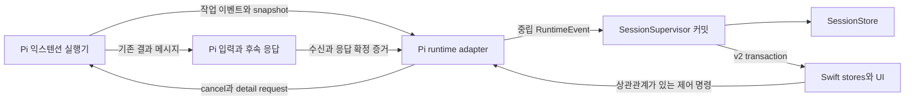

🧵

# 피클 비동기 작업 모델

2026-09-25 · Pi 설계 검토 · 설계 / 구현 준비

---

> Status: implemented (W8 활성화 완료, 2026-09-26). 결과는 [런타임 검증](pickle-async-tasks-runtime-verification.md)에 있다. 이 문서는 구현 전 계약을 보존하므로 미래형 서술은 설계 당시 기준이다. 현재 코드에서 확인한 사실, 새로 정한 설계, 구현 중 증명할 조건을 구분한다. 단계별 수정 위치와 검증은 [구현 계획](pickle-async-tasks-implementation-plan.md)에 기록한다.

## 목차

- [1. 범위와 판단](#1-범위와-판단)
- [2. 현재 코드의 경계](#2-현재-코드의-경계)
- [3. 소유권과 불변조건](#3-소유권과-불변조건)
- [4. 작업과 결과 전달 모델](#4-작업과-결과-전달-모델)
- [5. 호스트와 익스텐션 계약](#5-호스트와-익스텐션-계약)
- [6. 피클 상태와 완료](#6-피클-상태와-완료)
- [7. 중지·보관·런타임 교체](#7-중지보관런타임-교체)
- [8. 프로젝션과 UI](#8-프로젝션과-ui)
- [9. 호환성과 도입](#9-호환성과-도입)
- [10. 검증 범위와 참고](#10-검증-범위와-참고)

## 1. 범위와 판단

`bash_async`와 `subagent`의 실행기는 각 Pi 익스텐션에 남긴다. Picky는 공통 `AsyncTask` 계약으로 작업 수명과 사용자 제어를 연결한다. 지원 계약이 있는 Pickle에서는 subagent의 비동기 실행을 활성화한다.

사용자에게는 다음을 보장한다.

1. Pi가 응답을 마쳐도 연결된 작업이나 후속 결과 처리가 남아 있으면 피클을 완료로 표시하지 않는다.
2. 컴포저 바로 위에서 현재 작업, 종류, 최근 활동, 로그/응답과 중지를 확인한다.
3. 보관이 중지를 뜻하지 않는다. 작업 중 보관은 명시적으로 선택하고, 보관한 작업에도 다시 접근한다.
4. 앱의 연결 복구에서 작업을 잃거나, daemon 재시작 뒤 존재하지 않는 작업을 실행 중으로 복원하지 않는다.

이번 범위에서 제외한다.

- 별도 실행 서버, SaaS, 범용 workflow engine, 익스텐션 임의 HTML UI.
- 앱/daemon 종료 후의 무중단 실행, 프로세스 재부착, 작업 자동 재시도.
- main-agent 상태 소유권 변경. main은 계속 `MainAgentCoordinator`가 소유한다.
- 예약만 된 cron, todo 항목, 일반 동기 tool을 모두 비동기 작업으로 취급하는 변경.
- 모든 과거 subagent 이력을 새 모델로 다시 쓰는 마이그레이션.

UI의 짧은 이름은 `백그라운드 작업`, 코드 이름은 `AsyncTask`를 사용한다. 여기서 비동기는 tool 호출의 반환과 실제 작업 종료가 분리된다는 뜻이지, Pi가 반드시 동시에 응답하고 있다는 뜻은 아니다.

## 2. 현재 코드의 경계

조사 기준은 Picky `143d003f2`와 조사 시점 working tree, pi-extension `886ef383fd709446c2357c360364414e0132eddf`다. Picky에는 다른 작업의 미커밋 변경이 있으므로 구현 시작 시 해당 파일을 다시 확인한다.

| 확인한 사실 | 근거 | 필요한 변경 |
|---|---|---|
| Picky Pi SDK는 0.87.1, extension 저장소 override는 0.85.0 | [agentd/package.json](../../agentd/package.json), extension 루트 `package.json` | 저장소 테스트만으로 Picky 호환을 판정하지 않는다. |
| subagent tool의 async 선택은 UI와 stdin/stdout TTY 여부에 종속된다 | extension `packages/subagent/tool-execute.ts`, `isInteractiveTuiContext` | TUI 렌더 가능 여부와 호스트 async 수명 지원을 분리한다. |
| bash는 headless에서도 async, 완료 메시지는 500ms 배치 | extension `packages/bash-async/index.ts`, `notification-batcher.ts` | 실행 종료와 결과 처리 의무를 같은 이벤트에서 넘긴다. |
| extension API의 `sendMessage`는 void이며 내부 비동기 오류는 별도 extension error가 된다 | 설치 SDK `dist/core/agent-session.js`, extension `packages/bash-async/index.ts` | `Promise.resolve(sendMessage(...))`를 전달 확인으로 사용하지 않는다. |
| 로컬 bash의 status/output은 poll guard만 해제하며 완료 알림을 억제하지 않는다 | extension `packages/bash-async/index.ts:175–213` | 수동 조회를 ticket 처리 완료나 알림 취소로 간주하지 않는다. |
| subagent 비동기는 부모 tool AbortSignal과 독립이고 shutdown은 정착을 기다리지 않는다 | extension `tool-execute.ts`, `lifecycle.ts` | 개별/전체 중지와 실제 종료 확인 계약을 추가한다. |
| subagent 호출은 tool 종료에 `completed: true`가 된다 | [SubagentInvocationTracker](../../agentd/src/runtime/subagent-invocation-tracker.ts) | tool 접수 완료와 비동기 invocation 완료를 분리한다. |
| terminal 커밋은 메시지·상태·알림을 함께 처리한다 | [terminal-durable-commit.ts](../../agentd/src/application/terminal-durable-commit.ts), [terminal-session-finalization.ts](../../agentd/src/domain/terminal-session-finalization.ts) | 응답 확정과 전체 피클 정착을 분리한다. |
| 보관된 terminal 피클은 앱이 child daemon을 해제한다 | [PickySessionViewModel.swift](../../Picky/PickySessionViewModel.swift), `scheduleArchiveCommit` | 진행 여부와 해제 권한을 owner daemon에서 확인한다. |
| terminal sync는 `isStreaming == false`인 handle을 무효화할 수 있다 | [terminal-session-coordinator.ts](../../agentd/src/application/terminal-session-coordinator.ts) | SDK streaming과 runtime 보존 조건을 분리한다. |
| v2는 작은 metadata와 독립 child store를 사용한다 | [PickySessionStore.swift](../../Picky/Sessions/Projection/PickySessionStore.swift) | 기존 도구 활동 `activityStore`와 별도 `asyncTaskStore`를 추가한다. |

extension 경로는 pi-extension 저장소 루트 기준이다. 공개 소스의 고정 기준은 [pi-extension 886ef38](https://github.com/Jonghakseo/pi-extension/tree/886ef383fd709446c2357c360364414e0132eddf)다. package.json 버전 일치는 실제 Picky가 로드한 코드의 일치를 증명하지 않는다.

## 3. 소유권과 불변조건



`AsyncTaskRegistry`는 별도 파일 저장소나 독립 session writer가 아니다. supervisor가 소유한 session의 작업 집합을 다루는 reducer/application 경계다. 실제 save, revision, publish는 기존 session write 경로 하나를 사용한다.

| 소유자 | 책임 | 소유하지 않는 것 |
|---|---|---|
| 익스텐션 | 실행 큐·프로세스·로그·취소·결과 메시지 발신 | 피클 최종 status, Dock, 앱 알림 |
| Pi runtime adapter | EventBus 변환·세션 identity·Pi 수신/응답 관측 | durable session 상태를 직접 저장하는 일 |
| SessionSupervisor | 작업 projection·전달 의무·전체 상태·해제 허가의 영속 커밋 | command 실행 알고리즘, 모델의 작업 판단 |
| Swift registry | 수신한 projection·UI 전용 펼침/선택 | 작업 종료 추론, 별도 실행 상태 writer |

불변조건:

- I1. 작업 접수는 실제 spawn/queue 시작보다 먼저 관측되고, 빠른 종료에도 같은 identity를 사용한다.
- I2. 일반 tool 호출 종료는 background task 종료가 아니다.
- I3. 실행 종료와 결과 전달 대기 등록 사이에 피클이 완료되는 공백이 없다.
- I4. 메시지 발신 함수의 반환을 모델 처리 완료로 취급하지 않는다.
- I5. 취소 접수는 실제 프로세스 종료 확인이 아니다.
- I6. 이전 runtime/attempt의 이벤트는 현재 작업을 되살리거나 끝내지 못한다.
- I7. save 실패 전후로 메모리, projection, notification이 durable 상태를 앞서가지 않는다.
- I8. 작업 상세가 snapshot에서 생략돼도 안전 판단에 필요한 요약은 남는다.
- I9. 사용자 요청을 받는 경로, CLI, 그룹 보관, 재접속이 같은 안전 정책을 사용한다.
- I10. 활성 작업과 미처리 결과는 history TTL/보관 개수 제한으로 제거하지 않는다.
- I11. SDK의 `isStreaming`은 실제 SDK 상태다. 전체 피클 진행 여부로 덮어쓰지 않는다.
- I12. 완료 알림은 실제 전체 정착 커밋 뒤에만 발생하며, 응답 턴마다 반복하지 않는다.

## 4. 작업과 결과 전달 모델

### 4.1 식별과 그룹

새 task ID는 매 실행 UUID다. subagent의 표시용 run ID는 `details.runId`에 남긴다. `continue`는 표시 run ID가 같더라도 새 task ID/attempt와 원래 호출 연결을 가진다.

소유 identity는 Picky session ID, Pi session header ID, host runtime instance ID, provider ID로 구분한다. v2의 projection epoch와 runtime instance ID는 서로 다른 값이다. extension reload나 session 교체 시 이전 이벤트를 새 인스턴스에 귀속시키지 않는다.

batch/chain은 한 root task를 작업 수로 집계한다. 자식 실행은 그 root의 상세 항목이다. chain의 다음 단계 시작 대기나 batch의 부분 실패가 root를 조기 종료시키지 않는다. 단계별 중지는 extension이 지원할 때만 노출하고, 기본 중지는 그룹 전체다.

### 4.2 서로 다른 세 가지 상태

```typescript
// 제안하는 도메인 형태. 현재 존재하는 DTO가 아니다.
type ExecutionState =
  | "queued" | "running" | "cancelling"
  | "succeeded" | "failed" | "cancelled" | "interrupted";

type ExecutionPresence = "active" | "settled" | "unknown";

type CompletionState =
  | "pending" | "submitted" | "observed" | "processing" | "handled"
  | "suppressed" | "failed" | "unknown";
```

`ExecutionState`는 결과와 UI 상태다. `ExecutionPresence`는 실행 자원이 아직 남았거나 종료 여부가 불명한지를 나타낸다. bash `cleanup_error`처럼 결과는 실패여도 프로세스 종료는 불명일 수 있으므로 둘을 합치지 않는다. subagent runner도 terminal-message fallback에서 결과 Promise를 먼저 resolve하므로, Promise 정착과 child exit를 별도로 관찰한다.

종료 보장은 provider가 소유한 child/process group 또는 in-process 실행 자원의 범위다. `setsid` 등으로 탈출한 임의 descendant까지 감시·종료하는 기능은 v1 범위가 아니다. 이 제약은 도구와 상세 UI에 명시한다. 관측 가능한 소유 자원조차 정착하지 않았으면 unknown을 유지한다.

`CompletionTicket`은 `completionId`, root task ID, 전달 대상, 상태, 연결된 agent cycle ID를 가진다. 각 발신 메시지는 별도의 `deliveryId`와 대상 completion/task ID 목록을 `details.asyncTasks`에 싣는다. 배치와 재전송에서 메시지 시도와 논리적 완료를 구분한다. 기존 subagent details는 덮어쓰지 않고 병합한다. 공개 출력 문장을 파싱해서 연결하지 않는다.

- 자동 후속 처리가 필요한 작업은 execution terminal과 ticket `pending`을 하나의 update로 발행한다.
- `pi.sendMessage`를 호출했으면 `submitted`다. 이 상태는 접수나 소비를 보장하지 않는다.
- custom message를 관측하면 `observed`다. passive transcript append도 같은 이벤트를 내므로 이것만으로 processing으로 바꾸지 않는다.
- 모델 요청에 포함된 입력과 해당 cycle의 연결을 확인했을 때만 `processing`으로 전환한다. 그 연결을 실제 SDK로 증명하는 것이 W0의 선행 조건이다.
- 연결된 cycle의 응답 정착을 확인하면 `handled`다. 그 응답이 새 task를 만들었다면 전체 피클은 계속 실행 중이다.
- 로컬 bash의 수동 output/status 조회는 자동 알림을 억제하지 않는다. v1에서 이 동작을 바꾸지 않으며, 조회를 ticket 처리 완료로 삼지 않는다. host의 로그 조회 역시 모델용 poll guard나 notification 상태를 변경하지 않는다.
- `humanOnly`처럼 모델 후속 처리가 원래 없는 실행은 ticket을 만들지 않는다. 기존 headless 거부도 유지한다. 허용된 UI 환경에서도 숨김 task/output을 모델용 메시지나 활동에 추가하지 않는다.
- 명시적 전체 중지로 폐기한 결과는 `suppressed`로 기록한다. 오류나 timeout을 성공으로 바꾸지 않는다.

전달 확인 timeout은 `unknown`을 드러내기 위한 진단일 뿐 완료 조건이 아니다. 제출 여부가 불명한 결과를 자동 재전송하지 않는다. 모델 작업의 exactly-once 실행은 보장하지 않는다. ID는 상태 갱신 중복 제거와 수신 상관관계에 사용한다.

### 4.3 결과 유실과 보존

익스텐션은 발신 payload를 최소한 수신 확인 또는 명시적 폐기까지 보존해야 한다. 살아 있는 runtime에서 확실한 미발신 오류는 다시 전달할 수 있지만, `submitted/unknown`은 사용자가 중복 가능성을 확인한 뒤에만 재전송한다. 현재 SDK의 비동기 `send_message` 오류는 호출자에게 반환되지 않는다. completion ID가 없는 오류를 특정 ticket 실패로 추측하지 않고 해당 미관측 전달을 unknown으로 남긴다.

daemon crash를 넘는 자동 재전달 outbox는 v1에 넣지 않는다. crash 뒤 복구 불가능한 결과는 `interrupted/unknown`과 로그/응답 이력으로 표시한다. 미전달 결과 때문에 영원히 spinner만 도는 대신 이유와 후속 입력 경로를 노출한다.

제목과 최근 활동은 크기를 제한한다. 전체 stdout/응답은 기존 로그·report 저장소에 남기고 필요한 경우에만 읽는다. 파일 경로를 클라이언트가 임의 지정하는 API 대신, 소유 task ID를 받아 provider가 허용된 로그를 반환한다.

## 5. 호스트와 익스텐션 계약

### 5.1 지원 협상

세션별 EventBus에 `pi.async-tasks.v1` 이름공간을 사용한다. 아래 메시지들은 신규 계약이다.

| 종류 | 방향 | 의미 |
|---|---|---|
| `host-query` / `host-state` | extension ↔ host | 버전, runtime identity, tracking 지원, control 지원 |
| `provider-ready` | extension → host | provider 버전·지원 기능·snapshot 준비 여부 |
| `task-register` / `task-register-result` | extension ↔ host | spawn 전 task 예약과 durable 등록 확인 |
| `task-update` | extension → host | revision이 있는 완전한 task 상태와 ticket 변경 |
| `snapshot-request` / `snapshot` | host ↔ extension | 같은 provider instance의 전체 현재 상태와 watermark |
| `control-request` / `control-result` | host ↔ extension | cancel/detail/delivery suppression 등의 명시적 제어 |
| `completion-observed` | host → extension | Pi 입력 관측 뒤 payload 보존 의무 해제에 필요한 확인 |

모든 request/reply는 request ID와 runtime/provider identity를 포함한다. revision과 snapshot watermark는 provider instance별이다. 서로 다른 provider의 revision을 비교하거나 하나의 원자적 producer snapshot으로 취급하지 않는다. host의 통합 snapshot은 supervisor commit 시점의 projection이다.

EventBus는 `emit(): void`이고 비동기 handler 오류를 로그로 처리한다. 이벤트 버스 자체를 durable RPC로 취급하지 않는다. timeout, 중복 reply, provider 없음, 버전 불일치를 각각 구분한다. `pi.events.on`의 unsubscribe를 shutdown에서 호출한다. `pi.on`은 0.85.0에서 unsubscribe를 반환하지 않고 0.87.1에서는 반환하므로 API를 혼동하지 않는다. subagent lazy core가 준비되기 전에는 ready가 아니라고 응답한다.

새 async 모드는 compatible host와 provider가 준비된 Pickle에서만 활성화한다. 일반 Pi TUI 동작은 유지하고, 지원 없는 headless subagent는 기존 동기 경로를 유지한다. 전역 환경변수나 `hasUI=true`로 동작을 강제하지 않는다. main runtime에는 이번 capability를 광고하지 않는다.

### 5.2 등록과 순서

host는 extension 생성 전부터 bus를 구독하고 startup 이벤트를 버퍼링한다. supervisor가 handle을 등록하고 subscribe하기 전 이벤트가 사라지지 않게 한다. ready 이후 snapshot과 watermark로 합류하며, snapshot보다 나중 revision만 재적용한다.

compatible host 모드에서는 task를 등록하고 host의 durable 승인 뒤 spawn/queue에 넣는다. admission과 실행 결과는 별도 상태다.

| admission | 소유와 의미 | 다음 전이 |
|---|---|---|
| `reserved` | host가 요청 identity를 저장했지만 실행 grant를 발급하지 않음 | 승인 조건 충족 시 approved, 거절/철회 시 abandoned |
| `approved` | host가 grant와 controlGeneration을 저장, provider는 유효한 reply 수신 전 실행 금지 | 실제 시작 시 starting, provider의 미실행 확인 시 abandoned |
| `starting` | provider가 실행 시작 경계를 통과했거나 통과 중, 이미 승인된 작업의 수명을 보존 | spawn 증거로 spawned, 실패 후 자원 없음 확인으로 abandoned |
| `spawned` | 실제 runner/process 시작 증거가 있음 | execution lifecycle로 관리, admission을 되돌리지 않음 |
| `abandoned` | 이 예약은 실행하지 않기로 확정, 늦은 승인으로 재시작 금지 | 없음, 새 시도는 새 task ID |

등록 ID는 `(runtimeInstanceId, providerInstanceId, taskId)`다. `register/queryRegistration/abandonRegistration`은 이 ID로 멱등 처리한다. 동일 요청의 재질의는 기존 grant/상태를 반환하며 새 task나 새 spawn 권한을 만들지 않는다. 승인 검사가 즉시 끝나면 reserved와 approved를 한 commit으로 저장할 수 있지만 grant는 save 뒤에만 reply한다.

provider에는 task ID별 `spawnOnce`와 reservation 취소 latch가 있다. 승인 reply를 받더라도 latch와 현재 controlGeneration을 다시 검사한 뒤 실행한다. grant 검사와 실제 spawn/queue admission 사이에 await를 두지 않는다. 승인 reply가 늦게 왔는데 호출이 이미 철회됐다면 실행하지 않고 `abandonRegistration(neverSpawned=true)`를 보낸다. host는 starting/spawned 증거가 없는 같은 instance의 미실행 확인만 받아 abandoned로 전환한다.

승인 timeout은 만료/철회 증거가 아니다. provider가 살아 있으면 query로 같은 등록을 확인하거나 미실행 철회를 보내고, 둘 다 확인되지 않으면 stalled/unknown으로 남긴다. 재질의마다 새로운 실행을 만들지 않는다. 승인 기한은 진단에만 쓰며 기한 경과만으로 retention을 해제하지 않는다.

host 재시작은 새 runtime identity다. 옛 grant는 무효이고 자동 재실행하지 않는다. grant를 발급하지 않은 durable reserved는 abandoned로 복구할 수 있다. approved/starting/spawned는 provider의 미실행/정착 증거가 없으면 interrupted+unknown이다. 프로세스 생성과 파일 저장을 하나의 원자적 transaction이라고 주장하지 않는다.

등록 handler는 supervisor가 extension tool 완료를 기다리는 락 안에서 다시 같은 락을 기다려서는 안 된다. session write chain에서는 intent/save/reply만 처리하고 실행·취소 정착을 기다리지 않는다. 이 교착 가능성은 W0에서 실제 bash/subagent 시작 경계와 supervisor serializer를 함께 연결해 검증한다. prototype provider만 통과한 결과는 충분하지 않다.

성공·실패·취소·실제 정착 이벤트는 지연시키지 않는다. 최근 출력과 토큰 수 같은 상세 진행만 provider별로 합친다. full snapshot의 task revision이 state update와 모순되면 새로 동기화하고 완료 판정을 보류한다.

### 5.3 종료와 소비 증거

`sendMessage`의 반환, extension footer, tool 결과의 “Started async” 텍스트는 피클 수명 근거가 아니다. `details.asyncTasks.completionIds`를 runtime의 입력 이벤트까지 보존하고, 실제 cycle의 시작·응답 확정과 연결한다.

Pi는 내부 `turn_end`, 전체 `agent_end`, 후속 continuation을 구분하므로 `cycleId`를 명시적으로 도입한다. duplicate terminal은 cycle별로 제거한다. 동일 피클이 계속 `running`인 동안에도 새 cycle의 draft와 tool 집계를 정상적으로 초기화한다.

모델 입력 포함 증거의 후보는 Pi의 `context` hook과 0.87.1의 `context_with_system` hook이다. 둘은 LLM 호출 전 `AgentMessage[]`를 제공한다. inline observer는 메시지를 변경하지 않고 새 completion ID와 요청/cycle 연결만 보고한다. 다른 context handler가 뒤에서 메시지를 제거할 수 있는 순서도 W0에서 확인한다.

세부 event ordering과 SDK 0.85/0.87 호환은 W0에서 증명한 결과로 고정한다. `message_start` 하나를 봤다는 이유만으로 모델 처리가 끝났다고 판단하지 않는다.

## 6. 피클 상태와 완료

### 6.1 agent cycle과 aggregate state

영속 session에 agent cycle 상태와 async 작업/ticket 집합을 따로 둔다. `status`는 여전히 기존 공개 enum을 사용하되 aggregate policy가 결정한다. 다음 요약은 단순 UI 장식이 아니라 안전 계약이다.

```typescript
// 값은 supervisor가 같은 session commit에서 계산한다.
interface AsyncWorkSummary {
  tracking: "ready" | "reconciling" | "unsupported";
  activeRootCount: number;
  pendingCompletionCount: number;
  uncertainExecutionCount: number;
  attentionCount: number;
  workRevision: number; // 진행 텍스트가 아니라 수명/안전 조건 변경 때 증가
  canReleaseRuntime: boolean;
}
```

`agentCycle`과 `asyncWorkSummary`는 작은 metadata이며 snapshot에서 생략하지 않는다. 전체 task/ticket 상세는 별도 child section이다. 요약이 없는 것을 작업 수 0으로 해석하지 않는다.

상태 판정 우선순위:

1. 실행 여부 불명, 결과 전달 실패/불명, 복구 불가처럼 사용자 조치가 필요하면 `blocked`와 구체 사유를 표시한다. 활성 작업 수는 동시에 남는다.
2. 답할 수 있는 extension UI 질문이 있으면 `waiting_for_input`이다. 백그라운드 수명은 별도 유지한다.
3. 응답, compaction, 큐, 활성 task, 결과 후속 처리, 전체 중지 중 하나라도 남으면 `running`이다.
4. 모두 정착했으면 해당 작업 묶음의 최종 응답 결과에 따라 `completed/failed/cancelled`로 확정한다.

자식 실패 하나가 전체 피클을 즉시 failed로 만들지는 않는다. Pi가 결과를 받아 복구하거나 설명할 수 있어야 한다. 부모 오류가 발생했는데 자식이 살아 있으면 terminal로 숨기지 않고 조치 필요 상태와 살아 있는 작업을 함께 표시한다.

### 6.2 응답 확정과 피클 정착을 분리

응답 확정은 매 cycle 실행한다. assistant/thinking flush, tool 정리, 활동 집계, 응답 이력, artifact 생성은 계속 진행한다. 전체 피클 상태만 running/blocked로 남길 수 있다. 살아 있는 extension 질문을 무조건 clear하지 않고 질문 owner의 종료 증거에 따라 처리한다.

전체 정착은 agent cycle과 작업/ticket 상태를 읽는 공통 reducer가 계산한다. 마지막 task, 마지막 completion 처리, queue clear, 실패 복구처럼 Pi terminal 이벤트 외의 경로에서도 정착할 수 있어야 한다. 새 가짜 terminal 이벤트를 만들어 과거 응답을 다시 기록하지 않는다.

기존 `processedTerminalRuns`의 session 단위 가정, `assistant_turn_start`의 completed 전용 revive, notification reset 조건을 cycle/작업 묶음 identity로 바꾼다. 새 묶음의 ID는 피클이 이전 정착 상태에서 실제 새 입력/작업을 수락할 때 생성하고, 중간 background 결과마다 바꾸지 않는다.

save 성공 후에만 projection과 전체 완료 알림을 발행한다. task와 요약/status가 한 transaction에 들어가므로 앱이 중간 completed를 관측하지 않는다. notification의 현재 best-effort/idempotent 정책을 유지하며 crash를 넘는 exactly-once를 주장하지 않는다.

## 7. 중지·보관·런타임 교체

### 7.1 중지

행의 중지는 해당 root task만 대상으로 한다. 자동 결과 처리가 필요한 개별 취소 결과는 Pi에 전달해 다음 판단을 맡긴다. 전체 중지는 durable `controlGeneration`과 `admissionState(open/closing/closed)`로 구분한다. request ID별 operation 상태를 저장해 응답 유실 뒤 같은 중지를 재질의할 수 있다.

전체 중지의 순서는 다음과 같다.

1. owner serializer에서 controlGeneration을 증가시키고 `closing`과 operation ID를 저장한다. 이 commit이 새 launch/delivery 허가 차단점이다. UI 응답은 아직 `accepted`다.
2. 각 provider에 새 generation의 `closeAdmission`을 요청한다. provider는 먼저 reservation/grant, batch timer, pipeline 다음 단계, pending completion 발신을 동기적으로 fence하고, 이미 발신한 delivery ID 목록과 함께 `admissionClosed`를 응답한다. 부모 abort만 호출하는 것은 이 응답을 대체하지 않는다.
3. provider 발신은 current generation의 허가와 로컬 fence를 `pi.sendMessage` 직전에 확인한다. ID/generation은 custom details까지 전달한다. host의 Pi 입력 관측과 모델 요청 admission에서도 invalidated generation의 새 completion 요청을 거절/폐기하고 기록한다. 단순히 Picky status event만 무시하는 것으로 SDK 실행을 막았다고 판정하지 않는다.
4. session write 락 밖에서 사용자/내부 입력 큐를 정리하고 부모와 자식을 취소한다. 이미 queued/submitted인 delivery도 취소 ledger에 포함한다. 실제 model request가 시작되지 않았거나 이미 실행 중인 요청이 정착했다는 증거가 필요하다.
5. 같은 generation에서 모든 provider의 admissionClosed, 예약 철회 또는 정착, 실행 자원 정착, 미처리 delivery 폐기를 확인한 뒤 `closed`와 cancelled를 커밋한다. 승인되지 않은 신규 입력은 이 중지에 끼어들어 generation을 다시 열지 못한다.

이전 generation의 새로운 launch/결과 재개는 금지하지만, 이미 소유한 task의 late exit/cleanup 증거는 받아야 한다. 이런 이벤트는 원래 task의 presence만 정리하며 새 cycle을 시작하지 않는다. stale 이벤트를 전부 버려 종료 확인을 잃지 않는다.

provider ACK, SDK 입력 차단, 실제 종료 중 하나라도 확인되지 않으면 operation은 `blocked_delivery` 또는 `blocked_cleanup`으로 남는다. UI는 중지 실패 사유와 남은 작업을 보여준다. 확인 전에는 보관 후 해제나 삭제를 승인하지 않는다. 사용자의 명시적 새 입력만 정착된 closed 상태를 새 generation으로 다시 열 수 있다.

SDK 0.87.1의 `_deferredSettledActions`는 `clearQueue()`가 비우는 일반 follow-up 큐와 다르다. `agent_settled` handler 중 발신한 결과는 `abort()` 뒤에도 새 `_runAgentPrompt` 후보가 될 수 있고, `isIdle`도 이 배열을 검사하지 않는다. 따라서 clearQueue+abort만으로 전체 중지를 구현하지 않는다. 지원 provider의 발신 admission/세대 차단을 settlement 경계와 연결하고, 이미 제출한 deferred action까지 중지 후 새 모델 호출을 만들지 않는지 W0에서 증명한다. 현재 public API로 그 계약을 증명하지 못하면 hosted async 활성화를 막고 필요한 SDK 변경을 별도 결정한다. private 배열 직접 수정으로 우회하지 않는다.

`abortRestoringQueuedInputs`의 기존 사용자 초안 복원은 유지한다. extension completion payload를 사용자 초안으로 복원하지 않는다. 부모 응답만 중지하는 동작이 필요하면 `응답만 중지`로 따로 이름 붙인다. 기존 `전체 중지`가 자식까지 멈추지 않는 모호함을 남기지 않는다.

### 7.2 보관

일반 보관은 숨기기이며 자동 취소가 아니다. 작업이 남아 있으면 다음 선택을 제공한다.

| 선택 | 결과 |
|---|---|
| 계속 실행하며 보관 | archive membership만 변경, 작업·결과 처리·알림은 계속 |
| 모두 중지 후 보관 | launch/delivery 차단 → 실제 정착 확인 → 보관 |
| 돌아가기 | 변경 없음 |

확인에는 작업 수와 `workRevision`을 사용한다. 상세 출력 revision을 쓰면 출력마다 확인이 무효화되므로 사용하지 않는다. 확인 중 새 작업이 생기거나 안전 상태가 달라졌다면 다시 확인한다.

HUD, 단축키, Dock, CLI, 그룹 보관은 같은 policy를 사용한다. terminal 피클의 기존 CLI 보관은 유지한다. 활성 작업이 있는 비대화형 요청은 명시적 mode가 없으면 구조화된 오류를 반환하고, 계속 실행/중지 후 보관 옵션을 안내한다. UI에만 confirmation을 두지 않는다.

보관 목록은 Dock 안의 보관 버튼으로 열고, 세션 이름·경로와 복원·삭제만 보여준다. 진행 중 작업, 상태 집계, 상세·중지 컨트롤, 내부 진단은 보관 목록에 표시하지 않는다. 작업 확인과 중지는 복원한 Pickle의 대화창에서 수행한다. 이는 2026-09-26 사용자 요청에 따른 인지부하 최소화 원칙이며, 보관 목록 안에서 작업을 직접 제어하도록 한 이전 설계를 대체한다. 화면을 단순화해도 실행 추적·완료 처리·알림은 유지한다. 같은 날 후속 요청으로 명시적 삭제는 실행 상태와 무관하게 허용한다. ‘보관된 피클 전체 삭제’는 모든 보관 항목을 대상으로 하며, 연결된 실행의 중지·정리는 삭제 경로에서 처리한다. 보관 여부, 실제 삭제 응답, 정리·저장 실패는 확인한다. 자동 해제·복원·TTL의 조건을 이 삭제 버튼의 활성 조건으로 재사용하지 않는다. 보관된 세션의 프로토콜 stop은 허용하되 일반 user follow-up 허용 정책까지 넓히지는 않는다.

그룹 보관은 여러 daemon에 걸칠 수 있다. atomic transaction을 약속하지 않는다. 먼저 모든 대상의 선택 필요 여부를 확인하고, 개별 성공/실패를 수집한다. 성공한 멤버만 보관/그룹에서 제거하고, 실패한 멤버와 그룹을 남긴다. 지금처럼 그룹을 먼저 삭제한 뒤 member archive를 보내는 순서는 바꾼다.

### 7.3 runtime 해제

앱이 받은 terminal snapshot 하나만으로 daemon을 해제하지 않는다. archive undo 기간이 지난 뒤 owner daemon에 `prepareRuntimeRelease`를 요청한다. owner는 모든 기대 provider의 coverage와 최신 snapshot, agent/queue/registration/task/ticket/control 의무가 없음을 serializer 안에서 확인한다. 먼저 admission을 닫아 provider 차단 ACK를 모으고, 마지막 재확인 뒤 `releasePrepared`와 token을 저장한다.

`ReleaseApproval`은 `operationId`, `releaseToken`, `sessionId`, `daemonInstanceId`, `runtimeInstanceId`, `childGeneration`, `archiveIntentId`, `workRevision`, `controlGeneration`을 포함한다. token 저장 이후 owner는 명시적인 취소 또는 실제 teardown까지 새 입력/launch/delivery를 허가하지 않는다. 시간 만료만으로 fence를 자동 해제하지 않는다.

앱의 정상 보관 해제 API를 현재 `releaseChild(sessionId:)`에서 `releaseChild(ifApproved:)` 형태로 바꾼다. router는 current archiveIntent, client owner/epoch, child generation을 모두 비교한다. pool의 실제 terminate도 session ID로 최신 process를 다시 찾는 대신 검증한 generation/process identity를 받아 검사와 종료 사이에 async 공백을 두지 않는다. 기존 무조건 release는 이미 죽은 process 정리와 명시적 앱 종료 같은 별도 lifecycle reason으로만 제한한다.

경합과 실패는 다음처럼 처리한다.

| 사건 | 처리 |
|---|---|
| prepare/승인 reply 중복 | 같은 operation의 같은 token을 반환, 종료는 한 번만 실행 |
| 승인 유실·socket 재접속 | 작업을 다시 열지 않고 releasePrepared 유지, 같은 operation query로 재확인 |
| unarchive가 먼저 발생 | 앱의 archiveIntent를 즉시 바꾸어 늦은 승인을 무효화, `cancelRuntimeRelease(token)` ACK 뒤에만 기존 runtime 입력 재개 |
| owner 취소 ACK 유실 | 같은 token으로 재질의/재시도, UI에 복원 대기 표시, 자동 fence 해제 없음 |
| 이미 child가 종료된 뒤 unarchive | 종료를 확인한 후 새 generation으로 생성, 옛 token은 적용 불가 |
| owner/앱 재시작 | 이전 generation 승인을 사용하지 않음, current owner에서 snapshot과 보관 의도를 재조정 |
| 새 작업·미지원 provider·불명 자원 발견 | 승인 거부, child 유지, 이유 표시 |

primary-hosted Pickle의 runtime detach도 같은 owner-side quiescence policy를 사용한다. app lifecycle의 프로세스 강제 종료까지 이 승인이 막는 것은 아니다. 해당 종료는 중단/복구 정책의 영역이다.

dispose 때 Pi 응답 이벤트 구독과 task 자원 관측을 구분한다. 기존 `detachRuntimeHandle`은 먼저 unsubscribe하므로 그대로 사용하면 종료 증거를 잃는다. old-turn delta는 차단해도 task settlement observer는 정착 또는 명시적 unknown tombstone 저장까지 유지한다.

### 7.4 교체·복구 정책

| 경로 | v1 정책 |
|---|---|
| WebSocket 재접속 | 같은 live runtime snapshot으로 복원, 0개로 초기화하지 않음 |
| daemon 재시작 | 새 runtime identity에서 재조정, 실행 재부착/자동 재실행 없음 |
| `/reload`, `/new`, rewind | 작업/ticket이 남으면 거절하고 전체 중지 또는 완료 대기 안내 |
| terminal sync/tail | Picky-owned 작업이 있으면 idle이어도 handle 유지, 외부 writer 충돌은 blocked로 노출 |
| 명시적 보관 session 삭제 | 모든 보관 항목을 대상으로 연결된 실행을 정리한 뒤 삭제. 실행 상태·과거 owner 부재만으로 요청을 막지 않으며 실제 정리·저장 실패는 보존 |
| 보관 TTL 자동 정리 | 보관 여부뿐 아니라 quiescence 확인, 불명 실행은 자동 삭제 금지 |
| main reset/voice interrupt | 이번 기능으로 의미를 바꾸지 않음, Pickle capability와 격리 |

로그 파일이나 PID 존재만으로 실행 중임을 복원하지 않는다. 전체 task 이력을 복원하는 것과 실제 프로세스에 다시 연결하는 것은 다르다. `/compact`는 runtime을 교체하지 않는 경로라면 허용하되 task registry와 completion metadata가 transcript 압축에 의해 사라지지 않음을 검증한다.

정상 해제된 보관 세션은 보관 의도·owner·generation·work revision·완료 저널이 모두 일치하는 quiescent `releasePrepared`만 유지한다. 복원 시 새 runtime owner를 붙여 이전 승인을 폐기하고, 현재 provider의 협상·snapshot을 확인한 뒤 새 입력을 받는다. 저장된 증거를 유지하는 것은 이전 generation에 새 종료 권한을 주는 것이 아니다. 승인 증거가 없거나 유실된 기록은 작업 수가 0이어도 자동 재개하지 않는다.

## 8. 프로젝션과 UI

### 8.1 영속 계약

TypeScript schema, Swift Codable, protocol version, fixtures, v1 compatibility publication, v2 mutation, snapshot budget, persisted/transient ownership manifest를 같은 변경 묶음으로 다룬다.

`asyncTaskStore`는 기존 tool category 카운트의 `activityStore`와 분리한다. Dock과 Composer는 작은 metadata만 관찰하고, task rows가 상세 store를 관찰한다. 본문 전체를 `SessionCard`로 재구성해 작업 출력마다 conversation 전체를 다시 그리지 않는다.

상세 collection을 생략하면 Swift child store는 `.unavailable`이 된다. summary의 count와 `tracking`은 유지하므로 “작업 2개, 상세 불러오는 중”을 표시할 수 있다. 전체 snapshot으로도 상세가 계속 budget에 걸리면 task ID 기반 paginated detail 경로를 사용한다. 반복 snapshot 요청으로 같은 누락을 재시도하지 않는다.

기존 `subagentRuns`는 과거 이력 호환 projection으로 남긴다. 새 계약이 있는 실행은 task 데이터에서 파생한 값만 사용하고, legacy diagnostic/parser가 동시에 같은 실행의 수명을 쓰지 못하게 한다. 과거 기록의 best-effort 파싱을 살아 있는 작업 판정에 사용하지 않는다.

### 8.2 Design Decision Card

| 항목 | 결정 |
|---|---|
| 사용자 목적 | Pi가 말하지 않는 동안에도 실제 실행 중인 작업과 다음 행동을 확인 |
| 위치 | Conversation list와 Composer 사이의 고정된 sibling 영역 |
| 첫 시선 | 작업 수, 종류, 제목, 상태, 경과 시간 |
| 기본 행동 | 로그/상세 보기 |
| 보조 행동 | 개별 중지, 전체 중지, 펼치기 |
| 밀도 | 한 개는 한 행, 여러 개는 최대 3행과 나머지 펼침, 제한된 높이 |
| 상태 | loading/reconciling, queued, running, cancelling, 결과 처리, 실패·중단 |
| 색·타이포 | 기존 DS semantic status와 PickyHUDTypography, 상태 아이콘+텍스트 병행 |
| 모션 | panel에만 standard 전환, Reduce Motion에서는 정적/opacity, 전역 implicit animation 금지 |
| 접근성 | VoiceOver 상태/작업 수/버튼 이름, 키보드 이동, tooltip, 130% 글꼴 검증 |
| 포커스 | 작업 출현/완료가 composer focus와 marked text를 변경하지 않음 |
| 유지할 동작 | subagent invocation 말풍선, 로그·report 보기, 입력 큐, 기존 사용자 draft |

```text
대화 이력
────────────────────────────────────
백그라운드 작업 2개                 접기
  터미널  테스트 실행      1분 24초  로그 · 중지
  에이전트 코드 검토       42초     상세 · 중지
────────────────────────────────────
입력 큐와 컴포저
```

작업이 없으면 shelf를 제거한다. 성공 행의 짧은 잔상은 UI 상태일 뿐 active count에 포함하지 않는다. 실패 주의 표시는 사용자가 확인할 때까지 남길 수 있지만 실행 중 개수와 분리한다. 실제 진척도가 없으면 퍼센트를 만들지 않는다.

경과 시간은 각 행에서 계산한다. 시간 표시를 위한 network tick이나 session metadata write는 만들지 않는다. shelf 높이는 기존 composer 성장/카드 화면 상한과 함께 계산하고 transcript 최소 높이를 보존한다. 접힘/펼침이 스크롤을 강제로 최신으로 이동시키지 않아야 한다.

Composer는 `agentCycle.phase`와 실제 queue를 기준으로 입력 방식을 결정한다. aggregate `running`인데 Pi가 idle인 경우 사용자 입력을 막거나 가짜 steer 대기를 만들지 않는다. 사용자의 기본 전송 선호가 있으면 유지하며 도착 시점의 runtime 상태를 최종 기준으로 삼는다.

## 9. 호환성과 도입

1. 계약·단계별 characterization을 먼저 추가한다. production async 활성화는 꺼둔다.
2. Picky consumer와 안전한 status/retention 경로를 추가한다.
3. 두 익스텐션에 provider 계약을 추가하고 실제 Picky SDK로 함께 검증한다.
4. Swift shelf, 보관된 작업 접근, 제어 acknowledgement를 연결한다.
5. 새로 로드된 compatible Pickle에서만 subagent async를 활성화한다.

기존 main, 외부 Pi TUI, 계약 없는 headless 실행의 동작을 일괄 변경하지 않는다. 같은 npm 버전 문자열이나 설정 파일만으로 live provider가 갱신됐다고 판단하지 않는다. host handshake에서 로드된 provider/contract 버전을 확인한다.

coverage는 관측한 task 수가 아니라 이번 기능의 기대 producer 목록으로 판단한다. 로드된 bash_async/subagent provider 중 하나라도 handshake/snapshot을 제공하지 않거나 inventory 자체가 불명하면 `unsupported/reconciling`이다. 그 runtime은 launch를 한 번도 관측하지 못했어도 자동 release/삭제 승인을 받을 수 없다. 나중에 관측한 미추적 launch는 추가 unknown 의무로 남긴다. 기존 bash_async가 headless에서도 실행된다는 사실 때문에 이 보수적 처리가 필요하다.

새 안전 보장은 대응하는 앱·daemon protocol과 `asyncTaskUIV1`/release-approval capability가 있는 조합에만 적용한다. v1 dialect를 사용하더라도 owner-side 안전 판정은 동일하다. 지원하지 않는 옛 앱을 server-side guard만으로 안전한 앱으로 바꿀 수 있다고 주장하지 않는다. stale protocol 조합에는 hosted async를 활성화하지 않고 갱신 필요를 표시한다.

미지원 상태를 해소하려고 살아 있는 runtime의 목록을 비우거나 불명 작업을 성공 처리하지 않는다. 기존 작업의 종료를 확인하고 명시적으로 runtime을 교체해 지원 provider를 로드해야 한다. 이를 증명할 수 없으면 작업이 남을 수 있다는 경고와 blocked 상태를 유지한다. 강제 포기는 이번 v1의 자동 정리 경로에 넣지 않는다.

npm publish, 설치, 실행 중 앱 재시작은 별도 승인 작업이다. consumer 선행 배포와 capability 기반 활성화로 rollout한다. 이미 활성화된 runtime은 기능 플래그를 내려도 작업 추적·결과 처리·취소를 drain할 때까지 유지한다. 지원 중단으로 task 목록만 지우는 rollback은 금지한다.

### 9.1 Picky 전용 패키지와 접수 제어

Picky는 검증한 두 provider를 앱의 agentd runtime에 포함한다. `agentd/async-task-providers.lock.json`으로 패키지 파일 내용을 확인하며, 버전 문자열만 같다고 승인하지 않는다. 원본 pack의 해시와 출처는 `agentd/vendor/async-task-providers/PROVENANCE.txt`에 남긴다. 전역 Pi 패키지를 교체하거나 누락된 패키지를 자동 설치하지 않는다.

일반 확장과 Picky 전용 provider는 별도 로더를 사용한다. 일반 확장의 다른 도구·이벤트는 유지하지만 `pi.async-tasks.v1` 구독·발신은 허용하지 않는다. 패키지 검증에 실패한 새 Pickle에는 전역 legacy async 도구를 대신 노출하지 않는다. 기존 작업 의무가 있다면 미지원 상태에서도 보존한다.

새 접수만 막는 명령은 다음과 같다. 실행 중인 앱을 재시작할 필요는 없다.

```bash
node scripts/set-async-task-rollout.mjs "$HOME/Library/Application Support/Picky" drain
```

기존 작업의 추적·결과 처리·중지는 계속한다. 다시 접수하려면 같은 명령의 마지막 인자를 `on`으로 바꾼다. `off`로 추적 전체를 끄는 모드는 없다. 작업이 남아 있을 때 이전 앱으로 교체하는 것은 이 drain 명령과 다르며 안전한 rollback으로 보지 않는다.

## 10. 검증 범위와 참고

계약·provider·저장 상태·v2 프로젝션·Swift 렌더 검증에 이어 W8에서 실제 pack과 컴파일된 daemon 경로를 검증했다. 격리 모델과 유한한 자식 프로세스를 사용한 E2E를 실제 사용자 모델·네이티브 UI 검증과 구분한다. 최종 실행 결과와 남은 확인 항목은 [런타임 검증 보고서](pickle-async-tasks-runtime-verification.md), 단계별 기준은 [구현 계획](pickle-async-tasks-implementation-plan.md)에 남긴다.

- [Pi 공식 extension 문서](https://github.com/earendil-works/pi/blob/main/packages/coding-agent/docs/extensions.md)
- [Pi 공식 SDK 문서](https://github.com/earendil-works/pi/blob/main/packages/coding-agent/docs/sdk.md)
- [per-Pickle daemon 소유권](../per-pickle-daemon-topology.md)
- [extension 수명 안전 선례](../extension-safety-cutover.md)
- [리팩터 원칙](../refactoring-principles.md)
- [디자인 원칙](../../design/PRINCIPLES.md), [컴포넌트](../../design/COMPONENTS.md), [토큰](../../design/TOKENS.md)
- [UI gallery](../render-gallery.md), [HUD 성능 검증](../perf-profiling.md), [desktop 테스트 격리](../test-desktop-isolation.md)
