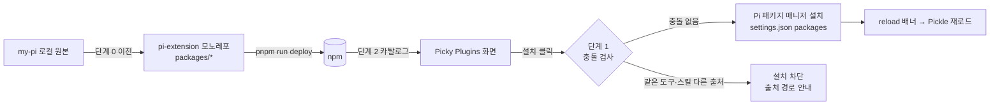

🧩

# Curated 플러그인 추가: web-access · vcc-ko · 스킬 5종

2026-09-29 · 설계 / 구현 준비 · 개정 2

---

> 이 문서는 구현 계약과 단계 계획이다. 구현·npm 배포·앱 재실행 승인이 아니다. "현재 사실"은 2026-09-29 기준 코드와 로컬 설치물에서 확인한 내용이고, "설계"는 새로 정하는 계약이며, "구현 중 증명"은 코드로 확인해야 하는 가정이다.
>
> 개정 2: 앱 번들 내장·환경 격리 설계(개정 1, `ac8be409e`)를 폐기했다. 기존 curated 플러그인과 같은 방식, 즉 사용자 Pi `agentDir`에 npm Pi 패키지를 설치하는 방식으로 바꾸고, 설치 안전성을 중심에 둔다.

## 목차

- [1. 범위와 판단](#1-범위와-판단)
- [2. 현재 사실](#2-현재-사실)
- [3. 전체 흐름](#3-전체-흐름)
- [4. 단계 0: npm 패키지 준비·배포](#4-단계-0-npm-패키지-준비배포)
- [5. 단계 1: 설치 안전장치](#5-단계-1-설치-안전장치)
- [6. 단계 2: Picky 카탈로그 추가](#6-단계-2-picky-카탈로그-추가)
- [7. 플러그인별 위험과 대응](#7-플러그인별-위험과-대응)
- [8. 검증 계획](#8-검증-계획)
- [9. 결정이 필요한 항목](#9-결정이-필요한-항목)
- [10. 작업 체크리스트](#10-작업-체크리스트)

## 1. 범위와 판단

| ID | 종류 | 현재 원본 | 배포 패키지(안) |
|---|---|---|---|
| `web-access` | extension | `~/.pi/agent/extensions/web-access` (로컬. 원본은 `nicobailon/pi-web-access` MIT fork) | `@ryan_nookpi/pi-extension-web-access` (신규) |
| `vcc-ko` | extension | `@ryan_nookpi/pi-extension-vcc-ko` 0.1.0 | 그대로 |
| `skill-creator` | skill | `Jonghakseo/my-pi` `skills/skill-creator` | `@ryan_nookpi/pi-skill-skill-creator` (신규) |
| `excalidraw` | skill | 〃 `skills/excalidraw` | `@ryan_nookpi/pi-skill-excalidraw` (신규) |
| `tmux-terminal` | skill | 〃 `skills/tmux-terminal` | `@ryan_nookpi/pi-skill-tmux-terminal` (신규) |
| `chrome-cdp` | skill | 〃 `skills/chrome-cdp` | `@ryan_nookpi/pi-skill-chrome-cdp` (신규) |
| `a4` | skill | 〃 `skills/a4` | `@ryan_nookpi/pi-skill-a4` (신규) |

판단:

1. **설치 모델은 기존 curated와 같다.** Plugins 화면에서 설치·제거·업데이트하고, agentd가 번들 Pi SDK 패키지 매니저로 사용자 `agentDir`(`PI_CODING_AGENT_DIR`)에 설치하며, 사용자 `settings.json`의 `packages`에 기록된다. 설치된 플러그인은 사용자의 터미널 Pi에서도 똑같이 동작한다. 격리하지 않는다.
2. **스킬도 npm Pi 패키지로 배포한다.** Pi 패키지는 `pi.skills` 매니페스트로 스킬만 담을 수 있다(Pi `docs/packages.md` "Create a package"). 기존 `PickySkillInstaller`(앱 번들 → `~/.pi/agent/skills` 복사) 방식은 쓰지 않는다. 업데이트가 앱 릴리즈에 묶이고 excalidraw 21MB가 앱 크기에 들어가기 때문이다.
3. **안전의 중심은 "두 벌 로드"를 막는 것이다.** Pi는 로컬 확장 디렉터리와 npm 패키지가 같은 도구를 등록해도 둘 다 로드한다. 이름 충돌은 진단으로만 남고 훅은 양쪽 모두 돈다. Picky는 설치 전에 같은 도구·스킬을 가진 다른 출처를 찾아 설치를 막고 사용자에게 알린다(5장).
4. **긴급 차단은 기존 보류 목록을 쓴다.** 배포본에 문제가 생기면 `agentd/src/domain/curated-package-safety.ts`의 `heldPackages`에 넣어 설치·업데이트를 닫는다. 새 장치를 만들지 않는다.

범위 밖: 앱 번들 내장, `agentDir` 격리, 외부 전제(tmux, Chrome, python-docx)의 자동 설치, 기존 curated 13개 변경.

## 2. 현재 사실

### 2.1 Picky curated 경로

- 카탈로그: `PickyCuratedPlugin.curatedDefaults`(`Picky/Companion/CompanionPanelExtensionsView.swift`), 메타데이터 `PickyHubPluginCatalog.swift`(category, provider, systemImage, useCaseKeys), 문구 `Localizable.xcstrings`의 `extensions.curated.*`, `hub.plugins.useCase.*`.
- 설치: `PickyCuratedPluginInstaller.install(source:)` → agentd `package-operations.ts` → Pi `DefaultPackageManager` → `<agentDir>/npm/node_modules/<name>` + `settings.json` `packages`.
- 상태: 설치 여부는 `settings.json` `packages`에서, 버전은 설치된 `package.json`에서 읽는다. 소스에 버전이 있으면 pinned로 보고 업데이트를 제안하지 않는다.
- 업데이트 확인: `checkUpdates` → agentd `checkAvailableUpdates()` → `packageUpdatesAvailable` 이벤트.
- 재로드: 설치 후 reload 배너. 기존 문서(`docs/extension-safety-cutover.md` 5항)상 reload는 메인을 다시 로드하지 않고, 터미널 세션은 건너뛰며, 스트리밍 중인 세션은 중단한다.
- 보류: `curatedPackageSafetyError(source)`가 memory-layer, cron의 설치·업데이트를 막는다. 제거는 허용한다.

### 2.2 Pickle 런타임과 사용자 Pi

- 실행 중인 Pickle child 데몬은 모두 `PI_CODING_AGENT_DIR=/Users/creatrip/.pi/agent`다.
- Pickle은 사용자 확장·스킬·AGENTS.md·설정·인증을 그대로 로드한다. 예외는 `bash-async`, `subagent` 두 개뿐이다. 이 둘은 Picky 고정본으로 바뀐다(`qualified-async-providers.ts` `asyncProviderLoaderOptions`의 `isLegacyProvider`).
- 따라서 curated로 설치한 패키지는 다음 reload부터 Pickle과 메인 모두에 로드된다.

### 2.3 Pi 0.87.1 로더 규칙

- 확장 도구·명령 이름 충돌: 모두 로드하고 `errors`에 `Tool "x" conflicts with …` 진단만 추가한다. 먼저 로드된 쪽의 도구가 쓰인다(`dist/core/resource-loader.js` `addExtensionConflictDiagnostics`).
- 스킬 이름 충돌: first-found wins, `collision` 진단(`dist/core/skills.js`).
- 패키지 중복: npm은 패키지 이름으로 식별해 같은 패키지를 두 번 올리지 않는다. 그러나 로컬 디렉터리와 npm 패키지처럼 **출처가 다른 같은 기능은 막지 않는다**(`docs/packages.md` "Understand scope and identity").
- npm 패키지 설치 시 `dependencies`도 설치한다. `pi-ai`, `pi-agent-core`, `pi-coding-agent`, `pi-tui`, `typebox`는 Pi가 공급하므로 `peerDependencies "*"`로 둔다(`docs/packages.md` "Declare dependencies").

### 2.4 이 PC에서 실제로 충돌하는 것

| 대상 | 이미 있는 것 | npm 판 설치 시 |
|---|---|---|
| web-access | `~/.pi/agent/extensions/web-access` (자동 발견 로컬 확장) | `web_search`, `fetch_content`, `get_search_content`, `/search` 두 벌 |
| 스킬 5종 | `~/.pi/agent/skills/<name>` | 같은 이름 스킬 두 벌, 한쪽만 적용 |
| vcc-ko | npm 설치됨, 같은 패키지 | 충돌 없음(설치됨으로 표시) |

다른 사용자에게도 같은 일이 생길 수 있다. 원본 `npm:pi-web-access`를 설치한 사람은 같은 도구 이름을 가진 다른 패키지를 이미 갖고 있다.

## 3. 전체 흐름



## 4. 단계 0: npm 패키지 준비·배포

작업 위치: `~/Documents/pi-extension`. 배포는 패키지마다 `pnpm run deploy <name>`(dry-run, PTY publish, registry 확인까지 수행).

### 4.1 web-access 추출

격리가 필요 없으므로 동작 변경은 하지 않는다. 사용자 Pi에서 쓰던 그대로 옮긴다.

1. `packages/web-access/`로 소스와 테스트(`config`, `extract`, `index-helpers`, `search`, `storage`)를 옮긴다.
2. `LICENSE`에 원본 `nicobailon/pi-web-access` MIT 저작권 표기를 유지하고 README에 fork 사실과 원본 대비 차이를 적는다.
3. `package.json`은 `bash-async` 형식을 따른다.
   - `pi.extensions: ["./index.ts"]`, `keywords: ["pi-package"]`
   - `files`: 상대 import 대상 전부(모노레포 `check-workspace.mjs`가 누락을 검사)
   - `dependencies`: `@mozilla/readability`, `linkedom`, `turndown`, `unpdf`, `p-limit`(현재 `~/.pi/agent/extensions/package.json` 범위에서 시작)
   - `peerDependencies`(optional `"*"`): `@earendil-works/pi-ai`, `pi-coding-agent`, `pi-tui`, `typebox`
4. 루트 `package.json`에 `publish:web-access`를 추가한다.
5. 정리만 한다: 쓰이지 않는 `perplexityApiKey`, `chromeProfile` 타입 제거. 설정 경로(`~/.pi/web-search.json`), 사용량 파일(`~/.pi/exa-usage.json`), PDF 위치(`~/Downloads`)는 유지한다.

### 4.2 스킬 패키지

모노레포에 `packages/skill-<name>/` 5개를 만든다.

```json
{
  "name": "@ryan_nookpi/pi-skill-excalidraw",
  "keywords": ["pi-package", "pi-skill"],
  "pi": { "skills": ["./skills/excalidraw"] },
  "files": ["skills/excalidraw/SKILL.md", "skills/excalidraw/scripts/", "…"]
}
```

구조는 `skills/<name>/SKILL.md`와 기존 `scripts/`, `references/`, `assets/`를 그대로 둔다. 스킬은 `SKILL.md` 절대 경로 기준으로 스크립트를 찾으므로 설치 위치가 바뀌어도 된다.

모노레포 규칙 수정: `check-workspace.mjs`는 `pi.extensions[0] === "./index.ts"`를 강제한다. `pi.skills`만 있는 패키지는 이 검사 대신 "`pi.skills` 경로마다 `SKILL.md`가 있고 frontmatter `name`이 디렉터리명과 같은지"를 검사하도록 분기한다. 같은 검사에서 `skills/<name>/references/setup.md`가 없으면 실패시킨다.

**최초 설정 안내(필수)**: 외부 도구가 필요한 스킬은 `references/setup.md`에 확인 명령과 1회 설치 방법을 적는다. `SKILL.md`는 전제 확인이 실패하면 이 문서를 근거로 사용자에게 설치 명령을 안내하도록 링크한다. 에이전트가 설치 방법을 추측하지 않게 하려는 장치다. Picky 카드 설명도 같은 문서를 기준으로 쓴다(6장).

| 스킬 | 확인 명령 | 1회 설치 |
|---|---|---|
| skill-creator | `python3 --version` | `xcode-select --install` 또는 `brew install python` |
| excalidraw | `open -Ra "Google Chrome"` | `brew install --cask google-chrome` |
| tmux-terminal | helper `doctor` | `brew install tmux` |
| chrome-cdp | `command -v chrome-devtools`, `chrome://version` | `npm install -g chrome-devtools-mcp@latest`, Chrome 144+, `chrome://inspect/#remote-debugging` 토글 |
| a4 | `python3 -c "import docx"` | `python3 -m pip install --user python-docx` (Homebrew Python은 `--break-system-packages` 추가) |

스킬별 이전 작업:

| 스킬 | 작업 |
|---|---|
| skill-creator | 하드코딩 `python3 ~/.pi/agent/skills/skill-creator/scripts/validate_skill.py`를 스킬 디렉터리 기준 경로로 바꾼다. 스킬 위치 안내는 유지 |
| excalidraw | `app/dist`는 git에서 무시되므로 `prepack`에서 `vite build`를 실행해 `files`에 넣는다. `excal build`로 재빌드할 수 있게 `app/src`·`package.json`·lockfile도 넣고 `node_modules`는 뺀다. tarball 약 16MB. 첫 실행 자동 빌드 안내는 "빌드된 앱 포함"으로 바꾼다 |
| tmux-terminal | 변경 없음. 테스트(`tmux-terminal.test.mjs`)는 `files`에서 제외 |
| chrome-cdp | `browser 에이전트(playwright-cli)` 언급 삭제(설치 대상 환경에 없을 수 있음). `chrome-devtools` CLI 설치 안내는 mise 전용에서 `npm i -g chrome-devtools-mcp`도 허용하도록 넓힌다. 동의 게이트 문단은 그대로 |
| a4 | `markdown-it`을 패키지 `dependencies`로 옮긴다. `__pycache__`, `test-a4-regressions.py` 제외. python-docx 안내 유지 |

**증명 완료(2026-09-29)**: 임시 agentDir에 tarball 6개를 npm 설치한 뒤 Pi `DefaultResourceLoader`가 확장 1개(도구 3개, `/search`)와 스킬 5개를 진단 0건으로 로드했다. 설치 위치에서 a4 HTML·DOCX 변환과 검사, skill-creator 검증, tmux `doctor`, excalidraw `lint`와 번들 앱 HTTP 200(빌드 없이)을 확인했다. 아래 항목도 여기서 확인됐다.

a4의 `md-to-a4-html.mjs`가 Pi 설치 레이아웃(`<agentDir>/npm/node_modules/@ryan_nookpi/pi-skill-a4/…`)에서 `markdown-it`을 해석하는지 실제 설치로 확인한다.

### 4.3 작성자 PC 전환(my-pi)

배포 후 이 PC의 원본을 치운다. 그대로 두면 5장 충돌 검사에 걸려 Picky에서 설치할 수 없다(의도한 동작).

1. `extensions/web-access`, `skills/{skill-creator,excalidraw,tmux-terminal,chrome-cdp,a4}` 삭제.
2. 설치는 Picky Plugins 화면에서 하거나 `settings.json` `packages`에 직접 추가. 과거 `bash-async`, `vcc-ko` 이전 커밋과 같은 형식으로 별도 커밋.

## 5. 단계 1: 설치 안전장치

### 5.1 충돌 검사 계약

카탈로그 항목이 제공 리소스를 선언한다.

```swift
struct PickyCuratedPlugin {
    …
    let providedTools: [String]   // web-access: ["web_search","fetch_content","get_search_content"], vcc-ko: ["vcc_recall"]
    let providedSkills: [String]  // excalidraw: ["excalidraw"]
}
```

설치 요청 전에 Picky가 agentd에 `inspectCuratedConflicts { source, tools, skills }`를 보낸다. agentd의 응답:

```ts
{ type: "curatedConflicts", source, conflicts: Array<
  | { kind: "tool"; name: string; ownerPath: string }
  | { kind: "skill"; name: string; ownerPath: string }
> }
```

판정 기준:

- **도구**: 항상 떠 있는 메인 런타임의 등록 도구 중 이름이 같고, `sourceInfo.path`가 설치하려는 패키지 경로(`<agentDir>/npm/node_modules/<name>`) 밖이면 충돌이다. Pi 내장 도구와 Picky 커스텀 도구(`ask_user_question` 등)도 충돌로 본다.
- **스킬**: 메인 런타임 `resourceLoader.getSkills()`에서 이름이 같고 파일 경로가 패키지 밖이면 충돌이다.
- 메인 런타임이 없으면(모의 런타임 등) 파일 시스템 fallback을 쓴다. 스킬은 `<agentDir>/skills/<name>`, `~/.agents/skills/<name>`, cwd의 `.pi/skills`·`.agents/skills`를 보고, 확장은 `<agentDir>/extensions/<id>`와 `settings.json` `packages`의 알려진 동명 패키지(web-access의 경우 `pi-web-access`)를 본다.
- 이미 같은 패키지가 설치돼 있으면 충돌이 아니다(업데이트 대상).

`@earendil-works/*` 접근은 `runtime/` 안에 두고, 애플리케이션 코드는 `runtime/types.ts`의 인터페이스(`listRegisteredToolOwners()`, `listSkillOwners()`)만 쓴다.

### 5.2 사용자 흐름

- 충돌이 있으면 설치 버튼 대신 "같은 기능이 이미 설치되어 있음" 상태를 보여주고, 상세에서 충돌 출처 경로를 보여준다. Picky는 그 파일을 지우지 않는다. 사용자 소유이기 때문이다.
- 강제 설치 옵션은 두지 않는다. 두 벌 로드는 결과가 예측되지 않으므로 사용자가 한쪽을 치운 뒤 다시 시도하게 한다.
- 설치된 뒤 새로 충돌이 생긴 경우(사용자가 나중에 로컬 스킬을 추가함)는 카드에 경고만 표시한다. 자동 제거는 하지 않는다.
- 문구는 `picky-ux-writing` 절차로 ko/en 함께 작성한다.

### 5.3 설치 후 확인

설치 성공 후 reload가 끝나면 agentd가 해당 패키지의 로드 결과를 확인한다.

- 확장: `resourceLoader.getExtensions().errors`에 이 패키지 경로의 로드 오류나 충돌 진단이 있으면 `pluginsReloaded` 결과에 실어 카드에 "로드 실패"로 표시한다.
- 스킬: `getSkills()`에 이름이 없거나 winner 경로가 패키지 밖이면 같은 방식으로 표시한다.

이 확인이 없으면 설치는 성공했는데 실제로는 다른 출처가 쓰이는 상태를 사용자가 알 수 없다.

### 5.4 버전 정책

- 카탈로그 소스는 기존과 같이 버전 없는 `npm:<name>`으로 둔다. 업데이트 제안이 동작하고 기존 13개와 규칙이 같다.
- 문제 배포본은 `heldPackages`로 막는다. 보류 항목은 설치·업데이트가 닫히고 제거만 열린다.
- **구현 중 증명**: Pi 패키지 매니저의 `checkAvailableUpdates`가 스킬 전용 패키지에도 동작하는지 확인한다.

## 6. 단계 2: Picky 카탈로그 추가

| ID | category | commandName 표시 | 카드 설명에 적을 전제(1회 설치 포함) |
|---|---|---|---|
| web-access | research | `web_search` | 없음. 키 없이 Exa MCP로 동작하며 `EXA_API_KEY`가 있으면 사용 |
| vcc-ko | taskManagement | `vcc_recall` | 기본 압축을 대체한다는 사실 |
| skill-creator | development | `/skill:skill-creator` | python3 (검증 스크립트만). `xcode-select --install` |
| excalidraw | content | `/skill:excalidraw` | Google Chrome. `brew install --cask google-chrome` |
| tmux-terminal | development | `/skill:tmux-terminal` | tmux. `brew install tmux` |
| chrome-cdp | development | `/skill:chrome-cdp` | Chrome 144+, 원격 디버깅 허용, `npm install -g chrome-devtools-mcp@latest` |
| a4 | content | `/skill:a4` | python3, python-docx. `python3 -m pip install --user python-docx` |

- `PickyCuratedPlugin`에 7개 static과 `providedTools`/`providedSkills`를 추가하고 `curatedDefaults`에 넣는다.
- `PickyHubPluginCatalog` 메타데이터와 useCase 문구를 추가한다. provider는 `@ryan_nookpi`.
- 외부 전제는 1차에서 설명 문구로만 알린다. 카드 설명에는 필요한 것과 대표 1회 설치 명령을 적고, 상세 화면에는 해당 스킬 `references/setup.md`의 확인·설치 절차(예외 경우 포함)를 요약한다. 문구 원본은 setup.md이며 둘이 어긋나면 setup.md를 기준으로 고친다.
- 동적 준비 상태 검사는 하지 않는다. 각 스킬이 실행 시 스스로 확인하고 setup.md로 안내한다(tmux-terminal `doctor`, a4의 import 확인, chrome-cdp CLI 확인).
- 카탈로그 추가는 **npm 배포가 끝난 패키지만** 한다. 배포 전 패키지를 넣으면 설치 버튼이 실패한다.

## 7. 플러그인별 위험과 대응

### vcc-ko: 압축 동작 전체가 바뀜

- 설치하면 `overrideDefaultCompaction: true`가 기본이라 `/compact`, 자동 임계치 압축, Picky 메인 에이전트의 idle compaction(`main-agent-coordinator.ts`의 `handle.compact()`)이 모두 vcc 알고리즘으로 바뀐다. 사용자 터미널 Pi도 마찬가지다.
- 메인 에이전트의 상시 규칙은 시스템 프롬프트에 붙으므로(`picky-runtime-contract-extension.ts`) 압축으로 잃지 않는다. `compactSummary`는 HUD에 문자열로 보이므로 형식이 바뀌어도 표시만 달라진다.
- 압축 후 자동 계속(`continueAfterThresholdCompact`)은 Pi ≥ 0.84.4에서 스스로 침묵한다(`PI_SELF_RESUME_VERSION`). Picky 번들 Pi는 0.87.1이다.
- **카탈로그 추가 전 필수 증명**: `extension-safety.integration.test.ts`와 같은 방식(HOME·agentDir 격리, 실제 Picky 어댑터, 오프라인 provider)으로 vcc-ko를 로드한다. 이어서 (a) 메인 idle compaction 성공과 `compactionCompleted` 수신, (b) Pickle 임계치 압축 뒤 예상 밖 follow-up 0건, (c) 압축 중 들어온 입력이 버퍼 후 전달되는지를 확인한다.

### web-access: 네트워크 도구 추가

- 새 권한 요구는 없다. 외부 요청은 도구 호출 시에만 발생한다.
- 선택 바이너리(ffmpeg, yt-dlp, gh)는 없으면 도구 오류 문구로 안내된다.
- `/search`는 `ui.select`를 쓰며 HUD 선택 UI로 뜬다. 활동 위젯(`setWidget`)과 단축키는 Picky에서 no-op이다. 문제는 아니지만 카드 설명에 쓰지 않는다.

### chrome-cdp: 사용자 브라우저 접근

- 스킬의 동의 게이트(사용자가 요청했을 때만 연결, Chrome Allow 대화상자는 사용자가 클릭)를 유지한다. 배포 패키지에서 이 문단을 지우거나 약화하지 않는다.
- 설치했다고 Chrome 접근 권한이 생기지 않는다는 점을 카드 설명에 적는다.

### excalidraw: Chrome 창 실행과 로컬 서버

- 로컬 HTTP 서버를 띄우고 `open -na "Google Chrome" --args --app=…`로 창을 연다. 상태는 `~/.cache/pi-excalidraw`다. 사용자 Pi와 공유된다.

### tmux-terminal, a4, skill-creator

- 스킬 문서와 보조 스크립트뿐이다. 실행은 agent의 bash 권한 안에서만 일어나므로 새 위험은 없다.

## 8. 검증 계획

| 계약 | 실패 시나리오 | 검증 |
|---|---|---|
| 도구 충돌 차단 | 로컬 web-access가 있는데 npm 판이 설치돼 두 벌 로드 | agentd 테스트: fixture `agentDir`에 `web_search`를 등록하는 로컬 확장을 두고 실제 로더로 메인 런타임을 올린 뒤 `inspectCuratedConflicts` → `tool` 충돌과 로컬 경로 반환 |
| 스킬 충돌 차단 | `~/.pi/agent/skills/excalidraw`가 있는데 패키지 설치 | 같은 fixture에 로컬 스킬 → `skill` 충돌 |
| 동일 패키지 재설치 | 이미 설치된 vcc-ko를 충돌로 오판 | fixture에 같은 패키지 설치 → 충돌 0건 |
| 설치 후 winner 확인 | 설치 성공인데 다른 출처가 쓰임 | reload 결과에 로드 실패가 실리는지 fixture로 확인 |
| 프로토콜 | Swift·TS 스키마 불일치 | `server.test.ts`, `PickyAgentClientTests`에 `inspectCuratedConflicts`/`curatedConflicts` 왕복 |
| Swift 흐름 | 충돌 상태에서 설치 버튼이 보임 | `PickyCuratedPluginsViewModel` 테스트: 충돌 응답 → row 상태 `conflict`, install 미호출 |
| vcc-ko 압축 | 7장 필수 증명 | 통합 테스트 |
| 스킬 패키지 레이아웃 | 설치 후 스크립트가 의존성을 못 찾음 | 임시 `PI_CODING_AGENT_DIR`에 실제 npm 설치 후 a4 HTML 변환, excalidraw `server.mjs` 기동, tmux-terminal `doctor` 실행 |
| 모노레포 | 스킬 패키지가 workspace 검사 실패 | `pnpm run verify:strict` |

앱·사용자 데몬은 건드리지 않는다. 설치 스모크는 `PICKY_AGENTD_PORT`, `PICKY_APP_SUPPORT_DIR`, `PI_CODING_AGENT_DIR`을 임시 경로로 둔 throwaway agentd에서만 한다.

## 9. 결정이 필요한 항목

권장안을 기본으로 진행하고, 다르게 원하면 해당 단계 전에 바꾼다.

| 항목 | 권장 | 이유 |
|---|---|---|
| 스킬 패키지 단위 | 스킬 하나당 패키지 하나 | 카드·제거·업데이트 단위가 기존 curated와 맞는다 |
| 스킬 패키지 이름 | `@ryan_nookpi/pi-skill-<name>` | 확장 패키지(`pi-extension-*`)와 종류가 구분된다 |
| 충돌 시 강제 설치 | 제공하지 않음 | 두 벌 로드는 어느 쪽이 쓰일지 예측되지 않는다 |
| 외부 전제 동적 검사 | 1차 제외, 설명 문구로만 | 스킬이 실행 시 스스로 안내한다. 필요하면 2차 |
| vcc-ko 카탈로그 추가 시점 | 7장 통합 테스트 통과 후 | 압축은 메인 에이전트 수명과 직결된다 |

## 10. 작업 체크리스트

**단계 0: npm (pi-extension 모노레포, my-pi)**
- [ ] `packages/web-access` 이전, LICENSE·README, `publish:web-access`
- [ ] `check-workspace.mjs`에 스킬 패키지 분기
- [ ] `packages/skill-*` 5개, excalidraw `prepack` 빌드, a4 `dependencies`, 스킬 문서 경로 수정, 스킬별 `references/setup.md`
- [ ] `verify:strict` → 패키지별 `pnpm run deploy`
- [ ] 임시 `PI_CODING_AGENT_DIR`에 설치해 레이아웃 스모크
- [ ] my-pi 로컬 원본 삭제(별도 커밋)

**단계 1: 안전장치 (Picky)**
- [ ] runtime 인터페이스 `listRegisteredToolOwners`/`listSkillOwners`, 파일 시스템 fallback
- [ ] `inspectCuratedConflicts` 프로토콜(TS·Swift) + 테스트
- [ ] 설치 후 winner 확인을 `pluginsReloaded` 결과에 포함
- [ ] 뷰모델 `conflict` 상태, 카드·상세 UI, 문구(ko/en)

**단계 2: 카탈로그 (Picky)**
- [ ] web-access, 스킬 5종 추가(배포 완료 후)
- [ ] vcc-ko 통합 테스트 → 통과 시 추가
