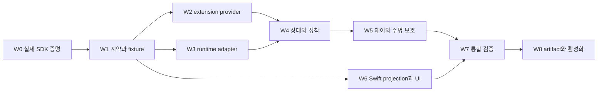

🛠️

# 피클 비동기 작업 구현 계획

2026-09-25 · Pi 설계 검토 · 구현 절차 / 검증

---

> [설계 계약](pickle-async-tasks-design.md)을 코드 변경으로 옮기기 위한 계획이다. 아래 테스트 명령은 구현 단계에서 실행할 명령이며, 이번 문서 작업에서 실행한 것으로 읽으면 안 된다. 새 파일과 새 명령은 명시적으로 표시한다.

## 목차

- [1. 구현 준비도 판정](#1-구현-준비도-판정)
- [2. 단계와 의존 관계](#2-단계와-의존-관계)
- [3. W0 실제 SDK 계약 증명](#3-w0-실제-sdk-계약-증명)
- [4. W1 공통 계약과 프로젝션](#4-w1-공통-계약과-프로젝션)
- [5. W2 익스텐션 provider](#5-w2-익스텐션-provider)
- [6. W3 runtime adapter](#6-w3-runtime-adapter)
- [7. W4 응답과 피클 정착 분리](#7-w4-응답과-피클-정착-분리)
- [8. W5 제어·보관·runtime 보호](#8-w5-제어보관runtime-보호)
- [9. W6 Swift store와 작업 UI](#9-w6-swift-store와-작업-ui)
- [10. W7 실제 경로 통합과 W8 배포](#10-w7-실제-경로-통합과-w8-배포)
- [11. 수용 테스트 행렬](#11-수용-테스트-행렬)
- [12. 현재 검증과 challenger 기록](#12-현재-검증과-challenger-기록)

## 1. 구현 준비도 판정

검토 후 판정은 **W0 착수 가능, 비동기 활성화는 아직 불가**다. 필요한 상태 소유자와 변경 경로는 현재 저장소에 존재하며 별도 외부 서버는 필요하지 않다. Pi SDK 변경 필요 여부는 deferred settled action의 중지 경합을 W0에서 증명한 뒤 결정한다. 실제 event ordering과 모델 입력 포함 확인 전에는 전체 계약의 런타임 실현 가능성이 검증됐다고 할 수 없다.

| 판단 | 내용 |
|---|---|
| 소스로 확인 | extension lifecycle 접점, 세션별 EventBus 선례, durable commit, v2 snapshot/transaction, 독립 Swift stores, archived child 해제 경로 |
| 지금 코드 작성에 들어갈 수 있음 | W0 fixture와 기존 동작 characterization. W1 최종 DTO와 W2/W3 adapter 계약은 W0 결과 뒤 고정 |
| 먼저 증명해야 함 | pre-spawn durable 등록의 교착 부재, completion metadata의 모델 입력/cycle 연결, deferred 결과와 전체 중지의 경합, 실제 종료 확인, 0.85/0.87 SDK 조합 |
| 활성화에 필요한 조건 | W0~W7의 계약 증거, 보관된 작업 접근, owner daemon의 해제 승인, 실제 npm artifact 검증 |
| 이번 작업에서 하지 않음 | 제품 코드 변경, 신규 테스트 구현/실행, npm 조회·설치·배포, 실제 앱/daemon 조작 |

버전 기준:

- Picky HEAD `143d003f2`, Pi SDK `0.87.1`, Node pin `24.18.1`.
- extension HEAD `886ef383fd709446c2357c360364414e0132eddf`, SDK override `0.85.0`.
- extension 로컬 package.json은 bash-async `0.2.1`, subagent `0.5.7`.
- Picky working tree에 이 작업과 무관한 UI/설정 변경이 있다. 라인 번호보다 문서에 적은 symbol을 우선 검색한다. 동시 작업을 지우거나 baseline으로 되돌리지 않는다.

## 2. 단계와 의존 관계



| 단계 | 실행 위치 | 수정 단위 | 완료 증거 |
|---|---|---|---|
| W0 | Picky + extension fixture | 실제 SDK/headless 수명 smoke | 순서·수신·종료를 관찰하는 테스트 |
| W1 | Picky contracts/DTO | identity, task/ticket, metadata, 명령/이벤트 | 양 언어 fixture와 omission 계약 |
| W2 | pi-extension | bash/subagent lifecycle provider | 실행기가 유지되는 provider 계약 테스트 |
| W3 | agentd runtime | host bridge, 초기 buffering, cycle correlation | 실제 SDK + runtime adapter 테스트 |
| W4 | agentd application/domain | 턴 확정과 피클 정착 분리 | 영속 결과·v2·notification 검사 |
| W5 | agentd + Swift router | stop/archive/release/reload 보호 | 모든 진입점과 stale 승인 회귀 |
| W6 | Swift HUD/stores | shelf, 종류별 행, composer, archived 접근 | v2 replay·렌더·입력 보존 |
| W7 | 양 저장소 | 실제 provider 통합·실패 행렬 | end-to-end trace와 저장값 |
| W8 | 패키지/배포 | artifact 확인과 점진 활성화 | 실제 로드 버전과 격리 smoke |

W2와 W3는 W1 고정 뒤 서로 다른 저장소/파일에서 병렬 작업할 수 있다. W4와 W5는 supervisor/terminal commit을 공유하므로 병렬 수정하지 않는다. W5와 W6도 router/protocol/view model 소유 파일을 겹쳐 수정하지 않는다. 각 묶음은 완결된 계약 단위로 커밋한다.

모든 단계에서 처음에는 기존 characterization을 재사용한다. 새 테스트는 아래의 관찰 가능한 실패를 막는 경우에만 추가한다. 정적 symbol 검색은 구현 지점 확인이지 동작 테스트의 대체물이 아니다.

## 3. W0 실제 SDK 계약 증명

### 확인한 재사용 지점

- [extension-safety.integration.test.ts](../agentd/src/runtime/extension-safety.integration.test.ts)는 격리 HOME/agentDir와 offline provider, 실제 `PiSdkRuntime`를 사용한다.
- 해당 테스트는 memory/cron용이고 checkout 환경변수 없이는 주요 케이스가 skip된다. 테스트 이름에 남은 이전 SDK 버전은 현재 검증 버전의 증거가 아니다.
- [pi-sdk-runtime.ts](../agentd/src/runtime/pi-sdk-runtime.ts)의 `createHandle`은 세션별 EventBus를 services에 전달한다.
- [bootstrap.ts](../agentd/src/bootstrap.ts)는 Pickle runtime과 primary main runtime을 별도로 생성한다. 새 capability는 Pickle constructor 옵션으로 제한할 수 있다.

### 구현 절차

1. 기존 offline fixture를 참고해 새 `agentd/src/runtime/async-task-host.integration.test.ts`를 만든다. 실제 extension 루트를 명시하지 않으면 필수 검증 모드가 실패해야 한다.
2. user HOME, `.pi`, Application Support와 live port를 사용하지 않는다. shell/subagent 실행은 유한한 로컬 fixture다. 외부 LLM과 실제 subagent 모델 호출은 금지한다.
3. prototype provider로 task 등록 request/reply를 먼저 확인한 뒤, 실제 bash/subagent start 경계와 supervisor serializer를 연결한다. tool이 등록 승인을 기다려도 이벤트가 처리되는지 검사한다. reserved/approved/starting/spawned/abandoned 각각에서 reply 유실·중복 query·철회·host 재시작을 주입한다. prototype만 통과하면 W0 완료가 아니다.
4. 완료 custom message에 ID를 넣고 idle/streaming/queued/compacting/agent-settled handler 각각에서 `details`가 어떤 event에 남는지 기록한다. passive append와 실제 모델 요청 포함을 구분하고 마지막 후속 응답까지 관찰한다. 0.87.1의 deferred settled action을 0.85.0과 동일 순서라고 가정하지 않는다.
5. stop request, process exit, late output, follow-up suppression을 별도 기록한다. 특히 0.87.1의 `_deferredSettledActions`는 clearQueue/abort가 직접 비우지 않는다. settled handler에서 완료 발신한 직후 전체 중지를 요청하고, 새 모델 호출이 생기는지 관찰한다. extension 객체 dispose를 프로세스 종료 증거로 사용하지 않는다.
6. Picky SDK 0.87.1에서 실제 두 package를 로드하고, extension 자체 테스트 환경 0.85.0과 비교한다. npm artifact 시험은 W8에서 별도로 수행한다.

### 통과 조건과 중단 조건

- async 시작 tool은 실제 작업 종료 전에 반환하지만 durable 등록보다 먼저 spawn하지 않는다.
- 빠른 작업이 start tool 반환 전에 끝나도 task/ticket이 사라지지 않는다.
- approved reply 유실 뒤 동일 ID query가 중복 spawn을 만들지 않는다. 철회된 reservation의 늦은 grant는 무효이며, host 재시작 뒤 approved/starting은 증거 없이 정착 처리하지 않는다.
- 완료 결과가 후속 응답에 포함됐다는 사실을 구조화된 ID로 증명한다.
- 등록 기다림/구독 초기화/첫 prompt 사이 교착이 없다.
- 실제 종료 미확인이 드러나고, false success를 만들지 않는다.
- 중지 generation 이후 새 completion-triggered 모델 호출이 시작되지 않는다. public API와 provider admission으로 증명할 수 없으면 SDK 변경 필요 여부를 먼저 결정하고 async 활성화를 막는다.
- 모델 소비 ID를 현재 SDK로 보존할 수 없거나 등록을 직렬화할 수 없다면 W1 계약을 바꾸고 재검증한다. 텍스트 파싱이나 timeout 기반 완료로 우회하지 않는다.

새 테스트 추가 후 실행할 명령:

```bash
PICKY_TEST_EXTENSION_ROOT="$HOME/Documents/pi-extension" \
  pnpm --dir agentd exec vitest run src/runtime/async-task-host.integration.test.ts
```

현재는 해당 새 테스트가 없고 이 명령도 실행하지 않았다.

## 4. W1 공통 계약과 프로젝션

### 수정 위치

- [agentd/src/protocol.ts](../agentd/src/protocol.ts), [Picky/PickyAgentProtocol.swift](../Picky/PickyAgentProtocol.swift).
- [contracts/protocol](../contracts/protocol), [session-field-ownership.json](../contracts/projection/session-field-ownership.json), [session-transient-ownership.json](../contracts/projection/session-transient-ownership.json).
- [terminal-session-finalization.ts](../agentd/src/domain/terminal-session-finalization.ts)의 mutation planner와 meta field 목록.
- [app-session-snapshot-policy.ts](../agentd/src/application/app-session-snapshot-policy.ts), [session-projection-v2-broadcaster.ts](../agentd/src/application/session-projection-v2-broadcaster.ts), v1 compatibility publisher.

### 구현 절차

1. `agentCycle`, `asyncWorkSummary`, `asyncTasks`, `completionTickets`, registration/control/release operation 상태의 persisted owner를 supervisor commit으로 고정한다. controlGeneration과 admission state, release token의 idempotent 결과도 복구 대상이다. 새 schema/helper는 각각 domain/runtime 경계 안에 둔다.
2. extension wire fixture를 새 `contracts/extensions/async-tasks-v1/`에 둔다. 두 저장소가 같은 fixture로 호환을 검사하며 별도 npm 공용 runtime 의존성은 먼저 만들지 않는다.
3. v2 task/ticket update mutation과 metadata를 추가한다. 하나의 durable commit에서 status/summary와 상세가 함께 바뀐다.
4. 상세 omission 시 unavailable로 표시하고, `agentCycle`과 safety summary는 minimal snapshot에도 유지한다. 알려지지 않은 task kind는 generic row로 decode한다.
5. 상세 조회/cancel/archive/release 명령은 session과 runtime identity를 포함하고 daemon이 소유권을 검사한다. 경로나 PID를 입력으로 받아 임의로 실행/종료하지 않는다.
6. protocol version parity와 negotiated dialect를 함께 갱신한다. v1/v2를 한 socket에 혼합 전송하지 않는다.

### 검증

기존 `agentd/src/protocol.test.ts`, `application/app-session-snapshot-policy.test.ts`, `domain/session-projection-ownership.test.ts`, `PickyTests/ProtocolContractTests.swift`, `PickyAgentProtocolCodecTests.swift`에 계약을 추가한다.

검증 대상은 optional/unknown kind/누락 상세/최소 요약/버전 불일치/중복 identity/큰 payload다. unsafe 누락은 0개가 아니라 reconciling 또는 unavailable로 나타나야 한다.

```bash
pnpm --dir agentd exec vitest run \
  src/protocol.test.ts \
  src/application/app-session-snapshot-policy.test.ts \
  src/domain/session-projection-ownership.test.ts
pnpm --dir agentd run typecheck
pnpm run check:architecture
```

## 5. W2 익스텐션 provider

### W2a bash_async

현재 접점은 `packages/bash-async/index.ts`, `job-manager.ts`, `notification-batcher.ts`, `types.ts`다. `onStateChange`는 현재 widget 갱신에 쓰이고, `start`는 job을 Map/queue에 넣고 바로 drain한다.

1. host capability를 세션별로 확인한다. 기존 TUI widget과 provider 상태 발행 실패를 분리한다.
2. durable 등록을 기다리는 pre-spawn 경계를 `start`에 추가한다. 기존 `onStateChange`에 await를 붙이는 것만으로는 drain이 기다리지 않으므로 충분하지 않다. task별 spawnOnce/abandon latch와 동일 ID registration query를 추가하고 실제 drain/spawn 직전에도 current controlGeneration을 확인한다.
3. terminal 상태와 completion ticket을 같은 lifecycle update에서 만든다. NotificationBatcher의 500ms 동안에도 ticket이 의무로 남는다.
4. 알림 `details`에 completion ID 목록을 추가한다. 발신 실패를 삼키지 않고 ticket 상태로 보고하며 수신 전 payload를 보존한다.
5. 현재 로컬 status/output 조회에는 자동 알림 억제가 없음을 회귀 계약으로 보존한다. 수동 조회를 completion 처리 완료로 바꾸지 않는다. host용 snapshot/detail은 모델용 poll guard와 알림 상태를 건드리지 않는 별도 읽기 경로로 둔다.
6. `cleanup_error`의 `detachExecution` late-settlement callback에서 presence를 갱신한다. shutdown timeout은 현재 job 삭제와 observer 단절을 수행하므로 unresolved tombstone과 최소 late observer를 추가한다. `finalized=true`가 liveness 갱신을 막지 않아야 한다.
7. list/history TTL은 active/unknown/ticket-pending 작업을 제거하지 못한다.

기존 테스트 `job-manager.test.ts`, `notification-batcher.test.ts`, `index.test.ts`를 확장한다. 새 lifecycle adapter의 직접 구현 함수보다 tool 접수·실제 runner·메시지 관측 결과를 검사한다.

### W2b subagent

현재 접점은 `packages/subagent/tool-execute.ts`, `commands.ts`, `store.ts`, `lifecycle.ts`, `invocation-queue.ts`, `activity.ts`다.

1. `isInteractiveTuiContext`는 TUI 용도로 유지하고, async 허용은 compatible host OR 기존 TUI로 분리한다.
2. `registerRunLaunch`와 실제 실행 시작 사이에 queued/등록 승인 경계를 둔다. `run`, `continue`, `batch`, `chain`, `/sub` 경로를 모두 목록화한다. invocation dequeue와 각 chain step은 current generation을 다시 검사하고, 그룹 중지 latch가 다음 step 등록도 막아야 한다.
3. root/group task를 먼저 등록하고 단계별 실행을 상세로 매핑한다. `continue`는 새 task ID, 원래 run ID는 표시값이다.
4. 현재 `subagent-activity`는 2.5초 제한과 tool count 조건이 있으므로 lifecycle 근거로 사용하지 않는다. 선택적 progress 데이터로만 쓴다.
5. `humanOnly`, 정상 결과, escalation, 오류 결과, origin session 이동, pending group completion을 completion 정책에 매핑한다. hidden 모드의 기존 headless 거부와 모델 비노출을 유지한다. pending completion 복귀 전송·stale eviction·shutdown suppression 모두 ticket에 반영한다.
6. cancel/전체 shutdown은 controller abort, 결과 Promise, 실제 exit/자원 정착을 분리한다. `runner.ts`의 terminal-message/agent-end fallback resolve는 exit가 아니다. pi/claude와 CLI/SDK 등 지원 runner별 종료 증거를 표로 만들고, 제공 못 하는 runner는 unknown을 유지한다. 오래된 runtime이 정리되기 전에 새 owner로 바꾸지 않는다.
7. 기존 start `sendMessage` 생략 정책을 보존한다. UI 이벤트를 tool call/result 사이에 메시지로 끼워 넣지 않는다.

기존 `subagent-tool-batch-chain.test.ts`, `subagent-group-pending.test.ts`, `subagent-lifecycle.test.ts`, `subagent-invocation-queue.test.ts`, `subagent-session-restore-observability.test.ts`, `subagent-commands-tool-integration.test.ts`를 재사용한다. `/sub`의 별도 실행기를 빠뜨리지 않는다.

```bash
pnpm --dir "$HOME/Documents/pi-extension" exec vitest run \
  packages/bash-async/job-manager.test.ts \
  packages/bash-async/notification-batcher.test.ts \
  packages/bash-async/index.test.ts \
  packages/subagent/subagent-tool-batch-chain.test.ts \
  packages/subagent/subagent-group-pending.test.ts \
  packages/subagent/subagent-lifecycle.test.ts \
  packages/subagent/subagent-invocation-queue.test.ts \
  packages/subagent/subagent-session-restore-observability.test.ts \
  packages/subagent/subagent-commands-tool-integration.test.ts
pnpm --dir "$HOME/Documents/pi-extension" run typecheck
```

전체 extension 검증/coverage는 해당 저장소의 commit/release gate에서 실행한다. 이 문서 작업에서 실행하지 않는다.

## 6. W3 runtime adapter

### 수정 위치

- [pi-sdk-runtime.ts](../agentd/src/runtime/pi-sdk-runtime.ts), [pi-sdk-runtime-session.ts](../agentd/src/runtime/pi-sdk-runtime-session.ts), [runtime/types.ts](../agentd/src/runtime/types.ts), [bootstrap.ts](../agentd/src/bootstrap.ts).
- [pi-event-normalizer.ts](../agentd/src/domain/pi-event-normalizer.ts), [subagent-invocation-tracker.ts](../agentd/src/runtime/subagent-invocation-tracker.ts).
- 신규 후보 `runtime/async-task-host-bridge.ts`, `domain/async-task-state.ts`.

### 구현 절차

1. Pickle runtime에만 host 지원을 켠다. bus listener는 services/extension 초기화 전에 붙이고, handle subscribe 전 이벤트는 bounded buffer와 snapshot으로 복구한다.
2. 구조화된 RuntimeEvent와 조회/취소 capability를 추가한다. application이 Pi SDK type을 직접 import하지 않게 한다. task registration의 host ACK는 bus.emit 반환이 아니라 실제 supervisor save 이후 reply다.
3. input event에 completion IDs를 보존한다. 현재 `input_message`는 details를 버리므로 명시적인 correlation 필드가 필요하다. submitted/observed/해당 모델 요청 처리/cycle 정착을 구분한다. `sendMessage(): void`나 passive message_end는 acceptance/소비 ACK가 아니다.
4. abort acknowledgement 때문에 old-turn event를 버리는 기존 guard가 task 종료 이벤트까지 버리지 않게 분리한다. delta 억제와 자원 정착 관측은 다른 책임이다.
5. `tool_execution_end`는 tool 접수만 끝낸다. 지원 provider의 subagent invocation 종료는 실제 root 정착으로 갱신한다. legacy parser와 이중 writer를 만들지 않는다.
6. dispose/rebind/reload에서 오래된 reply와 snapshot을 차단하고 새 instance로 ready 협상을 다시 한다. old-turn 이벤트와 task settlement observer를 분리해 dispose 전 unsubscribe로 종료 증거를 잃지 않게 한다. main voice pause EventBus는 건드리지 않는다.

기존 `runtime/pi-sdk-runtime.test.ts`를 확장하고 W0 실제 SDK fixture와 연결한다. MockRuntime의 optional capability 없음과 구버전 provider 조합도 검사한다.

```bash
pnpm --dir agentd exec vitest run src/runtime/pi-sdk-runtime.test.ts
pnpm --dir agentd run typecheck
pnpm run check:architecture
```

## 7. W4 응답과 피클 정착 분리

### 수정 위치

- [runtime-event-handler.ts](../agentd/src/application/runtime-event-handler.ts), [session-supervisor.ts](../agentd/src/session-supervisor.ts).
- [terminal-durable-commit.ts](../agentd/src/application/terminal-durable-commit.ts), [terminal-session-finalization.ts](../agentd/src/domain/terminal-session-finalization.ts), [session-message-builder.ts](../agentd/src/session-message-builder.ts).
- [pickle-completion-coordinator.ts](../agentd/src/application/pickle-completion-coordinator.ts), [pickle-terminal-waiter.ts](../agentd/src/application/pickle-terminal-waiter.ts).
- 신규 후보 `domain/pickle-work-state.ts`, `application/async-task-coordinator.ts`.

### 구현 절차

1. 기존 terminal 저장 실패/중복/알림 순서 characterization을 먼저 확보한다.
2. cycle 완료 planner는 assistant/thinking/tool/activity/artifact를 정착시키고 cycle outcome을 기록한다. 전체 status를 강제로 terminal로 만들지는 않는다.
3. aggregate reducer가 cycle, 큐, task presence, ticket, question, stop intent를 보고 status/summary/retention을 계산한다.
4. 마지막 completion 처리나 explicit discard처럼 Pi terminal 이외의 경로도 같은 reducer로 정착한다. 이미 확정한 assistant 텍스트를 재생하지 않는다.
5. `processedTerminalRuns`, completed 전용 revive/reset, `finishAssistantRun` 호출 조건을 cycle identity로 수정한다. session이 계속 running이어도 새 cycle draft가 이전 응답과 섞이지 않는다. `/reload` 등의 noTurnRan은 새 cycle로 세지 않는다. persisted 사용자 queue뿐 아니라 pendingQueueDeliveries와 실제 runtime queue의 reconciliation도 완료 blocker다.
6. durable transaction 안에서 작업·요약·상태를 함께 저장하고, 이후 publish/notification한다. save 실패 시 메모리와 후속 효과를 그대로 보존한다.
7. 전체 정착의 work episode ID를 완료 알림/CLI waiter와 연결한다. 중간 assistant 종료나 task 하나의 종료는 사용자에게 피클 완료 알림을 보내지 않는다.

기존 `application/terminal-durability.test.ts`, `terminal-completion-replay.test.ts`, `pickle-terminal-waiter.test.ts`, `runtime-event-handler.test.ts`, `domain/terminal-session-finalization.test.ts`를 확장한다. 새로운 상태 reducer만 테스트하고 끝내지 않는다. store에서 다시 읽은 값과 실제 v2 transaction, notification 수가 oracle이다.

```bash
pnpm --dir agentd exec vitest run \
  src/application/runtime-event-handler.test.ts \
  src/application/terminal-durability.test.ts \
  src/application/terminal-completion-replay.test.ts \
  src/application/pickle-terminal-waiter.test.ts \
  src/domain/terminal-session-finalization.test.ts
```

## 8. W5 제어·보관·runtime 보호

### 경로별 변경 목록

| 진입점 | 현재 경로 | 필요한 처리 |
|---|---|---|
| 개별/전체 중지 | supervisor `performAbort`, runtime handle `abort` | launch/delivery 차단, 자식 정착 확인, 큐 복원 분리 |
| 보관 | supervisor `setSessionArchived`, Swift `archive` | mode/workRevision 확인, confirmed mutation 이후 membership 처리 |
| CLI child 보관/중지 | server bridge → `PickyAgentClientRouter.handlePickleBridgeRequest` | 전송 성공이 아니라 owner daemon의 correlated 결과를 기다림 |
| 그룹 보관 | `PickySessionViewModel+DockGroupCLI.manageDockGroups` | 먼저 그룹 삭제하지 않음, partial result와 남은 membership 보존 |
| archived 작업 중지 | supervisor의 archived abort guard | stop만 허용, 일반 follow-up 정책은 유지 |
| child 자동 해제 | Swift `scheduleArchiveCommit`/`releaseArchivedTerminalChildIfCommitted` | owner 승인과 child generation 검사 |
| 영구 삭제/TTL | supervisor `deleteSession`/`purgeStaleArchivedSessions` | quiescence 확인, active/unknown 의무 삭제 금지 |
| `/new`, `/reload`, rewind | runtime builtin command, `session-rewind.ts` | outstanding work가 있으면 교체 거절 |
| plugin reload | supervisor reload 경로 | streaming 외에 async 의무 검사, 무인 abort/reload 금지 |
| terminal sync/tail | `terminal-session-coordinator.ts`, disposal gate | SDK idle과 retention 분리, 외부 transcript 충돌 가시화 |
| 복구 | supervisor `load`와 `session-supervisor-projection-policy.ts` | old task interrupted/unknown, 새 instance snapshot 전 0개로 만들지 않음 |

### 구현 절차

1. cancel/detail/archive 준비/실행과 runtime release 준비 명령을 W1 protocol에 맞춰 연결한다.
2. mutation 명령은 request ID로 idempotent하게 처리한다. accepted와 operation settled/result를 구분하고, UI가 timeout을 성공으로 보이지 않게 한다. 전체 중지의 durable controlGeneration 증가가 새 admission 차단점이다.
3. provider 발신·Pi 입력 관측·실제 모델 요청 admission에 같은 generation을 적용한다. closeAdmission ACK, queued/submitted completion 폐기, 실행 정착을 모아 stop operation을 끝낸다. old task의 late exit는 수신하되 새 cycle은 시작하지 않는다. blocking effect는 session write 락 밖에서 기다린다. 실패하면 blocked_delivery/blocked_cleanup이며 중지 후 보관도 실행하지 않는다.
4. owner는 새 입력/launch/delivery를 fence하고 provider coverage와 마지막 의무를 재확인한 뒤 releasePrepared/token을 저장한다. Swift router의 `releaseChild(sessionId:)` 정상 보관 경로를 `releaseChild(ifApproved:)`로 바꾸고 pool까지 generation/process identity를 전달한다. 검사와 terminate 사이에 await나 최신 session ID 재조회가 없도록 한다.
5. unarchive는 로컬 archiveIntent를 바꿔 늦은 승인을 무효화하고 cancelRuntimeRelease(token)의 ACK 뒤 입력을 재개한다. 승인/취소 ACK 유실은 같은 operation으로 재질의한다. prepared fence를 시간만으로 다시 열지 않는다. owner/child가 바뀌면 old token을 재사용하지 않는다.
6. 기대 bash/subagent provider의 coverage가 불완전하면 launch 관측이 전혀 없어도 자동 release/삭제를 금지한다. v1 dialect도 같은 owner 판정을 사용하고, 옛 앱/daemon 조합에는 hosted async를 활성화하지 않는다. 이미 죽은 process 정리나 명시적 앱 종료는 정상 archive release와 별도 lifecycle reason이다.
7. 앱과 CLI의 동일 명령이 같은 최종 저장 상태에 도달하는지 확인한다. bridge에서 `delivered: true`를 operation 완료로 재사용하지 않는다.

기존 Swift `PickyAgentClientRouterTests`, `PickySessionViewModelTests`의 archive undo/child release 케이스, `PickySessionProjectionV2ApplicationTests`의 v2 archive rollback, `PickySessionViewModelDockGroupCLITests`를 확장한다. agentd는 `session-supervisor.test.ts`, `server.test.ts`, `session-supervisor-rewind.test.ts`, `runtime/pi-sdk-runtime-rewind.test.ts`를 사용한다.

```bash
pnpm --dir agentd exec vitest run \
  src/session-supervisor.test.ts src/server.test.ts --no-file-parallelism
pnpm --dir agentd exec vitest run \
  src/session-supervisor-rewind.test.ts src/runtime/pi-sdk-runtime-rewind.test.ts
```

## 9. W6 Swift store와 작업 UI

### 수정 위치

- [PickySessionStore.swift](../Picky/Sessions/Projection/PickySessionStore.swift), [PickySessionProjectionChildStores.swift](../Picky/Sessions/Projection/PickySessionProjectionChildStores.swift), [PickySessionDockStore.swift](../Picky/Sessions/Projection/PickySessionDockStore.swift).
- [PickyRegistrySessionProjectionStorage+V2.swift](../Picky/Sessions/PickyRegistrySessionProjectionStorage+V2.swift), [PickySessionViewModel+SessionProjectionV2.swift](../Picky/PickySessionViewModel+SessionProjectionV2.swift).
- [PickySessionCommands.swift](../Picky/HUD/Conversation/PickySessionCommands.swift), [PickyConversationCardView.swift](../Picky/HUD/Conversation/PickyConversationCardView.swift), [PickyConversationComposerView.swift](../Picky/HUD/Conversation/PickyConversationComposerView.swift).
- [PickyHUDDockRailView.swift](../Picky/HUD/PickyHUDDockRailView.swift), [PickyHUDArchivedSessionsListView.swift](../Picky/HUD/Conversation/PickyHUDArchivedSessionsListView.swift), [Localizable.xcstrings](../Picky/Resources/Localizable.xcstrings).
- 신규 후보 `Picky/Sessions/Projection/PickySessionAsyncTaskStore.swift`, `Picky/HUD/Conversation/PickyAsyncTaskShelfView.swift`, 타입별 row와 presentation policy.

### 구현 절차

1. 새 child store와 metadata를 snapshot/transaction/legacy materialization/CLI summary 모두에 연결한다. unavailable와 empty를 구별한다.
2. Dock projection에는 count/attention/retention에 필요한 scalar만 추가한다. progress 출력 변화가 모든 Dock tile을 깨우지 않게 equality를 유지한다.
3. Composer projection에 agent phase를 추가한다. aggregate running+Pi idle에서 입력이 즉시 전달되고, 실제 streaming에서는 기존 queue/전송 선호가 유지된다.
4. shelf를 list와 composer 사이 sibling으로 넣는다. 최대 3행과 bounded disclosure, bash/subagent/fallback row를 사용한다.
5. 기존 `transientComposerHeightGrowth`와 카드 maxHeight를 존중해 shelf 공간과 transcript 최소 높이를 계산한다. input view identity, IME marked text, focus, viewport anchor를 보존한다.
6. 기존 subagent bubble과 report viewer는 이력 surface로 남긴다. 신규 tracked invocation 완료는 task root와 일치시킨다.
7. 보관된 진행 작업의 목록/상세/중지를 구현한 뒤에만 계속 실행하며 보관을 켠다. 기존 archived delete 가능 status 목록에 safety summary 검사를 추가한다.
8. 실패한 제어를 행과 접근성 label에 드러낸다. optimistic 취소 완료나 침묵하는 `try?`를 만들지 않는다.

### 검증

기존 `PickySessionProjectionV2ApplicationTests`, `PickyRegistrySessionProjectionStorageTests`, `PickySessionProjectionStoreTests`, `PickyConversationProjectionTests`, `PickyFocusStackComposerPresentationTests`, `PickyConversationCardViewTests`를 재사용한다. 새 shelf pure projection의 부족한 상태만 별도 테스트한다.

렌더용 새 target `async-tasks`는 아직 없다. production component 기반 scene과 `scripts/render-ui-gallery.sh` 분기를 추가한 뒤 dark/light, 130%, 긴 CJK 제목, 한/여러 작업, 결과 처리, 실패, reconciling을 캡처한다. PNG는 직접 읽어 검사한다. offscreen 이미지로 IME/focus/스크롤 보존을 통과 처리하지 않는다.

아래 Xcode 명령은 implementation 단계에서만 실행한다. 먼저 `pgrep -x xcodebuild`로 공유 DerivedData 사용 여부를 확인하고, 충돌이면 AGENTS의 고유 경로/cleanup 절차를 따른다. 공유 경로는 삭제하지 않는다.

```bash
DEVELOPER_DIR=/Applications/Xcode.app/Contents/Developer \
  xcodebuild -project Picky.xcodeproj -scheme Picky \
  -destination "platform=macOS,arch=$(uname -m)" \
  -derivedDataPath /private/tmp/PickyAgentDD test \
  -only-testing:PickyTests/ProtocolContractTests \
  -only-testing:PickyTests/PickySessionProjectionV2ApplicationTests \
  -only-testing:PickyTests/PickyFocusStackComposerPresentationTests
```

각 구현 묶음에서 바뀐 경계에 맞춰 위 suite 또는 명시한 인접 suite만 고른다. 실제 실행된 테스트 수/identifier를 확인한다. IDELaunchErrorDomain Code 20이면 테스트 미실행이며 signing을 바꿔 재시도하지 않는다. compile-only fallback을 테스트 pass로 표현하지 않는다.

WindowServer 의존 focus/IME/mounted interaction 검증은 [격리 UI CI](test-desktop-isolation.md)를 사용한다. 로컬에서 `TEST_RUNNER_` opt-in이나 UI-effect mode를 켜지 않는다. 성능은 [PickyPerf](perf-profiling.md)의 변경 전후 body/layout signpost로 측정하고, running app 교체는 명시 허가 없이 하지 않는다.

## 10. W7 실제 경로 통합과 W8 배포

### W7

두 종류 각각 `extension → Pi runtime → supervisor → SessionStore → 실제 v2 → Swift registry`를 연결한다. provider SDK path는 W0 실물을, socket path는 별도 port/임시 App Support의 throwaway daemon을 사용한다. MockRuntime smoke는 실제 extension 통합의 대체물이 아니다.

Swift는 TypeScript fixture를 production decoder와 v2 application 경로로 재생한다. 순수 summary helper assertion만으로 입력·보관·child 해제 안전을 증명하지 않는다.

최종 실패 행렬은 아래 V01~V21이다. 각 case는 결과와 실행 증거 경로를 implementation commit에 남긴다. 동일 source/environment에 이미 통과한 검사를 습관적으로 재실행하지 않는다. 관련 수정, 실패, coverage gap 또는 필수 hook/release gate가 있을 때만 넓힌다.

### W8

1. extension 저장소 필수 verify/release gate를 통과한다.
2. 배포할 package artifact를 별도 임시 경로에서 풀고, 그 코드로 Picky 실제 SDK 통합을 실행한다. 로컬 checkout 결과만 재사용하지 않는다.
3. Picky consumer를 먼저 제공하고 새 capability로 async를 켠다. 기존 불명/실행 중 작업이 있는 handle은 강제로 교체하지 않는다.
4. live provider version과 contract ready를 확인한다. package 파일 교체만으로 기존 handle이 바뀌었다고 간주하지 않는다.
5. rollback은 새 async 접수만 막고 기존 작업을 drain한다. 모든 의무가 정착하기 전 old consumer로 downgrade하지 않는다.

publish/install/restart/push는 별도 승인 작업이다. 사용자 승인 없이 수행하지 않는다.

## 11. 수용 테스트 행렬

| ID | 재현 | 최종 관찰값 |
|---|---|---|
| V01 | headless에서 bash/subagent 시작 | 시작 tool 반환 뒤 작업 유지, persisted running과 shelf 존재 |
| V02 | tool 결과보다 작업이 먼저 끝남 | task/결과 ID 유실 없음, 조기 완료/중복 행 없음 |
| V03 | bash 500ms batch 및 두 작업 결과 묶음 | execution 0이어도 ticket 때문에 진행 유지, 후속 응답 뒤 1회 완료 |
| V04 | batch 부분 실패/chain 단계 사이 공백 | root 지속, 자식 실패 노출, 최종 group 결과가 맞는 invocation에 연결 |
| V05 | 동일 runId continue와 지연된 이전 완료 | 새 attempt 상태가 오염되지 않음 |
| V06 | status/output로 최종 결과 수동 확인 | 로컬 현행의 자동 알림 동작 유지, 수동 조회로 ticket 조기 해제 없음, host 조회가 알림/poll guard를 변경하지 않음 |
| V07 | humanOnly, `/sub`, escalation | 허용된 실행 추적, hidden headless 거부/모델 비노출 유지, 필요 없는 후속 대기 없음 |
| V08 | 개별 취소/전체 중지와 완료 동시 발생 | 개별 영향 격리, 전체 중지 뒤 새 후속 응답/launch 없음 |
| V09 | cleanup_error 뒤 늦은 실제 exit | 실패+unknown 유지, 실제 정착 뒤에만 runtime 해제 가능 |
| V10 | HUD/CLI/그룹 활성 보관 | 명시 mode 확인, 실패 member 보존, 숨겨진 작업에도 접근/중지 가능 |
| V11 | release 승인 중 unarchive/새 child generation | 오래된 승인이 새 runtime을 종료하지 않음 |
| V12 | `/reload`, `/new`, rewind, terminal sync | active/불명 작업 유실·중복 writer 없음 |
| V13 | reconnect/epoch 변경/상세 omission/중복 update | 요약 유지, unavailable 구분, stale event 무시 |
| V14 | daemon crash/결과 전달 불명 | 자동 재실행·재발신 없음, 조치 필요 사유와 안전 보존 |
| V15 | save 실패 및 terminal 중복 | 저장 전 publish/notification 없음, 응답 중복 없음 |
| V16 | Pi idle인데 task만 실행 중 사용자 입력 | 입력 가능, 실제 Pi 상태에 맞춰 즉시 수행 또는 큐잉 |
| V17 | 입력/IME 중 task 추가·완료·펼침 | focus/marked text/draft/viewport 유지, 큰 글꼴 clipping 없음 |
| V18 | 여러 피클/main/구버전 조합 | 세션 간 취소·결과 누출 없음, 미지원 0개 위장 없음 |
| V19 | 실제 두 provider의 등록 승인 유실·철회·재질의·재시작 | 중복 spawn 없음, abandoned 늦은 grant 무효, approved 불명은 보존, serializer 교착 없음 |
| V20 | settled handler의 결과 제출과 전체 중지 경합 | generation 차단 뒤 새 모델 요청/chain step 없음, 이미 실행 중이면 정착 증거 전 cancelled 금지 |
| V21 | 기대 provider 미지원이며 launch 이벤트도 관측 못 함 | empty 목록을 신뢰하지 않음, HUD/CLI/v1/삭제/해제 모두 승인 거부 |

## 12. 현재 검증과 challenger 기록

### 현재 수행한 검증

- 코드와 타입을 직접 읽고 lifecycle, UI와 command route를 대조했다.
- 실제 존재하는 테스트 파일과 package script를 확인했다.
- worker #2가 extension/SDK, worker #3이 backend 수명 경로를 읽기 전용으로 검증했다. 아래 중요한 근거는 메인이 소스를 다시 읽어 대조했다.
- 신규 계약의 runtime 테스트, product build, Xcode test, 실제 UI 검증은 실행하지 않았다.
- 문서 로컬 링크/목차 anchor 78개와 기존 테스트 명령의 대상 경로를 검사했다. 신규 W0 테스트는 아직 없는 제안 파일로 구분했다.
- 제품 코드 변경 없이 설계 문서와 구현 계획만 추가했다. 외부 URL의 HTTP 응답과 신규 동작은 검증 범위가 아니다.

### 소스 대조 결과

| ID | 확인한 경계 | 실제 근거 | 문서 반영과 남은 증거 |
|---|---|---|---|
| E01 | bus.emit은 ACK가 아니고 async handler 오류를 로그로 처리 | 양 SDK `dist/core/event-bus.js`, Picky `createHandle` | 별도 request/reply와 provider별 revision, W0 교착 검증 필요 |
| E02 | extension sendMessage는 void, 내부 오류는 별도 send_message error | 양 SDK `dist/core/agent-session.js`, 0.87.1의 2397 부근 | submitted/observed/processing 분리, 실제 모델 요청 포함 증거는 W0 |
| E03 | 0.87.1의 settled handler 발신은 deferred queue에 들어감 | 같은 파일 `sendCustomMessage`, 1502–1507 | SDK 두 버전의 settled 직전/중간 도착 테스트 추가 |
| E04 | 로컬 bash status/output은 완료 알림을 취소하지 않음 | extension `packages/bash-async/index.ts:175–213` | 초안의 현행 suppression 가정 제거, V06을 실제 현행 보존으로 변경 |
| E05 | bash cleanup_error 이후 late settlement는 슬롯만 해제, shutdown timeout은 job 제거 | extension `packages/bash-async/job-manager.ts:471–565` | tombstone/late observer가 필요한 변경 범위 명시 |
| E06 | subagent runner는 결과 Promise를 exit 전에 resolve할 수 있음 | extension `packages/subagent/runner.ts:1035–1113` | result와 processExited 분리, SDK backend는 자원 정착 증거 별도 |
| E07 | hidden headless 실행은 현재 거절 | extension `packages/subagent/commands.ts:1101–1126` | 기존 제약·모델 비노출 유지, 새로운 headless 지원은 범위 제외 |
| E08 | detach는 unsubscribe 뒤 dispose | `agentd/src/session-supervisor.ts:1782–1789` | task settlement 구독 분리, W3/W5에서 정리 순서 검증 |
| E09 | CLI bridge의 archive는 전송 뒤 완료 응답, 그룹은 먼저 layout 제거 | `Picky/PickyAgentClientRouter.swift:806`, `Picky/Sessions/PickySessionViewModel+DockGroupCLI.swift:50` | owner의 최종 ACK와 그룹 partial outcome 설계 |
| E10 | 일부 bash descendant는 process group 밖으로 탈출 가능 | extension `packages/bash-async/job-manager.test.ts:748` | v1 소유 실행 자원 범위 명시, 임의 탈출 프로세스까지 종료 보장하지 않음 |
| E11 | clearQueue/abort는 deferred settled actions를 직접 제거하지 않고 isIdle도 이를 검사하지 않음 | SDK 0.87.1 `agent-session.js:530–552,875–877,1481–1507,1581–1623` | 전체 중지 보장을 W0 독립 gate로 추가, public API로 불가능하면 SDK 결정 필요 |
| E12 | context/context_with_system은 모델 호출 전 AgentMessage 배열을 제공 | SDK 0.87.1 `extensions/types.d.ts:516–536` | 구조화된 completion의 모델 입력 포함 관측 후보, 최종 handler 순서는 W0에서 검증 |

위 항목은 코드 확인 결과다. 새 구현을 실행한 결과가 아니다.

### challenger

challenger #4의 1차 판정은 **QUESTIONABLE / 선행 검증 후 가능**이었다. 런타임 미검증을 완료라고 주장한 문제는 없었지만 P0 1건, P1 2건의 계약 공백을 지적했다. 지적을 수용해 아래처럼 수정했고, 같은 challenger가 해당 세 경계를 재검토했다.

**재검토 판정은 Proceed / PASS, 문서 계약에 한정한다.** Q1·Q2·Q3의 P0/P1 설계 공백이 닫혔고, 중지 차단점·실패 상태·등록 전이·해제 token·미지원 coverage를 구현자가 임의로 결정할 필요가 없다는 판정이다. 재검토 대상은 설계 §5.2, §7.1, §7.3, §9와 구현 W0/W5/V19–V21이다. 전체 제품의 무조건 승인으로 확대 해석하지 않는다.

| 항목 | 반례 | 문서 처리 | 남은 증거 |
|---|---|---|---|
| Q1 · P0 | 전체 중지 차단 직전/직후 queued completion이 새 cycle 시작 | 설계 §7.1에 durable controlGeneration, provider admissionClosed, 입력/모델 요청 차단, blocked 결과를 명시. W5/V20 추가 | W0 실제 SDK deferred 경합, W5 실제 stop operation |
| Q2 · P1 | durable 승인 reply 유실 후 예약이 영구 잔류하거나 중복 spawn | 설계 §5.2에 reserved→approved→starting→spawned/abandoned, query/철회/latch/epoch 복구 명시. W0에 실제 두 provider+serializer 시험, V19 추가 | 승인 유실·late reply·host 재시작 fault injection |
| Q3 · P1 | token 없는 releaseChild가 새 generation 종료, 미지원 provider의 관측 못 한 실행 누락 | 설계 §7.3에 releasePrepared/token과 router→pool identity 검사, ACK 유실/unarchive 처리 명시. §9에 expected-provider coverage, V21 추가 | W5 release/restore 경합, v1/CLI/group/unsupported 최종 경로 |

challenger는 deferred 결과의 모델 호출 차단과 실제 provider/serializer 교착을 W0의 명시적 실행 gate로 남겼다. 검토는 읽기 전용이며 테스트를 실행하지 않았다. 문서 반영은 런타임 결함 해결이나 기능 활성화 승인을 뜻하지 않는다. 기능 활성화 전 각 증거가 필요하다.

### 구현자 인계 체크리스트

- [ ] 현재 source/SDK/package/작업 트리 기준을 다시 확인한다.
- [ ] W0의 다섯 가지 기술 가정을 실제 fixture로 증명한다.
- [ ] W1 계약과 field ownership을 고정한다.
- [ ] W2~W6을 기능 비활성 상태로 구현한다.
- [ ] 실제 W7 경로에서 수용 행렬의 증거를 확보한다.
- [ ] 보관된 작업 UI와 runtime release 승인이 준비됐다.
- [ ] artifact 검증과 명시 승인 뒤에만 배포/활성화한다.
