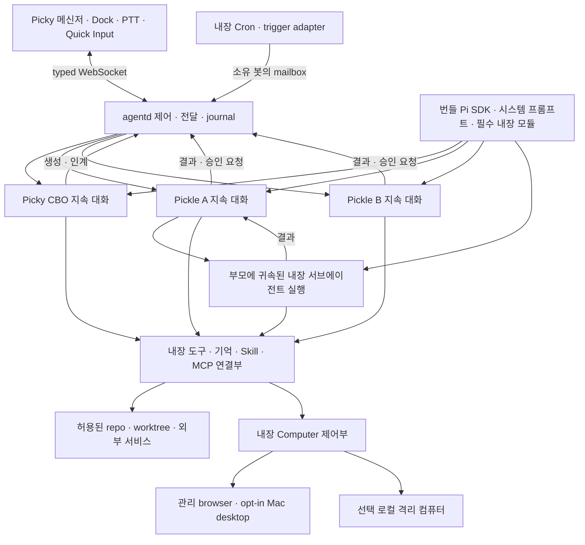

# 기획서 B · Pi 코어로 만드는 로컬 Grok Bot

- 버전: B 0.6
- 원자료 조사일: 2026-09-12 (KST)
- 0.6 개정일: 2026-09-13 (KST)
- 상태: 독립 대안 설계. 구현·출시 승인이나 기능 구현 완료를 뜻하지 않는다.
- 비교 대상 A: [봇 중심 MVP v0.4](./picky-pickle-bot-mvp-prd.md). 이전 대안으로 원문을 보존한다. 사용자 Pi 호환 전제는 B 0.2에서 폐기한다.
- 개정 기준: B 0.5 `60b37e19e`와 `picky-b04-feedback (1).md`의 세 의견. 상태 시각화·읽지 않음 배지·앱 설정 진입을 구체화한다. 피클별 관리와 로컬 컴퓨터 설계는 유지한다. 전용 내장 런타임·대화 제어·에이전트 대화와 사용자 그룹의 분리는 유지한다.
- Picky 조사 기준: `6444d2593`
- OpenMausBot 조사 기준: `f4d562c2d811b9734ddbe8a2873a4cb94f51b747`
- Pi SDK 기준: `0.84.4`, 공식 리비전 `b79e4cc834970cca69daebffab7df1da7d1e52c4`

> Grok Bot의 사용 경험을 로컬 Mac으로 옮긴다.
> OpenMausBot처럼 메신저와 로컬 실행 서버를 구성한다. Pi는 사용자 CLI가 아니라 Picky가 소유하는 내부 코어다.

B는 기존 Picky에 봇 이름과 메신저 창만 붙이는 안이 아니다. **봇 목록, 그룹 대화, 지속되는 업무 방식, Routine, 컴퓨터 제어, 승인, 결과물을 하나의 제품으로 다시 구성한다.** A에서 후순위였던 협업과 자동화도 완성 범위에 넣는다.

## 1. B의 기준과 A와의 차이

| 질문 | A 및 B 0.1의 이전 전제 | B 0.2 |
| --- | --- | --- |
| 제품 목표 | A는 작은 봇 MVP, B 0.1은 Grok 기능 포팅 | Grok Bot의 전체 데스크톱 흐름을 유지 |
| 런타임 소유자 | 사용자의 Pi 환경·인증·확장 재사용 | Pi SDK와 모든 실행 구성을 Picky가 번들·버전·배포·관리 |
| 확장 기능 | 사용자 설치·선택 플러그인과 연동 | 메모리·서브에이전트·Cron 등을 모두 필수 내장. 옵트아웃 없음 |
| 프롬프트·Skill | 전역/프로젝트 Pi 자원 discovery와 사용자 설정 존중 | 시스템 프롬프트·코어 Skill은 제품 자원. 학습 자료도 Picky 저장소 안에서만 관리 |
| 직접 제어 | 앱 상세에서 Pi/TUI·외부 세션 재개까지 접근 | 대화·상세·질문·중단·결과·Computer 제어를 앱 안에서 완결 |
| 협업·자동화 | B 0.1부터 그룹·Routine을 완성 범위에 포함 | 같은 범위를 내장 런타임 위에서 제공 |
| 이전·호환 | 외부 Pi 파일 재개·동기화·handoff 유지 | Picky 데이터 이전만 설계. 사용자 Pi 설치·세션과의 운영 호환은 종료 |

### 1.1 새로 확정한 제품 원칙

**Picky는 사용자의 Pi에 붙는 클라이언트가 아니다. Pi를 엔진으로 내장한 독립 제품이다.** 사용자의 로컬 Pi 런타임을 존중·재사용한다는 이전 철학을 전면 폐기한다.

- 모든 extension·시스템 프롬프트·Skill은 Picky의 내장 코드·제품 자원 또는 Picky 관리 업무 데이터로만 제공한다. 사용자의 Pi 설치나 플러그인이 없어도 동일한 제품 기능을 제공한다.
- 메모리 레이어·서브에이전트·Cron을 포함해 현재 선택 플러그인이 제공하는 기능은 필수 내장으로 전환한다. 앱·봇별 해제 토글, `no-extensions` 축소 모드, 사용자 플러그인으로 교체하는 우회 경로를 제공하지 않는다.
- 사용자 `~/.pi`, `~/.agents`, 프로젝트의 Pi 확장·prompt·Skill 경로를 런타임 구성으로 자동 발견·참조·실행하지 않는다. 사용자 Pi의 인증·모델·세션·설정과도 분리한다.
- `Pi에서 열기`, TUI 전환, Pi resume 명령 복사, 외부 Pi 세션 재개·동기화·handoff는 사용자 기능에서 제거한다. 숨겨 둔 고급 옵션이나 복구 안내로 남기지 않는다.
- 개별 Routine의 일시중지·삭제, 실행 중인 서브에이전트의 취소, 기억 확인·수정·삭제는 유지한다. 특정 작업을 관리하는 것과 내장 엔진을 끄는 것은 다르다.
- 내장 기능이라는 이유로 외부 계정 연결, 파일 접근, 녹화·전송·자동 실행 권한을 자동 부여하지 않는다. 기능 제공은 필수지만 행동 권한은 별도다.

이 절은 사용자가 확정한 방향이다. 아래의 세부 구현 방식은 제안이며 아직 제품 코드에 적용되지 않았다. 기존 사용자 Pi 호환 규칙을 B의 제약으로 다시 가져오지 않는다.

### 1.2 그대로 유지할 요구

Picky는 고정 CBO이고 사용자는 Pickle에 직접 말할 수도 있다. Pickle은 각각 고정 홈과 하나의 지속형 대화 세션을 갖고, 내부 Pi SDK가 이를 실행한다. repo/worktree는 별도 작업 대상이다. 음성·PTT·Quick Input·화면 맥락은 유지한다. 필요하면 같은 작업의 진행·결과·diff·도구 이력·Computer까지 앱 안에서 확인하고 제어한다.

단일 지속 대화는 내장 서브에이전트의 임시 작업 context까지 금지한다는 뜻이 아니다. 자식 실행은 부모에 귀속되고 별도 장기 봇·대화가 되지 않는 계약을 §7.7에 둔다. 사용자 Pi 플러그인의 내부 동작을 그대로 호환해야 한다는 제약은 없다.

**Grok의 내부 세션 구조가 Pi의 구조와 같다는 뜻은 아니다.** Grok에서 Chief of Staff는 사용 패턴이며, Picky의 고정 CBO는 이를 기본값으로 삼는 차이다. [G01][G03]

### 1.3 무엇을 참고하는가

- **Grok Bot은 무엇을 만들지의 기준**이다. 공개 문서에 있는 사용자 흐름과 기능을 따른다.
- **OpenMausBot은 로컬 제품 구성의 참고**다. UI와 harness의 계약을 가져오되 여러 사용자 CLI driver와 설정 호환 계층은 가져오지 않는다.
- **Pi는 Picky 내부의 단일 agent 코어**다. SDK의 판단·도구 실행·대화·컴팩션과 확장 API를 사용한다. 확장 API는 내장 모듈의 구현 방식일 뿐 사용자 플러그인 모델이 아니다.

일상적인 봇 제품의 기능과 정보 구조가 대상이다. xAI의 비공개 코드·프롬프트·모델 품질이나 상표·그래픽을 복제하지 않는다. xAI 계정·과금·SSO·클라우드 운영, Windows/Linux 클라이언트·네이티브 모바일 앱의 동등성은 기본 범위 밖이다. 모바일 원격 접근은 별도 선택 확장이다.

## 2. 조사에서 확인한 사실

### 2.1 Grok Bot은 메신저에 컴퓨터·자동화를 붙인 제품이다

Grok의 공식 디자인은 Bot, Chat, Prompt, Tool, Artifact를 주요 객체로 삼는다. 상태는 간결하게 보이지만, 컴퓨터 미리보기·takeover, 구조화된 카드, Routine 이벤트와 봇 간 인계는 대화에서 이어진다. 그룹 대화와 자동화는 부가 로그 화면이 아니다. [G01][G04][G05]

| 확인한 내용 | 설계에 미치는 영향 |
| --- | --- |
| 계정당 공유 컴퓨터 하나, 봇별 작업 화면. 파일·브라우저 로그인·CLI 자격증명 공유 | 봇별 화면을 봇별 보안 격리라고 설명하지 않는다. 로컬에서는 물리 화면·브라우저·격리 컴퓨터를 구분해야 함 |
| 도구·Skill은 계정 공통, 기억·Routine은 봇별 | 능력의 재사용과 역할별 지식을 다른 범위로 관리 |
| 그룹은 2~6개 봇, 멘션·비동기 인계·스레드·반응 지원 | CBO의 요약 전달만으로 그룹 협업을 대체하지 않음 |
| 직접 사용자 메시지는 백그라운드 작업보다 우선하며 현재 작업을 수정할 수 있음 | 모든 입력을 후속 queue 맨 뒤로 보내면 안 됨 |
| Duplicate는 프로필·설정·활성 Skill·Routine·아바타를 복제. 학습된 기억·대화·첨부 제외 | 요청된 기억 스냅샷 복제는 Grok 기본 동작과 구별되는 추가 사양 |
| 시연 학습은 컴퓨터에서 수행한 절차를 Skill 초안으로 만듦 | 순간 스크린샷 수집만으로 시연 학습이 있다고 주장하지 않음 |
| Auto Review는 별도 모델의 행동 검토이며 모든 부작용을 포괄하지 않음 | 모델 기반 검토와 실제 권한 제한·승인 계약을 구분 |
| Grok에는 사용자 모델 선택기가 없음 | Pi의 모델 선택은 로컬 제품의 고급 기능이며 매번 요구할 설정이 아님 |

근거는 공식 디자인과 봇·대화·Skill·컴퓨터·보안·설정 문서다. 검색, 시연 학습, 모바일 알림 등은 계정별 rollout 차이가 명시돼 있다. 문서에 있다는 사실과 모든 계정에서 직접 동작을 확인했다는 주장을 구분한다. [G01][G03][G04][G05][G06][G09][G10]

### 2.2 OpenMausBot은 이미 Pi를 지원하지만 세션 모델이 다르다

조사 리비전에는 `server/drivers/pi.ts`가 있다. `pi --mode rpc --no-session`으로 실행하고, thread의 `resumeCursor`에 저장한 파일로 `switch_session`하거나 `new_session`을 요청한다. **Pi 드라이버를 추가하는 것만이 B의 과제는 아니다.** [O02]

| 실제 코드에서 확인한 것 | B에서 취할 것 |
| --- | --- |
| React/Electron 앱, 로컬 Node harness, HTTP 명령·SSE 이벤트 | UI와 실행 소유자를 나누는 원칙. Picky의 WebSocket을 바꿀 이유는 없음 |
| Bot 안에 복수 task/thread와 continuation cursor | 가져오지 않음. Room과 요청이 늘어도 Pickle의 Pi 세션은 하나 |
| Pi session handshake 실패 후 bare prompt를 시도하는 fallback | 가져오지 않음. 재개 실패는 표시하고 다른 맥락에서 몰래 실행하지 않음 |
| 일반 Duplicate는 빈 봇을 만든 뒤 프로필 일부를 복사 | 기억·Skill·Routine 스냅샷 복제의 구현으로 쓰지 않음 |
| Team package는 구조화된 역할·playbook·Skill·Routine 정의를 가져오고 Routine을 비활성화 | 휴대 가능한 정의와 실행 권한을 분리하는 방식 참고 |
| Routine 실행은 새 detached task/thread를 할당 | 실행·receipt UI는 참고하되, 입력은 원래 Pi 세션으로 전달 |
| 사람이 컴퓨터를 잡으면 봇의 클릭·입력을 거부. 뒤로 queue하지 않음 | 채택. 오래된 클릭이 나중에 다른 화면에 실행되는 일을 막음 |
| 자체 `MEMORY.md`·topic memory와 별도 MCP·provider 관리 | Picky 내장 기억·Skill·연동부로 책임을 통합. 사용자 Pi나 OpenMaus의 별도 실행 계층을 병행하지 않음 |

직접 확인한 주요 경로는 `server/store.ts`, `server/drivers/pi.ts`, `src/state/store.tsx`, `server/bot-package.ts`, `server/routines.ts`, `server/computer-control.ts`, `server/workspace.ts`다. [O02][O03][O04][O05][O06][O07][O09]

OpenMausBot의 Local VM은 새 하이퍼바이저를 자체 개발한 형태가 아니다. 조사 코드에서는 Docker·Podman·Apple `container` 같은 로컬 runtime 위에 고정된 Cua Linux 이미지와 driver를 준비하고, 자원 제한·private mount·loopback viewer·target lease를 관리한다. Cloud Box와 Composio는 별도 서비스다. **로컬 harness라는 말이 모든 기능의 실행과 데이터가 로컬이라는 뜻은 아니다.** [O01][O08]

OpenMaus README는 일부 API key를 Unix mode `0600`의 `config.json`에 평문 저장한다고 명시한다. write-only 설정 UI가 암호화 저장을 뜻하지는 않는다. 이 저장 방식을 B의 비밀 입력 계약으로 그대로 가져오지 않는다. [O01]

### 2.3 Pi SDK 기본 기능과 Picky 내장 기능은 다르다

Pi SDK는 세션, 모델·인증 API, streaming, 로컬 도구, resource loading, steer·follow-up·abort·compaction과 확장 지점을 제공한다. 범용 MCP, 메모리 레이어, 서브에이전트, Cron, Bot roster, 권한 broker가 모두 SDK 기본 기능인 것은 아니다. **SDK에 없다는 이유로 사용자 플러그인 설치를 요구하지 않고 Picky가 내장한다.** [P01][P02][P03]

조사 기준의 기존 Picky에는 다음 구현이 있다. 이는 이전 제품의 사실이며 B의 최종 배포 방식이 아니다.

- `MainAgentCoordinator`, Pickle별 runtime/daemon 소유권, 메시지 journal, 상태·질문·결과 projection.
- 같은 Pi 파일 재개, steer/follow-up, 터미널 tail/sync. 내부 대화 복구는 재사용할 수 있지만 외부 Pi·TUI 사용자 경로는 제거 대상이다.
- 선택 memory/cron 확장의 기억 소유권·같은 세션 전달·reload lease·PTT 보류를 다루는 연동 코드와 테스트.

기존 memory/cron curated 설치·업데이트는 안전 보류 상태다. **내장화가 그 구현의 결함을 해결했다는 뜻은 아니다.** B는 사용자 npm 배포물을 기다려 설치하는 대신, 검토·라이선스 확인을 마친 소스와 수정 사항을 제품 버전으로 고정하고 실제 번들 산출물로 검증한다. 기존 writer·scheduler를 이전하는 안전 절차도 필요하다. 현재 제품의 보류를 이번 문서 변경으로 해제하지 않으며, 이전에 읽은 테스트를 실행 성공으로 간주하지 않는다. [C01][C02][C03][C04][C05]

## 3. 기능 대응표와 완성 범위

`로컬 치환`은 기능을 숨긴다는 뜻이 아니다. 사용자에게 실행 위치와 한계를 보여주며 대응한다. 아래의 B 기능은 구현 목표다.

| ID | Grok Bot 기능 | OpenMausBot에서 확인한 기반 | B의 목표 |
| --- | --- | --- | --- |
| F01 | 지속형 봇 roster·프로필·pin/hide | BotRecord, 프로필·sidebar 동작 | Picky 고정 CBO, Pickle 연락처, 이름·역할·상태·읽음·숨김 |
| F02 | Chief of Staff와 전문가 팀 | 팀·Chief of Staff package | Picky가 재사용·생성·배정·결과 조율. 직접 Pickle 대화도 유지 |
| F03 | DM·추가 지시·스레드·반응 | chat/thread와 질문 UI | 모든 일반 입력은 steer, 대화로 중단, 예약 메시지, 대화별 draft와 발화자 귀속 |
| F04 | 여러 봇의 그룹 대화·멘션 | channel/room roster·responder | Room journal, 멘션·공유 맥락. Room별 Pi 세션 생성 금지 |
| F05 | 봇 간 비동기 인계 | harness/팀 제어 경로 | 원 요청·담당자·수락·결과가 보이는 전달과 답변 |
| F06 | 역할별 기억·지속 지침 | `MEMORY.md`와 topic memory | 필수 내장 메모리 레이어, 봇별 소유권·확인·수정·잊기·출처 |
| F07 | 공통 Skill·봇별 활성화 | portable Skill와 package | 필수 내장 코어 Skill과 Picky 관리 업무 Skill. 사용자 Pi discovery·해제 토글 없음 |
| F08 | 봇 Duplicate·공유 | profile Duplicate, 별도 team import | 역할 복제와 로컬 기억 스냅샷 복제 구분. 새 홈·새 Pi 세션 |
| F09 | 일정 Routine·관리·test/history | scheduler·receipts·관리 API | 필수 내장 Cron에서 원래 Pickle 세션으로 전달. 개별 Routine은 pause/edit/test/history/삭제 |
| F10 | 외부 이벤트 trigger | 인증된 전용 webhook receiver | 지원 source의 polling·webhook adapter. localhost의 도달성 명시 |
| F11 | 시연으로 Skill 만들기 | 이번 조사에서 동등한 전체 실행 경로 미확인 | 사용자 시작·종료 녹화, Pi가 Skill 초안 생성, 안전 재현 후 저장 |
| F12 | 컴퓨터 status·preview | Computer panel, host/browser/VM/cloud provider | 관리 browser·Mac desktop이 필수. preview·takeover·복귀를 연결하며 격리 컴퓨터는 선택 확장 |
| F13 | 사람이 takeover하고 반환 | ComputerControl의 human hold/refusal | 앱 내 Computer takeover·반환과 stale action 거부. Pi/TUI 전환은 없음 |
| F14 | 연결 앱·Plugin·계정 | Composio 및 custom MCP registry | Picky 내장 도구·MCP 연결부를 제공. 사용자 Pi 설정은 재사용하지 않으며 외부 계정 연결은 별도 |
| F15 | 행동 승인·Auto Review | provider permission broker·질문 구분 | 도구는 기본 자동 실행. 필요할 때 에이전트가 ask로 선택·확인 요청, 실제 권한 경계 유지 |
| F16 | secure secret request | write-only 설정, 권한·인증 경로 | 일반 질문과 별도의 비밀 입력. transcript·모델에 원문 비밀 제외 |
| F17 | 파일 첨부·링크·결과 preview | attachment 저장·screen evidence | 파일·이미지·보고서·diff·검증 결과를 원 요청에 연결 |
| F18 | inline card/widget | 메시지·질문·스크린샷 카드 | 구조화된 작업·Routine·차트·표 카드와 제한된 interactive artifact |
| F19 | 메시지·봇·파일·Routine 검색 | 로컬 메시지 DB·검색 기반 | 사용자 전역 검색과 원문 위치 이동. 봇의 검색 범위는 별도 제한 |
| F20 | 읽음과 needs-attention·알림 | unread/activity·완료 표출 | 읽음, 질문, 승인, 실패를 분리. 사용자 판단이 필요한 경우 알림 |
| F21 | 음성 입력·대화 | dictation·TTS 경로 | 기존 Picky PTT·Quick Input·음성 제공자를 유지. 원격 TTS 필수화 금지 |
| F22 | 영속 컴퓨터·백그라운드 실행 | 로컬 저장·runtime lifecycle | Mac이 켜져 있는 동안의 지속 실행. 절전·종료는 지연·중단으로 표시 |
| F23 | 복구·삭제·설정·내보내기 | store, lifecycle, portable package | Bot·Pi 기록·Routine·shared resource의 삭제 범위를 구별, 안전 백업·복구 |
| F24 | usage·운영 설정 | provider/model·비용 관련 설정 | Picky가 지원하는 모델·추론 설정, 실행량·알려진 비용·자동화 예산 표시 |
| F25 | 모바일에서 같은 팀 제어 | companion/원격 기능이 별도 존재 | 선택 확장. 같은 local agentd에 승인된 원격 경로로 접근, 네이티브 모바일 동등성은 별도 |

F01~F24가 이 설계의 로컬 데스크톱 완성 목표다. F25와 기업용 계정·과금 인프라는 기본 출시 범위 밖이다. F11·F18처럼 OpenMaus에서 대응 실행 경로를 이번 조사로 확인하지 못한 기능도 Grok의 제품 목표에서는 빼지 않는다. [G01][G03][G04][G05][G06][G07][G08][G10][O01]

### 현재 Picky에서 가져올 것과 만들 것

| 대상 기능 | 현재 기반 | B에서 필요한 변경 |
| --- | --- | --- |
| F01~F03 봇·대화·CBO | Pickle identity·main agent·CLI 위임·Conversation | 고정 CBO 정책, 자동 재사용/생성, 통합 roster·메신저 |
| F04~F05 그룹·인계 | Dock 분류 그룹, main/child routing | 별도 Room journal·참여 관계·mailbox·인계 receipt. 기존 분류 그룹과 구별 |
| F06~F10 기억·Skill·복제·Routine | Pi resource loading, 기억/Cron 연동과 안전 보류, 기존 대화 복사 | 필수 내장 메모리·서브에이전트·Cron, 폐쇄형 로더, 자체 schema 이전·snapshot·Routine UI |
| F11~F13 시연·Computer·직접 제어 | 중립 화면 capture·pointer overlay, Pi terminal/sync | 실제 GUI 제어·녹화·Skill 생성과 앱 내 복구. 외부 Pi/TUI 제거, capture는 제어가 아님 |
| F14~F16 연결·승인·비밀 | Pi 확장과 질문 UI bridge | 내장 연결부·Picky 전용 인증, 기본 자동 실행·ask 응답 귀속·권한 검사, 별도 secret 흐름 |
| F17~F19 결과·widget·검색 | artifact/report·변경 파일·대화 이력 | 원 요청의 근거·버전 연결, 구조화 카드·제한된 widget, 전역 index |
| F20~F21 알림·입력 | Dock 읽음·상태, PTT·Quick Input·음성 제공자 | 질문/승인/실패의 attention, 원 대화로 deep link, 승인된 선택 알림 경로 |
| F22~F24 지속 실행·복구·운영 | app-owned daemon·session store·reconnect | 서비스/절전 정책, Routine 포함 백업·삭제, 알려진 실행량·비용 표출 |

기존 코드는 재사용의 출발점이다. 이 표의 왼쪽 기능 전체가 이미 구현됐다는 뜻은 아니다. [C01][C02][C03][C04][C05][C11][C12][C13]

## 4. 사용자가 보는 제품

### 4.1 메신저가 주 화면이다

```text
┌────────────────┬─────────────────────────┬────────────────────┐
│ 검색 / 새로 만들기 │ 선택한 봇 또는 그룹          │ 필요할 때 여는 상세    │
│                │ 상대 · 실제 상태 · 현재 작업   │                    │
│ Picky (CBO)    │                         │ Computer           │
│ 고정 Pickle들    │ 대화 / 결과 / 질문 / 승인     │ Files / Diff       │
│ 그룹 대화        │ Skill·Routine·인계 이벤트    │ Routines / Memory  │
│ 최근 / 숨김      │                         │ Profile / Skills   │
│                │ 답장 · 첨부 · /Skill · @대상  │                    │
│ 자동화 / 연결 / 설정│ 메시지 입력 · 예약 전송       │                    │
└────────────────┴─────────────────────────┴────────────────────┘
```

위 그림은 정보 구조이며 구현된 화면이 아니다. 평소에는 왼쪽 목록과 가운데 대화만 쓴다. 오른쪽을 상시 열거나 컴퓨터를 감시하도록 유도하지 않는다.

- 목록에는 봇·그룹을 표시한다. 여러 task가 생겼다고 연락처가 갈라지지 않는다.
- header에는 상대와 필요한 상태만 둔다. 중단 버튼이나 중단 확인 모달은 두지 않고 사용자가 채팅으로 지시한다. 모델과 실행 설정은 고급 메뉴에 둔다.
- 일반 도구와 결과 근거는 필요할 때 상세로 연다. 봇이 처리할 수 있는 실패·미확인은 내부에서 해결하고, 사용자 답이 필요한 질문만 대화에 보여준다. 실패를 숨기고 완료했다고 말하지 않는다.
- Computer는 앱 안에서 직접 제어한다. 실행 로그·diff·결과도 앱 안에서 열며, Pi/TUI·외부 세션으로 전환하지 않는다. 읽기 전용 상세를 연다고 실행을 멈추지 않는다.
- Dock은 상태 확인과 해당 대화로 돌아오는 진입점이다. 기존 작은 대화 카드를 또 하나의 주 화면으로 유지하지 않는다.

OpenMaus의 공개 화면에서는 roster, 중앙 대화, 우측 Computer 패널, inline 질문을 확인했다. 이를 레이아웃 참고로 쓰되, 그 스크린샷을 현재 모든 기능의 실행 증거로 사용하지 않는다. [O13]

### 4.2 별도 운영 콘솔을 일상의 관문으로 두지 않는다

Routine은 대화나 선택한 봇의 우측 관리 패널에서 만든다. 같은 정의·수정 revision을 공유하고, 일정·다음 실행·최근 결과를 본다. 전체 자동화 목록은 여러 봇의 책임을 훑는 용도로 쓴다. Skills·Memory도 대화에서 관리할 수 있고 상세에서 저장 결과를 확인한다.

연결 앱 화면은 내장 지원 여부·연결 계정·허용 도구·다시 인증할 이유를 보여준다. 사용자 플러그인 설치·해제 화면은 없으며 메모리·서브에이전트·Cron을 켜야 시작되는 설정도 없다. 일상적인 의뢰마다 모델·폴더·provider·queue 종류를 고르게 하지 않는다.

### 4.3 macOS 동작을 보존한다

기존 디자인 시스템과 시스템 폰트·Action Blue·semantic status를 사용한다. 키보드, VoiceOver, IME marked text, light/dark, Reduce Motion을 유지한다. 상태는 정적 아이콘·형태와 접근성 이름을 함께 두며 애니메이션·색·hover만으로 전달하지 않는다. 도움 요청·실패 이유는 실제 대화에서도 읽을 수 있어야 한다. PTT 시작 시 입력 대상 snapshot, pin, 멀티 디스플레이와 창 focus도 기존 계약을 지킨다. [C06][C07]

### 4.4 목업 피드백으로 확정한 UX

2026-09-13 사용자 피드백을 반영한다. 이 절은 이전 B의 중단 버튼·steer/follow-up 선택·도구별 기본 HITL·운영 정보 상시 노출보다 우선한다. 화면 계약은 [메신저 UX 명세](./picky-b-messenger-ux-spec.md)에 연결한다.

- 작업공간명·경로를 일반 화면에 노출하지 않는다. 내부의 고정 home/workspace 분리와 실행 대상 바인딩은 유지한다. 화면 설명·목업 안내·컴포저 하단 부연도 제품 화면에서 뺀다. 목업이라는 표시는 리뷰용 바깥 영역에만 둔다.
- 모든 일반 메시지는 대상 대화의 현재 작업에 steer로 전달한다. 실행 중이 아니면 같은 지속 대화에서 다음 turn을 시작한다. 사용자가 steer/follow-up을 고르지 않는다.
- 중단도 채팅으로 지시한다. Pi가 의도와 대상을 판단하고 내부 abort·자식 취소를 수행한다. Swift가 키워드로 의도를 결정하지 않는다. 중단 버튼을 없애는 것이 취소 기능·범위 검사·완료된 효과의 보존을 없애는 것은 아니다.
- 보내기 옆에 Slack형 예약 전송을 둔다. n분 뒤 또는 날짜·시각을 지정하며, 실제 전달 시 일반 메시지와 같은 steer 경로를 쓴다. 작업 완료 뒤 자동 전달하는 follow-up과는 다른 기능이다.
- 도구는 기본적으로 HITL 없이 실행한다. 에이전트가 선택·추가 허용이 필요하다고 판단할 때 `ask_user_question` 같은 도구로 짧은 질문과 선택지를 만든다. 앱이 모든 tool call마다 큰 승인 양식을 강제하지 않는다.
- DM의 발화자는 사용자와 상대 봇뿐이다. 다른 봇의 인계는 작은 보냄/받음 표시로 유지하고, 클릭하면 두 에이전트의 읽기 전용 대화를 연다. DM 안에 다른 봇의 원문을 길게 펼치거나 사용자 그룹으로 이동시키지 않는다. 사용자가 참여하는 그룹에서는 실제 참여자가 직접 말할 수 있다. (§7.3.1)
- 팀 배정은 짧은 문장과 전달 표시로 보여준다. 배정만으로 사용자 그룹을 만들거나 가입시키지 않는다. 최근 대화 목록은 이름·최근 문장·시각으로 구성하고, DM마다 같은 역할·이름을 반복하지 않는다.
- 예약 화살표는 보내기와 붙인 분할 버튼이다. 빠른 시간은 작은 메뉴에서 고르고 직접 입력이 필요할 때만 시간 설정을 연다. Slack의 브랜드색·로고를 복제하지 않는다.
- PR 결과는 짧은 완료 문장, branch, PR 번호, 링크만 기본으로 보인다. 파일·diff·검증·관찰 정보는 상세에서 확인하며, 근거 자체를 삭제하지 않는다.
- 결과 확인과 복구는 담당 Pickle이 먼저 처리한다. 결과가 불명확하면 읽기 전용 기록 조회·대조부터 하고, 완료된 외부 행동을 확인 없이 재실행하지 않는다. 스스로 해결할 수 없고 사용자의 판단이 필요할 때만 ask한다.

- 목록·대화 header의 완료·작업 중·조사 완료 같은 반복 상태 문구는 아바타의 진행 링·체크·대기·중단 아이콘으로 대체한다. 이름은 툴팁과 접근성 설명으로 유지하고, 동작 줄이기에서는 정적 형태로 구별한다. 질문·결과·근거를 없애는 것은 아니다.
- 읽지 않은 메시지는 숫자 배지로 표시한다. 작업 완료와 읽음은 독립적이며, 피클 표시 이름이 아니라 대화·메시지 ID와 사용자별 cursor에 귀속된다. 상세·전달 쌍 열람을 원 DM의 읽음으로 간주하지 않는다.
- 사이드바 왼쪽 아래에서 앱 설정으로 이동한다. ⌘,도 같은 진입점이다. 앱 전체 appearance·입력·알림 설정과 오른쪽 피클별 설정을 구분하고, 설정 열람이 대화·실행 소유권을 바꾸지 않는다. B.05 HTML은 화면 밝기·대화 밀도만 미리 본다.

### 4.5 선택한 피클의 관리 패널

오른쪽 관리 패널은 현재 DM 상대의 컴퓨터 상태·미리보기와 Routine 목록을 보여준다. 톱니에서
이름·레이블·설명·알림을 편집하고, Routine 행이나 추가 버튼으로 활성 상태·이름·지침·실행 시기·
실행 기록·테스트·삭제에 접근한다. 별도 운영 콘솔을 먼저 방문하게 하지 않는다.

- 요청의 진행·diff·검증을 보는 `상세`와 봇의 지속 설정을 구분한다. 같은 오른쪽 자리를 사용하되 소유 객체가 다르다. 일반 사용자 그룹에 가상의 봇 설정을 만들지 않는다.
- 열람은 작업·하위 실행을 멈추거나 새로운 Pi turn을 만들지 않는다. 다른 피클로 이동하면 그 피클의 패널을 연다. 수정 중 입력은 소유 봇·대상 정의에 묶어 보존하고, 이전 화면의 늦은 저장으로 다른 피클을 수정하지 않는다.
- 이름 변경은 표시 이름 변경이며 Bot ID·고정 홈·지속 세션·Routine 소유권을 바꾸지 않는다. 설명은 봇의 사용자 업무 설정이고, 필수 시스템 프롬프트·엔진을 덮어쓰거나 해제하는 경로가 아니다.
- 알림 설정은 해당 봇의 완료·개입 알림 선호다. OS 허용과 구별하며 대화의 ask·실패·실행 상태를 숨기지 않는다.
- Routine 편집은 대화에서 생성한 것과 같은 정의·revision·권한 검사를 사용한다. 필수 Cron의 전역 해제 토글이나 다른 scheduler를 추가하지 않는다. 미연결 event는 실행 가능으로 표시하지 않는다.
- `테스트 실행`은 저장된 revision에 귀속되는 실제 요청이다. 미저장 편집은 먼저 저장·취소하게 한다. 원 소유자의 mailbox와 현재 권한을 재검사하고 수락·실행·결과를 구분한다. 루틴 일시중지는 자동 trigger를 멈추는 것이며, 명시적 테스트의 권한을 만들어 주지는 않는다.
- 컴퓨터 선택 저장은 설치·연결·계정·mount·TCC 허용이 아니다. 실제 준비 상태·공유 범위·제어 소유자를 표시한다. Linux·browser·내 Mac의 경계는 §10과 [로컬 컴퓨터 설계](./picky-local-computer-design.md)를 따른다.

B.04 HTML은 폼·소유자별 브라우저 저장과 모의 기록만 다룬다. 실제 Routine 테스트 대신 명시적인
`모의 실행 기록`을 남기고, 컴퓨터는 `설정 필요`로 유지한다. 이는 제품 실행·격리의 완료 근거가 아니다.

## 5. 대표 사용자 흐름

### 5.1 처음 열고 일을 맡기기

1. Picky가 번들 runtime과 필수 내장 모듈의 버전·무결성·저장소를 확인한다. Pi CLI 설치 여부를 검사하거나 설치를 요구하지 않는다.
2. 모델 접속이 필요하면 Picky 안에서 API/OAuth 또는 지원 로컬 모델 연결을 설정한다. 사용자 Pi 인증 파일을 읽거나 자동 가져오지 않는다. 로컬 실행이 무료 추론·완전 오프라인을 뜻하지 않음을 알린다.
3. 내장 메모리·서브에이전트·Cron을 별도로 켤 필요 없이 Picky 대화가 열린다. 사용자는 파일을 붙이거나 현재 화면에서 말한다.
4. Picky가 직접 처리하거나 기존 담당자를 찾고, 필요하면 새 Pickle을 만든다.
5. 실제 생성·수락 후 담당자를 알린다. 작업공간·계정·Computer 권한이 부족하면 필요한 범위만 확인한다.
6. 결과·근거·질문이 원 대화로 돌아온다. 상세·수정·중단도 Picky 안에서 처리한다.

내장 모듈 누락·손상은 준비 오류다. 사용자 Pi로 fallback하거나 필수 기능을 끈 축소 모드를 정상 제품으로 표시하지 않는다. 반면 외부 서비스 미연결·TCC 미허용은 해당 행동의 준비 상태이며, 내장 엔진의 옵트아웃과 다르다.

### 5.2 팀이 협업하고 사용자가 개입하기

1. `조사하고, 구현하고, 별도로 검토해줘`라는 요청을 받는다.
2. Picky가 담당자를 재사용·생성하고 필요하면 그룹을 만든다. 그룹 생성이 Pi 세션 생성을 뜻하지 않는다.
3. 조사 봇의 근거, 구현 봇의 변경, 검토 봇의 판단이 같은 그룹의 인계로 표시된다.
4. 사용자는 `@구현담당 이 파일은 건드리지 마`라고 수정한다. 일반 메시지는 모두 현재 작업에 steer로 전달하며, 별도 전송 모드를 고르게 하지 않는다. 나중에 보낼 말은 예약 메시지로 작성한다.
5. 완료 주장은 diff·테스트·원본 근거로 확인한다. 코드가 작성됐다는 메시지만으로 검토까지 끝났다고 보고하지 않는다.

봇끼리 같은 요청을 계속 되돌려 보내지 않게 origin ID, 단계별 소유자, 재위임 한도·사용량 제한을 둔다. 상호 대화의 모델 판단은 Pi가 하고, 전달과 한도는 agentd가 검사한다.

### 5.3 업무 방식을 익히고 Routine으로 만들기

1. 일회성 작업을 실제로 완료하고 사용자가 방식·결과를 수정한다.
2. Pi가 명시적 기억과 Skill을 저장한다. 저장된 내용·범위를 대화에 알린다.
3. 말로 설명하기 어려우면 `작업 가르치기`로 해당 Computer에서 시연한다. 녹화 중임을 표시하고 즉시 중지할 수 있다.
4. Pi가 시연을 절차·판단 조건·필요 권한·검증 방법으로 정리한 Skill 초안을 제시한다.
5. 안전한 입력으로 확인한 뒤 Routine을 등록한다. 실행 시각·소유 봇·작업 대상·승인 경계·다음 실행을 표시한다.
6. 매번 원래 Pickle의 Pi 세션에서 실행하고, 결과 또는 개입 요청을 보낸다.

Grok의 시연 학습은 최대 10분, 마이크 미녹음으로 문서화돼 있다. B도 묵시적 상시 녹화 대신 사용자 시작·종료와 길이 제한을 둔다. 정확한 media 제한은 로컬 처리·모델 지원을 검증한 뒤 정한다. [G05]

시연 기록에는 다음 별도 계약을 적용한다.

- 시작할 때 소유 봇과 browser target 또는 지원 window를 고정한다. 전체 desktop·다른 창·알림을 기본 수집하지 않는다. 대상 전환은 일시정지 후 사용자가 범위를 다시 확인한다.
- 수집 항목은 선택한 화면, 시각, 허용된 클릭·스크롤·탐색·일반 필드 입력이다. 마이크·시스템 오디오·clipboard 원문·전역 key log는 수집하지 않는다. 입력 이벤트를 제외해도 화면에 글자가 보일 수 있음을 알린다.
- DOM/접근성 정보에서 password·one-time-code·secure field가 감지되면 자동으로 일시정지하고 해당 구간을 버퍼·저장본·전송 후보에서 제외한다. 구조적으로 확인할 수 없는 입력은 자동 기록하지 않는다. 픽셀만 보고 모든 비밀을 탐지한다는 보장은 하지 않는다.
- 초기 필수 시연 대상은 이 경계를 검증한 관리 browser다. 다른 앱의 시연은 target capture와 민감 입력 제어를 검증한 provider에서만 켠다. 로그인·2FA는 녹화를 끈 takeover로 처리한다.
- 기록은 먼저 봇 소유의 비공개 로컬 임시 자료로 둔다. 사용자가 preview에서 구간·입력을 제거하고, 전송할 화면·절차와 선택된 Pi 모델의 처리 위치를 확인한 뒤 `이 자료로 Skill 만들기`를 실행한다. 녹화 시작만으로 원본을 모델에 전송하지 않는다.
- 취소하면 임시 원본·추출물을 삭제한다. 초안 생성 후에는 기본적으로 원본을 삭제하고 승인된 Skill·출처만 남긴다. 사용자가 별도 보관을 선택한 자료는 목록과 삭제 경로를 제공한다. 비정상 종료의 미완료 기록은 다음 기동 때 정리하고, 실행 중 임시 기록도 24시간을 넘겨 보관하지 않는다.

로컬 파일 삭제는 디스크의 물리적 완전 삭제나 이미 전송한 모델 제공자 사본의 회수를 뜻하지 않는다. 자동완성·알림·감지되지 않은 민감 내용이 섞일 위험은 전송 전 검토에서도 확인한다.

### 5.4 같은 방식으로 병렬 코딩하기

1. 사용자가 같은 담당자의 방식으로 다른 PR을 동시에 처리해 달라고 한다.
2. 필요한 역할·Skill·선택된 기억의 스냅샷을 만든다. 진행 중 대화나 compaction 요약을 대신 복사하지 않는다.
3. 새 Pickle에 새 홈·새 Pi 세션을 만들고 자료의 새 소유자를 연결한다. Routine은 일시중지로 들어온다.
4. 두 코드 수정이 충돌할 수 있으면 Picky 내장 Git/worktree 절차로 별도 작업공간을 준비한다. 사용자의 Pi Skill이나 shell 함수 설치를 전제로 하지 않으며, 읽기 전용 검토에 worktree를 강제하지 않는다.
5. 원본은 원래 일을 계속한다. 복제본은 새 요청만 처리하고 자기 기억·업무 Skill을 독립적으로 관리한다. 공통 내장 코어는 수정하거나 해제하지 않는다.

Pi가 직접 코드를 작성·테스트한다. 별도 Cursor Cloud Agent가 필수인 구조로 만들지 않는다. Grok 공식 engineering 가이드의 cloud-agent 관리 사례는 피드백 루프의 참고이며, 그 실행 인프라까지 필수로 가져오는 것은 아니다. [G12]

### 5.5 컴퓨터 직접 제어와 앱 내 실행 관리

컴퓨터 preview는 읽기 전용이다. 사용자가 직접 잡으면 해당 자원의 봇 입력을 거부하고, 반환 뒤 새 화면 상태를 확인한다. 오래된 클릭·키 입력은 재생하지 않는다.

에이전트 실행은 대화의 수정·추가 지시·중단·질문 응답으로 관리한다. 작업공간은 내부에서 유지하고 UI에는 노출하지 않는다. 로그·diff·하위 실행과 근거는 필요할 때 상세에서 본다. Pi TUI나 외부 Pi writer로 소유권을 넘기지 않는다. 담당 Pickle이 기록을 대조해 복구를 진행하며, 결과가 불명확하다는 이유만으로 사용자에게 확인 업무를 넘기거나 같은 외부 행동을 재실행하지 않는다.

## 6. 구현 방식과 책임

### 6.1 권장안

**기존 native 입력·메신저 구성요소와 agentd를 활용하되, 실행부는 Picky 전용 내장 runtime으로 재구성한다.** Pi SDK를 사용하는 것은 유지하지만 사용자 Pi 호환용 adapter·discovery·세션 공유를 유지하는 것이 목표는 아니다.

| 접근 | 장점 | 비용·문제 | 판단 |
| --- | --- | --- | --- |
| 사용자 Pi 호환 계층 유지 | 기존 플러그인 설정을 재사용 | 재현 불가능한 환경·버전·권한·필수 기능 누락, 사용자 결정과 충돌 | 폐기 |
| Picky 소유 runtime + Pi SDK + 내장 모듈 | 한 제품 버전으로 코드·정책·상태·검증 책임을 통제 | 내장 모듈 패키징·인증·schema 이전·복구 구현 필요 | 채택 |
| OpenMaus 전체 fork 또는 새 agent engine | 이미 있는 UI를 활용하거나 모든 계층 직접 작성 | 다중 driver/세션 모델 재작업, native 입력 재통합 또는 Pi와 실행 엔진 중복 | 참고만 하고 기본안으로 채택하지 않음 |

내장화는 모든 기능을 처음부터 재작성하라는 뜻이 아니다. 검토된 확장 코드를 SDK의 extension API로 포함할 수 있지만 소스·버전·의존성·설정·배포를 Picky가 소유한다. 사용자 Pi 설치·업데이트나 전역 package manager를 통해 동작시키지 않는다.

### 6.2 실행 구조



`CORE`는 같은 버전의 코드·계약이며 봇들의 가변 세션을 합치는 객체가 아니다. 각 주 세션과 하위 실행의 데이터·권한은 별도 범위다. 기존 primary/child daemon의 소유권과 메시지 projection을 재사용하되, 세션 생성·자원 공급·재연결은 모두 Picky 내부 경로로 닫는다. [C01][C08]

| 주체 | 맡을 일 | 맡지 않을 일 |
| --- | --- | --- |
| Swift 앱 | 중립 입력, 메신저·상세·질문·비밀 입력, Computer takeover, macOS 통합 | 의도를 키워드로 분류, Pi/TUI 전환 제공 |
| agentd | Bot/Room·전달·journal·소유권·승인·자원 lease·runtime 수명 | 사용자 Pi process 탐색·접속·세션 tail 동기화 |
| 내장 Pi SDK | 이해·계획·도구 선택·코딩·대화·컴팩션·steer/follow-up | 사용자 CLI 실행을 fallback으로 사용, 기본 SDK만으로 모든 부가 기능이 있다고 간주 |
| 필수 내장 모듈 | 메모리·서브에이전트·Cron·Skill·도구·MCP·질문·제품 정책 | 전역 확장 발견, 사용자 opt-in 의존, 임의 플러그인 설치·교체 |
| Computer backend | 화면·입력·실제 환경의 lifecycle과 capability | Pi와 별개인 두 번째 일반 목적 agent loop |

명령은 실행 요청이고 이벤트는 수락·관찰한 사실이다. 요청 ID·origin·Bot·turn·Room·자식 run·결과 참조로 재접속과 중복 전달의 귀속을 유지한다. 발신자는 도구 인자의 `botId`가 아니라 실제 runtime에 바인딩한다. CBO도 허용된 관리 범위만 사용하며, 역할·기억·업무 Skill 수정은 실제 권한을 늘리지 않는다.

### 6.3 필수 내장 구성과 상태의 구분

| 구성 | 제품 계약 | 사용자가 관리할 수 있는 것 |
| --- | --- | --- |
| 메모리 레이어 | 항상 제공, 설치·해제·대체 불가 | 저장된 기억·범위·출처 확인, 수정·삭제 |
| 서브에이전트 | 항상 제공, Picky runtime과 부모 권한으로 실행 | 개별 실행의 진행·결과 확인과 취소 |
| Cron/Routine 엔진 | 항상 제공, Picky 소유 scheduler와 저장소 사용 | 개별 일정·trigger 생성·수정·pause·삭제 |
| 시스템 프롬프트·코어 Skill | 제품 버전으로 고정한 필수 자원, 사용자 override·해제 불가 | 설명·기능 확인, 업무 입력·선호·학습 자료 관리 |
| 나머지 기존 플러그인 기능 | 같은 내장 manifest와 배포·검증 체계로 이전 | 각 기능의 작업·연결·데이터 범위 관리 |

필수 구성은 모든 제품 runtime에 존재한다. 현재 Picky가 선택 플러그인으로 제공하던 기능을 내장 manifest에 빠짐없이 대응시킨다. 사용자가 개인 Pi에 추가한 임의 설치본까지 가져온다는 뜻은 아니다.

항상 존재한다는 말은 매번 서브에이전트를 생성하거나 사용자가 등록하지 않은 일정을 실행한다는 뜻이 아니다. 연결 계정·TCC·실제 권한 범위는 여전히 필요하다. 기존 허용 안의 도구는 기본 자동 실행하고, 추가 사용자 결정이 필요할 때 에이전트가 ask한다.

시연으로 만든 업무 Skill과 기억은 Picky 관리 데이터다. 배포된 코어 코드·프롬프트를 덮어쓰는 임의 확장이 아니며, 사용자 Pi 경로의 파일과 링크하지 않는다. 코어 Skill의 가용성을 봇별로 끄는 UI는 없다. 어떤 업무 Skill을 적용할지는 역할·요청과 내장 정책이 판단한다.

### 6.4 배포·프롬프트·격리의 책임

- 제품 release manifest에 Pi SDK, 필수 모듈, 시스템 프롬프트, 코어 Skill, 의존 runtime과 schema 버전을 고정한다. 호환되는 묶음으로 업데이트하고 데이터 schema까지 고려해 복구한다.
- 필수 모듈 누락·초기화 실패·무결성 불일치는 준비 오류다. 사용자 Pi 경로로 fallback하거나 자동으로 모듈을 끄지 않는다. 진단·데이터 보존·앱 내 복구 UI는 사용할 수 있어야 한다.
- 시스템 프롬프트와 standing rule은 매 turn에 제품 자원으로 구성한다. transcript의 첫 메시지에만 넣지 않는다. 재연결·컴팩션·내장 자식 실행에도 같은 정책 버전을 적용한다. 현재 every-turn contract 적용 경로는 참고할 수 있다. [C14]
- runtime의 경로·의존성 해석·설정·인증·환경 변수는 Picky가 명시적으로 공급한다. 사용자 Pi, 전역/프로젝트 확장, shell startup에 따라 실행 구성이 달라지지 않아야 한다.
- 기존 플러그인을 내장할 때 라이선스·출처·수정·고정 버전과 실제 번들 검증을 남긴다. 사용자의 설치본이나 안전 보류된 npm 버전을 이름만 바꿔 그대로 안전하다고 간주하지 않는다.

여기서 필수인 것은 사용자 Pi의 코드·설정·상태와 제품 runtime의 분리다. 이 분리만으로 같은 OS 사용자 권한의 모든 shell·파일 접근을 sandbox했다고 주장하지 않는다. 실제 실행 환경·자원 접근 경계는 §10~11에서 따로 다룬다.

## 7. Bot·홈·workspace·Room·Pi 세션

### 7.1 데이터의 소유 단위

아래 이름은 설계 개념이며 현재 protocol에 모두 존재한다는 뜻은 아니다. 외부 Pi의 저장 파일·ID·형식은 사용자용 API 계약이 아니다.

| 개념 | 소유와 수명 |
| --- | --- |
| Bot/Pickle | 안정적인 ID·역할·고정 홈·하나의 지속 대화 참조. 내부 Pi SDK가 실행 |
| Agent home | Picky 관리 루트 아래 Bot ID별 고정 실행 홈 |
| Workspace binding | 실제 repo/worktree·파일 범위. 홈과 별개 |
| Runtime release | 내장 코드·시스템 프롬프트·코어 Skill·의존성·schema의 버전 묶음 |
| Subagent run | 부모 Bot/request에 귀속된 임시 context·실행·결과. 장기 봇/대화 아님 |
| Room | 참여·이력 grant·공유 메시지·인계. 별도 Pi 세션 아님 |
| Message/Thread/Reaction | message·parent/root 참조, 실제 actor의 반응, 사용자별 읽음 cursor |
| Delivery/Request | origin·대상·thread·권한·자식 실행·결과 참조 |
| Routine/Run | 내장 엔진의 정의와 실행 receipt. 주 대화 세션 추가 없음 |
| Artifact | 파일/결과의 위치·버전·출처·권한·관련 요청 |
| Approval/Control lease | action 또는 실행 자원에 대한 제한된 제어. 복제 자료에 포함하지 않음 |

```text
<Picky 앱 번들>/
  runtime/                고정 Pi SDK·필수 모듈·의존 runtime
  system-prompts/         제품 시스템 프롬프트
  core-skills/            필수 내장 Skill

<Picky 전용 관리 루트>/
  runtime-state/          제품 설정·모델·인증 참조·schema 상태
  pickles/<bot-id>/       고정 홈·지속 대화·기억·업무 Skill·하위 실행 기록
  rooms/                 Room journal과 참여 관계
  routines/              내장 Cron 정의·실행 receipt
  snapshots/             허용된 데이터와 불변 manifest

<repo 또는 worktree>/     명시적으로 연결한 실제 작업 대상
```

정확한 경로명은 구현 시 정하되, 사용자 Pi 디렉터리를 symlink·실행 cwd·상태 저장소·실패 fallback으로 사용하지 않는다. auth 원문 대신 Picky 소유 보안 저장소 참조를 관리한다. 원본 사용자 Pi 데이터는 이 구조 밖에 두고 변경하지 않는다.

### 7.2 닫힌 자원 로더와 workspace

Pi 0.84.4의 `DefaultResourceLoader`는 `cwd`와 `agentDir` 외에도 전역·상위 프로젝트의 `.agents/skills` 등을 발견한다. 따라서 `agentDir`만 새 폴더로 바꾸는 것으로 요구를 충족하지 못한다. 공식 SDK는 custom `ResourceLoader`를 주면 그 두 경로가 resource discovery를 결정하지 않는다고 명시한다. [P02]

B는 Picky 전용 로더와 명시적 모델·설정·인증 서비스를 사용한다.

1. 허용된 번들 manifest와 Picky 관리 업무 데이터만 로드한다. 전역/프로젝트 extension·Skill·prompt discovery와 사용자 package 설치·reload 경로는 제공하지 않는다.
2. 모델·인증·설정 서비스도 Picky 소유 경로로 초기화한다. custom loader만 교체한 뒤 SDK의 기본 인증/설정 서비스가 사용자 `~/.pi`를 읽게 두지 않는다.
3. Pi runtime cwd는 고정 홈, 실제 파일·Git·빌드는 명시적 workspace로 구분한다. repo 선택이 사용자 Pi의 프로젝트 설정을 활성화하지 않는다.
4. repo의 `AGENTS.md`·README·개발 규칙은 허용된 프로젝트 참고 자료로 읽을 수 있다. 제품 시스템 프롬프트나 실행 가능한 extension으로 승격하지 않으며 내장 안전 정책을 덮어쓰지 못한다. 사용자 Pi Skill 파일은 자동 가져오지 않는다.
5. 실행 환경에 사용자 Pi용 override·전역 module 경로·shell startup을 묵시적으로 상속하지 않는다. 실제 빌드에 필요한 개발 도구·환경은 workspace 실행 권한과 명시적 설정으로 연결한다. 로컬 Git·컴파일러를 쓰는 것은 사용자 Pi 런타임 호환과 다르다.
6. 서비스 재시작·컴팩션·하위 실행도 같은 닫힌 구성을 사용한다. 외부 Pi가 파일을 다시 열 수 있어야 한다는 조건은 없다.

공개 SDK API 존재가 이 격리의 동작 증거는 아니다. 사용자 Pi가 없는 환경과 오염된 전역/프로젝트 설정이 있는 환경에서 모두 동일한 내장 구성을 실행하는지 검증해야 한다.

### 7.3 그룹이 늘어도 봇의 Pi 세션은 늘지 않는다

각 봇에 입력 mailbox 하나를 둔다. DM, Room, 인계, Routine은 origin이 다른 입력이다. 한 봇의 최상위 turn을 겹쳐 실행하지 않는다.

- 멘션은 명시적 수신자다. 일반 그룹 메시지는 참여 봇 중 지정된 조율 담당 Pi가 응답자를 판단한다. UI가 내용으로 직무를 분류하지 않는다.
- 조율 담당은 Room 참여자여야 한다. CBO라는 이유로 참여하지 않은 모든 방의 원문을 자동 전달하지 않는다.
- 다른 방의 모든 transcript를 매번 합치지 않는다. 현재 요청에 필요한 Room 이력·결과 참조를 전달한다.
- 일반 입력은 steer 경로로 전달하되 원 대화·대상·요청 문맥을 유지한다. Room B의 새 의뢰가 Room A의 무관한 작업 수정으로 오인되지 않게 Pi와 전달 계층이 귀속을 보존한다. UI 전송 모드 선택으로 이 책임을 사용자에게 넘기지 않는다.
- 독립적인 장기 담당자가 필요하면 다른 visible Pickle을 재사용·복제한다. 한 요청의 한정된 하위 작업은 내장 서브에이전트를 사용할 수 있다. Room·의뢰마다 주 대화 `resumeCursor`를 추가하지 않는다.

Grok의 bot-to-group 인계는 현재 text-only로 문서화돼 있다. B도 우선 텍스트와 허용된 artifact 참조로 연결하며, 원본 파일을 다른 방에 복사·전송할 때는 별도 범위를 검사한다. 사용자 첨부 전체를 금지한다는 뜻은 아니다. [G04]

하나의 Pi 세션이 여러 Room을 오가므로 **Room을 모델 맥락의 보안 격리로 약속하지 않는다.** 전달 범위와 실제 도구 권한을 제한하되, 엄격히 분리해야 하는 업무는 별도 봇·허용 자원으로 나눈다.

Pi SDK 자체의 기본 subagent 기능을 가정하지 않는다. B가 구현·배포하는 필수 내장 서브에이전트의 계약은 §7.7을 따른다. 기존 사용자 subagent 플러그인과의 실행 호환은 요구하지 않는다. [P01]

### 7.3.1 에이전트 간 대화와 사용자 그룹은 다르다

에이전트 간 전달·응답 이력을 두 봇의 대화로 읽을 수 있게 한다. 이는 별도 Pi 세션이나 사용자가 참여하는 Room이 아니라, 각 봇의 기존 mailbox로 오간 메시지의 journal을 읽는 화면이다.

- 안정적인 에이전트 쌍·대화 ID, 발신자/수신자, 메시지 ID, 원 요청·인계 ID와 시각을 보존한다. 서로 다른 요청의 기록을 한 요청의 완료 근거로 섞지 않는다.
- 사용자의 DM에는 작은 `메시지 보냄/받음 + 상대` 표시만 둔다. 클릭하면 해당 두 봇의 대화를 열고 원 전달 위치를 찾는다. 과거 기록은 현재 사용자가 읽을 수 있는 범위만 제공한다.
- 조회·검색·원 자료의 권한을 재검사한다. 한 전달 표시가 보인다고 두 봇의 모든 비공개 Room 이력을 공개하지 않는다. §7.4·§7.6의 회수와 원 자료 권한도 적용한다.
- 읽기 전용 화면에는 작성·전송·가입 UI가 없다. 열람이 새 turn·세션·봇·사용자 그룹을 만들거나 현재 실행을 중단하지 않는다. 닫으면 원 DM과 초안으로 돌아온다.
- 사용자 그룹은 사용자의 명시적 시작·참여 또는 참여 대상을 분명히 알리는 별도 흐름으로 구성한다. Picky가 여러 담당자에게 일을 나눴다는 사실만으로 사용자 그룹 참여를 추정하지 않는다.
- 두 봇의 메시지 해석·실행은 여전히 각 봇의 Pi가 담당한다. Swift는 대화 화면을 보여주고 agentd는 원본 귀속·조회 범위·전달 receipt를 관리한다.

### 7.4 Room 참여와 이력 접근

- 새 참여자는 기본적으로 가입 이후 메시지만 전달·조회받는다. 과거 이력은 사용자가 허용한 메시지 범위 또는 특정 인계 자료를 명시적으로 연결한다. 이미 승인된 업무 위임에 필요한 입력은 그 범위에서 재사용하며 매번 다시 묻지 않는다.
- 참여 관계에는 가입·탈퇴 구간과 grant 버전을 둔다. CBO의 자동 참여자 구성 권한이 다른 방의 모든 과거 이력을 공유하는 권한은 아니다.
- artifact는 Room 메시지를 볼 수 있다는 이유만으로 무조건 열리지 않는다. 원 자료의 권한과 해당 참여자에게 부여된 범위를 함께 검사한다.
- 참여자를 제거하면 그 Room의 새 전달·조회·검색을 차단하고, Room이 준 artifact 접근과 대기 입력을 회수한다. 실행 중 Room 요청은 취소 상태로 전환하고 새 action을 막는다. 다른 DM·Room의 무관한 작업까지 종료하지 않는다.
- 재가입해도 이전 grant를 자동 복구하지 않는다. 이미 완료된 외부 효과, Pi 세션·기억·다운로드에 남은 내용까지 회수하거나 잊게 만들었다고 표시하지 않는다.

### 7.5 스레드·반응·읽음

메시지는 DM 또는 Room ID와 안정적인 message ID를 가진다. thread reply는 같은 대화의 `parentMessageId`·`rootMessageId`를 저장한다. 다른 방의 참조는 thread parent가 아니라 권한을 확인한 링크다. 삭제·미접근 parent는 원문 없음으로 표시하며 다른 대화에 잘못 붙이지 않는다.

- thread reply도 원래 봇의 mailbox로 들어가고 결과는 같은 root에 돌아온다. thread를 열거나 답장했다고 Pi 세션·workspace를 바꾸지 않는다.
- 일반 답장은 대상 대화에 귀속한 steer 입력이다. 사용자에게 follow-up 모드를 노출하지 않는다. ask 선택·확인 응답은 해당 질문/action ID로 처리하며, 일반 메시지나 reaction을 그 응답으로 자동 승격하지 않는다.
- reaction은 실제 actor·메시지·반응 값의 추가/제거 이벤트다. 재전송해도 중복되지 않으며, 같은 Pi 세션에 새 turn을 자동 생성하지 않는다.
- reaction을 승인·인계 수락·완료 receipt로 해석하지 않는다. 이 행동들은 별도 명시적 action이다.
- 사용자가 실제로 보고 있는 대화에서 읽음 cursor를 전진시킨다. 앱이 백그라운드이거나 dialog·관리 화면에 가려져 있거나 이전 메시지를 읽는 동안에는 새 수신 메시지를 자동으로 읽음 처리하지 않는다. 재접속·재전송·화면 재렌더링을 새 수신으로 세지 않고, 사용자가 보낸 메시지·상태 갱신·전달 칩도 미읽은 메시지에 넣지 않는다.
- 사용자별 대화·thread 읽음 cursor와 미읽은 답글 수를 저장한다. thread를 열었다고 방 전체를 읽음 처리하지 않는다. 멘션·구독한 thread 답글·개입 요청을 알리고, 단순 반응은 기본적으로 알림을 울리지 않는다.

### 7.6 검색도 같은 접근 정책을 적용한다

사용자는 자신이 소유한 대화·봇·자료를 전역 검색한다. 봇 검색은 agentd가 runtime에 바인딩한 principal로만 실행한다. 모델이 `user`나 다른 Bot ID를 질의 인자로 지정해 검색 주체를 바꾸지 못한다.

- 봇에는 자신의 DM과 현재 참여·이력 grant로 허용된 Room 구간만 검색한다. 파일은 별도 artifact 권한도 통과해야 한다.
- 권한 필터는 원문 조회뿐 아니라 검색 후보·snippet·결과 수·ranking 전에 적용한다. 전체 결과를 모델에 준 뒤 가리는 방식은 사용하지 않는다.
- 숨김·보관은 표시 상태이며 권한 회수가 아니다. 삭제된 본문은 검색 후보·cache에서 제거하고 원문 없음으로 처리한다. 새 참여·탈퇴·grant 변경은 index/cache에도 반영하며 조회 시 현재 권한을 재검사한다.
- Room에서 회수한 자료가 과거에 Pi 기억·다른 결과물로 복사됐다면 원 검색 index 제거만으로 모든 사본이 사라지지는 않는다. 별도 삭제 범위로 안내한다.

이 계약은 Picky의 전달·검색·자료 도구에 적용한다. 임의 host shell까지 제한하는 OS 격리와 혼동하지 않는다.

### 7.7 내장 서브에이전트와 하나의 지속 대화

- 모든 Pickle은 내장 서브에이전트를 사용할 수 있다. 별도 설치·설정 파일·역할 스킬·사용자 `pi` 실행 파일을 요구하지 않는다.
- 한 요청의 조사·구현·검토를 한정된 자식 run으로 수행한다. 필요하면 독립 임시 Pi SDK context를 만들 수 있지만 부모의 장기 대화를 교체하거나 두 번째 연락처·상시 세션 pool로 사용하지 않는다.
- 자식에게 부모 request, runtime release, 허용된 입력·workspace·도구·기억 범위, deadline·재귀/동시성·사용량 상한을 바인딩한다. 부모 권한보다 넓힐 수 없다.
- 자식은 부모 세션 파일에 직접 쓰지 않는다. 결과·오류·검증 근거는 run ID로 반환하고 주 대화가 수락한다. Cron·기억 등 내장 서비스는 scope를 공유하는 서비스이며 자식마다 독립 스케줄러·전역 저장소를 시작하지 않는다.
- 부모의 진행 상세에서 자식의 실행·결과·실패·중단을 확인한다. 취소는 자식과 자원이 정리될 때까지 추적하고, 이미 완료된 외부 효과는 취소했다고 가장하지 않는다.
- 앱 복구는 실행 receipt와 알려진 결과를 확인한다. 결과 불명의 외부 행동을 자식 재생으로 반복하거나 외부 Pi 세션에서 복구하도록 안내하지 않는다.

이 임시 context 정책은 B의 구현 제안이다. 유지하는 불변식은 Pickle당 하나의 **지속 대화**이며, 필수 내장 서브에이전트까지 없애는 제약이 아니다.

## 8. 기억·Skill·복제·팀 package

### 8.1 내장 엔진과 봇의 업무 데이터를 구분한다

- 내장 메모리 레이어는 항상 존재한다. 저장된 기억은 Picky 내부의 사용자 공통·workspace·봇 scope로 구분하고 출처·수정·삭제를 관리한다. 사용자 Pi의 메모리 디렉터리와 동기화하지 않는다.
- 시스템 프롬프트·코어 Skill은 제품 release에 묶인 필수 자원이다. 사용자·봇별 설치/해제·독립 교체·임의 코드 추가를 허용하지 않는다.
- 시연·업무에서 생긴 Skill은 Picky 관리 저장소의 버전 있는 데이터다. 원문·필요 권한·적용 범위를 검토하며, 내장 ID·시스템 정책·코드를 덮어쓸 수 없다.
- 봇별 기억과 업무 Skill은 독립 수정할 수 있다. core 기능을 없애는 opt-out과 업무 자료의 수정·삭제를 혼동하지 않는다. 안정된 선호는 저장하되 변하는 PR·branch·가격·테스트 결과는 다시 확인한다.
- 내장 기억의 판단·사용은 Pi 코어와 내장 도구가 담당한다. 앱 UI가 별도 AI 기억 엔진을 운영하거나 OpenMaus memory 주입기와 이중 저장하지 않는다.

기존 테스트의 `memory-layer-agent` custom entry는 데이터 소유권·재연결의 참고다. 필요한 구현은 검토 후 내장할 수 있지만 외부 Pi의 저장 형식을 영구 호환 계약으로 삼지 않는다. Picky가 하나의 권위 있는 저장 schema와 migration을 소유한다. [C04][C05]

### 8.2 세 가지 복사 목적

| 동작 | 포함 | 제외 |
| --- | --- | --- |
| 역할 복제 | 프로필·업무 지침·업무 Skill 버전·내장 기능 참조·Routine 정의 | 학습된 기억, 대화, 실행 상태, 내장 실행 코드, 권한·비밀 |
| 로컬 업무 기억 스냅샷 복제 | 위 자료와 사용자가 포함하기로 한 봇별 기억 | 대화·compaction 요약·queue·질문·승인·실행 이력·credential |
| 휴대 가능한 팀 package | 역할·Room 구성·playbook·허용된 업무 Skill·Routine 정의 | 임의 extension·시스템 프롬프트 override·개인 기억·대화·인증·권한·절대 경로·실행 상태 |

첫 동작은 Grok의 Duplicate에 가깝고, 둘째는 앞서 요청한 추가 기능이다. 셋째는 OpenMaus team package의 안전한 경계를 참고한다. 다만 B는 Grok과 달리 코어 Skill의 가용성을 봇별로 해제하거나 복제 설정으로 바꾸지 않는다. Grok과 OpenMaus의 일반 Duplicate가 기억까지 복사한다고 설명하지 않는다. Grok 복제 Routine의 활성 상태는 공개 자료로 확인하지 못했으며, B의 일시중지 가져오기는 별도 안전 정책이다. [G03][O04][O05]

### 8.3 스냅샷 계약

- 원본 Bot·생성 시각·schema·자료 버전/해시·포함 범위를 기록한다. 이후 원본이 바뀌어도 이미 만든 snapshot은 바뀌지 않는다.
- export 전후에 기억·Skill·Routine 정의의 단조 증가 revision을 모두 비교한다. 중간에 하나라도 바뀌면 혼합 snapshot을 확정하지 않고 제한적으로 재시도하거나 실패를 알린다. run 이력처럼 제외한 자료의 변경은 정의의 revision과 구별한다.
- revision 읽기를 지원하지 않는 저장소는 짧은 쓰기 checkpoint에서 일관된 읽기를 확보해야 한다. 확보할 수 없으면 snapshot을 만들지 않으며 원본 작업을 몰래 abort하지 않는다.
- 완성된 manifest와 clone 요청 ID에 새 Bot ID·홈·Pi 세션을 연결한다. 자료·실행 권한·workspace 준비를 모두 확인한 뒤 의뢰를 수락한다. 재시도는 같은 생성 receipt를 이어받아 Bot·Routine을 중복 생성하지 않는다.
- 기억은 내장 메모리 schema의 export/import 경로로 추출하고 새 소유자에 연결한다. JSONL 전체 복사나 대화 요약으로 대신하지 않는다.
- snapshot은 필요한 제품/내장 Skill 버전과 업무 데이터만 참조한다. core 코드를 복사·비활성화하거나 사용자 Pi 경로로 연결하지 않는다. 현재 runtime과 호환되지 않는 snapshot은 준비 오류로 표시하고 이전 schema를 검증한다.
- 변경 가능한 원본 파일을 가리키는 링크는 독립 snapshot이 아니다. 불변 버전 참조와 복제본의 쓰기 공간을 구분한다.
- Routine은 일시중지로 가져온다. 원본 소유자·경로·대상 계정·다음 실행·밀린 trigger를 그대로 실행하지 않는다.
- 새 target까지 포함하는 기존 자동화 허용이 있을 때만 활성화할 수 있다. 아니면 정의만 보존한다.
- `.env`, Pi 인증 파일, browser profile, 승인 grant, 비밀 입력, 미커밋 코드·대화 첨부를 홈 전체 압축으로 가져오지 않는다.
- 알 수 없는 package 필드·경로 탈출·심볼릭 링크·중복 ID를 검증한다. 정규 필드 제거만으로 자유 텍스트 속 비밀까지 완벽히 검출된다고 주장하지 않는다.
- 실패·누락을 표시하고 원본은 그대로 둔다. 자동 정리라며 원본 봇·worktree·기억을 지우지 않는다.

팀 package는 로컬 파일 가져오기·내보내기부터 제공한다. 공개 링크 호스팅이나 marketplace 운영은 필요하지 않다. 공유는 별도 외부 공개 행동이며, 기억을 포함한 로컬 복제와 같은 권한으로 처리하지 않는다.

### 8.4 복제 자료와 실행 권한은 별도로 연결한다

복제본은 원본 grant를 상속하지 않는다. 모델 접속에는 사용자가 허용한 Picky 전용 인증을 사용할 수 있지만, 그 인증이 업무용 MCP 계정·browser 로그인·workspace 접근 권한을 뜻하지는 않는다.

- workspace, connector의 account/tool/action/목적지, Computer target/profile, 외부 행동은 새 Bot의 capability manifest에서 기본 미허용이다. 명시적인 기존 사용자 허용이나 이번 의뢰가 덮는 범위만 agentd가 새 소유자에 연결하고 근거를 남긴다.
- 이미 허용한 repo 작업·알림 대상은 재확인 없이 연결할 수 있다. 복제 버튼을 누르거나 Skill을 활성화했다는 이유만으로 원본의 모든 계정을 연결하지 않는다.
- 사용자 Pi의 전역 MCP·확장·인증·환경을 로드하지 않는다. 내장 연결부도 새 Bot의 account·action 범위만 노출하며 좁은 범위를 강제할 수 없는 adapter는 제한 실행에 사용하지 않는다.
- 무제한 host shell이 필요한 코딩은 별도의 사용자 권한 신뢰 실행이다. 기존 허용이 이를 포함할 때만 사용하고, 같은 OS 사용자 자원에 접근할 수 있음을 표시한다. 이를 workspace만 접근 가능한 격리 모드라고 부르지 않는다.
- 권한이 부족한 복제본은 정의를 보존한 준비 대기 상태다. 몰래 host 실행·다른 계정으로 fallback하거나 원본 Routine을 먼저 켜지 않는다.

수용 기준의 권한 미확대는 **관리된 grant가 사용자의 허용 범위를 넘지 않는 것과 신뢰 실행의 실제 한계를 정직하게 표시하는 것**이다. credential 파일 미복사만으로 OS 수준 권한 분리를 증명하지 않는다.

## 9. Routine과 이벤트 실행

### 9.1 Pi가 방법을 관리하고 실행 기반은 한 번만 만든다

Pi가 대화에서 Routine의 목적·입력·조건·결과·승인 경계를 작성한다. 사용자는 같은 정의를 우측 패널에서 직접 작성·수정할 수도 있다. 어느 진입점이든 소유자·revision·권한 경계를 저장하고, 폼 문구를 권한으로 승격하지 않는다. scheduler는 확정된 일정과 trigger를 감지해 **원래 봇의 mailbox**로 전달한다. 실행 receipt와 대화의 결과를 연결한다.

Cron은 Picky 필수 내장 서비스다. 검토된 기존 구현을 내부 모듈로 재사용할 수 있지만 사용자 Pi cron 패키지·전역 job 저장소·LaunchAgent와 연동하지 않는다. Picky 소유의 정의·Room origin·receipt와 같은 지속 대화로의 전달을 한 엔진에서 관리한다. 외부 headless Pi를 실행하지 않으며 수락·실제 실행·성공을 다른 상태로 저장한다. [C04][C05]

### 9.2 실행 정책

| 상황 | 제안 동작 |
| --- | --- |
| 봇이 idle | 원래 Pi 세션에서 실행 |
| 다른 의뢰 수행 중 | 기본 후속 전달. 같은 Routine의 interval 발생이 쌓이지 않도록 합치기 또는 건너뛰기를 기록 |
| 사용자 질문·승인 대기 | 답변으로 오인하지 않고 대기 |
| PTT·앱 내 제어/복구 대기 중 | 해당 요청의 자동 전달 보류. 사용자 Pi로 제어권을 넘기는 상태는 없음 |
| 사용자의 명확한 수정·중단 | Routine보다 우선. 이미 완료된 외부 행동을 undo했다고 말하지 않음 |
| Mac 절전·service 종료 | 실행했다고 표시하지 않음. 재개 때 missed/coalesced/skipped 처리 |
| 중복 event 또는 재전송 | 저장된 delivery ID·receipt로 중복 수락 억제 |
| 외부 행동 결과 불명 | 담당 Pickle이 내부적으로 미확인 상태를 보존하고 기록을 조회·대조. 무조건 재실행하거나 사용자에게 확인 업무를 떠넘기지 않음 |
| 봇 삭제·Routine 삭제 | trigger 중지, 대기 입력 정리, 실행 중·불명 결과 보존. 카드 삭제만으로 job이 취소됐다고 간주하지 않음 |

시간대·DST·수정된 일정·재시작 후 catch-up·재시도 범위를 정의한다. 놓친 외부 발송을 기동 순간 한꺼번에 수행하지 않는다. `Test run`은 실제 작업이며 dry-run이라고 표시하지 않는다. [G05]

### 9.2.1 사용자 예약 메시지

예약 메시지는 Routine의 별도 반복 실행이 아니라 사용자가 작성한 1회성 메시지다. Picky의 내장 일정 서비스와 영속 receipt를 재사용하고 새 Pi 세션·별도 scheduler를 만들지 않는다.

- 저장 값은 메시지 ID, 작성자, 원 대화/스레드, 수신자, 본문, 발송 시각·시간대, 수정 revision, 전달 상태다. 화면을 전환해도 수신자가 바뀌지 않는다.
- n분 뒤와 특정 날짜·시각을 지원한다. 사용자는 예약 목록에서 시각 변경·삭제를 할 수 있다. 현재 작업을 중단했다고 독립적인 예약 메시지를 묵시적으로 삭제하지 않는다.
- 실제 발송 전에는 Pi에 전달하지 않는다. 만기가 되면 동일 대화에 한 번 전달하고 일반 입력과 같은 steer 경로를 쓴다. 새 권한이나 오래된 승인 응답을 만들어 주지 않는다.
- 수신자 삭제·Room 권한 회수·예약 수정/삭제는 실행 시 다시 검사한다. 취소·중복 발송·오래된 revision을 방지한다.
- 절전·서비스 종료·재시작·DST·시간대 변경과 놓친 발송의 처리는 명시적으로 정의한다. Mac이 꺼져 있으면 발송할 수 없으며, 지연된 메시지를 무조건 몰아 보내지 않는다.

### 9.3 로컬 이벤트의 도달성

처음에는 Pi로 접근 가능한 source의 제한된 polling을 사용할 수 있다. 웹훅을 지원하면 app control API와 분리된 수신 경로, 인증·재전송 ID·입력 크기 제한을 둔다. 외부 서비스는 사용자의 `127.0.0.1`로 직접 접근할 수 없다. 인터넷 수신은 사용자가 승인한 relay·VPN·reverse proxy 같은 별도 경로가 필요하다. 이를 자동으로 공개하지 않는다. [O01][O06]

외부 payload는 인증된 서비스에서 왔더라도 신뢰된 지시가 아니다. 입력을 인용문으로 감싸는 것만으로 prompt injection을 막았다고 주장하지 않는다.

- receiver는 등록된 source·Routine ID·정의 revision·event ID를 trusted envelope로 만들고, 외부 본문·첨부는 크기를 제한한 `untrustedPayloadRef`로 분리한다. payload의 role·Bot·Room·승인·도구 정의 필드를 실행 metadata로 승격하지 않는다.
- 실행 시점의 capability는 저장된 Routine 정책과 현재 유효한 사용자 허용의 교집합이다. account·tool/action·목적지·workspace·사용량·위임 상한을 요청에 바인딩한다. 모델은 이 범위 안에서 방법을 선택한다.
- 실제 tool 전송과 부작용 전에 runtime의 origin·정책 revision·실제 인자를 검사한다. Routine 수정·권한 변경·다른 봇 위임으로 범위를 우회하지 못하며, 초과 행동은 새 사용자 승인 없이는 실행하지 않는다.
- 제한을 강제할 수 없는 임의 shell·host extension은 외부 입력 기반의 무인 제한 실행에 허용하지 않는다. 그런 경로가 필요하면 자동 실행 대신 범위를 드러낸 사용자 개입을 요청한다. 같은 Pi 세션의 이전 대화나 포괄적 허용을 새 event의 권한으로 사용하지 않는다.

이 경계는 모델이 공격 문장을 이해하지 못하게 만드는 장치가 아니라, 이해하더라도 허용되지 않은 외부 효과를 실행하지 못하게 하는 계약이다.

### 9.4 앱과 Mac의 수명

창을 닫는 것, 앱을 종료하는 것, 실행 서비스를 멈추는 것, Mac 절전은 다르다. 기본 로컬 모드에서는 실행 host가 살아 있어야 한다. 선택적인 백그라운드 서비스 모드는 설정·해제·중단 상태를 사용자에게 보여주고, 하나의 agentd 소유자만 실행되게 한다.

내장 Cron은 Picky 실행 host의 수명을 따른다. 백그라운드 host의 설정은 Cron 모듈을 제거하는 opt-out이 아니며, host가 없으면 실행이 지연된다. 사용자 Pi의 Cron/LaunchAgent를 빌려 대신 실행하거나 외부 Pi를 시작하지 않는다. Mac이 꺼져 있는데 계속 일한다는 Grok의 클라우드 약속은 제공하지 않는다.

## 10. Computer를 로컬로 옮기는 방법

### 10.1 기본 선택

**Pi의 로컬 코드·파일 실행을 기본으로 하고, GUI는 승인된 Computer provider를 붙인다.** 모든 봇을 위해 VM을 먼저 만들지는 않는다. 반대로 VM이 없다고 사용자 desktop을 묵시적으로 조작하지도 않는다.

| 실행면 | 용도 | 병렬성·경계 |
| --- | --- | --- |
| Pi 로컬 workspace | 코드·Git·테스트·파일·CLI | 별도 worktree로 충돌을 줄임. 같은 사용자 권한과 포트·DB·캐시는 공유 |
| 관리되는 로컬 browser | 전용 profile/page에서 웹 업무·preview·takeover | 실제 browser target 소유권 검사. 사용자의 평소 browser profile을 자동 가져오지 않음 |
| 이 Mac의 desktop | 로컬 앱·로그인·native workflow | 명시적 opt-in, TCC와 물리 입력의 단일 소유권. 봇별 독립 화면이라고 부르지 않음 |
| 로컬 격리 컴퓨터 | 사용자의 desktop과 분리된 Linux GUI·웹 자동화 | OpenMaus의 봇별 Docker/Podman + Cua 경로를 우선 실험. mount·network·host 도구 경계는 별도로 검증 |
| 외부 cloud computer | 별도 실행 환경이 필요한 선택 확장 | 기본안 밖. Box 등 새 계정·비용·데이터 전송을 묵시적으로 도입하지 않음 |

F12·F13과 단계 5의 필수 provider는 **관리 browser와 명시적 opt-in Mac desktop**이다. 둘 다 preview·takeover·입력 거부·fresh-frame 복귀·결과 연결을 지원해야 한다. 병렬성 기준은 독립 browser target 두 개이며, 물리 Mac 입력은 하나의 lease로 직렬화한다. 사용자 한 명이 모든 provider를 켜야 한다는 뜻은 아니다.

로컬 Linux 격리 컴퓨터는 선택 확장이다. browser만 구현하면 단계 5 미완료지만, VM을 구현하지 않았다는 이유로 B를 미완료로 보지는 않는다. Grok처럼 봇마다 독립 OS 작업 화면을 기본 제공하는 것은 아니며, 이 점은 명시적인 로컬 치환이다. 단순 screenshot이나 일반 브라우저 링크 열기는 Computer 구현으로 세지 않는다.

Computer provider 선택과 Pi core 선택은 다른 문제다. Computer를 VM으로 연결해도 Pi 세션과 고정 홈이 새로 생기거나 바뀌지 않는다. 모델·기억·credential을 guest에 통째로 mount하지 않는다.

2026-09-13 사용자의 로컬 격리 요청에 따라, **분리된 Computer의 우선 구현 후보는 OpenMaus식 피클별 Linux desktop**으로 좁힌다. 현재 Mac은 15.6.1·arm64·48GiB이며 Docker CLI 존재만 확인했다. 실제 engine·이미지·성능은 미검증이다. 이 선택은 위 필수 browser/Mac provider 계약을 없애거나 모든 봇에 VM을 자동 설치하는 결정은 아니다. 구체적인 경계·OS·실험 조건은 [로컬 컴퓨터 설계](./picky-local-computer-design.md)에 둔다.

### 10.2 OpenMaus에서 참고할 구현

OpenMaus의 `container-computer.ts`는 Cua image digest·driver 버전, 봇별 target·private 작업공간·loopback viewer를 관리한다. Docker/Podman 경로에는 4GiB·2 CPU·512 PID 등의 제한과 실제 설정 검사가 있다. 별도 `computer-control.ts`는 사람 hold 중 입력을 거부한다. 이 관리 범위와 경계가 참고점이며 숫자·이미지가 Picky의 모든 지원 Mac에서 적절하다는 증거는 아니다. [O07][O08]

Docker·Podman·Apple container의 OS·아키텍처·배포 조건은 다르다. pinned OpenMaus의 Apple container 어댑터는 피클별 target 생성을 거부하며, Apple의 현행 공식 지원은 macOS 26이다. 이를 macOS 15.6.1이나 Picky 최소 14.2의 기본 경로로 삼지 않는다. Docker Desktop의 지원 버전·구독 조건도 별도 확인한다. GUI가 준비되지 않았으면 setup-needed로 표시하고 다른 실행면으로 몰래 fallback하지 않는다. [근거와 비교](./picky-local-computer-design.md#5-os배포-판단)

기본 Docker Desktop의 컨테이너들은 Linux VM/kernel을 공유하고, RW mount한 host 폴더는 변경할 수 있다. loopback viewer는 outbound network 통제가 아니다. source의 stopped desktop은 재시작을 거부하므로 보존 폴더로 재생성하는 것과 process·창 상태의 복구도 구분한다. guest만 준비하고 host shell·extension 우회를 열어 둔 상태를 Pi 전체의 sandbox라고 표시하지 않는다. [O08]

Pi 공식 Gondolin 예제도 host Pi의 built-in tool을 microVM으로 보내는 패턴을 제공한다. 하지만 그것은 완성된 GUI desktop·공유 로그인·takeover의 증거가 아니며, 다른 host extension까지 격리하는 것도 아니다. B의 shell isolation 참고이지 별도 필수 인프라가 아니다. [P04]

### 10.3 실제 자원을 잠근다

home별 lock만으로는 두 봇이 같은 Mac에 동시에 타이핑하는 일을 막을 수 없다. lease는 실제 desktop, browser target/profile, VM target, 내부 실행 owner 등 자원 ID에 걸어야 한다.

- preview와 제어를 분리한다. 사람이 잡은 동안 봇의 GUI 입력은 거부한다.
- lease 반환 뒤 새 화면·target·epoch를 확인한다. 이전 좌표의 클릭을 queue에서 재생하지 않는다.
- 재시작·연결 종료·lease 만료는 오래된 grant를 무효화한다. 새 소유권 확인 없이 자동 조작을 재개하지 않는다.
- bot별 VM을 쓰면 로그인도 자동으로 공유된다고 약속하지 않는다. 공유 browser와 분리된 VM은 실제 credential 범위가 다르다.
- managed browser의 여러 page와 여러 browser process의 같은 profile 공유를 혼동하지 않는다. 동시 로그인·profile lock·사용자 개입을 별도로 검증한다.

### 10.4 실행 소유권과 복구는 제품 내부에만 둔다

주 세션의 writer는 Picky runtime 하나다. 업데이트·서비스 재시작·복구 때 이전 owner를 정리하고 저장 checkpoint와 처리한 delivery를 확인한 뒤 새 owner가 이어받는다. 이것은 앱의 내부 복구이며 사용자에게 Pi session 경로나 resume 명령을 제공하는 기능이 아니다.

외부 Pi writer를 따라가는 tail/sync·CLI 접속·TUI takeover는 제거한다. 예전 deep link·resume/handoff 요청은 명시적인 미지원 응답을 주며 로컬 `pi`를 실행하지 않는다. 진단은 제품 버전·모듈 상태·정제된 실행 기록으로 하고, 실패 시 사용자 Pi 설치·재개를 해결책으로 안내하지 않는다.

## 11. 연결·승인·비밀·결과의 경계

### 11.1 연결 앱

도구·MCP 연결부·지원 adapter는 Picky가 내장한다. Pi SDK의 기본 기능과 제품의 내장 추가 기능을 구별하되, 필요한 Pi extension을 사용자가 따로 설치하도록 안내하지 않는다. 외부 MCP/서비스 연결은 제품의 계정·endpoint·capability 설정으로 관리한다. 사용자 Pi의 연결 설정·임의 로컬 서버 실행 명령을 자동 가져오지 않는다. [P01][O11]

연결 catalog에는 실제 account, 상태, 허용 tool/action, 읽기/쓰기 capability와 재인증 이유를 표시한다. 연결을 해제해도 MCP 엔진 자체가 제거되는 것은 아니다. 또한 한 연결의 checkbox를 끄는 것이 같은 서비스에 접근하는 모든 browser·shell 네트워크를 차단한다는 뜻은 아니다. [G09]

### 11.2 기본 자동 실행과 필요한 질문

B 0.3은 모든 도구의 기본값을 HITL 없는 자동 실행으로 둔다. 도구별 승인 창을 앱이 매번 끼워 넣지 않는다. 에이전트가 정보·선택·추가 허용이 필요하다고 판단하면 ask 도구로 대화에 짧게 묻는다. 이는 사용자 결정이며 Grok이나 Pi SDK의 기본 보안 보장이라고 설명하지 않는다.

| 종류 | 사용자에게 보여줄 것 | 처리 |
| --- | --- | --- |
| 질문·선택 | 질문과 실제 선택지·필요한 자유 입력 | 해당 질문에 대한 응답. 공통 Allow/Deny로 바꾸지 않음 |
| 추가 행동 허용이 필요한 ask | 무슨 행동인지, 대상·영향 중 결정에 필요한 최소 정보 | 내부에는 Bot·원 요청·실제 action·인자·범위를 바인딩. 만료·취소·수정된 입력에 재사용 금지 |
| 비밀 입력 | 연결 서비스·목적·마스킹 입력 또는 takeover | 비밀 원문을 transcript·모델·일반 로그에 넣지 않음 |

기본 자동 실행은 사용자의 명시적 금지, 계정 권한, TCC, 자원 lease, 실제 capability 검사를 해제한다는 뜻이 아니다. 허용 범위를 벗어난 행동은 실행하지 않고 에이전트가 필요한 연결·권한·판단을 ask로 요청한다. 사용자가 이미 허용한 범위를 도구 호출마다 다시 묻지 않는다. 결정을 요청한 action은 응답 전에 실행하지 않으며, 무응답·연결 종료를 새 허용으로 간주하지 않는다.

loopback 접속이나 ask UI의 존재만으로 사용자 권한을 증명하지 않는다. client·origin·질문·응답 actor·실제 action을 검증한다. 모델이 질문할 수 있다는 사실만으로 임의 shell을 sandbox하거나 모든 부작용을 통제한다고 주장하지 않는다.

### 11.3 Auto Review와 실제 권한

Grok형의 자연어 규칙과 선택 가능한 모델 검토를 B의 지원 목표에 포함한다. Pi의 모델 API를 사용하는 별도 검토 호출이 allow/ask/deny 의견을 내더라도, 명시적 금지·권한 범위·유효한 사용자 승인을 덮어쓰지 않는다. 이 검토를 또 하나의 영속 Pickle 세션으로 만들 필요는 없다.

| 실행 경로 | B가 확인할 제어 지점 | 과장하면 안 되는 것 |
| --- | --- | --- |
| Pi tool call·사용자 bash | 실행 전 hook/adapter, 요청·범위·취소 | 텍스트 규칙만으로 임의 shell의 모든 부작용을 이해함 |
| MCP·외부 도구 | 해당 tool의 계정·payload·기존 허용 범위·필요 시 ask 응답 | 도구 노출 제한이 모든 외부 네트워크 접근을 막음 |
| Computer action | target·lease·epoch·사람 제어·실제 권한 | 봇 홈이 다르면 같은 화면을 안전하게 동시 조작함 |
| 내장 모듈·Skill·제품 업데이트 | release manifest·무결성·schema·실제 실행 경계 | 번들에 넣었다는 이유만으로 코드·권한이 자동으로 안전해짐 |
| Routine·위임·권한 변경 | 정의·대상·기존 허용 범위·사용량·origin | 생성 권한이 외부 발송·삭제·배포 권한을 함께 줌 |

Pi SDK 자체에는 기본 sandbox가 없다. B의 폐쇄형 resource loading은 사용자 Pi 코드·설정 혼입을 막는 필수 계약이지만, 같은 OS 사용자 권한의 native shell까지 격리했다는 증거는 아니다. 내장 도구·자식 실행에도 실제 파일·mount·네트워크·credential 경계를 적용하고 검증해야 한다. 사용자 Pi 인증·설정은 runtime 자원으로 사용하지 않는다. [P03][P04]

Picky의 모델·connector 비밀은 Picky 전용 인증 경로와 Keychain 등 적절한 저장소로 관리하고 UI에는 설정 여부만 돌려준다. 사용자 Pi의 `auth.json`·credential 환경을 자동 읽기·복사·수정하지 않는다. 로컬 first는 로컬 저장·제어의 뜻이지, 선택한 모델 API·MCP·웹으로 데이터가 나가지 않는다는 뜻이 아니다.

### 11.4 결과와 interactive artifact

기본 PR 카드는 짧은 완료 문장, branch, PR 번호, 링크만 보인다. 원 요청, 실제 변경 위치, 근거, 검증 여부, 미확인 항목은 연결된 상세에서 확인한다. 작업공간 경로를 일반 UI에 노출하지 않는다. PR·commit·파일 hash·테스트 결과는 관찰 시점과 연결하고, 오래된 성공 기록을 현재 작업의 검증으로 재사용하지 않는다.

Pi의 구조화된 출력으로 표·차트·Routine·작업·인계 카드를 표시한다. 범용 HTML/JS artifact가 필요하면 격리 viewer를 사용한다. 임의 파일 접근, unrestricted network, native bridge나 agent command 실행 권한을 문서 자체에 주지 않는다. 카드의 버튼은 검증된 action 참조를 사용하고, 같은 권한 검사와 필요한 ask 응답 절차를 거친다.

첨부의 원본·변환본·추출 결과를 구분한다. Office·PDF·영상은 실제 parser/전처리·모델 capability가 확인된 형식만 지원한다고 표시한다. 파일을 받았다는 사실을 내용을 읽었다는 증거로 삼지 않는다. [G07]

## 12. 기존 Picky를 이전하는 방법

**Picky의 데이터 보존과 사용자 Pi 런타임 호환 종료를 구분한다.** 이전 과정이 사용자 Pi의 모든 자료를 검색·이관하는 새 호환 기능이 되어서는 안 된다.

1. 기존 Picky Bot ID, 메시지·결과·읽음·pin·보관 상태, 작업공간 의도를 보존한다. Dock 분류 그룹을 Room으로 자동 바꾸지 않는다.
2. 이전 Picky가 이미 참조하던 대화·기억·Routine만 범위를 명시한 일회성 migration 대상으로 삼는다. 임의 사용자 Pi 세션을 찾아 재개하거나 일반 JSONL 가져오기·동기화 UI를 제공하지 않는다.
3. 실행 writer와 Picky 소유 scheduler를 확인·정리한 뒤 일관된 snapshot을 Picky 전용 저장소로 이전한다. 외부 Pi 파일 참조·symlink는 끊고 원본은 보존한다. 사용자 Pi의 무관한 세션·기억·job·LaunchAgent는 수정하거나 중지하지 않는다.
4. 내부 Pi ID·저장 포맷은 더 이상 외부 호환 계약이 아니다. migration에서 필요하면 새 내부 ID/schema에 매핑하되 Bot ID·대화·출처를 보존하고 중복 실행을 막는다. 정상 운영에 들어간 뒤에는 그 Bot의 지속 대화 identity를 유지한다.
5. 과거 tool call·승인·시스템 지침·queue는 실행하거나 권한으로 되살리지 않는다. 과거 대화는 이력이고 새 시스템 정책은 제품의 내장 버전이다. 오래된 원문으로 인해 사용자 Pi 설정을 다시 로드하지 않는다.
6. 사용자 Pi extension·Skill·prompt·인증·설정은 일괄 복사하지 않는다. 필요한 제품 기능은 내장 구현으로, 계정은 Picky 인증으로 제공한다. 내장화 대상 데이터의 변환이 불가능하면 누락·보관 상태를 표시하고 외부 Pi로 fallback하지 않는다.
7. Routine은 정의와 실행 receipt를 이전하고 중복 scheduler·미확인 외부 효과를 점검한 뒤 활성화한다. 내장 Cron 필수 제공이 기존 예약의 자동 재활성화 승인은 아니다.
8. Picky 자체 CLI/API는 제품 제어 경로로 유지할 수 있다. `--cwd`는 workspace 입력으로 수용하되 사용자 Pi session 파일·resume·handoff 관련 명령/필드는 폐기한다. 이전 링크도 Pi를 실행하지 않고 미지원 사유를 표시한다.
9. 새 메신저에는 Pi/TUI·resume·sync·사용자 플러그인 설치/해제 메뉴를 남기지 않는다. 필요한 진단·복구·중단·상세는 제품 안에서 제공한다.
10. 내장화의 배포 검증은 실제 제품 bundle을 대상으로 한다. 기존 [안전 cutover 문서][C05]의 writer·scheduler·배포물 검증 교훈은 유지하되, 사용자 npm 업데이트를 B의 정상 설치 경로로 삼지 않는다.

이 문서 수정으로 앱 재시작·migration·사용자 파일 변경·패키지 배포를 실행하지 않는다. 높은 영향도 경계는 자원 로더·인증·모듈 lifecycle·세션 저장소·migration·내장 서브에이전트·Cron·앱 제어 UI다.

## 13. 구현 단계와 수용 기준

### 13.1 먼저 확인할 기술 실험

사용자 환경을 바꾸지 않는 격리 fixture와 실제 제품 bundle로 검증한다. 아래는 아직 실행하지 않은 계획이다.

| 실험 | 확인할 결과 | 실패하면 |
| --- | --- | --- |
| 사용자 Pi 없는 시작 | 번들 runtime·메모리·서브에이전트·Cron·Skill이 모두 준비됨 | 사용자 Pi 설치를 안내하지 않고 제품 결함으로 처리 |
| 오염된 전역/프로젝트 환경 | `~/.pi`·`~/.agents`·repo 확장·prompt·Skill·인증·환경 변수를 바꿔도 제품 자원이 동일 | 기본 discovery·auth·환경 상속 경로 차단 |
| 필수 내장 manifest | 해제 설정/모듈 누락이 축소 정상 모드로 이어지지 않음, every-turn 정책 유지 | 해당 제품 release 준비 실패, 진단·복구 제공 |
| 고정 home + workspace | 제품 내부 대화 identity 유지, 올바른 repo 작업, 프로젝트 자료가 코어를 덮어쓰지 않음 | 경로·자료 로더·권한 계약 수정 |
| 내장 메모리·Cron | bundle의 실제 모듈로 저장·재연결·같은 대화 전달·이전/중복 억제 | 외부 extension source로 테스트를 대체하거나 skip하지 않음 |
| 내장 서브에이전트 | 부모 귀속·임시 context·권한 상한·취소·결과, 외부 Pi process/주 세션 동시 쓰기 없음 | 자식 수명·scope·결과 전달 수정 |
| 대화 없는 기억 snapshot | revision 일치, 새 owner import, 대화/권한 미유입·Routine 미실행·core 변경 없음 | raw JSONL·사용자 Pi 경로 복사로 우회하지 않음 |
| Room + 같은 주 mailbox | thread·DM·Routine의 귀속, 참여 변경·검색·artifact 권한 보존 | 전달·접근 계약 수정 |
| 제품 내부 복구 | 이전 owner 종료·checkpoint·receipt 확인, TUI/resume/handoff 비노출 | 외부 Pi fallback 없이 제품 복구 수정 |
| 필수 Computer provider | browser 두 target 병렬, Mac 입력 직렬화, human hold 거부·fresh-frame 복귀 | 해당 기능 완료 표시 금지 |
| 자동 실행·ask·비밀·시연·외부 event | 기본 자동 실행, 필요한 ask의 귀속, 녹화/비밀/실제 권한 검사 | 범위 밖 실행 차단 후 경계 재검증 |

### 13.2 구현 순서

| 단계 | 산출물 | 다음 단계로 갈 증거 |
| --- | --- | --- |
| 1. 전용 runtime과 필수 내장 | 닫힌 로더·Picky 인증·release manifest·기억/서브에이전트/Cron·고정 홈·내부 복구·migration | 사용자 Pi 없이 실행, 외부 자원 혼입 없음, 필수 모듈과 데이터 이전 검증 |
| 2. 메신저와 제어 | roster·DM·thread·reaction·읽음, 상태·질문·승인·결과, 기존 입력·Dock 연결 | PTT/Quick Input부터 답글·수정·중단까지 같은 요청으로 연결 |
| 3. 팀과 업무 방식 | Room·참여/이력·인계·내장 하위 실행 상세·업무 Skill/Memory UI·snapshot·package | 부모/Room 귀속, 대화 미복제, core 비변조, 권한·원본 보존 |
| 4. 자동화 제품화 | 1단계 내장 Cron의 Routine·이벤트·이력·절전/서비스 UI | engine 옵트아웃 없이 개별 작업 관리, 권한 우회·중복·재시작 검증 |
| 5. Computer와 학습·결과 | 필수 browser/Mac provider, takeover, 관리 browser 시연 Skill, 파일·widget | §10.1의 필수 제어·병렬성 및 §5.3의 녹화 경계 충족. 격리 provider는 선택 |
| 6. 제품 통합 | principal별 검색·알림·usage·복구·백업·설치/업데이트 경험 | F01~F24의 로컬 데스크톱 수용 기준과 이전 사용자 흐름 충족 |

단계 2만 마치고 B를 완성했다고 부르지 않는다. 동시에 처음부터 VM 관리자·새 모델 엔진·별도 SaaS를 만드는 작업으로 범위를 키우지도 않는다.

### 13.3 반드시 통과할 사용자 시나리오

| 시나리오 | 실패로 볼 결과 |
| --- | --- |
| 사용자 Pi 미설치·업데이트·삭제·오염 설정 | 제품 실행 실패 또는 사용자 Pi 코드·인증·prompt·Skill에 따른 동작 변화 |
| 필수 내장 모듈 누락·해제 설정·초기화 실패 | 기능을 끈 채 정상 시작, 전역 package 설치나 사용자 Pi로 fallback |
| 컴팩션·재연결·서브에이전트 시작 | 내장 시스템 정책/Skill 버전 유실, 외부 prompt가 대체 |
| 내장 서브에이전트 병렬·취소·실패 | 부모 권한 확대·주 대화 파일 동시 쓰기·고아 run·중복 결과·외부 Pi 실행 |
| Pi/TUI·resume·handoff·sync의 과거 메뉴/링크/요청 | 새 사용자 경로에 노출, 숨은 fallback 실행, 내부 session 파일을 재개 기능으로 제공 |
| 한 Pickle에 여러 의뢰, compaction과 재접속 | 내부 지속 대화 identity가 바뀌거나 기억을 잃고도 같은 봇처럼 표시 |
| 같은 봇이 두 Room과 DM·Routine에 참여 | 두 번째 지속 대화 생성, 다른 방에 답변·승인 적용, private 이력 일괄 전달 |
| Room 가입·이력 공유·탈퇴·재가입 | 과거 이력 자동 공개, 회수된 참조의 조회·전달, 이미 남은 Pi 기억까지 지웠다는 표시 |
| 비참여 Room·타 봇 DM·삭제 자료 검색 | snippet·결과 수·artifact cache를 통한 유출, actor 인자로 사용자 검색 권한 획득 |
| 과거 메시지의 thread 답글·reaction·재접속 | 새 Pi 세션 생성, 잘못된 root/읽음, 중복 반응, 반응으로 승인·작업 시작 |
| 현재 코딩에 채팅으로 긴급 수정·중단 | 모드 선택 강요, 입력이 queue 뒤로만 밀림, 장기 도구 중 중단 의도 미수신, 다른 요청 중단 |
| 예약 메시지 수정·삭제·발송 중 화면 전환 | 조기·중복·취소 후 발송, 바뀐 수신자, 새 Pi 세션, 요청하지 않은 권한 확대 |
| 민트 DM의 모카 인계와 PR 결과 | 모카를 DM 참여자처럼 표시, 인계 내용 기본 펼침, 큰 PR 근거·작업공간 상시 노출 |
| 실행·완료·대기·중단과 동작 줄이기 | 색·애니메이션 없이는 상태 구별 불가, 질문·실패 이유까지 숨김 |
| 미읽은 메시지 수신·열람·재접속 | 배지 중복 증가, 다른 DM·thread까지 읽음 처리, 숨겨진 대화의 새 메시지 자동 읽음 |
| 왼쪽 아래 앱 설정·⌘,·설정 변경 | 설정 진입 불가, 대화 초안·실행·피클 소유권 변경, 이전 설정 창의 늦은 값 적용 |
| 피클 관리 열기·이름 변경·다른 피클로 전환 | 원 DM 초안·작업 중단, 새 Bot·홈·세션 생성, 미저장 입력 손실, 이전 폼으로 다른 소유자 설정 변경 |
| Routine 편집·테스트·삭제 | 다른 봇 정의 수정, 미저장/오래된 revision 실행, 수락만으로 성공 표시, 삭제한 trigger 부활, 실행·불명 결과 기록 소실 |
| 컴퓨터 환경 선택 | 설정 저장을 설치·계정·mount·TCC 허용으로 오인, Linux에서 Mac 앱 실행 가능 주장, 무단 host fallback |
| 전달 표시에서 두 봇의 대화 열람 | 사용자 그룹 자동 생성·가입, 다른 쌍/무권한 이력 표시, 새 Pi turn·세션 생성, 원 DM 초안 변경 |
| 원본과 복제본이 병렬로 코드 수정 | 원본 대화·미완료 변경·기억 오염, 같은 작업공간에 무단 동시 쓰기 |
| 역할/기억 snapshot을 새 홈에 적용 | 대화·compaction·secret·grant 유입, 수정 가능한 원본 파일 공유 |
| export 중 기억·Skill·Routine 동시 수정 및 생성 재시도 | 혼합 revision 확정, 원본 강제 중단, 중복 Bot·Routine 생성 |
| 사용자 Pi 자원이 있는 환경에서 생성·복제 | 전역 설정/인증/Skill 혼입, 미허용 account·target, core 변경·해제, host 실행을 격리로 오표시 |
| 복제 Routine과 중복 trigger | 승인되지 않은 예약 활성화, 같은 외부 행동 자동 반복 |
| webhook/메일에 권한 변경·credential 조회·다른 수신자 전송 지시 포함 | trusted metadata 덮어쓰기, 허용 밖 도구·목적지·파일 접근, 위임으로 우회 |
| Mac 절전·서비스 종료·복구 | 실행하지 않은 일의 완료 표시, 놓친 발송의 무조건 catch-up |
| 내부 runtime 중단·재연결·업데이트 | 두 writer 동시 실행, stale 분기/중복 효과, 사용자 Pi로 복구 fallback |
| 사람이 Computer를 조작하고 반환 | 봇의 입력 침범, 과거 좌표 입력이 뒤늦게 실행 |
| 기본 자동 실행과 복구 | 모든 도구에 HITL 강제, 필요한 ask 미표시, 미확인을 성공으로 표시, 기록 확인 없이 외부 효과 반복 |
| 관리 browser 두 target과 opt-in Mac 제어 | browser만으로 완료 선언, 물리 입력 동시 사용, VM 없음을 이유로 묵시적 host 전환 |
| 녹화로 절차를 배운 뒤 반복 | 시연 파일 수신만으로 학습 완료, 승인된 Skill의 실제 재현 미확인 |
| 시연 중 secure field·자동완성·타 창 알림 및 취소 | 제외할 비밀이 버퍼·파일·전송 후보에 남음, 범위 밖 수집, preview 전 업로드, 취소 자료 잔존 |
| 파일·chart·widget 결과 검토 | 원본 불일치·오래된 테스트 근거, 문서 JS의 임의 도구 실행 |
| 봇·Routine·연결 제거 | 숨김을 중지로 오인, 지워진 봇을 위한 예약 실행, 공유 로그인 삭제 여부 오표시 |
| Picky 제어 API·pin·Dock 그룹·PTT·IME 사용 | 다른 대상 전달, 제품 데이터 삭제, 입력·키보드·접근성 회귀 |
| 많은 봇과 긴 대화로 시작·재접속 | 모든 transcript와 이미지 전체를 roster 갱신마다 읽어 UI가 멈춤 |

상태·라우팅·저장은 production 경로를 사용하고 외부 경계만 fake로 둔다. SDK 호출 존재, 테스트 파일 존재, mock 성공은 실제 Pi·Computer·connector 동작을 입증하지 않는다.

기존 session-supervisor·runtime·protocol·Swift ownership의 행동 테스트를 필요한 곳에 재사용한다. 외부 확장 checkout에 의존하던 연동 검증은 실제 내장 bundle을 대상으로 바꾸고 필수 모듈 부재를 skip하지 않는다. 외부 terminal sync의 호환을 유지하는 대신 해당 사용자 경로가 제거됐는지 확인한다. 실제 반복 사용에는 내장 하위 실행·로컬 코딩·그룹·Routine·Computer 개입·내부 복구를 포함하며 UI 검증은 desktop isolation과 performance 정책을 따른다. [C04][C09][C10]

### 13.4 구현 전에 남은 결정

- 내장할 기존 기능 소스의 정확한 revision·라이선스·수정 범위와 제품 bundle 배치. 필수 내장·옵트아웃 불가 원칙 자체는 미결정이 아니다.
- Picky 전용 저장 schema·기존 제품 데이터 migration과 내장 업데이트의 호환/rollback 경계. 사용자 Pi 운영 호환을 복원하는 대안은 제외한다.
- 내장 서브에이전트의 구체적인 자원·재귀·동시성 상한과 임시 context 정리. 실행 소유자는 Picky이고 사용자 subagent 플러그인 호환은 고려하지 않는다.
- 필수 browser·Mac provider의 구현·배포 조합과 지원 OS. 선택 Linux provider는 Docker/Podman + Cua가 우선 후보이며 실제 image·engine 버전, 격리 강제·라이선스·복구·성능은 별도 실험으로 확정한다.
- 백그라운드 host의 기본값과 Routine·예약 메시지의 missed-run 정책. Cron 모듈은 필수지만 Mac 전원·절전 제약을 숨기지 않는다.
- 중단 버튼 없이 장기 도구 실행·연결 장애 중에도 채팅의 중단 의도를 Pi가 받아 내부 abort로 연결하는 경로와 지연 상한. HTML의 정해진 문장 분기로 대체 검증하지 않는다.

이 항목들은 확정된 제품 방향 안에서 선택할 구현·운영 경계다. 이 문서가 실제 격리·내장화 완료를 입증하지는 않는다.

## 14. 조사 범위·근거·재사용 조건

공식 Grok 문서·공개 가이드, 고정 리비전의 OpenMaus 코드·공개 화면, 설치된 Pi SDK의 문서·선언, Picky 소스를 읽었다. Pi의 SDK·security·containerization 문서는 공식 고정 리비전과 설치본의 바이트 일치도 확인했다.

실제 Grok 로그인 계정, OpenMaus packaged app, Computer·connector·Routine 통합을 실행하지 않았다. VM 설치, Picky 앱 재시작, 제품 build/test도 수행하지 않았다. B 0.6은 내장화·피클별 관리·로컬 격리 설계를 유지하고 상태 시각화·읽지 않음·앱 설정 피드백을 반영한 문서 개정이다. HTML 목업 검증은 실제 내장화·격리·migration·권한 실행의 검증이 아니다. 이 문서의 수용 표는 향후 검증 계획이다.

### 주요 출처

| 출처 | 확인한 범위 |
| --- | --- |
| [Grok 디자인][G01], [시작][G02], [봇][G03], [대화][G04] | 제품 객체·roster·생성/복제·그룹·handoff·직접 수정 |
| [Skill/Routine][G05], [Computer][G06], [파일][G07] | 재사용·시연·자동화·공유 컴퓨터·takeover·결과 |
| [승인/비밀][G08], [보안][G09], [설정][G10] | Auto Review·권한 범위·모델 선택·알림·데이터 |
| [모바일][G11], [engineering 가이드][G12] | 원격 사용의 차이·코딩 피드백 루프 사례 |
| [OpenMaus README][O01], [Pi driver][O02], [store][O03] | 로컬 구조·provider session과 task 모델 |
| [Duplicate][O04], [package][O05], [Routine][O06] | 복제 범위·휴대 가능한 정의·실행 단위 |
| [takeover][O07], [Local VM][O08], [memory][O09] | 사람이 잡은 자원의 입력 거부·backend·자체 기억 구조 |
| [permission proxy][O10], [MCP][O11], [라이선스][O12], [공개 화면][O13] | 승인/질문 구분·기존 연결 경계·재사용 조건·정보 구조 |
| [Pi README][P01], [SDK][P02], [security][P03], [containerization][P04] | 기본 기능과 확장·공개 API·격리 한계 |
| [Picky runtime][C01], [coordinator][C02], [terminal sync][C03] | 기존 구현의 참고. 외부 Pi/terminal sync는 B에서 제거 대상 |
| [확장 통합 테스트][C04], [안전 cutover][C05], [bootstrap][C08], [standing rule][C14] | 내장화 시 검증할 기존 계약·결함과 every-turn 프롬프트 적용 |
| [디자인][C06], [원칙][C07], [격리 검증][C09], [성능][C10] | macOS 제품·검증 기준 |

### OpenMaus 코드·자산을 재사용할 때

조사 리비전의 OSS 본체는 Apache-2.0이며 `enterprise/`는 별도 source-available 라이선스다. 개발·평가와 production·white-label 조건이 다르므로, enterprise 기능은 별도 허가·조건 검토 없이 이식 대상으로 삼지 않는다. root `NOTICE`와 third-party/Cua 구성요소의 라이선스도 확인해야 한다. [O12]

이 문서는 구조를 참고한 설계이고 OpenMaus 코드를 제품에 복사하지 않았다. 이후 실제 코드를 가져오면 출처·변경·라이선스 고지를 보존한다. Grok/OpenMaus의 이름·mascot을 Picky 자산처럼 배포하지 않는다.

[G01]: https://x.ai/news/designing-grok-bot
[G02]: https://docs.x.ai/grok-bot/get-started
[G03]: https://docs.x.ai/grok-bot/bots
[G04]: https://docs.x.ai/grok-bot/chat-and-collaboration
[G05]: https://docs.x.ai/grok-bot/skills-routines-and-automations
[G06]: https://docs.x.ai/grok-bot/computer-and-apps
[G07]: https://docs.x.ai/grok-bot/files-and-results
[G08]: https://docs.x.ai/grok-bot/approvals-security-and-privacy
[G09]: https://docs.x.ai/grok-bot/security
[G10]: https://docs.x.ai/grok-bot/settings-and-notifications
[G11]: https://docs.x.ai/grok-bot/mobile
[G12]: https://x.ai/bot/guides/grok-bot-for-engineering
[O01]: https://github.com/milind-soni/OpenMausBot/blob/f4d562c2d811b9734ddbe8a2873a4cb94f51b747/README.md
[O02]: https://github.com/milind-soni/OpenMausBot/blob/f4d562c2d811b9734ddbe8a2873a4cb94f51b747/server/drivers/pi.ts#L783-L805
[O03]: https://github.com/milind-soni/OpenMausBot/blob/f4d562c2d811b9734ddbe8a2873a4cb94f51b747/server/store.ts#L559-L680
[O04]: https://github.com/milind-soni/OpenMausBot/blob/f4d562c2d811b9734ddbe8a2873a4cb94f51b747/src/state/store.tsx#L2613-L2641
[O05]: https://github.com/milind-soni/OpenMausBot/blob/f4d562c2d811b9734ddbe8a2873a4cb94f51b747/server/bot-package.ts#L114-L255
[O06]: https://github.com/milind-soni/OpenMausBot/blob/f4d562c2d811b9734ddbe8a2873a4cb94f51b747/server/routines.ts#L1320-L1428
[O07]: https://github.com/milind-soni/OpenMausBot/blob/f4d562c2d811b9734ddbe8a2873a4cb94f51b747/server/computer-control.ts
[O08]: https://github.com/milind-soni/OpenMausBot/blob/f4d562c2d811b9734ddbe8a2873a4cb94f51b747/server/container-computer.ts
[O09]: https://github.com/milind-soni/OpenMausBot/blob/f4d562c2d811b9734ddbe8a2873a4cb94f51b747/server/workspace.ts
[O10]: https://github.com/milind-soni/OpenMausBot/blob/f4d562c2d811b9734ddbe8a2873a4cb94f51b747/server/permission-proxy.ts
[O11]: https://github.com/milind-soni/OpenMausBot/blob/f4d562c2d811b9734ddbe8a2873a4cb94f51b747/server/mcp-registry.ts
[O12]: https://github.com/milind-soni/OpenMausBot/blob/f4d562c2d811b9734ddbe8a2873a4cb94f51b747/LICENSING.md
[O13]: https://github.com/milind-soni/OpenMausBot/tree/f4d562c2d811b9734ddbe8a2873a4cb94f51b747/docs/screenshots
[P01]: https://github.com/earendil-works/pi/blob/b79e4cc834970cca69daebffab7df1da7d1e52c4/packages/coding-agent/README.md
[P02]: https://github.com/earendil-works/pi/blob/b79e4cc834970cca69daebffab7df1da7d1e52c4/packages/coding-agent/docs/sdk.md
[P03]: https://github.com/earendil-works/pi/blob/b79e4cc834970cca69daebffab7df1da7d1e52c4/packages/coding-agent/docs/security.md
[P04]: https://github.com/earendil-works/pi/blob/b79e4cc834970cca69daebffab7df1da7d1e52c4/packages/coding-agent/docs/containerization.md
[C01]: ../agentd/src/runtime/pi-sdk-runtime.ts
[C02]: ../agentd/src/application/main-agent-coordinator.ts
[C03]: ../agentd/src/application/terminal-session-coordinator.ts
[C04]: ../agentd/src/runtime/extension-safety.integration.test.ts
[C05]: ./extension-safety-cutover.md
[C06]: ../design/DESIGN.md
[C07]: ../design/PRINCIPLES.md
[C08]: ../agentd/src/bootstrap.ts
[C09]: ./test-desktop-isolation.md
[C10]: ./perf-profiling.md
[C11]: ../Picky/CompanionManager.swift
[C12]: ../Picky/HUD/Conversation/PickyConversationComposerView.swift
[C13]: ../Picky/HUD/Conversation/PickyArtifactTrayPresentation.swift
[C14]: ../agentd/src/runtime/picky-runtime-contract-extension.ts
