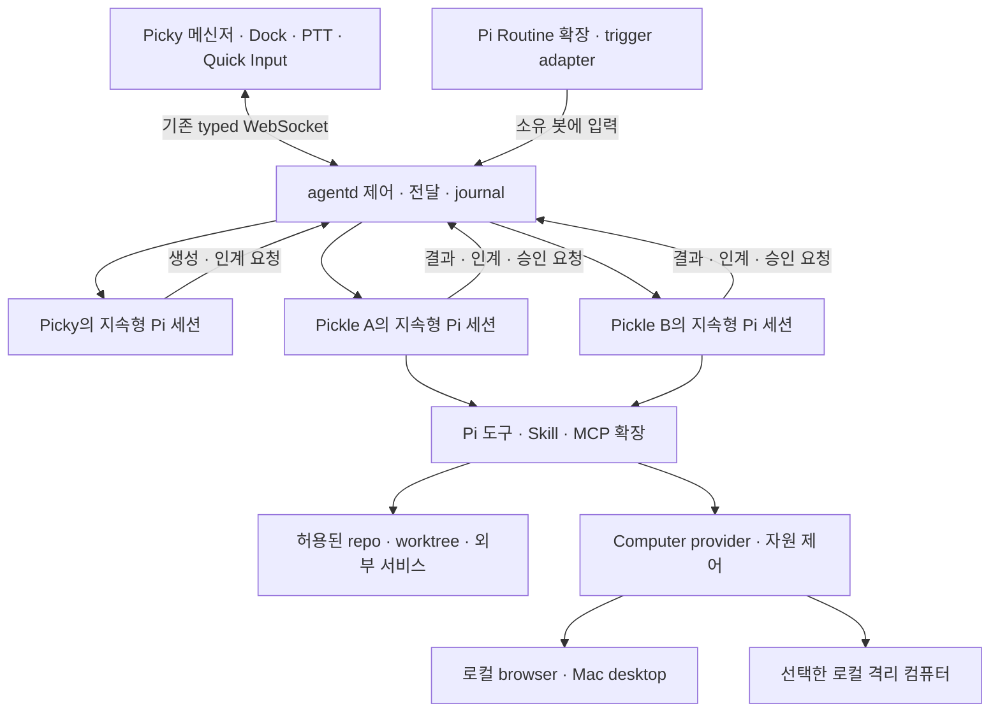

# 기획서 B · Pi 코어로 만드는 로컬 Grok Bot

- 버전: B 0.1
- 조사·작성일: 2026-09-12 (KST)
- 상태: 독립 대안 설계. 구현·출시 승인이나 기능 구현 완료를 뜻하지 않는다.
- 비교 대상 A: [봇 중심 MVP v0.4](./picky-pickle-bot-mvp-prd.md). A는 수정하거나 폐기하지 않는다.
- Picky 조사 기준: `6444d2593`
- OpenMausBot 조사 기준: `f4d562c2d811b9734ddbe8a2873a4cb94f51b747`
- Pi SDK 기준: `0.84.4`, 공식 리비전 `b79e4cc834970cca69daebffab7df1da7d1e52c4`

> Grok Bot의 사용 경험을 로컬 Mac으로 옮긴다.
> OpenMausBot처럼 메신저와 로컬 실행 서버를 구성하되, 에이전트 코어는 Pi 하나로 통일한다.

B는 기존 Picky에 봇 이름과 메신저 창만 붙이는 안이 아니다. **봇 목록, 그룹 대화, 지속되는 업무 방식, Routine, 컴퓨터 제어, 승인, 결과물을 하나의 제품으로 다시 구성한다.** A에서 후순위였던 협업과 자동화도 완성 범위에 넣는다.

## 1. B의 기준과 A와의 차이

| 질문 | A | B |
| --- | --- | --- |
| 어디서 시작하는가 | 기존 Picky의 입력·세션 경험을 작은 봇 MVP로 발전 | Grok Bot의 완성된 제품 흐름에서 필요한 기능을 역산 |
| 구현 참고 | 기존 Picky의 점진적 개편 | OpenMausBot의 메신저·harness·제어 계약, 기존 Picky/Pi의 검증 가능한 기반 |
| 주 화면 | CBO와 Pickle의 1:1 메신저 | 봇·그룹 roster, 대화, 컴퓨터·자료·Routine 상세가 연결된 작업 앱 |
| 협업·자동화 | 기본 위임 우선, 그룹·Routine 확대는 후순위 | 그룹 대화, 봇 간 인계, 일정·이벤트 Routine을 완성 제품의 필수 기능으로 취급 |
| 업무 방식 | Pi 지침·기억과 스냅샷 복제 | 기억·Skill 관리, 시연 학습, 복제·내보내기·가져오기를 연결 |
| 구현 순서의 의미 | 작은 MVP의 출시 경계 | 큰 목표를 단계적으로 구현하되, 중간 단계를 전체 포팅 완료라고 부르지 않음 |

기준은 세 가지로 나눈다.

- **Grok Bot은 무엇을 만들지의 기준**이다. 공개 문서에 있는 사용자 흐름과 기능을 따른다.
- **OpenMausBot은 어떻게 로컬 앱으로 구성할지의 참고**다. 실제 소유권·승인·저장 구현을 읽고 필요한 패턴을 가져온다. 저장소를 통째로 복사한다는 결정은 아니다.
- **Pi는 판단·도구 실행·대화·컴팩션의 코어**다. 그 위에 별도의 범용 agent loop, 모델 라우터, 다중 CLI 엔진을 다시 만들지 않는다.

### 그대로 유지할 요구

Picky는 고정 CBO이고 사용자는 Pickle에 직접 말할 수도 있다. Pickle은 각각 고정 홈과 하나의 지속형 Pi 세션을 갖는다. repo/worktree는 별도 작업 대상이다. 음성·PTT·Quick Input·화면 맥락은 메신저로 들어오는 기존 입력 경로로 유지한다. 평소에는 맡기고, 필요하면 같은 작업의 상세·Pi·터미널까지 들어간다.

이는 Picky의 제품 결정이다. **Grok의 내부 세션 구조가 Pi의 단일 세션과 같다는 뜻은 아니다.** Grok에서 Chief of Staff는 사용 패턴이며, Picky의 고정 CBO는 이를 기본값으로 삼는 차이다. [G01][G03]

### 여기서 말하는 전면 포팅

일상적인 봇 제품의 기능과 정보 구조가 대상이다. xAI의 비공개 코드·프롬프트·모델 품질을 재현하거나, 상표·아바타·그래픽을 복제하는 작업이 아니다.

xAI 계정·과금·SSO·클라우드 운영·기업 인증, Windows/Linux 클라이언트와 네이티브 모바일 앱은 로컬 macOS 제품의 동일 범위로 주장하지 않는다. 모바일 원격 접근은 별도 선택 확장이다. 기능을 빠뜨린 채 같다고 말하는 대신, 아래 대응표에 로컬 치환과 차이를 표시한다.

## 2. 조사에서 확인한 사실

### 2.1 Grok Bot은 메신저에 컴퓨터·자동화를 붙인 제품이다

Grok의 공식 디자인은 Bot, Chat, Prompt, Tool, Artifact를 주요 객체로 삼는다. 상태는 간결하게 보이지만, 컴퓨터 미리보기·takeover, 구조화된 카드, Routine 이벤트와 봇 간 인계는 대화에서 이어진다. 그룹 대화와 자동화는 부가 로그 화면이 아니다. [G01][G04][G05]

| 확인한 내용 | 설계에 미치는 영향 |
| --- | --- |
| 계정당 공유 컴퓨터 하나, 봇별 작업 화면. 파일·브라우저 로그인·CLI 자격증명 공유 | 봇별 화면을 봇별 보안 격리라고 설명하지 않는다. 로컬에서는 물리 화면·브라우저·격리 컴퓨터를 구분해야 함 |
| 도구·Skill은 계정 공통, 기억·Routine은 봇별 | 능력의 재사용과 역할별 지식을 다른 범위로 관리 |
| 그룹은 2~6개 봇, 멘션·비동기 인계·스레드·반응 지원 | CBO의 요약 전달만으로 그룹 협업을 대체하지 않음 |
| 직접 사용자 메시지는 백그라운드 작업보다 우선하며 현재 작업을 수정할 수 있음 | 모든 입력을 후속 queue 맨 뒤로 보내면 안 됨 |
| Duplicate는 프로필·설정·활성 Skill·Routine·아바타를 복제. 학습된 기억·대화·첨부 제외 | 요청된 기억 스냅샷 복제는 Grok 기본 동작과 구별되는 추가 사양 |
| 시연 학습은 컴퓨터에서 수행한 절차를 Skill 초안으로 만듦 | 순간 스크린샷 수집만으로 시연 학습이 있다고 주장하지 않음 |
| Auto Review는 별도 모델의 행동 검토이며 모든 부작용을 포괄하지 않음 | 모델 기반 검토와 실제 권한 제한·승인 계약을 구분 |
| Grok에는 사용자 모델 선택기가 없음 | Pi의 모델 선택은 로컬 제품의 고급 기능이며 매번 요구할 설정이 아님 |

근거는 공식 디자인과 봇·대화·Skill·컴퓨터·보안·설정 문서다. 검색, 시연 학습, 모바일 알림 등은 계정별 rollout 차이가 명시돼 있다. 문서에 있다는 사실과 모든 계정에서 직접 동작을 확인했다는 주장을 구분한다. [G01][G03][G04][G05][G06][G09][G10]

### 2.2 OpenMausBot은 이미 Pi를 지원하지만 세션 모델이 다르다

조사 리비전에는 `server/drivers/pi.ts`가 있다. `pi --mode rpc --no-session`으로 실행하고, thread의 `resumeCursor`에 저장한 파일로 `switch_session`하거나 `new_session`을 요청한다. **Pi 드라이버를 추가하는 것만이 B의 과제는 아니다.** [O02]

| 실제 코드에서 확인한 것 | B에서 취할 것 |
| --- | --- |
| React/Electron 앱, 로컬 Node harness, HTTP 명령·SSE 이벤트 | UI와 실행 소유자를 나누는 원칙. Picky의 WebSocket을 바꿀 이유는 없음 |
| Bot 안에 복수 task/thread와 continuation cursor | 가져오지 않음. Room과 요청이 늘어도 Pickle의 Pi 세션은 하나 |
| Pi session handshake 실패 후 bare prompt를 시도하는 fallback | 가져오지 않음. 재개 실패는 표시하고 다른 맥락에서 몰래 실행하지 않음 |
| 일반 Duplicate는 빈 봇을 만든 뒤 프로필 일부를 복사 | 기억·Skill·Routine 스냅샷 복제의 구현으로 쓰지 않음 |
| Team package는 구조화된 역할·playbook·Skill·Routine 정의를 가져오고 Routine을 비활성화 | 휴대 가능한 정의와 실행 권한을 분리하는 방식 참고 |
| Routine 실행은 새 detached task/thread를 할당 | 실행·receipt UI는 참고하되, 입력은 원래 Pi 세션으로 전달 |
| 사람이 컴퓨터를 잡으면 봇의 클릭·입력을 거부. 뒤로 queue하지 않음 | 채택. 오래된 클릭이 나중에 다른 화면에 실행되는 일을 막음 |
| 자체 `MEMORY.md`·topic memory와 별도 MCP·provider 관리 | Pi의 기억 확장·Skill·MCP 경로와 이중 운영하지 않음 |

직접 확인한 주요 경로는 `server/store.ts`, `server/drivers/pi.ts`, `src/state/store.tsx`, `server/bot-package.ts`, `server/routines.ts`, `server/computer-control.ts`, `server/workspace.ts`다. [O02][O03][O04][O05][O06][O07][O09]

OpenMausBot의 Local VM은 새 하이퍼바이저를 자체 개발한 형태가 아니다. 조사 코드에서는 Docker·Podman·Apple `container` 같은 로컬 runtime 위에 고정된 Cua Linux 이미지와 driver를 준비하고, 자원 제한·private mount·loopback viewer·target lease를 관리한다. Cloud Box와 Composio는 별도 서비스다. **로컬 harness라는 말이 모든 기능의 실행과 데이터가 로컬이라는 뜻은 아니다.** [O01][O08]

OpenMaus README는 일부 API key를 Unix mode `0600`의 `config.json`에 평문 저장한다고 명시한다. write-only 설정 UI가 암호화 저장을 뜻하지는 않는다. 이 저장 방식을 B의 비밀 입력 계약으로 그대로 가져오지 않는다. [O01]

### 2.3 Pi 기본 코어와 확장을 구분해야 한다

Pi SDK는 세션, 모델·인증, streaming, 로컬 도구, Skill/resource loading, steer·follow-up·abort·compaction과 확장 지점을 제공한다. 범용 MCP 연결, Bot roster, Routine scheduler, 기업형 권한 broker는 기본 코어 기능이 아니다. 사용자 질문 도구와 확장 UI가 있다는 사실을 모든 도구의 승인 제어가 있다는 뜻으로 해석하지 않는다. [P01][P02][P03]

현재 Picky에는 재사용할 기반이 더 있다.

- `MainAgentCoordinator`, Pickle별 runtime/daemon 소유권, 메시지 journal, 상태·질문·결과 projection.
- 같은 Pi 파일 재개, steer/follow-up queue, 터미널 tail·sync와 오래된 runtime 폐기.
- `memory-layer`의 agent-scoped 기억, Cron의 같은 세션 전달·reload lease·PTT 전달 보류를 다루는 확장 연동 경로와 통합 테스트.

마지막 항목은 **배포가 끝났다는 뜻이 아니다.** `memory-layer`와 `cron`의 curated 설치·업데이트는 현재 안전 보류 상태다. 검토된 새 배포물, 그 내용에 대한 통합 검증, 기존 writer와 scheduler의 이전을 끝내기 전에는 B의 준비된 의존성으로 계산하지 않는다. 이번 조사에서 해당 테스트를 실행하지도 않았다. [C01][C02][C04][C05]

## 3. 기능 대응표와 완성 범위

`로컬 치환`은 기능을 숨긴다는 뜻이 아니다. 사용자에게 실행 위치와 한계를 보여주며 대응한다. 아래의 B 기능은 구현 목표다.

| ID | Grok Bot 기능 | OpenMausBot에서 확인한 기반 | B의 목표 |
| --- | --- | --- | --- |
| F01 | 지속형 봇 roster·프로필·pin/hide | BotRecord, 프로필·sidebar 동작 | Picky 고정 CBO, Pickle 연락처, 이름·역할·상태·읽음·숨김 |
| F02 | Chief of Staff와 전문가 팀 | 팀·Chief of Staff package | Picky가 재사용·생성·배정·결과 조율. 직접 Pickle 대화도 유지 |
| F03 | DM·추가 지시·스레드·반응 | chat/thread와 질문 UI | 같은 Pi 세션의 대화, 결과 답장·steer·queue·stop, 대화별 draft |
| F04 | 여러 봇의 그룹 대화·멘션 | channel/room roster·responder | Room journal, 멘션·공유 맥락. Room별 Pi 세션 생성 금지 |
| F05 | 봇 간 비동기 인계 | harness/팀 제어 경로 | 원 요청·담당자·수락·결과가 보이는 전달과 답변 |
| F06 | 역할별 기억·지속 지침 | `MEMORY.md`와 topic memory | Pi 기억 확장 재사용, 봇별 소유권·확인·수정·잊기·출처 |
| F07 | 공통 Skill·봇별 활성화 | portable Skill와 package | 공통 catalog, 봇별 enable/pin, Pi Skill 형식과 실행 |
| F08 | 봇 Duplicate·공유 | profile Duplicate, 별도 team import | 역할 복제와 로컬 기억 스냅샷 복제 구분. 새 홈·새 Pi 세션 |
| F09 | 일정 Routine·관리·test/history | scheduler·receipts·관리 API | 원래 Pickle 세션에서 실행, pause/edit/test/history/삭제 |
| F10 | 외부 이벤트 trigger | 인증된 전용 webhook receiver | 지원 source의 polling·webhook adapter. localhost의 도달성 명시 |
| F11 | 시연으로 Skill 만들기 | 이번 조사에서 동등한 전체 실행 경로 미확인 | 사용자 시작·종료 녹화, Pi가 Skill 초안 생성, 안전 재현 후 저장 |
| F12 | 컴퓨터 status·preview | Computer panel, host/browser/VM/cloud provider | 관리 browser·Mac desktop이 필수. preview·takeover·복귀를 연결하며 격리 컴퓨터는 선택 확장 |
| F13 | 사람이 takeover하고 반환 | ComputerControl의 human hold/refusal | 컴퓨터와 Pi 직접 조작의 소유권을 각각 명시, stale action 거부 |
| F14 | 연결 앱·Plugin·계정 | Composio 및 custom MCP registry | 기존 Pi MCP·도구·package를 재사용. Composio/Box 계정은 필수 아님 |
| F15 | 행동 승인·Auto Review | provider permission broker·질문 구분 | action 귀속 승인, 범위 규칙, 선택적 모델 검토, 실제 coverage 표시 |
| F16 | secure secret request | write-only 설정, 권한·인증 경로 | 일반 질문과 별도의 비밀 입력. transcript·모델에 원문 비밀 제외 |
| F17 | 파일 첨부·링크·결과 preview | attachment 저장·screen evidence | 파일·이미지·보고서·diff·검증 결과를 원 요청에 연결 |
| F18 | inline card/widget | 메시지·질문·스크린샷 카드 | 구조화된 작업·Routine·차트·표 카드와 제한된 interactive artifact |
| F19 | 메시지·봇·파일·Routine 검색 | 로컬 메시지 DB·검색 기반 | 사용자 전역 검색과 원문 위치 이동. 봇의 검색 범위는 별도 제한 |
| F20 | 읽음과 needs-attention·알림 | unread/activity·완료 표출 | 읽음, 질문, 승인, 실패를 분리. 사용자 판단이 필요한 경우 알림 |
| F21 | 음성 입력·대화 | dictation·TTS 경로 | 기존 Picky PTT·Quick Input·음성 제공자를 유지. 원격 TTS 필수화 금지 |
| F22 | 영속 컴퓨터·백그라운드 실행 | 로컬 저장·runtime lifecycle | Mac이 켜져 있는 동안의 지속 실행. 절전·종료는 지연·중단으로 표시 |
| F23 | 복구·삭제·설정·내보내기 | store, lifecycle, portable package | Bot·Pi 기록·Routine·shared resource의 삭제 범위를 구별, 안전 백업·복구 |
| F24 | usage·운영 설정 | provider/model·비용 관련 설정 | Pi 모델·생각 수준은 고급 설정, 실행량·알려진 비용·자동화 예산 표시 |
| F25 | 모바일에서 같은 팀 제어 | companion/원격 기능이 별도 존재 | 선택 확장. 같은 local agentd에 승인된 원격 경로로 접근, 네이티브 모바일 동등성은 별도 |

F01~F24가 이 설계의 로컬 데스크톱 완성 목표다. F25와 기업용 계정·과금 인프라는 기본 출시 범위 밖이다. F11·F18처럼 OpenMaus에서 대응 실행 경로를 이번 조사로 확인하지 못한 기능도 Grok의 제품 목표에서는 빼지 않는다. [G01][G03][G04][G05][G06][G07][G08][G10][O01]

### 현재 Picky에서 가져올 것과 만들 것

| 대상 기능 | 현재 기반 | B에서 필요한 변경 |
| --- | --- | --- |
| F01~F03 봇·대화·CBO | Pickle identity·main agent·CLI 위임·Conversation | 고정 CBO 정책, 자동 재사용/생성, 통합 roster·메신저 |
| F04~F05 그룹·인계 | Dock 분류 그룹, main/child routing | 별도 Room journal·참여 관계·mailbox·인계 receipt. 기존 분류 그룹과 구별 |
| F06~F10 기억·Skill·복제·Routine | Pi resource loading, 기억/Cron 연동과 안전 보류, 기존 대화 복사 | 검증된 package cutover, catalog·scope·export/import·같은 세션 Routine UI |
| F11~F13 시연·Computer·직접 제어 | 중립 화면 capture·pointer overlay, Pi terminal/sync | 실제 GUI 제어·녹화·Skill 생성, Computer/Pi 각각의 소유권. capture는 제어가 아님 |
| F14~F16 연결·승인·비밀 | Pi 확장과 질문 UI bridge | 연결 account/capability 표출, 실행 전 승인 broker·coverage, 별도 secret 흐름 |
| F17~F19 결과·widget·검색 | artifact/report·변경 파일·대화 이력 | 원 요청의 근거·버전 연결, 구조화 카드·제한된 widget, 전역 index |
| F20~F21 알림·입력 | Dock 읽음·상태, PTT·Quick Input·음성 제공자 | 질문/승인/실패의 attention, 원 대화로 deep link, 승인된 선택 알림 경로 |
| F22~F24 지속 실행·복구·운영 | app-owned daemon·session store·reconnect | 서비스/절전 정책, Routine 포함 백업·삭제, 알려진 실행량·비용 표출 |

기존 코드는 재사용의 출발점이다. 이 표의 왼쪽 기능 전체가 이미 구현됐다는 뜻은 아니다. [C01][C02][C03][C04][C05][C11][C12][C13]

## 4. 사용자가 보는 제품

### 4.1 메신저가 주 화면이다

```text
┌────────────────┬─────────────────────────┬────────────────────┐
│ 검색 / 새로 만들기 │ 선택한 봇 또는 그룹          │ 필요할 때 여는 상세    │
│                │ 상대 · 실제 상태 · 현재 작업   │                    │
│ Picky (CBO)    │                         │ Computer           │
│ 고정 Pickle들    │ 대화 / 결과 / 질문 / 승인     │ Files / Diff       │
│ 그룹 대화        │ Skill·Routine·인계 이벤트    │ Routines / Memory  │
│ 최근 / 숨김      │                         │ Profile / Skills   │
│                │ 답장 · 첨부 · /Skill · @대상  │                    │
│ 자동화 / 연결 / 설정│ 메시지 입력 · 중단           │                    │
└────────────────┴─────────────────────────┴────────────────────┘
```

위 그림은 정보 구조이며 구현된 화면이 아니다. 평소에는 왼쪽 목록과 가운데 대화만 쓴다. 오른쪽을 상시 열거나 컴퓨터를 감시하도록 유도하지 않는다.

- 목록에는 봇·그룹을 표시한다. 여러 task가 생겼다고 연락처가 갈라지지 않는다.
- header에서 실행 상태·중단·컴퓨터 접근을 찾을 수 있다. 모델과 실행 설정은 고급 메뉴에 둔다.
- 일반 도구는 짧은 activity와 상세 이력으로 접는다. 질문·승인·실패·검증 누락은 접지 않는다.
- 전체 컴퓨터/Pi/터미널은 직접 작업을 위한 더 깊은 접근이다. 로그를 열었다고 제어권을 가져가지는 않는다.
- Dock은 상태 확인과 해당 대화로 돌아오는 진입점이다. 기존 작은 대화 카드를 또 하나의 주 화면으로 유지하지 않는다.

OpenMaus의 공개 화면에서는 roster, 중앙 대화, 우측 Computer 패널, inline 질문을 확인했다. 이를 레이아웃 참고로 쓰되, 그 스크린샷을 현재 모든 기능의 실행 증거로 사용하지 않는다. [O13]

### 4.2 별도 운영 콘솔을 일상의 관문으로 두지 않는다

Routine은 대화에서 만들고 생성 카드로 확인한다. 봇 상세에서 일정·다음 실행·최근 결과를 보고, 전체 자동화 목록은 여러 봇의 책임을 훑는 용도로 쓴다. Skills·Memory도 대화에서 관리할 수 있고 상세에서 저장 결과를 확인한다.

연결 앱 화면은 설치 여부·연결 계정·허용 도구·다시 인증할 이유를 보여준다. 일상적인 의뢰마다 모델·폴더·provider·queue 종류를 고르게 하지 않는다.

### 4.3 macOS 동작을 보존한다

기존 디자인 시스템과 시스템 폰트·Action Blue·semantic status를 사용한다. 키보드, VoiceOver, IME marked text, light/dark, Reduce Motion을 유지한다. 상태나 도움 요청을 avatar 애니메이션·색·hover만으로 전달하지 않는다. PTT 시작 시 입력 대상 snapshot, pin, 멀티 디스플레이와 창 focus도 기존 계약을 지킨다. [C06][C07]

## 5. 대표 사용자 흐름

### 5.1 처음 열고 일을 맡기기

1. 기존 Pi 환경이 있으면 사용 가능한 인증·모델·도구를 확인한다. 새 서비스 계정부터 만들게 하지 않는다.
2. 없으면 Pi가 지원하는 인증 경로를 한 번 설정한다. 로컬 실행이 무료 추론이나 완전한 오프라인을 뜻하지 않음을 알린다.
3. Picky 대화가 열린다. 사용자는 파일을 붙이거나 지금 보고 있는 화면에서 말한다.
4. Picky가 직접 처리하거나 기존 담당자를 찾고, 필요하면 새 Pickle을 만든다.
5. 실제 생성·수락을 확인한 뒤 담당자를 알린다. 권한이 부족하면 필요한 대상·효과만 확인한다.
6. 결과·근거·남은 질문이 원 대화로 돌아온다. 필요하면 담당자의 상세로 이동한다.

Computer나 MCP가 아직 준비되지 않았어도 대화·로컬 코드 작업은 가능한 범위에서 시작한다. 준비되지 않은 도구를 썼다고 가장하거나 자동으로 다른 실행 위치로 바꾸지 않는다.

### 5.2 팀이 협업하고 사용자가 개입하기

1. `조사하고, 구현하고, 별도로 검토해줘`라는 요청을 받는다.
2. Picky가 담당자를 재사용·생성하고 필요하면 그룹을 만든다. 그룹 생성이 Pi 세션 생성을 뜻하지 않는다.
3. 조사 봇의 근거, 구현 봇의 변경, 검토 봇의 판단이 같은 그룹의 인계로 표시된다.
4. 사용자는 `@구현담당 이 파일은 건드리지 마`라고 수정한다. 현재 실행에 대한 steer인지, 다음 작업인지 실제 수락 상태를 표시한다.
5. 완료 주장은 diff·테스트·원본 근거로 확인한다. 코드가 작성됐다는 메시지만으로 검토까지 끝났다고 보고하지 않는다.

봇끼리 같은 요청을 계속 되돌려 보내지 않게 origin ID, 단계별 소유자, 재위임 한도·사용량 제한을 둔다. 상호 대화의 모델 판단은 Pi가 하고, 전달과 한도는 agentd가 검사한다.

### 5.3 업무 방식을 익히고 Routine으로 만들기

1. 일회성 작업을 실제로 완료하고 사용자가 방식·결과를 수정한다.
2. Pi가 명시적 기억과 Skill을 저장한다. 저장된 내용·범위를 대화에 알린다.
3. 말로 설명하기 어려우면 `작업 가르치기`로 해당 Computer에서 시연한다. 녹화 중임을 표시하고 즉시 중지할 수 있다.
4. Pi가 시연을 절차·판단 조건·필요 권한·검증 방법으로 정리한 Skill 초안을 제시한다.
5. 안전한 입력으로 확인한 뒤 Routine을 등록한다. 실행 시각·소유 봇·작업 대상·승인 경계·다음 실행을 표시한다.
6. 매번 원래 Pickle의 Pi 세션에서 실행하고, 결과 또는 개입 요청을 보낸다.

Grok의 시연 학습은 최대 10분, 마이크 미녹음으로 문서화돼 있다. B도 묵시적 상시 녹화 대신 사용자 시작·종료와 길이 제한을 둔다. 정확한 media 제한은 로컬 처리·모델 지원을 검증한 뒤 정한다. [G05]

시연 기록에는 다음 별도 계약을 적용한다.

- 시작할 때 소유 봇과 browser target 또는 지원 window를 고정한다. 전체 desktop·다른 창·알림을 기본 수집하지 않는다. 대상 전환은 일시정지 후 사용자가 범위를 다시 확인한다.
- 수집 항목은 선택한 화면, 시각, 허용된 클릭·스크롤·탐색·일반 필드 입력이다. 마이크·시스템 오디오·clipboard 원문·전역 key log는 수집하지 않는다. 입력 이벤트를 제외해도 화면에 글자가 보일 수 있음을 알린다.
- DOM/접근성 정보에서 password·one-time-code·secure field가 감지되면 자동으로 일시정지하고 해당 구간을 버퍼·저장본·전송 후보에서 제외한다. 구조적으로 확인할 수 없는 입력은 자동 기록하지 않는다. 픽셀만 보고 모든 비밀을 탐지한다는 보장은 하지 않는다.
- 초기 필수 시연 대상은 이 경계를 검증한 관리 browser다. 다른 앱의 시연은 target capture와 민감 입력 제어를 검증한 provider에서만 켠다. 로그인·2FA는 녹화를 끈 takeover로 처리한다.
- 기록은 먼저 봇 소유의 비공개 로컬 임시 자료로 둔다. 사용자가 preview에서 구간·입력을 제거하고, 전송할 화면·절차와 선택된 Pi 모델의 처리 위치를 확인한 뒤 `이 자료로 Skill 만들기`를 실행한다. 녹화 시작만으로 원본을 모델에 전송하지 않는다.
- 취소하면 임시 원본·추출물을 삭제한다. 초안 생성 후에는 기본적으로 원본을 삭제하고 승인된 Skill·출처만 남긴다. 사용자가 별도 보관을 선택한 자료는 목록과 삭제 경로를 제공한다. 비정상 종료의 미완료 기록은 다음 기동 때 정리하고, 실행 중 임시 기록도 24시간을 넘겨 보관하지 않는다.

로컬 파일 삭제는 디스크의 물리적 완전 삭제나 이미 전송한 모델 제공자 사본의 회수를 뜻하지 않는다. 자동완성·알림·감지되지 않은 민감 내용이 섞일 위험은 전송 전 검토에서도 확인한다.

### 5.4 같은 방식으로 병렬 코딩하기

1. 사용자가 같은 담당자의 방식으로 다른 PR을 동시에 처리해 달라고 한다.
2. 필요한 역할·Skill·선택된 기억의 스냅샷을 만든다. 진행 중 대화나 compaction 요약을 대신 복사하지 않는다.
3. 새 Pickle에 새 홈·새 Pi 세션을 만들고 자료의 새 소유자를 연결한다. Routine은 일시중지로 들어온다.
4. 두 코드 수정이 충돌할 수 있으면 기존 Skill/`gw` 절차로 별도 worktree를 준비한다. 읽기 전용 검토에 worktree를 강제하지 않는다.
5. 원본은 원래 일을 계속한다. 복제본은 새 요청만 처리하고 자기 기억·Skill을 독립적으로 수정한다.

Pi가 직접 코드를 작성·테스트한다. 별도 Cursor Cloud Agent가 필수인 구조로 만들지 않는다. Grok 공식 engineering 가이드의 cloud-agent 관리 사례는 피드백 루프의 참고이며, 그 실행 인프라까지 필수로 가져오는 것은 아니다. [G12]

### 5.5 컴퓨터 또는 Pi를 직접 조작하기

컴퓨터 preview는 읽기 전용이다. 사용자가 직접 잡으면 해당 자원의 봇 입력을 거부하고, 반환 뒤 새 화면 상태를 확인한다. 오래된 클릭·키 입력은 재생하지 않는다.

Pi 직접 조작은 별도 문제다. 같은 세션을 두 프로세스가 동시에 쓰지 않도록 관리 경로에서 자동 입력을 보류하고, 실행을 정리한 뒤 소유권을 넘긴다. 돌아오면 JSONL과 작업공간을 동기화하고 대기 입력을 재개한다. 컴퓨터를 잡는 것과 Pi 대화의 writer를 넘기는 것을 하나의 flag로 처리하지 않는다.

## 6. 구현 방식과 책임

### 6.1 권장안

**기존 Picky의 native shell·agentd·Pi adapter를 유지하고, 메신저와 봇 제품 모델을 OpenMaus 방식으로 재구성한다.** UI를 지금의 Dock 중심 구성에 맞춰 축소하지 않되, 이미 있는 입력·세션·프로토콜 안전 장치를 버리지 않는다.

| 접근 | 장점 | 비용·문제 | 판단 |
| --- | --- | --- | --- |
| OpenMaus fork 후 Pi-only화 | 메신저·Computer·Routine UI를 가장 직접적으로 출발점으로 삼음 | task별 session/Routine·자체 memory/MCP 계층 변경, Picky native 입력·기존 기록 재통합, fork·라이선스 관리 | 별도 실험 앱에는 가능. Picky 본체의 기본안으로는 비추천 |
| 기존 Picky 기반의 OpenMaus형 제품 재구성 | Pi SDK·voice·context·CLI·소유권·저장 기반 재사용 | Room, resource catalog, 승인·Computer 제어와 메신저 구현 필요 | 권장 |
| 새 harness·VM·agent engine 전면 자체 개발 | 모든 계층을 직접 통제 | Pi와 역할 중복, GUI·배포·인증·복구 범위까지 불필요하게 커짐 | 제외 |

컴퓨터 backend는 교체 가능한 도구 경계로 둔다. VZ 하이퍼바이저를 새로 작성하는 일을 메신저의 선행 조건으로 만들지 않는다. OpenMaus의 Local VM 방식이나 기존 로컬 도구를 검증해 사용한다.

### 6.2 실행 구조



화살표는 논리적 책임이다. `T`를 공용 가변 Pi 세션이나 봇 권한을 합치는 프로세스로 해석하지 않는다. 기존 primary/child daemon의 소유권은 출발점으로 유지한다. 일반 Pickle에서 팀·Room 도구를 사용할 수 있도록 현재 primary-only 제어 경로를 좁은 명령으로 확장해야 한다. child에 CBO의 전체 권한을 복사하지 않는다. [C01][C08]

| 주체 | 맡을 일 | 맡지 않을 일 |
| --- | --- | --- |
| Swift 앱 | 중립 입력, 메신저·상세·질문·비밀 입력, 사용자의 실제 제어, macOS 통합 | 역할·의도를 키워드로 분류, 별도 agent loop |
| agentd | Bot/Room 참조, 입력 수락·전달, runtime 소유권, durable journal, 승인 귀속, 자원 lease | 작업 방법을 독자적으로 추론하거나 기억 내용을 별도 AI로 관리 |
| Pi SDK와 세션 | 이해·계획·도구 선택·코딩·대화·컴팩션·steer/follow-up | 봇 registry, 네이티브 메신저, 모든 도구의 보안 격리를 기본 제공한다고 간주 |
| Pi 확장·package | 기억·Skill·Routine·MCP·Computer 도구를 세션에서 사용 | 별도의 숨은 장기 bot/session pool 구성 |
| Computer backend | 화면·입력·브라우저·sandbox lifecycle과 실제 지원 capability | Pi와 별개인 두 번째 일반 목적 에이전트로 작업 의도 재해석 |

명령은 실행을 요청하고, 이벤트는 이미 수락되거나 관찰된 사실을 전달한다. UI가 API 응답만 보고 가상의 완료 메시지를 만들지 않는다. 요청 ID·origin·Bot·turn·Room·결과 참조를 저장해 재접속과 중복 전송에도 귀속을 유지한다.

발신자는 도구 인자의 `botId`가 아니라 runtime에 바인딩된 실제 봇으로 확인한다. CBO도 부여된 관리 범위 안에서만 다른 봇의 자료를 읽거나 내보낸다. 자료 관리 경로는 정규화·심볼릭 링크·홈 밖 경로를 검사한다. 역할 설명이나 기억 파일을 수정해 실제 권한을 늘릴 수는 없다. 이 관리 도구의 정책과 같은 OS 사용자 shell의 접근 권한은 별개다.

## 7. Bot·홈·workspace·Room·Pi 세션

### 7.1 데이터의 소유 단위

아래 이름은 설계 개념이며 현재 protocol에 모두 존재한다는 뜻은 아니다.

| 개념 | 소유와 수명 |
| --- | --- |
| Bot/Pickle | 안정적인 ID·역할·고정 홈·유일한 Pi 세션 참조. 이름 변경과 요청 추가로 바뀌지 않음 |
| Agent home | 공통 관리 루트 아래 Bot ID별 경로. Pi runtime cwd의 기준 |
| Workspace binding | 요청이 실제로 다룰 repo/worktree·파일 범위. 홈과 별개 |
| Room | 참여 봇·가입 구간·이력 grant·공유 지침·메시지·인계. 별도 Pi 세션이나 대리 bot이 아님 |
| Message/Thread/Reaction | 안정적인 메시지·parent/root 참조, 실제 actor의 반응, 사용자별 읽음 cursor. 실행 권한과 별개 |
| Delivery/Request | 사람·다른 봇·Routine에서 온 입력의 ID, origin, 대상, thread, 권한 범위, 결과 참조 |
| Routine/Run | 정의와 실행 receipt. receipt가 새 Pi 세션의 소유권 단위는 아님 |
| Artifact | 생성·수정한 파일/결과의 위치·버전·출처·권한·관련 요청 |
| Approval/Control lease | 특정 action 또는 실행 자원에 대한 제한된 제어 상태. 프로필과 복제 자료에 포함하지 않음 |

```text
<Picky 관리 루트>/
  pickles/<bot-id>/    고정 실행 홈, Pi 세션과 봇 소유 자료·참조
  shared/             공통 Skill 버전·허용된 공유 자료
  rooms/              Room journal과 참여 관계
  snapshots/          불변 복제 manifest와 허용된 자료

<repo 또는 worktree>/  코드·Git·빌드의 실제 작업 대상
<기존 Pi 설정>/         인증·모델·전역 확장, 무조건 봇 홈에 복사하지 않음
```

이 구조는 소유 관계의 예시다. 기존 JSON journal을 전부 새 DB로 옮기거나 Pi 기억을 새 파일 포맷으로 다시 쓰라는 지시가 아니다.

### 7.2 `cwd` 하나로 모든 경로를 해결하지 않는다

Pi 0.84.4에서 `cwd`는 프로젝트 resource discovery와 도구 경로에, `agentDir`는 전역 설정·확장·인증·모델 등에 영향을 준다. custom `ResourceLoader`, `modelRuntime`, `SessionManager.create(cwd, sessionDir)`와 `open(path, sessionDir, cwdOverride)`는 공개 API로 확인했다. [P02]

B의 제안은 다음과 같다.

1. Pi runtime의 cwd는 고정 홈으로 둔다. 새 요청이나 Room 전환 때 이를 repo로 바꾸지 않는다.
2. 실제 코드 명령과 파일 경로는 명시적인 workspace에 적용한다. 새 홈 안에 엉뚱한 Git 저장소나 결과물을 만들지 않는다.
3. workspace의 `AGENTS.md`·프로젝트 Skill·설정·trust 결정은 그 프로젝트에서 로드한다. 홈에서 자동 발견되는 자료만으로 대체하지 않는다.
4. 봇별 자료는 custom loader·추가 resource 경로·명시적 세션 저장 위치로 연결한다. `agentDir = agentHome`만 넣으면 인증과 모델 설정까지 갈라질 수 있다.
5. 기존 Pi 인증은 유지하거나 `ModelRuntime`으로 명시적으로 연결한다. 인증 파일을 복제 snapshot에 넣지 않는다.
6. Pi에서 다시 열 때도 같은 홈·세션·resource 구성이 적용돼야 한다. 설정을 agentd의 메모리에만 두지 않는다.

API 존재와 올바른 동작은 다르다. 같은 파일 재개, workspace 지침 전환, Skill 내부 상대경로, custom memory 위치, 프로젝트 trust를 함께 검증한 뒤 이 결합을 확정한다.

### 7.3 그룹이 늘어도 봇의 Pi 세션은 늘지 않는다

각 봇에 입력 mailbox 하나를 둔다. DM, Room, 인계, Routine은 origin이 다른 입력이다. 한 봇의 최상위 turn을 겹쳐 실행하지 않는다.

- 멘션은 명시적 수신자다. 일반 그룹 메시지는 참여 봇 중 지정된 조율 담당 Pi가 응답자를 판단한다. UI가 내용으로 직무를 분류하지 않는다.
- 조율 담당은 Room 참여자여야 한다. CBO라는 이유로 참여하지 않은 모든 방의 원문을 자동 전달하지 않는다.
- 다른 방의 모든 transcript를 매번 합치지 않는다. 현재 요청에 필요한 Room 이력·결과 참조를 전달한다.
- 수정 지시는 대상 요청·turn에 연결한다. Room B의 추가 의뢰가 Room A의 진행 중 작업을 실수로 steer하지 않게 한다.
- 병렬 실행이 필요하면 다른 visible Pickle을 재사용하거나 복제한다. OpenMaus의 task별 `resumeCursor` 구조는 도입하지 않는다.

Grok의 bot-to-group 인계는 현재 text-only로 문서화돼 있다. B도 우선 텍스트와 허용된 artifact 참조로 연결하며, 원본 파일을 다른 방에 복사·전송할 때는 별도 범위를 검사한다. 사용자 첨부 전체를 금지한다는 뜻은 아니다. [G04]

하나의 Pi 세션이 여러 Room을 오가므로 **Room을 모델 맥락의 보안 격리로 약속하지 않는다.** 전달 범위와 실제 도구 권한을 제한하되, 엄격히 분리해야 하는 업무는 별도 봇·허용 자원으로 나눈다.

기존 Pi subagent 확장은 SDK 기본 기능이 아니며 독립 Pi process/context를 만들 수 있다. B가 새로 관리하는 장기 병렬 담당자는 visible Pickle로만 만든다. 기존 도구 내부 임시 subagent의 허용 범위와 호환성은 구현 전 결정 항목으로 남기며, 숨은 세션 풀을 허용하는 예외로 사용하지 않는다. [P01]

### 7.4 Room 참여와 이력 접근

- 새 참여자는 기본적으로 가입 이후 메시지만 전달·조회받는다. 과거 이력은 사용자가 허용한 메시지 범위 또는 특정 인계 자료를 명시적으로 연결한다. 이미 승인된 업무 위임에 필요한 입력은 그 범위에서 재사용하며 매번 다시 묻지 않는다.
- 참여 관계에는 가입·탈퇴 구간과 grant 버전을 둔다. CBO의 자동 참여자 구성 권한이 다른 방의 모든 과거 이력을 공유하는 권한은 아니다.
- artifact는 Room 메시지를 볼 수 있다는 이유만으로 무조건 열리지 않는다. 원 자료의 권한과 해당 참여자에게 부여된 범위를 함께 검사한다.
- 참여자를 제거하면 그 Room의 새 전달·조회·검색을 차단하고, Room이 준 artifact 접근과 대기 입력을 회수한다. 실행 중 Room 요청은 취소 상태로 전환하고 새 action을 막는다. 다른 DM·Room의 무관한 작업까지 종료하지 않는다.
- 재가입해도 이전 grant를 자동 복구하지 않는다. 이미 완료된 외부 효과, Pi 세션·기억·다운로드에 남은 내용까지 회수하거나 잊게 만들었다고 표시하지 않는다.

### 7.5 스레드·반응·읽음

메시지는 DM 또는 Room ID와 안정적인 message ID를 가진다. thread reply는 같은 대화의 `parentMessageId`·`rootMessageId`를 저장한다. 다른 방의 참조는 thread parent가 아니라 권한을 확인한 링크다. 삭제·미접근 parent는 원문 없음으로 표시하며 다른 대화에 잘못 붙이지 않는다.

- thread reply도 원래 봇의 mailbox로 들어가고 결과는 같은 root에 돌아온다. thread를 열거나 답장했다고 Pi 세션·workspace를 바꾸지 않는다.
- 일반 답장은 해당 요청의 추가 입력이다. 진행 중 작업을 고치는 행동은 대상 request/turn을 지정한 steer로 구분한다. 질문·승인 응답은 해당 객체의 ID로만 처리한다.
- reaction은 실제 actor·메시지·반응 값의 추가/제거 이벤트다. 재전송해도 중복되지 않으며, 같은 Pi 세션에 새 turn을 자동 생성하지 않는다.
- reaction을 승인·인계 수락·완료 receipt로 해석하지 않는다. 이 행동들은 별도 명시적 action이다.
- 사용자별 대화·thread 읽음 cursor와 미읽은 답글 수를 저장한다. thread를 열었다고 방 전체를 읽음 처리하지 않는다. 멘션·구독한 thread 답글·개입 요청을 알리고, 단순 반응은 기본적으로 알림을 울리지 않는다.

### 7.6 검색도 같은 접근 정책을 적용한다

사용자는 자신이 소유한 대화·봇·자료를 전역 검색한다. 봇 검색은 agentd가 runtime에 바인딩한 principal로만 실행한다. 모델이 `user`나 다른 Bot ID를 질의 인자로 지정해 검색 주체를 바꾸지 못한다.

- 봇에는 자신의 DM과 현재 참여·이력 grant로 허용된 Room 구간만 검색한다. 파일은 별도 artifact 권한도 통과해야 한다.
- 권한 필터는 원문 조회뿐 아니라 검색 후보·snippet·결과 수·ranking 전에 적용한다. 전체 결과를 모델에 준 뒤 가리는 방식은 사용하지 않는다.
- 숨김·보관은 표시 상태이며 권한 회수가 아니다. 삭제된 본문은 검색 후보·cache에서 제거하고 원문 없음으로 처리한다. 새 참여·탈퇴·grant 변경은 index/cache에도 반영하며 조회 시 현재 권한을 재검사한다.
- Room에서 회수한 자료가 과거에 Pi 기억·다른 결과물로 복사됐다면 원 검색 index 제거만으로 모든 사본이 사라지지는 않는다. 별도 삭제 범위로 안내한다.

이 계약은 Picky의 전달·검색·자료 도구에 적용한다. 임의 host shell까지 제한하는 OS 격리와 혼동하지 않는다.

## 8. 기억·Skill·복제·팀 package

### 8.1 기억과 능력을 다르게 관리한다

- 안정된 선호·역할 지식은 해당 봇의 Pi 기억에 저장한다. 변하는 branch·PR·가격·테스트 결과는 원본을 다시 확인한다.
- 공통 Skill catalog는 여러 봇이 사용할 수 있다. 봇별 활성화·버전 pin·독립 수정본을 구분한다.
- 공통 Skill 수정과 특정 봇의 로컬 개선을 같은 동작으로 취급하지 않는다. 새 버전의 영향 범위를 보여준다.
- 앱은 자료의 목록·출처·사용 범위·저장 결과를 보여준다. OpenMaus의 `MEMORY.md` prompt 주입기를 Pi 기억 확장 위에 추가하지 않는다.
- 기존 user/project memory와 봇별 memory를 구분한다. 고정 홈 때문에 모든 프로젝트 기억을 하나로 바꾸거나 원래 공유 기억을 복제하지 않는다.

현재 Picky 확장 테스트의 agent-scoped 기억은 Pi의 `memory-layer-agent` custom entry를 사용한다. 따라서 봇 소유 기억이 반드시 별도 `memory/*.md` 파일이어야 하는 것은 아니다. **권위 있는 Pi 저장 형식과 소유자 ID를 보존한다.** [C04][C05]

### 8.2 세 가지 복사 목적

| 동작 | 포함 | 제외 |
| --- | --- | --- |
| 역할 복제 | 프로필·업무 지침·활성 Skill의 고정 버전·Routine 정의 | 학습된 기억, 대화, 실행 상태, 권한·비밀 |
| 로컬 업무 기억 스냅샷 복제 | 위 자료와 사용자가 포함하기로 한 봇별 기억 | 대화·compaction 요약·queue·질문·승인·실행 이력·credential |
| 휴대 가능한 팀 package | 역할·Room 구성·playbook·허용된 Skill·Routine 정의 | 개인 기억·대화·인증·권한·절대 로컬 경로·실행 중 상태 |

첫 동작은 Grok의 Duplicate에 가깝고, 둘째는 앞서 요청한 추가 기능이다. 셋째는 OpenMaus team package의 안전한 경계를 참고한다. Grok과 OpenMaus의 일반 Duplicate가 기억까지 복사한다고 설명하지 않는다. Grok 복제 Routine의 활성 상태는 공개 자료로 확인하지 못했으며, B의 일시중지 가져오기는 별도 안전 정책이다. [G03][O04][O05]

### 8.3 스냅샷 계약

- 원본 Bot·생성 시각·schema·자료 버전/해시·포함 범위를 기록한다. 이후 원본이 바뀌어도 이미 만든 snapshot은 바뀌지 않는다.
- export 전후에 기억·Skill·Routine 정의의 단조 증가 revision을 모두 비교한다. 중간에 하나라도 바뀌면 혼합 snapshot을 확정하지 않고 제한적으로 재시도하거나 실패를 알린다. run 이력처럼 제외한 자료의 변경은 정의의 revision과 구별한다.
- revision 읽기를 지원하지 않는 저장소는 짧은 쓰기 checkpoint에서 일관된 읽기를 확보해야 한다. 확보할 수 없으면 snapshot을 만들지 않으며 원본 작업을 몰래 abort하지 않는다.
- 완성된 manifest와 clone 요청 ID에 새 Bot ID·홈·Pi 세션을 연결한다. 자료·실행 권한·workspace 준비를 모두 확인한 뒤 의뢰를 수락한다. 재시도는 같은 생성 receipt를 이어받아 Bot·Routine을 중복 생성하지 않는다.
- Pi custom entry에 저장된 기억은 기억 도구의 export/import 경로로 추출하고 새 소유자에 연결한다. JSONL 전체 복사나 대화 요약으로 대신하지 않는다.
- 변경 가능한 원본 파일을 가리키는 링크는 독립 snapshot이 아니다. 불변 버전 참조와 복제본의 쓰기 공간을 구분한다.
- Routine은 일시중지로 가져온다. 원본 소유자·경로·대상 계정·다음 실행·밀린 trigger를 그대로 실행하지 않는다.
- 새 target까지 포함하는 기존 자동화 허용이 있을 때만 활성화할 수 있다. 아니면 정의만 보존한다.
- `.env`, Pi 인증 파일, browser profile, 승인 grant, 비밀 입력, 미커밋 코드·대화 첨부를 홈 전체 압축으로 가져오지 않는다.
- 알 수 없는 package 필드·경로 탈출·심볼릭 링크·중복 ID를 검증한다. 정규 필드 제거만으로 자유 텍스트 속 비밀까지 완벽히 검출된다고 주장하지 않는다.
- 실패·누락을 표시하고 원본은 그대로 둔다. 자동 정리라며 원본 봇·worktree·기억을 지우지 않는다.

팀 package는 로컬 파일 가져오기·내보내기부터 제공한다. 공개 링크 호스팅이나 marketplace 운영은 필요하지 않다. 공유는 별도 외부 공개 행동이며, 기억을 포함한 로컬 복제와 같은 권한으로 처리하지 않는다.

### 8.4 복제 자료와 실행 권한은 별도로 연결한다

복제본은 원본 grant를 상속하지 않는다. 모델 접속은 사용자가 Picky에 허용한 공통 Pi 인증을 사용할 수 있지만, 그 인증이 업무용 MCP 계정·browser 로그인·workspace 접근 권한을 뜻하지는 않는다.

- workspace, connector의 account/tool/action/목적지, Computer target/profile, 외부 행동은 새 Bot의 capability manifest에서 기본 미허용이다. 명시적인 기존 사용자 허용이나 이번 의뢰가 덮는 범위만 agentd가 새 소유자에 연결하고 근거를 남긴다.
- 이미 허용한 repo 작업·알림 대상은 재확인 없이 연결할 수 있다. 복제 버튼을 누르거나 Skill을 활성화했다는 이유만으로 원본의 모든 계정을 연결하지 않는다.
- 전역 MCP·확장·환경 변수를 그대로 로드한 뒤 UI에서만 숨기지 않는다. 좁은 범위를 강제할 수 없는 adapter는 제한 실행에 노출하지 않는다.
- 무제한 host shell이 필요한 코딩은 별도의 사용자 권한 신뢰 실행이다. 기존 허용이 이를 포함할 때만 사용하고, 같은 OS 사용자 자원에 접근할 수 있음을 표시한다. 이를 workspace만 접근 가능한 격리 모드라고 부르지 않는다.
- 권한이 부족한 복제본은 정의를 보존한 준비 대기 상태다. 몰래 host 실행·다른 계정으로 fallback하거나 원본 Routine을 먼저 켜지 않는다.

수용 기준의 권한 미확대는 **관리된 grant가 사용자의 허용 범위를 넘지 않는 것과 신뢰 실행의 실제 한계를 정직하게 표시하는 것**이다. credential 파일 미복사만으로 OS 수준 권한 분리를 증명하지 않는다.

## 9. Routine과 이벤트 실행

### 9.1 Pi가 방법을 관리하고 실행 기반은 한 번만 만든다

Pi가 대화에서 Routine의 목적·입력·조건·결과·승인 경계를 작성한다. scheduler는 확정된 일정과 trigger를 감지해 **원래 봇의 mailbox**로 전달한다. 실행 receipt와 대화의 결과를 연결한다.

기존 Pi Cron의 같은 세션 전달 경로를 우선 재사용한다. 다른 cron engine과 별도 headless bot session을 앱에 중복 구현하지 않는다. 다만 현재 확장의 원시 job 모델과 B의 Routine catalog·Room origin·실행 receipt 사이 adapter는 필요하다. 실행 수락과 작업 성공을 다른 상태로 저장한다. [C04][C05]

### 9.2 실행 정책

| 상황 | 제안 동작 |
| --- | --- |
| 봇이 idle | 원래 Pi 세션에서 실행 |
| 다른 의뢰 수행 중 | 기본 후속 전달. 같은 Routine의 interval 발생이 쌓이지 않도록 합치기 또는 건너뛰기를 기록 |
| 사용자 질문·승인 대기 | 답변으로 오인하지 않고 대기 |
| PTT·Pi 직접 조작 중 | 자동 전달 보류. 기존 per-runtime pause와 새로운 takeover 계약 연결 |
| 사용자의 명확한 수정·중단 | Routine보다 우선. 이미 완료된 외부 행동을 undo했다고 말하지 않음 |
| Mac 절전·service 종료 | 실행했다고 표시하지 않음. 재개 때 missed/coalesced/skipped 처리 |
| 중복 event 또는 재전송 | 저장된 delivery ID·receipt로 중복 수락 억제 |
| 외부 행동 결과 불명 | `실행 결과 확인 필요`로 중단. 무조건 재시도하지 않음 |
| 봇 삭제·Routine 삭제 | trigger 중지, 대기 입력 정리, 실행 중·불명 결과 보존. 카드 삭제만으로 job이 취소됐다고 간주하지 않음 |

시간대·DST·수정된 일정·재시작 후 catch-up·재시도 범위를 정의한다. 놓친 외부 발송을 기동 순간 한꺼번에 수행하지 않는다. `Test run`은 실제 작업이며 dry-run이라고 표시하지 않는다. [G05]

### 9.3 로컬 이벤트의 도달성

처음에는 Pi로 접근 가능한 source의 제한된 polling을 사용할 수 있다. 웹훅을 지원하면 app control API와 분리된 수신 경로, 인증·재전송 ID·입력 크기 제한을 둔다. 외부 서비스는 사용자의 `127.0.0.1`로 직접 접근할 수 없다. 인터넷 수신은 사용자가 승인한 relay·VPN·reverse proxy 같은 별도 경로가 필요하다. 이를 자동으로 공개하지 않는다. [O01][O06]

외부 payload는 인증된 서비스에서 왔더라도 신뢰된 지시가 아니다. 입력을 인용문으로 감싸는 것만으로 prompt injection을 막았다고 주장하지 않는다.

- receiver는 등록된 source·Routine ID·정의 revision·event ID를 trusted envelope로 만들고, 외부 본문·첨부는 크기를 제한한 `untrustedPayloadRef`로 분리한다. payload의 role·Bot·Room·승인·도구 정의 필드를 실행 metadata로 승격하지 않는다.
- 실행 시점의 capability는 저장된 Routine 정책과 현재 유효한 사용자 허용의 교집합이다. account·tool/action·목적지·workspace·사용량·위임 상한을 요청에 바인딩한다. 모델은 이 범위 안에서 방법을 선택한다.
- 실제 tool 전송과 부작용 전에 runtime의 origin·정책 revision·실제 인자를 검사한다. Routine 수정·권한 변경·다른 봇 위임으로 범위를 우회하지 못하며, 초과 행동은 새 사용자 승인 없이는 실행하지 않는다.
- 제한을 강제할 수 없는 임의 shell·host extension은 외부 입력 기반의 무인 제한 실행에 허용하지 않는다. 그런 경로가 필요하면 자동 실행 대신 범위를 드러낸 사용자 개입을 요청한다. 같은 Pi 세션의 이전 대화나 포괄적 허용을 새 event의 권한으로 사용하지 않는다.

이 경계는 모델이 공격 문장을 이해하지 못하게 만드는 장치가 아니라, 이해하더라도 허용되지 않은 외부 효과를 실행하지 못하게 하는 계약이다.

### 9.4 앱과 Mac의 수명

창을 닫는 것, 앱을 종료하는 것, 실행 서비스를 멈추는 것, Mac 절전은 다르다. 기본 로컬 모드에서는 실행 host가 살아 있어야 한다. 선택적인 백그라운드 서비스 모드는 설정·해제·중단 상태를 사용자에게 보여주고, 하나의 agentd 소유자만 실행되게 한다.

Cron이 별도 LaunchAgent로 살아 있다는 이유로, 종료된 Picky runtime 대신 숨은 Pi 세션을 시작하게 하지 않는다. B 소유 Routine의 실행은 지정된 runtime 소유 경로로만 들어간다. 그 경로가 없으면 지연 상태다. Mac이 꺼져 있는데 계속 일한다는 Grok의 클라우드 약속은 제공하지 않는다.

## 10. Computer를 로컬로 옮기는 방법

### 10.1 기본 선택

**Pi의 로컬 코드·파일 실행을 기본으로 하고, GUI는 승인된 Computer provider를 붙인다.** 모든 봇을 위해 VM을 먼저 만들지는 않는다. 반대로 VM이 없다고 사용자 desktop을 묵시적으로 조작하지도 않는다.

| 실행면 | 용도 | 병렬성·경계 |
| --- | --- | --- |
| Pi 로컬 workspace | 코드·Git·테스트·파일·CLI | 별도 worktree로 충돌을 줄임. 같은 사용자 권한과 포트·DB·캐시는 공유 |
| 관리되는 로컬 browser | 전용 profile/page에서 웹 업무·preview·takeover | 실제 browser target 소유권 검사. 사용자의 평소 browser profile을 자동 가져오지 않음 |
| 이 Mac의 desktop | 로컬 앱·로그인·native workflow | 명시적 opt-in, TCC와 물리 입력의 단일 소유권. 봇별 독립 화면이라고 부르지 않음 |
| 로컬 격리 컴퓨터 | 사용자의 desktop과 분리된 Linux GUI·웹 자동화 | OpenMaus의 Cua/container 방식을 검토. runtime 설치·이미지·자원·mount·viewer 보안 검증 필요 |
| 외부 cloud computer | 별도 실행 환경이 필요한 선택 확장 | 기본안 밖. Box 등 새 계정·비용·데이터 전송을 묵시적으로 도입하지 않음 |

F12·F13과 단계 5의 필수 provider는 **관리 browser와 명시적 opt-in Mac desktop**이다. 둘 다 preview·takeover·입력 거부·fresh-frame 복귀·결과 연결을 지원해야 한다. 병렬성 기준은 독립 browser target 두 개이며, 물리 Mac 입력은 하나의 lease로 직렬화한다. 사용자 한 명이 모든 provider를 켜야 한다는 뜻은 아니다.

로컬 Linux 격리 컴퓨터는 선택 확장이다. browser만 구현하면 단계 5 미완료지만, VM을 구현하지 않았다는 이유로 B를 미완료로 보지는 않는다. Grok처럼 봇마다 독립 OS 작업 화면을 기본 제공하는 것은 아니며, 이 점은 명시적인 로컬 치환이다. 단순 screenshot이나 일반 브라우저 링크 열기는 Computer 구현으로 세지 않는다.

Computer provider 선택과 Pi core 선택은 다른 문제다. Computer를 VM으로 연결해도 Pi 세션과 고정 홈이 새로 생기거나 바뀌지 않는다. 모델·기억·credential을 guest에 통째로 mount하지 않는다.

### 10.2 OpenMaus에서 참고할 구현

OpenMaus의 `container-computer.ts`는 Cua image digest·driver 버전, private 작업공간, loopback viewer, target lease, CPU·memory·PID 제한을 관리한다. 이 관리 범위와 도구 경계가 참고점이다. 그 숫자나 이미지가 Picky의 모든 지원 Mac에서 그대로 적절하다는 뜻은 아니다. [O08]

Docker·Podman·Apple container의 OS·아키텍처·배포 조건은 다르다. Picky의 macOS 14.2 지원을 조용히 높이거나 설치되지 않은 runtime을 있다고 가정하지 않는다. GUI 지원이 필요한데 준비되지 않았으면 setup-needed로 표시하고 다른 실행면으로 몰래 fallback하지 않는다.

Pi 공식 Gondolin 예제도 host Pi의 built-in tool을 microVM으로 보내는 패턴을 제공한다. 하지만 그것은 완성된 GUI desktop·공유 로그인·takeover의 증거가 아니며, 다른 host extension까지 격리하는 것도 아니다. B의 shell isolation 참고이지 별도 필수 인프라가 아니다. [P04]

### 10.3 실제 자원을 잠근다

home별 lock만으로는 두 봇이 같은 Mac에 동시에 타이핑하는 일을 막을 수 없다. lease는 실제 desktop, browser target/profile, VM target, 터미널 writer 등 자원 ID에 걸어야 한다.

- preview와 제어를 분리한다. 사람이 잡은 동안 봇의 GUI 입력은 거부한다.
- lease 반환 뒤 새 화면·target·epoch를 확인한다. 이전 좌표의 클릭을 queue에서 재생하지 않는다.
- 재시작·연결 종료·lease 만료는 오래된 grant를 무효화한다. 새 소유권 확인 없이 자동 조작을 재개하지 않는다.
- bot별 VM을 쓰면 로그인도 자동으로 공유된다고 약속하지 않는다. 공유 browser와 분리된 VM은 실제 credential 범위가 다르다.
- managed browser의 여러 page와 여러 browser process의 같은 profile 공유를 혼동하지 않는다. 동시 로그인·profile lock·사용자 개입을 별도로 검증한다.

### 10.4 Pi 터미널도 관리 경로를 거친다

`Pi에서 열기`와 새 재개 명령은 lease를 얻고 같은 저장 세션을 연다. 자동 입력을 보류한 뒤 이전 writer의 종료·disposal을 확인한다. 복귀 시 sync가 끝난 뒤 전달을 재개한다.

사용자가 관리 경로 밖에서 임의의 `pi --session`을 실행하면 앱만으로 완전한 단일 writer를 강제할 수 없다. 그런 동작까지 안전하다고 약속하지 않는다. 감지 가능한 외부 변경에는 자동 전달 중지·동기화 필요 상태를 표시하고, 기존 직접 재개 명령의 이전 방법을 안내한다. 기존 terminal tail/sync는 재사용하지만 그 자체를 소유권 보장으로 보지 않는다. [C03][C05]

## 11. 연결·승인·비밀·결과의 경계

### 11.1 연결 앱

Pi에서 이미 쓰는 도구·MCP·Skill·package를 우선한다. Pi SDK 자체에 MCP가 기본 내장됐다고 표시하지 않는다. 설치된 bridge나 필요한 확장을 제품에서 확인하고 안내한다. OpenMaus의 Composio catalog나 별도 MCP process registry를 Pi 위에 다시 올리지 않는다. [P01][O11]

공통 연결 catalog에는 실제 account, 상태, 허용 도구, 읽기/쓰기 capability, 재인증 필요 여부를 표시한다. 봇마다 노출·사용 범위를 구분하되, checkbox를 끄면 같은 서비스의 browser·shell 경로까지 차단된다고 주장하지 않는다. Grok 문서도 connector 정책과 network 정책을 별도로 설명한다. [G09]

### 11.2 질문·승인·비밀은 다른 객체다

| 종류 | 사용자에게 보여줄 것 | 처리 |
| --- | --- | --- |
| 질문 | 실제 질문과 선택지·자유 입력 | 원 질문에 대한 응답. Allow/Deny로 바꾸지 않음 |
| 행동 승인 | Bot·원 요청·작업 대상·정확한 operation·입력·효과 | 그 action에만 적용. 만료·취소·수정된 입력에는 재사용 금지 |
| 비밀 입력 | 연결 서비스·목적·마스킹 입력 또는 takeover | 비밀 원문을 transcript·모델·일반 로그에 넣지 않음 |

실행 계층이 지원하는 곳에서 승인 전에 멈춘다. 앱 창을 그리기만 하고 이미 실행한 뒤 승인받는 방식은 실패다. 연결이 끊기거나 응답을 못 받은 승인 요청은 자동 허용하지 않는다. 필수 승인 규칙은 포괄적인 Always Allow보다 우선한다. [G08][O10]

loopback 접속을 사용자 승인으로 간주하지 않는다. 기존 로컬 capability 경로를 바탕으로 client·origin·요청을 검증하고, 사용자 승인·권한 변경과 봇의 일반 명령을 구분한다. 이 역시 같은 OS 사용자 아래 임의 프로그램을 완전히 차단한다는 약속은 아니다.

### 11.3 Auto Review와 실제 권한

Grok형의 자연어 규칙과 선택 가능한 모델 검토를 B의 지원 목표에 포함한다. Pi의 모델 API를 사용하는 별도 검토 호출이 allow/ask/deny 의견을 내더라도, 명시적 금지·권한 범위·유효한 사용자 승인을 덮어쓰지 않는다. 이 검토를 또 하나의 영속 Pickle 세션으로 만들 필요는 없다.

| 실행 경로 | B가 확인할 제어 지점 | 과장하면 안 되는 것 |
| --- | --- | --- |
| Pi tool call·사용자 bash | 실행 전 hook/adapter, 요청·범위·취소 | 텍스트 규칙만으로 임의 shell의 모든 부작용을 이해함 |
| MCP·외부 도구 | 해당 tool의 전송 전 승인·계정·payload | 도구 노출 제한이 모든 외부 네트워크 접근을 막음 |
| Computer action | target·lease·epoch·사람 제어·승인 | 봇 홈이 다르면 같은 화면을 안전하게 동시 조작함 |
| 확장 설치·업데이트·실행 | trust·패키지 무결성·지원 실행 경계 | host extension 코드까지 Pi의 도구 hook이 sandbox함 |
| Routine·위임·권한 변경 | 정의·대상·기존 허용 범위·사용량·origin | 생성 권한이 외부 발송·삭제·배포 권한을 함께 줌 |

Pi는 같은 OS 사용자 권한으로 실행되며 기본 sandbox가 없다. **봇별 홈과 메모리 도구의 접근 정책은 OS 수준 격리가 아니다.** Native shell·extension이 가진 접근을 숨기지 않는다. 강한 격리가 필요한 경우 실제 실행 환경·mount·네트워크·credential 경계를 좁히고 별도로 검증해야 한다. [P03][P04]

Picky가 소유하는 비밀은 Keychain 등 적절한 저장 경로를 쓰고 UI에는 설정 여부만 돌려준다. 기존 Pi의 인증 저장 방식을 앱이 자동으로 바꾸거나 전부 암호화됐다고 말하지 않는다. 로컬 first는 로컬 저장·제어의 뜻이지, 선택한 모델 API·MCP·웹으로 데이터가 나가지 않는다는 뜻이 아니다.

### 11.4 결과와 interactive artifact

결과에는 원 요청, 실제 변경 위치, 근거, 검증 여부, 미확인 항목을 붙인다. PR·commit·branch·파일 hash·테스트 결과는 관찰 시점과 연결하고, 오래된 성공 기록을 현재 작업의 검증으로 재사용하지 않는다.

Pi의 구조화된 출력으로 표·차트·Routine·작업·인계 카드를 표시한다. 범용 HTML/JS artifact가 필요하면 격리 viewer를 사용한다. 임의 파일 접근, unrestricted network, native bridge나 agent command 실행 권한을 문서 자체에 주지 않는다. 카드의 버튼은 검증된 action 참조와 동일 승인 경로로 연결한다.

첨부의 원본·변환본·추출 결과를 구분한다. Office·PDF·영상은 실제 parser/전처리·모델 capability가 확인된 형식만 지원한다고 표시한다. 파일을 받았다는 사실을 내용을 읽었다는 증거로 삼지 않는다. [G07]

## 12. 기존 Picky를 이전하는 방법

1. 기존 Pickle ID, Pi 파일과 header identity, 메시지·결과·읽음·pin·보관 상태를 보존한다. 프로필을 만들기 위해 새 Pi 세션으로 갈아타지 않는다.
2. 기존 `cwd`를 workspace 의도로 수용하고 고정 home을 별도 배정한다. `pickle-create --cwd <repo>`와 handoff가 지정한 실제 작업 대상을 바꾸지 않는다.
3. 기존 Pi 파일은 우선 원래 참조로 재개한다. 위치를 옮길 경우 writer를 정리하고 ID·내용·모든 참조·재개 명령과 복구 절차를 함께 검증한다.
4. 기존 Dock 그룹은 분류·정렬이다. 이를 참여자와 메시지를 가진 Room으로 자동 변환하지 않는다.
5. 현재 대화 복사 API와 새 역할/기억 복제를 별도 계약으로 둔다. 기존 JSONL snapshot 경로를 새 기능의 내부 구현으로 쓰지 않는다.
6. 기존 `picky pickle-*`·Pi handoff·외부 automation은 명시적 호환 계층으로 유지한다. 새로운 Room·Routine·clone 참조를 typed protocol에 추가하고 Swift/TypeScript 양쪽을 검증한다.
7. 삭제·숨김·보관·일시중지·컴퓨터 reset을 분리한다. 숨김은 실행을 멈추지 않으며, 삭제는 관련 Routine을 어떻게 처리했는지 확인해야 한다.
8. memory/cron 안전 보류는 [cutover 문서](./extension-safety-cutover.md)의 배포물·writer·scheduler 검증을 통과하기 전 해제하지 않는다. 앱 재시작·확장 설치·LaunchAgent 변경은 별도 실행 승인 사항이다.

기존 Picky의 높은 영향도 경계는 session schema/store, runtime resource loading, main/child routing, terminal sync, extension lifecycle, Swift projection·입력이다. 그 경계를 새로 검증하지 않고 OpenMaus 화면만 연결해서 끝내지 않는다.

## 13. 구현 단계와 수용 기준

### 13.1 먼저 확인할 기술 실험

이 단계는 사용자 환경을 바꾸지 않는 격리 실험으로 수행한다. 아래 검증은 이번 문서 작업에서 실행하지 않았다.

| 실험 | 확인할 결과 | 실패하면 |
| --- | --- | --- |
| 고정 home + 실제 workspace | 같은 Pi ID/파일로 재개하면서 올바른 repo 지침·Skill·trust·파일 작업 적용 | 단순 cwd 전환안 폐기, resource/tool 결합 수정 |
| 기존 기억·Cron 배포물 | 검토된 실제 package에서 agent memory·scope·같은 세션 전달·reload/dispose 안전 확인 | 안전 보류 유지. 설치만 해서 해결됐다고 처리하지 않음 |
| 대화 없는 기억 snapshot | revision 일치, 새 owner import, 대화 미유입·독립 변경·grant 재계산·Routine 미실행 | raw JSONL 복사나 UI만의 권한 제한으로 우회하지 않음 |
| Room + 같은 Pi mailbox | 방·thread·Routine·DM의 귀속, 참여 변경·검색·artifact 권한의 최종 결과 보존 | 그룹 UI 확대 전에 전달·접근 계약 수정 |
| Pi takeover | 관리 경로의 writer 하나, 자동 입력 보류·disposal·sync·재개 | 직접 제어를 동시 writer 방식으로 출시하지 않음 |
| 필수 Computer provider | browser 두 target 병렬, Mac 입력 직렬화, human hold 중 거부, fresh-frame 복귀 | 해당 필수 provider가 준비될 때까지 F12·F13 완료 표시 금지 |
| 승인·secret·widget·시연 | 실행 전 정지·만료 거부, 녹화 비밀·취소 자료 미유입, artifact 권한 제한 | 지원 coverage를 좁히고 위험 경로는 막음 |
| 외부 이벤트의 실행 범위 | 공격 payload에도 고정 origin·계정·도구·목적지·파일 범위를 유지 | 무인 실행 비활성화, 실제 enforcement를 마련한 뒤 재검증 |

### 13.2 구현 순서

| 단계 | 산출물 | 다음 단계로 갈 증거 |
| --- | --- | --- |
| 1. 정체성과 실행 계약 | 고정 홈·workspace·Pi ID, 재개·단일 writer, 기존 데이터 호환 | 실제 Pi와 기존 기록으로 동일 세션 유지·올바른 프로젝트 실행 |
| 2. 메신저와 제어 | roster·DM·thread·reaction·읽음, 상태·질문·승인·결과, 기존 입력·Dock 연결 | PTT/Quick Input부터 답글·수정·중단까지 같은 요청으로 연결 |
| 3. 팀과 업무 방식 | Room·참여/이력·인계·Skill/Memory UI·역할/기억 snapshot·portable package | 협업 귀속, 대화 미복제, 허용 범위 내 grant, 원본 보존 |
| 4. 자동화 | 같은 세션 Routine·이벤트·run history·절전/서비스 정책 | 공격 입력의 권한 우회 거부, busy·질문·PTT·재시작·중복·삭제 동작 |
| 5. Computer와 학습·결과 | 필수 browser/Mac provider, takeover, 관리 browser 시연 Skill, 파일·widget | §10.1의 필수 제어·병렬성 및 §5.3의 녹화 경계 충족. 격리 provider는 선택 |
| 6. 제품 통합 | principal별 검색·알림·usage·복구·백업·설치/업데이트 경험 | F01~F24의 로컬 데스크톱 수용 기준과 이전 사용자 흐름 충족 |

단계 2만 마치고 B를 완성했다고 부르지 않는다. 동시에 처음부터 VM 관리자·새 모델 엔진·별도 SaaS를 만드는 작업으로 범위를 키우지도 않는다.

### 13.3 반드시 통과할 사용자 시나리오

| 시나리오 | 실패로 볼 결과 |
| --- | --- |
| 한 Pickle에 여러 의뢰, compaction과 재접속 | Pi ID가 바뀌거나 기억을 잃고도 같은 봇처럼 표시 |
| 같은 봇이 두 Room과 DM·Routine에 참여 | 숨은 Pi 세션 생성, 다른 방에 답변·승인 적용, private 이력 일괄 전달 |
| Room 가입·이력 공유·탈퇴·재가입 | 과거 이력 자동 공개, 회수된 참조의 조회·전달, 이미 남은 Pi 기억까지 지웠다는 표시 |
| 비참여 Room·타 봇 DM·삭제 자료 검색 | snippet·결과 수·artifact cache를 통한 유출, actor 인자로 사용자 검색 권한 획득 |
| 과거 메시지의 thread 답글·reaction·재접속 | 새 Pi 세션 생성, 잘못된 root/읽음, 중복 반응, 반응으로 승인·작업 시작 |
| 현재 코딩에 긴급 수정·중단 | 입력이 queue 뒤로만 밀리거나 다른 요청을 중단 |
| 원본과 복제본이 병렬로 코드 수정 | 원본 대화·미완료 변경·기억 오염, 같은 작업공간에 무단 동시 쓰기 |
| 역할/기억 snapshot을 새 홈에 적용 | 대화·compaction·secret·grant 유입, 수정 가능한 원본 파일 공유 |
| export 중 기억·Skill·Routine 동시 수정 및 생성 재시도 | 혼합 revision 확정, 원본 강제 중단, 중복 Bot·Routine 생성 |
| 전역 MCP·browser·환경 변수가 있는 상태에서 복제 | 미허용 account·target 노출, UI만 숨긴 도구, host 신뢰 실행을 격리라고 표시 |
| 복제 Routine과 중복 trigger | 승인되지 않은 예약 활성화, 같은 외부 행동 자동 반복 |
| webhook/메일에 권한 변경·credential 조회·다른 수신자 전송 지시 포함 | trusted metadata 덮어쓰기, 허용 밖 도구·목적지·파일 접근, 위임으로 우회 |
| Mac 절전·서비스 종료·복구 | 실행하지 않은 일의 완료 표시, 놓친 발송의 무조건 catch-up |
| Pi 직접 조작 후 복귀 | 두 writer가 동시에 쓰거나 이전 runtime의 stale 분기에서 진행 |
| 사람이 Computer를 조작하고 반환 | 봇의 입력 침범, 과거 좌표 입력이 뒤늦게 실행 |
| 일반 도구를 접은 대화 | 질문·승인·terminal failure·미검증 결과를 발견할 수 없음 |
| 관리 browser 두 target과 opt-in Mac 제어 | browser만으로 완료 선언, 물리 입력 동시 사용, VM 없음을 이유로 묵시적 host 전환 |
| 녹화로 절차를 배운 뒤 반복 | 시연 파일 수신만으로 학습 완료, 승인된 Skill의 실제 재현 미확인 |
| 시연 중 secure field·자동완성·타 창 알림 및 취소 | 제외할 비밀이 버퍼·파일·전송 후보에 남음, 범위 밖 수집, preview 전 업로드, 취소 자료 잔존 |
| 파일·chart·widget 결과 검토 | 원본 불일치·오래된 테스트 근거, 문서 JS의 임의 도구 실행 |
| 봇·Routine·연결 제거 | 숨김을 중지로 오인, 지워진 봇을 위한 예약 실행, 공유 로그인 삭제 여부 오표시 |
| 기존 CLI·pin·Dock 그룹·PTT·IME 사용 | 다른 대상 전달, 기존 데이터 삭제, 입력·키보드·접근성 회귀 |
| 많은 봇과 긴 대화로 시작·재접속 | 모든 transcript와 이미지 전체를 roster 갱신마다 읽어 UI가 멈춤 |

상태·라우팅·저장은 production 경로를 사용하고 외부 경계만 fake로 둔다. SDK 호출 존재, 테스트 파일 존재, mock 성공은 실제 Pi·Computer·connector 동작을 입증하지 않는다.

기존 `session-supervisor.test.ts`, `runtime/pi-sdk-runtime.test.ts`, `runtime/extension-safety.integration.test.ts`, protocol·terminal sync·Swift ownership 테스트를 재사용하고, Room·snapshot·Computer·approval의 최종 결과에 필요한 사례만 추가한다. UI 검증은 기존 desktop isolation 정책과 performance 계측을 따른다. 실제 반복 사용에는 로컬 코딩·그룹 인계·Routine·사람 개입·복구를 모두 포함한다. [C04][C09][C10]

### 13.4 구현 전에 남은 결정

- 검토된 memory/cron 배포물과 cutover 시점. 현재 보류를 우회하지 않는다.
- 기존 Pi subagent 내부 임시 세션을 단일 세션 원칙에 어디까지 포함할지와 기존 Skill 호환성.
- 필수 browser·Mac provider의 구체적인 구현·배포 조합과 지원 OS. §10.1의 최소 완료 범위는 고정하고, 선택 격리 provider의 runtime은 별도 검증해 선택한다.
- 백그라운드 서비스의 초기 기본값과 missed-run 정책. 어떤 경우에도 Mac 전원·절전 제약은 숨기지 않는다.

이는 B를 문서로 완성하지 못했다는 뜻이 아니라, 구현 전에 확인하거나 승인할 기술·운영 경계다. 지금 근거 없이 지원된다고 가정하는 것보다 명시적으로 남기는 편이 낫다.

## 14. 조사 범위·근거·재사용 조건

공식 Grok 문서·공개 가이드, 고정 리비전의 OpenMaus 코드·공개 화면, 설치된 Pi SDK의 문서·선언, Picky 소스를 읽었다. Pi의 SDK·security·containerization 문서는 공식 고정 리비전과 설치본의 바이트 일치도 확인했다.

실제 Grok 로그인 계정, OpenMaus packaged app, Computer·connector·Routine 통합을 실행하지 않았다. VM 설치, Picky 앱 재시작, 제품 build/test도 수행하지 않았다. 이 문서의 수용 표는 향후 검증 계획이다.

### 주요 출처

| 출처 | 확인한 범위 |
| --- | --- |
| [Grok 디자인][G01], [시작][G02], [봇][G03], [대화][G04] | 제품 객체·roster·생성/복제·그룹·handoff·직접 수정 |
| [Skill/Routine][G05], [Computer][G06], [파일][G07] | 재사용·시연·자동화·공유 컴퓨터·takeover·결과 |
| [승인/비밀][G08], [보안][G09], [설정][G10] | Auto Review·권한 범위·모델 선택·알림·데이터 |
| [모바일][G11], [engineering 가이드][G12] | 원격 사용의 차이·코딩 피드백 루프 사례 |
| [OpenMaus README][O01], [Pi driver][O02], [store][O03] | 로컬 구조·provider session과 task 모델 |
| [Duplicate][O04], [package][O05], [Routine][O06] | 복제 범위·휴대 가능한 정의·실행 단위 |
| [takeover][O07], [Local VM][O08], [memory][O09] | 사람이 잡은 자원의 입력 거부·backend·자체 기억 구조 |
| [permission proxy][O10], [MCP][O11], [라이선스][O12], [공개 화면][O13] | 승인/질문 구분·기존 연결 경계·재사용 조건·정보 구조 |
| [Pi README][P01], [SDK][P02], [security][P03], [containerization][P04] | 기본 기능과 확장·공개 API·격리 한계 |
| [Picky runtime][C01], [coordinator][C02], [terminal sync][C03] | 현재 재개·상태·소유권의 구현 기반 |
| [확장 통합 테스트][C04], [안전 cutover][C05], [bootstrap][C08] | 현재 기억·Cron 연동과 실제 배포 보류 |
| [디자인][C06], [원칙][C07], [격리 검증][C09], [성능][C10] | macOS 제품·검증 기준 |

### OpenMaus 코드·자산을 재사용할 때

조사 리비전의 OSS 본체는 Apache-2.0이며 `enterprise/`는 별도 source-available 라이선스다. 개발·평가와 production·white-label 조건이 다르므로, enterprise 기능은 별도 허가·조건 검토 없이 이식 대상으로 삼지 않는다. root `NOTICE`와 third-party/Cua 구성요소의 라이선스도 확인해야 한다. [O12]

이 문서는 구조를 참고한 설계이고 OpenMaus 코드를 제품에 복사하지 않았다. 이후 실제 코드를 가져오면 출처·변경·라이선스 고지를 보존한다. Grok/OpenMaus의 이름·mascot을 Picky 자산처럼 배포하지 않는다.

[G01]: https://x.ai/news/designing-grok-bot
[G02]: https://docs.x.ai/grok-bot/get-started
[G03]: https://docs.x.ai/grok-bot/bots
[G04]: https://docs.x.ai/grok-bot/chat-and-collaboration
[G05]: https://docs.x.ai/grok-bot/skills-routines-and-automations
[G06]: https://docs.x.ai/grok-bot/computer-and-apps
[G07]: https://docs.x.ai/grok-bot/files-and-results
[G08]: https://docs.x.ai/grok-bot/approvals-security-and-privacy
[G09]: https://docs.x.ai/grok-bot/security
[G10]: https://docs.x.ai/grok-bot/settings-and-notifications
[G11]: https://docs.x.ai/grok-bot/mobile
[G12]: https://x.ai/bot/guides/grok-bot-for-engineering
[O01]: https://github.com/milind-soni/OpenMausBot/blob/f4d562c2d811b9734ddbe8a2873a4cb94f51b747/README.md
[O02]: https://github.com/milind-soni/OpenMausBot/blob/f4d562c2d811b9734ddbe8a2873a4cb94f51b747/server/drivers/pi.ts#L783-L805
[O03]: https://github.com/milind-soni/OpenMausBot/blob/f4d562c2d811b9734ddbe8a2873a4cb94f51b747/server/store.ts#L559-L680
[O04]: https://github.com/milind-soni/OpenMausBot/blob/f4d562c2d811b9734ddbe8a2873a4cb94f51b747/src/state/store.tsx#L2613-L2641
[O05]: https://github.com/milind-soni/OpenMausBot/blob/f4d562c2d811b9734ddbe8a2873a4cb94f51b747/server/bot-package.ts#L114-L255
[O06]: https://github.com/milind-soni/OpenMausBot/blob/f4d562c2d811b9734ddbe8a2873a4cb94f51b747/server/routines.ts#L1320-L1428
[O07]: https://github.com/milind-soni/OpenMausBot/blob/f4d562c2d811b9734ddbe8a2873a4cb94f51b747/server/computer-control.ts
[O08]: https://github.com/milind-soni/OpenMausBot/blob/f4d562c2d811b9734ddbe8a2873a4cb94f51b747/server/container-computer.ts
[O09]: https://github.com/milind-soni/OpenMausBot/blob/f4d562c2d811b9734ddbe8a2873a4cb94f51b747/server/workspace.ts
[O10]: https://github.com/milind-soni/OpenMausBot/blob/f4d562c2d811b9734ddbe8a2873a4cb94f51b747/server/permission-proxy.ts
[O11]: https://github.com/milind-soni/OpenMausBot/blob/f4d562c2d811b9734ddbe8a2873a4cb94f51b747/server/mcp-registry.ts
[O12]: https://github.com/milind-soni/OpenMausBot/blob/f4d562c2d811b9734ddbe8a2873a4cb94f51b747/LICENSING.md
[O13]: https://github.com/milind-soni/OpenMausBot/tree/f4d562c2d811b9734ddbe8a2873a4cb94f51b747/docs/screenshots
[P01]: https://github.com/earendil-works/pi/blob/b79e4cc834970cca69daebffab7df1da7d1e52c4/packages/coding-agent/README.md
[P02]: https://github.com/earendil-works/pi/blob/b79e4cc834970cca69daebffab7df1da7d1e52c4/packages/coding-agent/docs/sdk.md
[P03]: https://github.com/earendil-works/pi/blob/b79e4cc834970cca69daebffab7df1da7d1e52c4/packages/coding-agent/docs/security.md
[P04]: https://github.com/earendil-works/pi/blob/b79e4cc834970cca69daebffab7df1da7d1e52c4/packages/coding-agent/docs/containerization.md
[C01]: ../agentd/src/runtime/pi-sdk-runtime.ts
[C02]: ../agentd/src/application/main-agent-coordinator.ts
[C03]: ../agentd/src/application/terminal-session-coordinator.ts
[C04]: ../agentd/src/runtime/extension-safety.integration.test.ts
[C05]: ./extension-safety-cutover.md
[C06]: ../design/DESIGN.md
[C07]: ../design/PRINCIPLES.md
[C08]: ../agentd/src/bootstrap.ts
[C09]: ./test-desktop-isolation.md
[C10]: ./perf-profiling.md
[C11]: ../Picky/CompanionManager.swift
[C12]: ../Picky/HUD/Conversation/PickyConversationComposerView.swift
[C13]: ../Picky/HUD/Conversation/PickyArtifactTrayPresentation.swift
