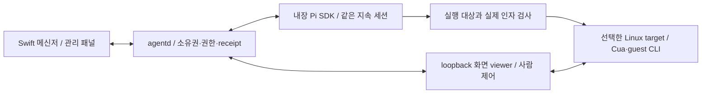

# Picky 로컬 컴퓨터 · OpenMaus 방식 적용안

- 작성일: 2026-09-13 (KST), [기획서 B 0.5](./picky-grok-bot-port-prd-b.md) §10의 구체화
- 범위: 소스·공식 문서 조사와 [B.04 컴퓨터 화면](./prototypes/picky-b-messenger/computer-settings.html). 제품 구현·설치·성능·격리 검증 결과가 아니다.
- OpenMaus 기준: `f4d562c2d811b9734ddbe8a2873a4cb94f51b747`. 이후 upstream 변경을 실행·검증했다고 주장하지 않는다.

## 1. 추천

**이 Mac에서는 Docker 기반으로 피클별 Linux 데스크톱을 분리하는 실험부터 한다.** OpenMaus의
고정 Cua 이미지·게스트 driver·봇별 target·제한된 mount·loopback viewer 구조를 참고한다.
새 hypervisor나 agent loop를 만들지 않는다. Pi SDK와 agentd가 실행·권한·소유권을 관리하고,
Computer 어댑터는 실제 화면·입력·게스트 실행의 경계를 맡는다.

이것은 Mac 안에 **별도의 Linux 화면·앱·브라우저 로그인·작업 파일 영역**을 두는 방법이다.
Mac 앱까지 복제하는 방법은 아니며, Docker Desktop의 모든 컨테이너는 기본적으로 하나의 Linux VM
안에서 실행된다. 피클별 전용 VM과 같은 강도로 설명하지 않는다. [D1]

현재 확인한 장비는 macOS **15.6.1, arm64, 메모리 48GiB**다. `docker` 실행 파일만 존재하며
`podman`, `container` 명령은 찾지 못했다. Docker daemon·context·라이선스 동의·이미지·실행 가능 여부는
조회하지 않았다. 메모리 숫자만으로 동시 실행 수나 화면 지연을 약속하지 않는다.

## 2. 어디까지 분리되는가

| 방식 | 분리되는 것 | 분리되지 않거나 별도 검증할 것 | 이번 판단 |
| --- | --- | --- | --- |
| 전용 브라우저 프로필 | 쿠키·로그인·브라우저 저장 데이터 | 같은 Mac 사용자 권한·다운로드·host 도구. OS sandbox가 아님 | 가벼운 웹 업무의 별도 provider |
| Docker/Podman의 피클별 Linux 컨테이너 | 데스크톱·process namespace·root filesystem·별도 browser profile | Linux VM/kernel 공유, 허용 mount 쓰기, 네트워크, host Pi 도구 | 우선 실험 후보. 이 Mac의 첫 후보는 Docker |
| Apple `container` | 컨테이너별 lightweight Linux VM | mount·network·host 어댑터 경계는 여전히 필요 | 현재 공식 지원 OS와 pinned OpenMaus 제약 때문에 기본안에서 제외 |
| 내 Mac 직접 제어 | 별도 환경이 아님 | 실제 로그인·앱·물리 화면을 공유. TCC와 단일 입력 소유권 필요 | 명시적 opt-in 경로, 격리라고 표시하지 않음 |
| 별도 macOS VM | macOS guest의 화면·앱·사용자 환경 | OS 이미지·배포·라이선스·디스크·복구·입력·권한 구현 | Mac 앱까지 격리가 필요할 때 후속 검토 |

Docker 공식 문서는 host 파일 공유 설정과 명시적인 bind mount를 통과한 파일만 컨테이너에
보인다고 설명한다. **mount한 폴더는 게스트에서 변경할 수 있다.** viewer를 loopback으로 묶는 것도
외부 웹·LAN·host 서비스로 나가는 통신을 제한하지 않는다. 네트워크 제한은 따로 강제·검증해야 한다. [D1]

Docker의 ECI는 VM 내부에서 컨테이너별 user namespace 등의 보호를 더하는 별도 기능이다.
기본 Docker 실행에 이미 적용됐다고 가정하지 않으며, 제품·배포 조건도 별도 확인한다. [D3]

## 3. 고정 OpenMaus 소스에서 확인한 것

| 코드 | 확인한 동작 | Picky에 가져올 때 주의할 점 |
| --- | --- | --- |
| `container-computer.ts` 28~106 | Cua XFCE multi-arch 이미지 digest, Driver `0.20.0`과 amd64/arm64 wheel hash 고정. Bot ID 해시로 target·폴더·컨테이너 식별 | 표시 이름으로 경로를 만들지 않음. 해당 pin의 arm64 지원 코드는 실기동 성공의 증거가 아님 [O1] |
| 118~198 | 파생 이미지와 supervisor-owned driver. Chromium/Chrome profile을 workspace 아래에 보존 | 사용자 Mac의 profile 복사가 아님. guest login 데이터도 비밀이므로 코드 결과·snapshot·package에 섞지 않음 [O2] |
| 477~657 | image·owner label, 안전 설정, durable workspace, driver version/health, 실제 screenshot을 확인해야 ready | process가 살아 있거나 포트가 열렸다는 이유만으로 준비 완료라고 표시하지 않음 [O3] |
| 660~755, 857~947 | viewer 6901만 loopback에 게시. 피클별 임의 host port, workspace 하나를 `/home/cua/workspace`에 RW mount | 공유 폴더는 실제 host 쓰기 권한이다. mount 검사는 실제 해석된 경로·symlink·추가 mount도 검증해야 함 [O4] |
| 781~947 | 4GiB 메모리·swap 상한, 2 CPU, 512 PID, 512MiB shm. cap drop 후 SETUID/SETGID, Podman에는 SYS_CHROOT 추가. privileged·host namespace·device 등 거부 | 숫자는 upstream 설정이지 Picky 측정값이 아님. 사용자 Docker daemon 기본값을 믿지 말고 inspect 결과로 확인 [O5] |
| 857~864 | Apple `container`의 pinned 어댑터는 고정 host port 문제로 피클별 target 생성을 거부 | upstream 코드에 runtime 이름이 있다고 봇별 GUI 기능이 동등한 것은 아님 [O5] |
| 966~1017 | image 준비 전 생성 거부, 소유 label 없는 컨테이너 제거 거부, 실행마다 VNC 비밀번호 생성 | 안전한 소유권 확인과 생성 단계 분리를 참고 [O6] |
| 781~788, 987~990 | 이 desktop 이미지는 stop 후 안전하게 resume할 수 없어 start를 거부하고 재생성을 요구 | 컨테이너 수명과 보존 폴더 수명을 구분. 창·process 상태의 완전 복원이라고 표시하지 않음 [O5][O6] |
| `container-mcp.ts` | runtime exec를 통해 guest Cua Driver MCP로 stdio 연결, 제어 gate 전달 | 도구 API가 있는 것만으로 host shell·다른 extension까지 guest로 이동하지 않음 [O7] |
| `computer-control.ts` | 사람 hold 중 봇 입력을 뒤로 queue하지 않고 거부. 봇 단위 in-memory hold/lease | 거부 원칙은 채택. Picky는 물리 Mac처럼 여러 봇이 공유하는 **실제 자원 ID**에도 lock을 걸어야 함 [O8] |

## 4. Picky에 연결할 구조

- Pickle의 Bot ID·고정 홈·Pi 세션과 `ComputerTarget` ID를 따로 둔다. 이름 변경·target 재생성은 새 봇·새 주 세션을 만들지 않는다.
- 처음부터 모든 봇에 컨테이너를 만들지 않는다. 사용자가 해당 환경의 준비를 허용했을 때 생성하고, 원 소유자의 target을 재사용한다.
- guest의 작업 영역과 browser profile을 분리 관리한다. host 전체 홈, Picky/Pi 인증·기억·session, SSH agent, Docker socket, Keychain, 평소 browser profile은 자동 mount하지 않는다.
- 외부 repo를 연결할 때 정확한 범위와 RW/RO를 별도로 허용한다. general chat에서 경로를 숨기는 것과 파일 권한 확인 화면에서 실제 허용 범위를 숨기는 것은 다르다.
- 격리된 요청의 shell·파일·GUI 작업은 guest 쪽으로 보내고, 다른 host tool·MCP·extension 경로로 우회할 수 없게 한다. 이를 강제하지 못하면 **Computer만 분리되고 host 코드 실행 권한은 별도인 상태**라고 표시한다. VM 선택만으로 Pi 전체를 sandbox했다고 주장하지 않는다.
- viewer는 loopback과 단기 비밀값으로 보호하고, native bridge나 Pi 명령 실행 권한을 임의 guest HTML에 주지 않는다. 비밀 viewer URL·환경값을 모델·대화·일반 로그에 남기지 않는다.
- GUI 입력마다 bot·실제 target·요청 generation·human lease·권한을 확인한다. 사람 제어, 연결 해제, 취소, target 교체 뒤 이전 입력을 거부한다. 반환 후 새 frame을 받은 뒤에만 입력한다.
- source의 browser lock 정리나 컨테이너 재생성을 그대로 실행하지 않는다. 다른 소유자의 live profile을 정리하지 않는지 확인하고, 작업 파일·로그인 데이터의 보존·삭제·백업을 구분한다.

루틴도 원래 봇의 mailbox와 현재 허용 범위를 사용한다. VM 안에 별도 Pi 세션·scheduler를 만들거나,
준비 실패 시 host Mac으로 몰래 바꿔 실행하지 않는다. 클라우드 모델·웹·MCP 전송이 있으면 로컬 GUI
환경이라고 해서 데이터가 Mac 밖으로 나가지 않는 것은 아니다.

## 5. OS·배포 판단

- Apple `container` 공식 README는 Apple Silicon과 **macOS 26** 지원을 명시하고 이전 OS를 지원하지 않는다. 이 Mac 15.6.1이나 Picky 최소 14.2를 조용히 올리지 않는다. 별도 선택 backend로 검증할 수는 있지만 현재 기본 의존성으로 삼지 않는다. [A1]
- Docker Desktop 공식 지원은 현재와 이전 두 macOS major release이며, 버전별 조건이 바뀐다. 이 Mac에서 설치된 실제 engine/version·arm64 이미지·권한을 확인한 뒤 실험한다. macOS 14.2의 제품 지원까지 자동으로 증명한 것은 아니다. [D2]
- Docker Desktop은 기업 규모·매출·용도에 따라 유료 구독이 필요하다. 개인 개발 머신의 설치를 전체 배포 라이선스로 간주하지 않는다. Podman은 대안 후보지만 이 장비에는 명령이 없고, 같은 이미지·mount·viewer·성능 검증이 필요하다. [D2]
- full macOS VM은 이번 Linux 경로가 아니다. Apple Virtualization API는 virtualization entitlement가 필요하다. 공식 안내는 다른 capability가 필요하지 않으면 App Sandbox entitlement를 제거할 수 있다고 명시한다. 따라서 App Sandbox를 가상화 자체의 필수 요건이라고 단정하지 않는다. 현재 서명·entitlement는 변경하지 않는다. [A2]
- OpenMaus OSS/enterprise 구분과 NOTICE, Cua 이미지·driver·포함 OS 패키지의 버전별 라이선스를 배포 전에 확인한다. 루트 OSS 라이선스만 읽고 이미지 전체의 재배포 조건을 확인했다고 주장하지 않는다. [O9]

## 6. 다음 기술 실험의 합격 조건

아래는 **아직 실행하지 않은 계획**이다. 사용자 허용 후 임시 데이터·전용 target에서 검증한다.
실행 중인 Picky나 사용자의 일반 Docker 컨테이너·browser profile을 실험 대상으로 쓰지 않는다.

1. Docker 준비 상태와 실제 arm64 image digest·driver를 확인한다. 허용한 target 하나만 만들고 GUI screenshot, browser 입력, guest 파일·CLI 결과가 같은 target에 귀속되는지 확인한다.
2. host 민감 영역·socket·추가 mount·host/LAN 서비스에 대한 거부 사례를 실행한다. network 정책이 없다면 그 경계를 미구현으로 표시한다. host extension 우회도 막혀야 격리된 요청이라고 부른다.
3. 두 target에서 파일·cookie·입력·로그인이 섞이지 않는지 확인한다. 물리 Mac 제어는 같은 화면을 동시에 잡지 못하게 한다. cold start, idle/active RAM·CPU, frame 지연을 측정하고 그 뒤 동시 실행 수를 정한다.
4. 사람 hold 중 입력 거부, 취소·재연결·target 교체의 stale 입력 거부, fresh-frame 복귀를 확인한다. preview 열람만으로 제어권을 잡지 않는다.
5. 컨테이너 재생성 전후 허용 파일·browser profile 보존과 ephemeral process 손실을 각각 확인한다. 제거는 원 소유자 target에만 적용하고 재생성으로 외부 효과를 재실행하지 않는다.
6. 준비 실패는 `설정 필요`로 남기고 host fallback을 거부한다. 실제 제품 bundle·최소 OS·라이선스·업데이트 조합을 별도로 검증한 후에만 설치 경로를 확정한다.

## 출처

[D1]: https://docs.docker.com/faqs/platform/#how-are-containers-isolated-from-the-host-in-docker-desktop
[D2]: https://docs.docker.com/desktop/setup/install/mac-install/
[D3]: https://docs.docker.com/enterprise/security/hardened-desktop/enhanced-container-isolation/
[A1]: https://github.com/apple/container/blob/main/README.md#requirements
[A2]: https://developer.apple.com/documentation/virtualization/adding-the-virtualization-entitlement-to-your-project
[O1]: https://github.com/milind-soni/OpenMausBot/blob/f4d562c2d811b9734ddbe8a2873a4cb94f51b747/server/container-computer.ts#L28-L106
[O2]: https://github.com/milind-soni/OpenMausBot/blob/f4d562c2d811b9734ddbe8a2873a4cb94f51b747/server/container-computer.ts#L118-L198
[O3]: https://github.com/milind-soni/OpenMausBot/blob/f4d562c2d811b9734ddbe8a2873a4cb94f51b747/server/container-computer.ts#L477-L657
[O4]: https://github.com/milind-soni/OpenMausBot/blob/f4d562c2d811b9734ddbe8a2873a4cb94f51b747/server/container-computer.ts#L660-L755
[O5]: https://github.com/milind-soni/OpenMausBot/blob/f4d562c2d811b9734ddbe8a2873a4cb94f51b747/server/container-computer.ts#L781-L947
[O6]: https://github.com/milind-soni/OpenMausBot/blob/f4d562c2d811b9734ddbe8a2873a4cb94f51b747/server/container-computer.ts#L966-L1017
[O7]: https://github.com/milind-soni/OpenMausBot/blob/f4d562c2d811b9734ddbe8a2873a4cb94f51b747/server/container-mcp.ts
[O8]: https://github.com/milind-soni/OpenMausBot/blob/f4d562c2d811b9734ddbe8a2873a4cb94f51b747/server/computer-control.ts#L1-L129
[O9]: https://github.com/milind-soni/OpenMausBot/blob/f4d562c2d811b9734ddbe8a2873a4cb94f51b747/LICENSING.md
