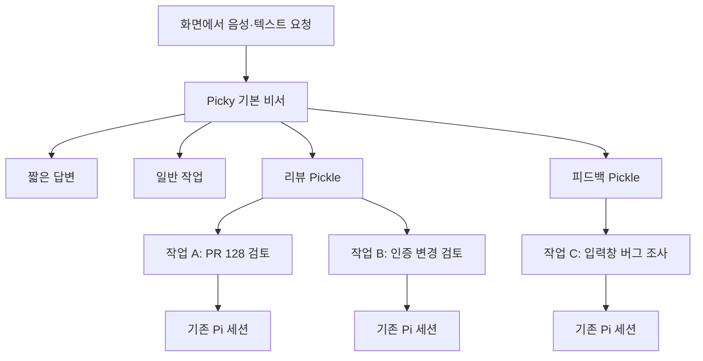

# Picky / Pickle 제품 정의와 봇 중심 MVP 기획서

- 문서 버전: 0.1
- 작성일: 2026-09-12 (KST)
- 상태: 제품 방향을 구체화한 제안. 구현 및 출시 승인 문서가 아니다.
- 현재 구현 기준: `ffa046d59`
- 대상: 제품 기획, UX 설계, 구현 범위 산정, 파일럿 검증

이 문서는 Picky를 **화면에서 일을 맡기는 로컬 AI 팀**으로 발전시키는 방향을 정리한다. 사용자와 논의한 방향을 바탕으로 작성했으며, 아래 P0 범위와 세부 정책은 MVP 제안이다. 현재 앱이 이미 이렇게 동작한다는 뜻은 아니다. 기존 `AGENTS.md`, 사용자 매뉴얼, 런타임 계약은 이번 문서 작성으로 변경하지 않는다.

## 1. 제품 결정 요약

> Picky는 지금 보고 있는 일을 AI 팀에게 맡기는 Mac 비서다.
> Pickle은 내 작업 방식을 기억하고, 같은 종류의 일을 계속 책임지는 담당자다.

현재의 `Pickle = Pi 세션`을 제품 관점에서 `Pickle = 지속형 담당자`, `작업 = 한 번 맡긴 일`로 분리한다. 실행은 기존 Pi 세션을 활용한다.

- 사용자는 봇 선택 화면보다 현재 하던 일에서 시작한다. 화면, URL, 선택 텍스트, 음성, 표시한 영역을 요청과 함께 전달한다.
- Picky는 기본 비서로 남는다. 간단한 일은 직접 처리하고, 명시적으로 선택하거나 확인한 Pickle에게 작업을 맡긴다.
- Pickle의 역할과 승인된 작업 방식은 다음 작업에 이어진다. 이전 작업의 대화 전체를 기본 입력으로 재사용하지 않는다.
- Hub는 담당자와 작업을 관리하는 곳, Dock은 작업 상태와 다음 행동을 확인하는 곳으로 사용한다.
- macOS, local-first, Pi 실행 기반을 유지한다. 새 SaaS 백엔드, VM 공급자, 모바일 앱, 멀티 런타임을 MVP에 추가하지 않는다.

**MVP가 증명할 질문:** 같은 Pickle에게 반복 업무를 다시 맡겼을 때 재설명은 줄고, 이전 작업의 맥락이 새 작업에 잘못 섞이지 않는가?

## 2. 사용자와 해결할 문제

### 초기 대상

| 사용자 | 자주 하는 일 | 현재 겪는 문제 | 기대 변화 |
| --- | --- | --- | --- |
| Pi를 쓰는 Mac 개발자·메이커 | 코드 검토, 피드백 조사, 기술 리서치 | 저장소, 기준, 출력 형식을 새 세션마다 설명 | 같은 담당자에게 새 입력만 전달 |
| 여러 일을 병행하는 개발 리드 | 조사·수정 초안 위임, 결과 검토 | 작업 세션이 늘면 담당·상태·확인 요청을 찾기 어려움 | 담당자별 작업과 확인 요청을 한눈에 구분 |

초기에는 이들이 쓰는 반복 업무를 검증한다. 전사 영업·채용·재무 자동화, 모바일 중심 사용자, 완전 무감독 운영은 대상이 아니다.

### 해결할 문제

1. 화면의 맥락을 AI에 옮기기 위해 URL, 텍스트, 이미지, 경로를 다시 정리해야 한다.
2. 잘 끝난 작업의 방법이 개별 세션 안에 남아 다음 작업에 재사용하기 어렵다.
3. 하나의 긴 세션을 계속 쓰면 작업 사이의 가정과 지시가 섞인다.
4. 여러 세션이 실행되면 작업 중인 것과 내 응답이 필요한 것을 구분하기 어렵다.

Picky는 이미 첫 번째 문제를 다룬다. 이번 MVP는 그 진입 경험을 유지하면서 나머지 문제를 해결한다. 봇 개수나 아바타 다양성은 성공 기준이 아니다.

## 3. 제품 개념과 책임

| 개념 | 제품 정의 | 남기는 정보 | 끝나는 시점 |
| --- | --- | --- | --- |
| Picky | 기본 비서이자 작업 접수·조정 창구 | 사용자와의 대화, 명시적인 공통 지침, 작업 참조 | 앱 사용 동안 기본 진입점으로 유지 |
| Pickle | 반복 가능한 업무를 맡는 지속형 담당자 | 이름, 역할, 기본 작업 위치·모델, 사용자가 확인한 작업 방식 | 사용자가 보관할 때 목록에서 제외 |
| 작업 | 목표와 결과가 있는 개별 의뢰 | 입력 맥락, 대화, 진행 상태, 질문·승인, 결과물 | 완료·실패·취소 후에도 이력 보존 |
| Pi 세션 | 작업을 실행하는 내부 단위 | 실행 대화, 도구 활동, 재개 정보 | 기존 실행·복구 정책을 따름 |
| Skill | 재사용 가능한 작업 방법 | 절차, 판단 기준, 결과 형식 | 작업이나 Pickle과 별개로 재사용 |
| Routine | 특정 담당자에게 일을 시작시키는 반복 실행 설정 | 일정·이벤트, 작업 입력, 담당자 | 사용자가 중지·제거할 때 종료 |

MVP에서는 작업 하나와 기존 Pi 세션 하나를 대응시킨다. 하나의 작업 안에서 follow-up과 steer는 가능하지만, 별개의 목표는 새 작업으로 시작한다. 하나의 작업이 여러 Pi 세션을 관리하는 별도 실행 계층은 만들지 않는다.

담당 Pickle이 없는 **일반 작업**도 허용한다. 단발성 업무를 위해 봇 생성을 강제하지 않으며, Picky의 짧은 답변마다 작업 레코드를 만들지도 않는다.

### 지속성에 관한 약속

- 지속되는 것은 담당자의 정체성과 저장된 작업 방식이다. Pickle마다 프로세스를 항상 실행하지 않는다.
- 현재 Picky 데몬은 앱 생명주기와 연결된다. 앱 종료, Mac 절전·종료, 네트워크 단절 중 작업 완료를 보장하지 않는다.
- local-first는 로컬 저장과 실행 제어를 뜻한다. 선택한 모델이나 외부 도구에 입력이 전달될 수 있으며, 오프라인 모델이나 데이터 완전 격리를 뜻하지 않는다.

## 4. 현재 구현과 변경 범위

| 영역 | 현재 확인된 상태 | MVP에서 바꿀 것 |
| --- | --- | --- |
| 입력 | PTT, Quick Input, 요청 시점 화면 맥락, 화면 표시 | 담당자·새 작업·기존 작업의 전달 대상을 명시 |
| 메인 에이전트 | 독립된 Picky 대화, 위임과 완료 보고 | 저장된 담당자를 조회하고 확인된 대상에게 새 작업 전달 |
| Pickle | 상태·대화·도구·결과물을 가진 Pi 세션 | 기존 구조는 작업으로 유지하고 지속형 프로필 연결 |
| Hub | Dashboard, Plugins, Recent Conversation, Settings 등 | `내 Pickles` 진입점과 담당자별 작업 목록 추가 |
| Dock | 세션 타일, 그룹, 미리보기, 보관·취소·입력 pin | 담당자 고정 항목과 개별 작업 항목을 구별 |
| 재사용 | Pi 지침·Skills, 선택 설치형 Memory·Cron 플러그인 | P0는 확인된 지침 재사용. 자동 기억·Pickle Routine 통합은 P1 |
| 질문·승인 | 확장 도구의 질문·확인 UI | 작업·요청별 귀속과 재접속 후 상태 보존 |

현재 Dock 그룹은 세션을 묶는 UI다. 공유 대화방이나 봇 협업 팀으로 간주하지 않는다. 그룹을 Pickle로 자동 변환하지 않는다.

근거: [현재 제품 정의](../README.md), [사용자 매뉴얼](./user-manual.md), [세션 스키마](../agentd/src/protocol.ts), [데몬 소유권](./per-pickle-daemon-topology.md).

## 5. 핵심 사용자 흐름

### A. 잘 끝난 작업에서 첫 Pickle 만들기

1. 사용자가 기존 방식으로 PR 검토 작업을 완료한다.
2. 결과 메뉴에서 **이 업무의 담당 Pickle 만들기**를 선택한다.
3. Picky가 이름, 담당 업무, 기본 폴더, 재사용할 지침의 초안을 보여준다.
4. 사용자가 검토·수정하고 **Pickle 저장**을 누른다.
5. 완료된 작업은 새 Pickle의 작업 이력에 연결한다. 대화 내용과 세션 ID는 바꾸지 않는다.
6. 다음 PR을 **새 작업**으로 맡기면 같은 검토 기준을 사용한다.

이전 프롬프트·대화·스크린샷·접근 권한을 통째로 복사하지 않는다. 추출된 지침은 확인 전에는 저장하거나 실행하지 않으며, 취소하면 프로필과 연결 모두 생성하지 않는다.

첫 생성은 완료된 일반 작업 또는 기존 작업에서만 제공한다. 이미 다른 Pickle이 담당한 작업을 이동하거나 프로필을 복제하는 기능은 P0에서 제외한다. 빈 프로필에서 직접 만드는 경로도 제공하되 초기 설정을 강제하지 않는다.

### B. 현재 화면의 일을 담당자에게 맡기기

1. 사용자가 피드백을 보면서 Picky를 호출한다.
2. 선택한 입력 대상과 요청 시점 맥락을 고정한다.
3. 사용자가 담당자를 명시했으면 해당 Pickle에 새 작업을 보낸다. Picky가 담당자를 제안했다면 사용자가 확인한 뒤 보낸다.
4. 작업 생성이 실제로 수락되면 `피드백 담당에게 맡겼어요 · 입력창 버그 조사`를 표시한다.
5. 사용자는 원래 앱에서 계속 일하고, 결과나 질문이 오면 해당 작업으로 돌아간다.

화면 내용은 중립적인 자료다. Swift UI가 Slack, GitHub 같은 앱 이름을 보고 담당자를 고르지 않는다. 의도 해석은 Pi가 맡고, 전달은 확정된 ID로 수행한다.

### C. 같은 Pickle에 서로 다른 일 맡기기

1. 리뷰 Pickle에서 PR A를 검토 중이다.
2. 사용자가 Pickle 상세의 **새 작업**으로 PR B를 보낸다.
3. 두 작업은 각각의 대화·상태·결과를 가진다. 새 작업은 기존 작업을 steer하지 않는다.
4. PR A 화면에서 보내는 후속 메시지는 PR A에만 들어간다.
5. 다음 작업에는 저장된 검토 기준이 적용되지만 PR A의 임시 가정이나 승인 결정은 전달하지 않는다.

동시 실행은 기존 세션 실행 능력을 사용한다. 같은 저장소나 외부 자원을 수정하는 작업을 안전하게 병렬화한다는 추가 보장은 하지 않는다.

### D. 질문·결과를 확인하고 다시 이어가기

1. 한 작업이 질문을 기다리는 동안 같은 Pickle의 다른 작업은 계속 실행할 수 있다.
2. 담당자에는 `진행 1 · 응답 필요 1`처럼 집계된 상태가 표시된다.
3. 질문을 열면 담당 Pickle, 작업 제목, 질문 또는 제안된 실행 대상이 보인다.
4. 답변·승인은 해당 요청에만 적용한다. 만료되거나 취소된 요청은 실행시키지 않는다.
5. 완료 결과에는 작업 링크와 확인 가능한 결과물·수행 내용이 남는다. 요약을 열었다고 질문이 해결된 것으로 처리하지 않는다.

## 6. MVP 우선순위

P0는 외부 파일럿에 필요한 범위다. P1은 반복 사용 효과를 확인한 뒤 추가한다. P2는 당장 일정에 넣지 않는다. 우선순위는 영향도와 의존성 기준이며 개발 기간 추정이 아니다.

### P0: 담당자를 다시 사용하는 경험

| ID | 기능 | 구체 범위 | 완료 기준 |
| --- | --- | --- | --- |
| P0-01 | Pickle과 작업 분리 | 지속형 프로필, 선택적 담당자 연결, 작업과 기존 세션의 대응 | 같은 담당자에 두 작업을 저장·재접속해도 대화·상태·결과가 섞이지 않음 |
| P0-02 | Pickle 생성·편집·보관 | 이름·업무·폴더·지침, 기본 모델·추론 설정, 작업에서 생성, Dock 고정 | 검토 후에만 프로필이 생성되고 편집 사항은 다음 작업부터 적용됨. 보관해도 이력 유지 |
| P0-03 | 새 작업과 지침 재사용 | 작업 생성 시 프로필 버전 스냅샷, 독립 대화, 일반 작업 허용 | 이전 작업의 임시 내용 없이 저장된 기준으로 다른 입력을 처리. 기존 작업의 모델 변경은 계속 가능 |
| P0-04 | 명시적 전달·후속 입력 | PTT·Quick Input·직접 입력의 대상 표시, Pi를 통한 확인형 위임, 수락 확인 | 요청 중 선택이 바뀌어도 원래 대상에 한 번만 전달. 실패를 성공으로 표시하지 않음 |
| P0-05 | 담당자별 작업 UI | Hub의 내 Pickles, 작업 목록·상세, 일반·기존 작업 목록, Dock 집계 | 실행·응답 필요·미확인 결과를 구별하고 정확한 작업으로 이동. 로그·도구·결과물 접근 유지 |
| P0-06 | 질문·승인·중단 귀속 | 기존 질문·확인 UI와 취소의 작업별 연결 | 승인·답변이 다른 작업에 적용되지 않음. 중단 후 늦게 온 요청으로 실행이 재개되지 않음 |
| P0-07 | 이전 데이터·재접속 호환 | 기존 ID·기록·그룹·입력 pin 보존, 프로필 연결 복원, 수락 중복 방지 | 기존 세션을 계속 열고 재개할 수 있음. 재접속·재전송으로 작업·알림·승인 실행이 중복되지 않음 |

P0-01·07의 데이터 및 ID 계약을 먼저 정한다. P0-02·03 위에 P0-04를 연결하고, P0-05·06까지 같은 작업 ID로 이어져야 MVP가 된다. 프로필 화면만 완성한 상태를 MVP 완료로 보지 않는다.

### P1: 검증된 업무의 재사용 확대

| 기능 | 추가할 내용 | P0에서 미루는 이유 |
| --- | --- | --- |
| 기억 제안·검토 | 작업에서 얻은 장기 지침의 출처 표시, 승인·수정·삭제, 다음 작업 반영 | 자동 기억이 섞이기 전에 명시적 지침의 가치부터 검증 |
| Skill 연결 | 기존 Pi Skill을 담당 업무에 연결하고 필요 조건·변경을 표시 | 새 Skill 포맷이나 마켓플레이스를 만들 필요 없음 |
| Pickle Routine | 검증된 입력으로 일정 실행, 일시정지, 실행 이력·실패 표시. Pi Cron 연동 가능성 검증 후 재사용 | 저장된 일정과 실제 실행 주체의 생명주기를 먼저 확인해야 함 |
| 확인 횟수 줄이기 | 사용자가 저장한 좁은 위임 규칙으로 반복 선택 생략 | 대상이 잘못 선택되는 사례를 먼저 수집 |
| 목적이 있는 봇 간 위임 | 작업 범위·근거·결과·종료 조건을 가진 인계, Picky의 결과 취합 | 자유 대화보다 중복 작업과 비용을 통제하기 쉬움 |
| 프로젝트 공통 맥락 | 여러 담당자가 명시적으로 참조하는 프로젝트 지침 | 담당자 맥락과 작업 맥락의 분리부터 검증 |

### P2 및 MVP 비목표

- 봇들끼리 자유롭게 대화하는 채널, 자동 조직도, 무제한 재위임.
- Bot별 클라우드 컴퓨터, VM 공급자 연결, 원격 상시 worker.
- Claude CLI·Codex CLI 등 Pi 외의 여러 agent runtime 어댑터.
- 모바일 companion, 기업 계정·결제·SSO, 외부 원격 분석.
- 화면 시연 녹화로 Skill 만들기, 봇·팀 공유 마켓플레이스.
- 자동 프로필 생성, 대화 전체를 기억으로 흡수, 감정·친밀도 시스템.
- 기존 Hub, 디자인 토큰, 아바타 모션 체계의 전면 교체.

기존 플러그인 기능은 제거하지 않는다. 예를 들어 설치된 Cron은 계속 쓸 수 있지만, Pickle 소유 Routine으로 자동 편입하거나 실행 보장을 확대하지 않는다.

## 7. P0 기능 정책

### 프로필과 작업 방식

필수 입력은 이름, 담당 업무, 기본 작업 폴더다. 폴더는 원본 작업이나 현재 기본 설정으로 미리 채운다. 모델·추론 수준은 현재 Pickle 기본 설정을 상속할 수 있고, 확인된 지침은 없어도 된다. 아바타는 기존 표현을 재사용한다.

- 프로필을 생성하는 것만으로 작업, 플러그인 설치, 인증, 파일 수정이 시작되지 않는다.
- 폴더가 없거나 모델을 사용할 수 없으면 실행 전에 이유와 변경 방법을 표시한다. 다른 경로나 모델로 조용히 대체하지 않는다.
- P0의 기억은 **사용자가 저장한 작업 지침**이다. 별도 Memory 플러그인 설치를 필수로 만들지 않는다.
- 작업 생성 시 사용한 프로필 버전, 지침, 폴더, 모델 설정을 기록한다. 프로필 편집은 진행 중인 작업을 바꾸지 않는다.
- 기존 Pi 사용자·프로젝트 지침은 계속 적용한다. 프로필은 그 지침이나 실행 권한을 우회하는 수단이 아니다.
- P0의 격리 약속은 대화·작업 상태의 분리다. 기존 Pi 메모리·도구·파일은 별도 범위에 따라 공유될 수 있다. Pickle별 메모리 보안 격리를 약속하지 않는다.
- Pickle 보관은 실행·대기·미해결 질문이 있는 작업이 없을 때만 허용한다. 고정 해제는 언제든 가능하며 작업을 중단하거나 숨기지 않는다. Pickle 영구 삭제는 P1 이후로 미룬다.

### 입력과 라우팅

| 입력 위치·의도 | 동작 |
| --- | --- |
| Picky 기본 입력 | 기본 비서가 수신. 짧은 답변, 일반 작업, 담당자 제안 중 판단 |
| Pickle 상세의 `새 작업` | 해당 Pickle에 독립 작업 생성 |
| 특정 작업의 composer | 해당 작업에 기존 follow-up·steer 규칙으로 전달 |
| `이 작업에 다음 입력 보내기` | 한 번의 입력에만 적용. 성공적으로 수락되면 해제 |
| `이 작업에 입력 고정` | 명시적으로 해제할 때까지 같은 작업 대상 유지 |
| Picky가 제안한 담당자 | 담당자·작업 요약을 확인한 뒤 전달. 명시되지 않은 봇을 자동 생성하지 않음 |

입력 시작 시 `Picky`, `Pickle에 새 작업`, `기존 작업` 중 선택한 대상을 고정한다. Picky가 수신 후 위임하면 별도의 확인된 전달로 기록한다. 입력에 다른 담당자 이름이 등장해 고정 대상과 충돌하면 Pi가 확인하고, 앱이 문자열로 대상을 바꾸지 않는다.

같은 Pickle에 실행 중인 작업이 하나뿐이어도 Pickle 상세의 새 입력을 기존 작업에 자동 합치지 않는다. 작업을 제출한 뒤에는 그 작업 상세로 이동하여 후속 입력의 대상이 분명해지게 한다.

각 전달은 요청 ID와 확정된 대상 ID로 추적한다. 재전송은 기존 수락 결과를 돌려주며 새 작업을 만들지 않는다. 대상이 보관·삭제되거나 연결이 끊기면 실패를 표시하고, Picky나 다른 작업으로 자동 우회하지 않는다.

### 화면 맥락과 결과

- 화면·URL·선택 텍스트·표시 영역은 사용자가 요청한 순간에만 수집한다. 현재 화면 제외·스크린샷 설정을 존중한다.
- 원본 맥락은 작업에 귀속한다. 프로필을 만들었다는 이유로 원본 화면을 장기 기억에 저장하지 않는다.
- 완료 요약은 원래 작업과 결과물에 연결한다. 결과물을 읽거나 검증하지 않았다면 검증됐다고 표시하지 않는다.
- 프로필 연결 때문에 임시 스크린샷이나 기존 결과물의 보존 기간이 영구 보관으로 바뀌지 않는다. 사라진 원본은 이용 불가로 표시한다.

### 질문·승인과 실제 권한

프로필의 `발송 전에 물어보기` 같은 문구는 업무 지침이며 강제 보안 정책이 아니다. P0-06은 기존 실행 경로가 발생시킨 질문·승인을 정확한 작업에 연결하는 기능이다. 모든 도구 호출에 대한 독립 위험 판별 엔진을 추가하는 범위가 아니다.

- 승인에는 담당자, 작업, 요청 ID, 제안된 대상과 효과를 표시한다. 일회성 승인을 다른 작업이나 미래 요청에 재사용하지 않는다.
- Pin, 모델 선택, 프로필 생성, 기억 저장은 권한을 넓히지 않는다.
- 취소되거나 만료된 승인 응답은 거부한다. 재접속 후 이미 처리된 승인을 다시 실행하지 않는다.
- 연결 중단 때문에 외부 실행 여부를 알 수 없으면 `실행 결과 확인 필요`로 멈춘다. 원본 시스템에서 결과를 확인하기 전에는 재실행하지 않는다. 모든 외부 도구가 exactly-once 실행을 보장한다고 가정하지 않는다.
- 외부 발송·게시·구매·배포를 승인 후 실행하는 경험은 실행 계층이 실제로 막고 기다리는 경로에서만 지원한다고 표시한다. 지원하지 않는 도구를 승인 안전성이 있는 자동화로 소개하지 않는다.
- 파일럿은 읽기·조사·초안·검토를 중심으로 한다. 위험한 외부 변경은 검증된 승인 경로 또는 사용자의 직접 실행으로 제한한다.
- 로컬 Pi, credential, MCP, 파일의 접근 권한은 별개다. Pickle ID, 작업 폴더, 별도 daemon은 보안 sandbox가 아니다.

## 8. UI 기획

### Design Decision Card

- 사용자 목표: 담당자를 다시 사용하면서 진행 중인 작업과 필요한 응답을 놓치지 않는다.
- 대상 화면: Hub의 내 Pickles, Dock, 작업 상세, PTT·Quick Input의 수신 대상 표시.
- 첫 시선 정보: 누구에게 맡긴 어떤 일인지, 내 응답이 필요한지, 다음에 무엇을 할 수 있는지.
- 주요 행동: 새 작업 맡기기, 특정 작업 열기, 질문에 답하기.
- 보조 행동: 프로필 편집·고정·보관, 도구 이력·결과물 확인.
- 상태 의미: Pickle은 하위 작업을 집계하고, 작업은 실제 실행 상태를 가진다. 연결 상태는 실행 상태와 분리한다.
- 디자인 기반: 기존 `DS`, `PickyHUDTypography`, Action Blue와 semantic status 재사용. 새 토큰·모션 시스템을 이 MVP에서 정의하지 않는다.
- 접근성: 상태를 색·애니메이션만으로 표현하지 않는다. VoiceOver가 담당자·작업·응답 필요 수를 읽을 수 있고, 키보드만으로 같은 작업에 접근할 수 있어야 한다.
- 유지할 동작: light/dark, Reduce Motion, 글자 크기, IME 입력, 멀티 디스플레이, 명시적 입력 pin, 로그·결과물·질문 접근.
- 위험: 담당자와 작업이 비슷하게 보여 잘못 선택하거나, 상태 집계가 질문을 숨기거나, Dock 정렬이 작업 도중 바뀌는 문제.

### Hub

`내 Pickles`를 추가하고 나머지 탐색 구조는 가능한 한 유지한다. 기존 메인 대화는 Picky 기본 비서 대화로 남는다.

- 목록에는 이름, 담당 업무 한 줄, 진행 작업 수, 응답 필요 수, 미확인 결과를 표시한다.
- 처음에는 빈 목록과 `Pickle 만들기`, `기존 작업에서 만들기`를 보여준다. 기본 봇 여러 개를 자동 생성하지 않는다.
- 상세 상단에는 역할 요약과 `새 작업`, 아래에는 `응답 필요 → 진행 중 → 최근 완료` 순서의 작업 목록을 둔다.
- 프로필 설정은 보조 화면에 둔다. 작업을 열면 기존 대화·도구·로그·결과물 UI로 진입한다.
- `일반·기존 작업` 진입점을 제공해 담당자 없는 작업도 찾고 재개할 수 있게 한다.

### Dock

- 고정된 Pickle은 재사용 진입점이다. 실행 중인 개별 작업은 현재처럼 빠르게 접근할 수 있어야 한다.
- 담당자 항목은 이름과 집계, 작업 항목은 제목과 개별 상태로 구별한다. 이름 변경이나 새 결과 때문에 기존 항목의 순서를 자동 재배치하지 않는다.
- 담당자를 클릭하면 작은 작업 목록을 열고, 작업을 선택하면 기존 conversation card를 연다. Hub 이동을 강제하지 않는다.
- `+`의 기존 일반 작업 생성과 폴더 선택을 보존한다. 반복 사용을 위해 프로필을 만들도록 강제하지 않는다.
- 담당자 메뉴와 작업 메뉴의 보관·중단 대상을 명시한다. 담당자 고정 해제를 작업 보관이나 일괄 취소로 해석하지 않는다.

### 상태와 예외

| 상태·조건 | 표시와 행동 |
| --- | --- |
| Pickle에 작업 없음 | `대기 중`, 새 작업 가능 |
| 작업 queued / running | 대기·실행 중 구분, 취소 가능 여부 표시 |
| waiting_for_input | `응답 필요`, 질문·승인으로 바로 이동 |
| blocked / failed | 원인과 가능한 다음 행동. 일반 완료처럼 접지 않음 |
| completed / cancelled | 실제 결과를 구별. 새 후속 입력은 기존 세션 규칙으로 처리 |
| 여러 상태가 공존 | `진행 2 · 응답 필요 1`처럼 병렬 표시. 개별 상태는 작업에서 확인 |
| 완료 결과 미확인 | 읽지 않은 결과 표시. 읽음과 승인·해결은 서로 다른 상태 |
| 연결 끊김 | `연결 끊김 · 마지막 확인 시각`, 완료·실행 중으로 새로 추정하지 않음 |
| hover / pressed / selected | 기존 상태 표현과 레이아웃 유지, 이름·작업 제목 tooltip 제공 |
| 키보드·비활성 | 포커스 순서와 대상 유지, 실행 불가 이유 표시 |

보관된 작업이 나중에 유효한 질문을 받으면 활성 질문이 이력 속에 숨지 않게 응답 필요 목록에서 접근시킨다. 닫거나 보관했다는 사실만으로 질문을 답변한 것으로 처리하지 않는다.

## 9. 데이터·호환성 원칙

### 최소 데이터 책임

| 데이터 | P0에서 필요한 정보 | 주의점 |
| --- | --- | --- |
| Pickle 프로필 | 안정적인 ID, 이름, 역할, 폴더·모델 기본값, 확인된 지침, 버전, 보관 여부 | 비밀번호·인증 token·작업 transcript를 넣지 않음 |
| 작업 연결 정보 | 기존 세션 ID, 선택적 Pickle ID, 생성 시 프로필 스냅샷·버전 | 이름이 아니라 ID로 연결. 기존 기록을 소급 변경하지 않음 |
| 요청·수락 정보 | 요청 ID, 선택한 대상 종류·ID, 작업 ID, 수락·실패 결과 | 중복 전달과 잘못된 대상 전환 방지 |
| 질문·결과 참조 | 작업 ID, 요청·결과 식별자, 처리·읽음 상태 | UI에서 재구성한 문자열로 실행 대상을 판단하지 않음 |

세부 schema와 저장 파일 형식은 구현 설계에서 정한다. 저장·실행 상태는 agentd가 소유하고 앱은 투영된 상태를 표시한다. 앱과 daemon에 독립적인 담당자 매칭·작업 소유권 로직을 중복 구현하지 않는다.

### 기존 사용자 전환

1. 기존 세션은 ID, 대화, 로그, 결과물, Pi 파일 경로, 보관 여부를 유지한다. 과거 세션 안의 여러 업무를 소급해서 분할하지 않는다.
2. 처음에는 담당자 없는 기존 작업으로 노출한다. 세션마다 Pickle을 자동 생성하지 않는다.
3. 사용자가 완료된 기존 작업에서 새 Pickle을 만들 때만 해당 프로필을 연결한다. 다른 세션을 자동 편입하지 않는다. 원본 작업에 새 지침이 소급 적용됐다고 표시하거나 당시 실행 설정을 덮어쓰지 않는다.
4. 기존 Dock 그룹은 작업 그룹으로 유지한다. 번호 단축키·세션 pin의 대상 ID를 새 프로필 ID로 바꾸지 않는다.
5. 기존 `picky pickle-*` CLI와 Pi handoff는 MVP 동안 기존 세션 의미를 유지한다. 새 프로필 기능은 별도 명령 계약을 설계해 이름 혼동을 막고, 사용자 UI에서는 작업으로 안내한다.
6. 저장 형식은 구 데이터 읽기와 중단 후 재시도가 가능해야 한다. 새 UI를 비활성화해도 작업·연결 정보는 삭제하지 않는다. 구버전 앱으로의 downgrade 호환성은 별도 검증 없이 보장하지 않는다.

현재 primary/child daemon 소유권을 Pickle 프로필 수명과 혼동하지 않는다. 수동 생성 작업의 child는 계속 단일 실행 세션을 소유하고, 프로필을 추가했다고 여러 작업을 같은 child에 밀어 넣지 않는다.

## 10. 구현 순서와 산출물

| 단계 | 범위 | 완료 증거 |
| --- | --- | --- |
| 1. 용어·데이터 계약 | P0-01·07, 프로필과 작업 ID 구분, 이전 데이터 읽기, 요청 중복 처리 | 기존 기록을 새 작업 목록에서 열고 같은 Pi 세션을 재개 |
| 2. 담당자 재사용 | P0-02·03, 생성·편집·보관, 지침 스냅샷, 새 작업 | 같은 Pickle의 두 작업이 서로 다른 입력·대화를 가지고 같은 확인 지침을 사용 |
| 3. 화면에서 위임 | P0-04, 대상 고정, Picky의 확인형 위임, 수락 확인 | PTT·Quick Input에서 확정된 작업에 한 번만 전달되고 결과까지 연결 |
| 4. 상태와 안전한 복귀 | P0-05·06·07, Hub·Dock 집계, 질문·승인·취소·재접속 | 여러 작업 중 정확한 질문에 답하고 재접속 후 같은 결과로 복귀 |
| 5. 파일럿 | P0 전체와 기존 사용 흐름 회귀 확인 | 아래 출시 기준과 반복 사용 관찰 결과 확보 |

관련 코드 진입점은 `agentd/src/protocol.ts`, `session-store.ts`, `session-supervisor.ts`, `application/main-agent-coordinator.ts`, Swift protocol/client router, `PickySessionViewModel`, Hub, HUD, Companion/Quick Input이다. 이것은 변경 후보 지도이며 전부 리팩터링하라는 목록이 아니다.

구현 전에 확인할 사항은 프로필별 Pi 지침 주입 위치, 기존 Memory의 공유 범위, 실행 계층의 승인 지원 도구, 기존 CLI와 새 프로필 명령의 구분이다. 이 확인으로 P0 경계가 달라지면 먼저 이 문서를 갱신한다. 임의로 별도 scheduler, runtime adapter, 메모리 엔진을 만들지 않는다.

## 11. 수용 기준과 검증

아래는 향후 구현 검증 계획이다. 이번 기획서 작성에서 제품 테스트를 실행했거나 통과했다는 의미가 아니다.

| 시나리오 | 관찰할 최종 결과 | 우선 검증 경계 |
| --- | --- | --- |
| 프로필 저장·다음 작업 | 검토한 지침과 기본값만 다음 작업에 사용되고 원본 대화는 별도로 남음 | agentd 실제 생성·저장 경로 |
| 같은 Pickle의 두 작업 | 각 작업의 대화·결과·질문·취소가 독립. 이어하기는 선택한 작업에만 반영 | agentd lifecycle + Swift 작업 투영 |
| 입력 중 대상 변경 | 시작 시 고정한 대상의 저장된 대화에 정확히 한 번 기록. 다른 작업에는 없음 | Swift 입력 orchestration → protocol → store |
| 수락 응답 유실·재접속 | 같은 요청 재시도 후 기존 작업 ID를 반환하고 중복 실행하지 않음 | WebSocket·store·runtime 통합 |
| 승인 후 늦은 응답·취소 | 원래 요청만 처리하며 만료·취소된 요청은 외부 효과를 만들지 않음 | 승인 bridge·runtime 외부 경계 |
| 외부 실행 도중 연결 중단 | 실행 여부를 확정할 수 없으면 확인 필요 상태로 남고 자동 재실행하지 않음 | runtime·외부 서비스 경계 |
| 혼합 상태의 Dock | 응답 필요 작업이 진행 상태에 묻히지 않고 선택하면 그 질문을 열음 | 실제 이벤트 경로의 Swift projection + UI 확인 |
| 이전 데이터·프로필 보관 | 세션 ID·파일·로그·입력 pin·그룹 유지. 보관한 담당자의 작업 이력 접근 가능 | migration·재접속 경로 |
| 프로필 변경·원본 만료 | 진행 작업의 스냅샷은 유지되고 만료된 화면·결과물을 있다고 표시하지 않음 | 저장·결과 표시 경로 |

- Swift/TypeScript protocol 변경은 양쪽 모델과 공용 fixture를 함께 검증한다.
- 핵심 상태·저장·라우팅 코드는 실제 구현을 사용하고 모델 runtime·외부 서비스만 fake로 둔다. helper 결과만으로 전체 전달 성공을 주장하지 않는다.
- UI는 키보드, IME, light/dark, Reduce Motion, 여러 작업과 멀티 디스플레이를 확인한다. HUD 성능은 실제 변경 범위에 맞게 측정하고 빌드 성공으로 대신하지 않는다.
- 테스트는 임시 데이터와 격리된 runtime을 사용한다. 실행 중인 사용자 앱을 임의로 종료·재시작하지 않는다. WindowServer 의존 자동 검증은 기존 격리 정책을 따른다.

### 파일럿과 출시 판단

제안 규모는 테스터 5명, 각자 반복 업무 1종을 서로 다른 입력으로 3회 수행하는 것이다. 수치와 기간은 실측 성과가 아니라 초기 검증 설계다.

| 지표 | 측정 방법 | 초기 목표 |
| --- | --- | --- |
| 재설명 감소 | 폴더·업무 기준·출력 형식처럼 반복 입력한 항목을 1회차와 3회차 비교 | 5명 중 4명 이상 감소 |
| 자발적 재사용 | 2·3회차에 기존 Pickle을 선택했는지 관찰 | 5명 중 4명 이상 재사용 |
| 작업 구분 | 서로 다른 두 결과와 한 질문을 올바른 작업에서 찾는지 관찰 | 모든 테스터가 혼동 없이 수행 |
| 안전·보존 | 잘못된 대상 전달, 승인 오귀속, 기록 유실, 중복 외부 실행을 기록 | 출시 차단 사례 0건, 위 수용 시나리오 모두 충족 |
| 설정 부담 | 첫 프로필 생성의 막힘·중도 포기·불필요한 설정을 관찰 | 모델·플러그인·VM 설정 없이 기존 환경에서 첫 재사용 완료 |

동일 입력 재실행 속도나 성공률만 측정하지 않는다. 새로운 입력에도 담당자의 방법이 유용한지가 핵심이다. 사용량은 가능한 기존 로컬 통계를 참고하고, 평가는 테스터가 확인한 로컬 기록으로 남긴다. 원문 대화나 화면을 원격 분석 서비스로 전송하지 않는다.

파일럿에서 잘못된 대상 전달, 승인 오귀속, 작업 데이터 유실이 나오면 기능 추가보다 수정이 먼저다. 작은 파일럿에서 사고가 없었다고 모든 도구의 안전성을 입증했다고 표현하지 않는다.

## 12. 주요 위험과 대응

| 위험 | 대응 |
| --- | --- |
| 프로필만 늘고 반복 사용되지 않음 | 사전 제작 봇을 늘리지 말고 실제로 끝난 작업에서 생성하는 경로를 우선 |
| 긴 대화가 사실상 전역 기억이 됨 | P0는 확인된 지침만 재사용. 작업 대화 분리, 공유 Pi 메모리 범위 명시 |
| Picky의 담당자 판단이 틀림 | 명시 대상 우선, 제안 위임은 확인, 전송 대상·수락 결과 노출 |
| 담당자와 작업을 같은 메뉴로 취급 | 생성·보관·중단·입력 대상 문구를 분리하고 기존 ID 의미 유지 |
| 여러 작업이 같은 로컬 파일을 수정 | 병렬 세션을 sandbox로 홍보하지 않음. 기존 작업별 폴더 정책 유지, 공유 자원 충돌은 별도 실행 설계로 다룸 |
| 단순화하면서 도구·오류·질문을 숨김 | 기본 화면은 요약하되 원래 작업과 전체 근거를 항상 열 수 있게 유지 |
| Routine·모바일 요구로 범위 확대 | P0 재사용 효과 확인 뒤 판단. 현재 앱·호스트 생명주기 제약 표시 |
| 프로필 생성 문구가 권한 보장처럼 읽힘 | 업무 지침과 실행 권한 구분. 검증되지 않은 승인·격리 약속 금지 |

## 13. 참고 자료와 적용 원칙

### 현재 Picky의 근거

- [README](../README.md): 현재 Picky/Pickle 정의와 화면 맥락 진입 경험.
- [User Manual](./user-manual.md): Hub, Dock, 작업 제어, Plugins, Memory·Cron 연결.
- [Protocol](../agentd/src/protocol.ts): 기존 세션과 상태·질문·결과물 모델.
- [Per-Pickle daemon topology](./per-pickle-daemon-topology.md): primary/child 수명과 세션 소유권.
- [Design System](../design/DESIGN.md): Activity first, quiet chrome, explicit state, native behavior.
- [Desktop test isolation](./test-desktop-isolation.md), [HUD profiling](./perf-profiling.md): 향후 구현 검증 제약.

### 외부 제품에서 참고한 것

- [Grok Bot 공식 디자인 글](https://x.ai/news/designing-grok-bot): 대화 기록 대신 지속형 담당자를 중심에 놓기, 필요한 순간만 자세한 실행 표시.
- [Grok Bot 컴퓨터와 앱 문서](https://docs.x.ai/grok-bot/computer-and-apps): 역할 구분과 실제 컴퓨터·credential 격리는 다르다는 점.
- [OpenMausBot README](https://github.com/milind-soni/OpenMausBot/tree/2f91c462926bee70242c42a4e3443b19d0a13a0c): 봇 중심 UI, 로컬 제어, 사용자 모델 선택, 작업 맥락 구분.

외부 자료는 제품 패턴의 참고다. 공개 데모나 저장소 기능 목록을 실제 운영 신뢰성의 증거로 사용하지 않는다. Picky는 메신저 외형이나 클라우드 컴퓨터를 복제하기보다 **현재 화면에서 요청하고, 같은 담당자를 다시 쓰고, 개별 작업으로 돌아오는 경험**을 먼저 완성한다.
