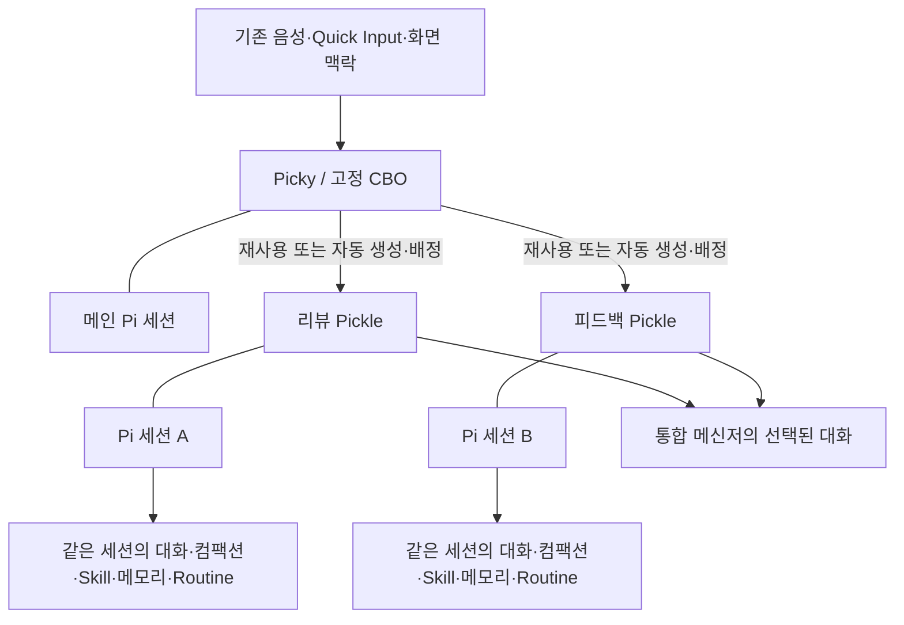

# Picky / Pickle 제품 정의와 봇 중심 MVP 기획서

- 문서 버전: 0.3
- 수정일: 2026-09-12 (KST)
- 상태: 핵심 제품·세션 원칙 확정, 세부 MVP 범위는 제안. 구현 및 출시 승인 문서가 아니다.
- 현재 제품 구현 기준: `ffa046d59`
- 이전 기획 버전: `f493ed31b`의 0.2
- 대상: 제품 기획, UX 설계, 구현 범위 산정, 파일럿 검증

이 문서는 Picky를 **현재 하던 자리에서 대화로 일을 맡기는 로컬 AI 팀**으로 발전시키는 방향을 정리한다. 0.3은 사용자가 확정한 CBO 역할, Pickle당 단일 Pi 세션, 통합 메신저를 기준으로 이전 기획을 수정한다. 새 기능이 이미 구현됐다는 뜻은 아니다. 기존 `AGENTS.md`, 사용자 매뉴얼, 런타임 계약은 이번 문서 작성으로 변경하지 않는다.

## 1. 확정된 제품 원칙

> Picky는 팀을 운영하는 고정 CBO다.
> Pickle은 각각 하나의 Pi 세션으로 살아가는 봇이다.
> 사용자는 지금처럼 입력하고, 메신저에서 담당자와 대화한다.

| 항목 | 확정 방향 |
| --- | --- |
| Grok Bot과의 대응 | Grok Bot의 개별 봇 하나가 Pickle 하나에 대응 |
| Picky의 역할 | 고정 CBO(Chief Bot Officer). 일반 Pickle에 CBO 역할을 선택 부여하는 방식이 아님 |
| 팀 구성 | 기존 Pickle을 우선 재사용하고, 필요하면 Picky가 자동 생성·역할 배정 |
| 세션 | **Pickle 하나당 지속형 Pi 세션 하나**. 의뢰마다 세션을 만들지 않음 |
| 장기 작업 방식 | 같은 세션 안에서 컴팩션·스킬화·메모리·루틴 관리 |
| 입력 | 기존 음성·PTT·Quick Input·화면 맥락·명시적 입력 대상 기능 유지 |
| 주 대화 화면 | 왼쪽 Picky/Pickle 목록, 오른쪽 선택한 대화가 있는 통합 메신저 창 |
| Dock | 상태 확인과 메신저 진입. 별도의 작은 대화 카드를 주 화면으로 병행하지 않음 |
| 도구 호출 | 일반 호출은 기본적으로 숨김. 중요한 승인·질문·실패·외부 효과·결과는 노출 |

### 0.2에서 폐기하는 가정

- 한 Pickle의 대화 뒤에 의뢰별 Pi 세션을 여러 개 두는 구조.
- 새 의뢰마다 독립 실행 세션을 생성하고 UI에서만 하나의 봇처럼 합치는 구조.
- Pickle과 세션 사이에 별도의 다중 작업 실행 관리 계층을 추가하는 계획.
- 새 Pickle을 만들 때마다 사용자가 생성 제안을 수락해야 한다는 정책.
- 작업별 대화 카드와 통합 메신저를 동등한 주 화면으로 운영하는 계획.

0.2의 인지부하 감소 원칙은 유지한다. 사용자는 모델·폴더·세션·queue 모드를 매번 고르지 않는다. 내부 실행을 단순하게 보이게 하되 권한, 취소, 기록, 오류를 없애지 않는다.

## 2. 사용자와 제품 약속

초기 대상은 Mac에서 Pi를 쓰는 개발자·메이커와 여러 업무를 병행하는 개발 리드다. 기존 Pi 환경을 재사용하되 일상적인 의뢰에서 runtime 운영 지식을 요구하지 않는다.

| 하고 싶은 일 | 사용자가 하지 않아도 될 일 | 제품의 책임 |
| --- | --- | --- |
| 보고 있는 피드백 조사 | 담당자 생성·배정, 관련 맥락 복사 | Picky가 기존 담당자를 찾거나 만들고 의뢰 전달 |
| 같은 담당자에게 다른 일 추가 | 새 세션 생성, 진행 중 세션 선택 | 같은 세션에 입력을 전달하고 대기·후속 흐름 관리 |
| 방금 결과 수정 | follow-up·steer 모드 선택 | 결과 참조와 의도를 바탕으로 같은 세션에서 이어가기 |
| 다음부터 같은 방식 사용 | 별도 기억·Skill 저장소 설정 | 해당 Pickle이 Pi 안에서 업무 방식 관리 |
| 중요한 행동 승인 | 도구 로그에서 대상과 효과 재구성 | 관련 내용과 정확한 실행 대상을 함께 표시 |

성공 질문은 다음과 같다.

**사용자가 세션이나 작업 모드를 배우지 않고 담당자에게 계속 일을 맡길 수 있으며, Picky가 팀 구성과 조율을 대신하는가?**

첫 모델 인증, 새로운 도구 접근 허용까지 사라지는 것은 아니다. 전사 무감독 자동화, 모바일 중심 사용, 독립 클라우드 worker는 초기 범위가 아니다.

## 3. Picky·Pickle·Pi의 관계

### Picky는 고정 CBO

- Picky는 기존 메인 Pi 세션을 기반으로 사용자의 의뢰를 접수하고 팀을 운영한다.
- 각 Pickle의 역할·진행 상황을 파악하고 적절한 담당자에게 일을 맡긴다.
- 적합한 담당자가 없거나 분담이 필요한 경우 새 Pickle을 만들 수 있다. 생성 자체에 매번 확인을 요구하지 않는다.
- 간단한 응답과 조율은 직접 처리할 수 있다. 모든 짧은 질문을 새 봇에게 넘기지 않는다.
- 사용자가 특정 Pickle에게 직접 말하는 경로도 유지한다. 모든 메시지를 CBO를 통해 다시 말하게 하지 않는다.
- CBO는 제품의 고정 역할이다. `이 Pickle을 CBO로 만들기` 같은 역할 전환 UI는 두지 않는다.

### Pickle 하나는 Pi 세션 하나

| 개념 | 책임 |
| --- | --- |
| Pickle | 이름·역할·지속 업무를 가진 봇. 하나의 Pi 세션을 소유 |
| Pi 세션 | 해당 Pickle의 대화, 의뢰 처리, 도구, 컴팩션, 스킬화, 기억, 루틴 관리 |
| 의뢰·할 일 | 같은 세션 안에서 관리하는 목표·진행 항목. 새 Pi 세션을 생성하는 단위가 아님 |
| 메신저 대화 | 해당 세션의 메시지·중요한 활동·결과를 보여주는 UI |
| 실행 상세 | 같은 세션의 도구·로그·결과물·현재 turn을 확인하는 보조 화면 |

핵심 불변조건:

1. Pickle을 만들 때 Pi 세션 하나를 연결한다. 다른 Pickle과 같은 Pi 세션을 공유하지 않는다.
2. 새 의뢰, 결과 답장, 선호 변경, Routine 실행 때문에 Pi 세션을 새로 만들거나 바꾸지 않는다.
3. 컴팩션은 동일 세션 안에서 맥락을 정리하는 동작이다. 세션 교체나 대화 삭제로 대신하지 않는다.
4. 연결·프로세스를 다시 만들더라도 원래 저장된 Pi 세션으로 재개한다. 재개 실패를 숨기고 새 세션을 만들지 않는다.
5. 앱이나 agentd가 하나의 Pickle 뒤에 숨은 Pi 세션 풀을 두지 않는다. 앱 수준에서 별개의 봇으로 병렬 처리하려면 다른 Pickle을 사용한다.
6. 메신저는 같은 세션의 투영이다. 앱이 여러 Pi 세션의 전체 대화를 한 Pickle의 이력처럼 합치지 않는다. CBO가 받은 보고를 자기 세션에서 요약·인용하는 것은 허용하며 원래 담당자를 구분해 표시한다.

Picky도 별도의 기존 메인 Pi 세션을 사용한다. Pickle의 세션을 CBO와 공유하지 않는다. 여기서 제한하는 것은 Picky가 소유하는 봇·세션 매핑이다. Pi의 기존 도구 내부 동작을 이번 UI 기획만으로 재구현하거나 일괄 변경하지 않는다.

### 동일 세션에서 생기는 제약

한 Pickle에 다른 의뢰를 보내도 별도 맥락으로 격리되는 것은 아니다. 과거 가정이 영향을 줄 수 있으며, Pi의 컴팩션·지침·기억 관리로 다뤄야 한다. 이전 버전의 작업별 맥락 격리를 제품 약속으로 유지하지 않는다.

새 입력은 기본적으로 같은 세션의 후속 입력으로 대기시키고, 현재 일을 수정하라는 명확한 의도는 기존 steer·중단 정책으로 처리한다. 앱이 같은 세션에서 서로 다른 최상위 turn을 동시에 시작하지 않는다. 병렬 분담이 필요하면 CBO가 다른 Pickle을 활용할 수 있지만, 모든 추가 메시지마다 봇을 늘리지 않는다.

## 4. 시스템의 판단과 사용자의 판단

| 판단 | 기본 정책 |
| --- | --- |
| 어느 Pickle에게 맡길지 | Picky의 Pi가 역할과 기존 허용 범위 안에서 선택 |
| 새 담당자가 필요한지 | 기존 Pickle 우선. 역할·분담상 필요하면 자동 생성 후 알림 |
| 새 메시지를 언제 처리할지 | 같은 세션에서 대기·후속·수정 의도를 처리. 사용자에게 세션 선택을 요구하지 않음 |
| 기본 모델·폴더 | 기존 설정과 확인된 프로젝트 맥락 사용. 고급 설정에서 변경 가능 |
| 업무 방식 기억·스킬화 | 해당 Pickle이 Pi의 지침·도구로 관리. 별도 앱 저장소 편집을 강제하지 않음 |
| 무엇을 수정·중단할지 모호함 | 의미 있는 차이가 생기면 대상이나 결과 이름으로 짧게 질문 |
| 새 계정·도구·데이터 접근 | 명시적인 승인이나 인증 요청 |
| 발송·구매·삭제·배포 등 중요한 외부 효과 | 정확한 승인 범위를 확인하고 없거나 넓어지면 승인 요청 |
| 외부 실행 여부가 불명확함 | 원본 결과를 확인하기 전에는 자동 재실행하지 않음 |

묻지 않을 질문은 `새 세션으로 실행할까요?`, `리뷰 담당을 만들어도 될까요?` 같은 내부 운영 선택이다. 필요한 질문은 `방금 결과를 수정할까요, 다음 결과에만 적용할까요?`, `이 수신자에게 발송할까요?`처럼 결과와 권한에 관한 것이다.

자동 생성은 새 계정·도구·비밀에 대한 접근 허용이 아니다. Picky는 기존 허용 범위만 새 Pickle에 전달하고, 새로운 범위는 별도로 확인한다. 프로필 이름이 같다고 서로 다른 프로젝트의 봇이나 기록을 합치지 않는다.

## 5. 핵심 사용자 흐름

### A. Picky에게 말하면 팀이 일을 맡는다

1. 기존 Pi 환경이 준비된 사용자가 피드백을 보며 Picky를 부른다.
2. `이거 원인 조사하고 수정안까지 정리해줘`라고 말한다.
3. Picky는 기존 피드백 담당에게 맡기거나 필요한 담당자를 만든다. 단순한 일은 직접 응답한다.
4. 생성·전달이 실제로 수락된 뒤 `피드백 담당을 만들고 맡겼어요` 또는 `피드백 담당이 조사하고 있어요`라고 짧게 알린다.
5. 결과는 원래 대화로 돌아오고, 메신저의 담당자 대화와 상세로 이어진다.

빈 봇 목록이나 프로필 마법사를 첫 의뢰의 관문으로 두지 않는다. 역할이 겹치는 봇이 이미 있으면 우선 재사용한다. 자동 생성은 허용하지만 자동 삭제·기록 병합까지 허용하는 것은 아니다.

### B. 같은 Pickle에게 계속 말하기

1. 리뷰 Pickle에 PR A 검토를 맡긴다.
2. 진행 중 `이 PR B도 봐줘`라고 보낸다.
3. 입력은 같은 Pi 세션의 후속 queue에 들어간다. 필요하면 `지금 검토를 마친 뒤 이어서 볼게요`라고 알린다.
4. PR A 결과에 `인증 관련 부분은 더 확인해줘`라고 답장한다.
5. 결과 참조와 새 지시가 같은 세션에 들어간다. 새로운 Pi 세션이나 숨은 병렬 작업자를 만들지 않는다.

사용자가 두 검토를 동시에 원하거나 독립 분담이 필요한 경우에는 Picky가 다른 리뷰 Pickle을 활용·생성할 수 있다. 이 경우 별개의 봇이 목록에 나타나며 자기 Pi 세션을 갖는다. 단순히 바쁘다는 이유로 매번 새 봇을 만들지는 않는다.

### C. 같은 세션이 업무 방식을 관리하기

1. 사용자가 `앞으로 요약은 세 문장만 쓰고 출처 링크는 남겨줘`라고 말한다.
2. 해당 Pickle이 Pi 안에서 지침이나 메모리를 저장하고, 실제 저장 후 무엇을 반영했는지 알려준다.
3. 다음 의뢰에도 적용한다. `이번에는 길게 써줘`는 해당 의뢰에만 적용한다.
4. 대화가 길어지면 같은 Pi 세션이 컴팩션을 수행한다. 사용자가 새 세션을 만들 필요는 없다.
5. 재사용할 절차는 그 Pickle이 Skill로 관리한다. Picky 앱이 별도 Skill 엔진이나 기억 DB를 운영하지 않는다.

기억 내용의 확인·수정·잊기는 대화와 Pi의 도구로 제공한다. 수행되지 않은 저장·삭제를 완료됐다고 말하지 않는다. 명시되지 않은 선호 추정이나 민감 정보의 자동 저장은 확대 범위로 따로 검토한다.

### D. Routine도 같은 담당자에게 돌아오기

1. 사용자가 `매일 이 방식으로 요약해줘`라고 요청한다.
2. 해당 Pickle이 Pi의 도구로 일정·입력·대상 세션을 관리한다. 필요한 시간·승인 범위만 확인한다.
3. 실행 시각이 되면 입력은 **원래 Pickle의 동일 Pi 세션**으로 들어간다.
4. 그 세션이 사용 중이면 정해진 대기 정책을 따른다. Routine마다 새로운 Pi 세션을 만들지 않는다.
5. 실행 결과는 담당자 대화에 나타난다.

이 흐름은 소유권에 관한 확정 방향이며, Routine 자동 실행 통합은 P1이다. 이미 설치된 Cron이 독립 headless 세션을 만든다면 그대로 Pickle Routine이라고 연결할 수 없다. 동일 세션으로 입력을 전달할 수 있는지 먼저 검증해야 한다.

## 6. MVP 우선순위

P0는 외부 파일럿에 필요한 범위다. P1은 실행 계약을 검증한 뒤 확대한다. 우선순위는 개발 기간의 추정이 아니다.

### P0: 한 봇·한 세션을 대화로 사용하기

| ID | 기능 | 구체 범위 | 완료 기준 |
| --- | --- | --- | --- |
| P0-01 | 고정 CBO와 자동 팀 구성 | Picky가 역할 파악, 기존 Pickle 재사용, 필요 시 생성·배정, 수락 알림 | 사용자에게 생성·배정 설정을 요구하지 않고 실제 담당자에게 전달 |
| P0-02 | Pickle당 단일 Pi 세션 | 프로필·세션 1:1 연결, 같은 세션 후속·재개·컴팩션 | 여러 의뢰와 재접속·컴팩션 후에도 같은 Pi 세션 유지. 다른 Pickle과 공유하지 않음 |
| P0-03 | 통합 메신저 | 왼쪽 Picky 고정·Pickle 목록, 오른쪽 대화, 결과 답장, 기존 입력 연결 | Dock과 기존 입력에서 같은 담당자 대화로 진입. 별도 작업 화면을 거치지 않음 |
| P0-04 | Pi 안의 지속 업무 방식 | 역할·명시적 선호를 Pi에서 관리, 컴팩션 뒤에도 역할 유지, 기존 Skill·메모리 도구 사용 | 다음 의뢰에 저장된 방식이 적용되고 저장·수정·잊기 결과를 확인 |
| P0-05 | 중요한 활동만 노출 | 일반 도구 호출 숨김, 실제 상태, 결과·질문·승인·중요 오류, 전체 실행 이력 | 일반 도구 카드를 읽지 않아도 결과와 필요한 판단을 이해. 숨긴 이력은 상세에서 확인 |
| P0-06 | 동일 세션의 입력·중단·승인 | 후속 queue, 명시적인 수정, 결과 참조, 질문·승인·취소의 요청별 귀속 | 새 메시지가 무관한 실행을 중단하거나 다른 요청의 승인을 소비하지 않음 |
| P0-07 | 이전 데이터·프로토콜 호환 | 기존 세션·Pi 파일·CLI·pin·그룹 보존, 재전송·알림 중복 방지 | 기존 Pickle을 동일 세션으로 재개하고 메신저에서도 같은 결과·상태 확인 |

0.2의 다중 세션 기반 작업 분리는 P0-02의 단일 세션 계약으로 대체한다. 작업별 저장소와 여러 세션을 합치는 별도 담당자 타임라인은 만들지 않는다. 기존 세션 journal을 메신저에 맞게 표시한다.

### P1: 동일 세션 안에서 업무 자동화 확대

| 기능 | 추가 내용 | 경계 |
| --- | --- | --- |
| 대화형 Routine | 등록·중지·실행 이력·실패 알림, 기존 Pi scheduler 연동 검증 | 실행 입력은 같은 Pi 세션. 새 세션 생성형 job을 그대로 사용하지 않음 |
| 스킬화 경험 | 성공한 절차를 해당 Pickle이 Skill로 만들고 재사용 | Pi 도구·파일 기반. 별도 앱 Skill 포맷·마켓플레이스 없음 |
| 더 풍부한 기억 관리 | 반복 수정에서 장기 지침 제안, 출처 확인·수정·잊기 | Pi가 소유. 추정을 사실로 저장하거나 보안 범위를 넓히지 않음 |
| Pickle 간 직접 협업 | 목표·근거·완료 조건을 가진 제한된 인계 | 각자 원래 세션 사용. CBO가 조율하며 무제한 재위임 금지 |
| 프로젝트 공통 맥락 | 여러 Pickle이 허용된 공통 지침·자료 참조 | 공유 범위 명시. 세션·기억을 병합하는 기능이 아님 |

### MVP에서 하지 않을 것

- 하나의 Pickle에 여러 Pi 세션을 배정하거나 의뢰별로 교체하는 구조.
- 컴팩션·Routine·재접속을 핑계로 기존 세션 대신 새 세션을 자동 생성하는 동작.
- 앱이 별도 메모리·Skill·의도 분류 엔진을 만들어 Pi와 이중 관리하는 구조.
- CBO를 선택하는 템플릿·역할 전환 UI, 매번 봇 설정을 요구하는 생성 마법사.
- Bot별 클라우드 컴퓨터, 원격 상시 worker, 모바일 앱, Pi 외 여러 agent runtime.
- 새 SaaS 백엔드·계정·결제·SSO·원격 분석, 별도 모델 라우터.
- 무제한 자동 봇 생성·조직도·재위임, 감정·친밀도 시스템, 공유 마켓플레이스.
- 상시 화면 감시, 민감 정보나 대화 전체를 전역 기억에 자동 복사하는 기능.

기존 Plugins·Memory·Cron은 제거하지 않는다. 다만 설치 여부와 Pickle의 단일 세션 계약 충족 여부를 구별한다.

## 7. 입력·수명·권한 계약

### 기존 입력 인터페이스 유지

- 현재 음성·PTT·Quick Input·화면 표시·맥락 수집 방식을 유지한다. 메신저를 열어야만 의뢰할 수 있게 만들지 않는다.
- 입력 시작 시 선택된 Picky/Pickle과 명시적인 답장 대상을 고정한다. 입력 중 다른 창이나 봇을 클릭해도 바뀌지 않는다.
- 기존 pin·일회성 전달은 원래 입력 경로에 적용하고 활성 사실을 계속 표시한다. 다른 대화의 직접 메시지나 결과 답장을 가로채지 않는다.
- 화면·URL·선택 텍스트·표시 영역은 요청한 순간에만 수집하고 기존 제외·스크린샷 설정을 존중한다.
- Swift UI는 앱 이름이나 키워드로 역할·의도를 분류하지 않는다. Picky/Pickle의 Pi가 의도를 해석하고 agentd가 확정된 대상을 제어한다.

### 같은 세션의 새 입력·수정·중단

- 일반 추가 의뢰는 같은 Pi 세션의 후속 queue를 사용한다. 새로운 최상위 turn을 중복 시작하지 않는다.
- 명확한 수정·중단은 기존 Pi 제어를 사용한다. 모호하면 의뢰나 결과 이름으로 질문하고, 사용자에게 내부 모드 선택을 요구하지 않는다.
- 결과 답장은 그 결과의 메시지 참조와 함께 같은 세션에 들어간다. 과거 결과에 답장했다고 과거 시점으로 rewind하거나 세션을 fork하지 않는다.
- 질문·승인을 기다리는 동안 새 의뢰가 와도 기존 요청의 답변으로 오인하지 않는다. 대기 입력과 질문 응답을 구분한다.
- `전부 멈춰`는 현재 대화 상대의 진행 중 실행·대기 입력 범위로 처리하고 대상을 알린다. 팀 전체는 `모든 Pickle의 일을 멈춰`처럼 전역 의도가 명시됐을 때 처리한다. 향후 Routine 예약 삭제는 실행 중단과 구별한다.
- 새 전달·정정·답변은 요청 ID와 실제 세션·turn·질문에 연결한다. 중복 전송은 기존 수락 결과를 반환한다.

### 컴팩션·메모리·루틴의 소유권

- 컴팩션은 Pi의 동일 세션 기능을 사용한다. 봇 정체성과 지속 지침을 첫 채팅 메시지에만 넣어 컴팩션 후 사라지게 만들지 않는다.
- 기억·Skill·Routine의 의미와 생성·수정은 Pi가 관리한다. 앱은 실제 결과와 상태를 보여주고 필요한 사용자 응답을 전달한다.
- 예약 저장·시각 감지·입력 전달을 지원하는 인프라가 있더라도 원래 Pickle의 세션을 실행 대상으로 삼는다. 별도의 LLM 세션을 만들어 대신 처리하지 않는다.
- Routine 입력도 현재 세션의 실행·질문 대기 상태를 존중한다. 중복 trigger나 복구 과정에서 같은 실행을 무조건 반복하지 않는다.
- 기존 메모리·Skill 파일이 계정·프로젝트 범위에서 공유될 수 있다. 한 세션이 관리한다는 말은 그 파일이 다른 봇으로부터 격리됐다는 뜻이 아니다.

### 수명과 복구

- 프로세스·WebSocket·runtime handle의 재연결과 Pi 세션의 교체는 다르다. 전자는 허용하지만 동일 세션 재개가 원칙이다.
- 원래 세션을 재개할 수 없으면 이유와 복구 방법을 표시한다. 다른 세션에서 계속한 뒤 같은 봇이 기억한다고 가장하지 않는다.
- 앱 종료·Mac 절전·전원 종료 중 실행을 보장하지 않는다. 현재 daemon의 앱 종속 수명을 변경하는 것은 별도 실행 인프라 과제다.
- Routine을 등록했다고 24시간 실행을 약속하지 않는다. 실제 실행 가능 시간, 지연·실패를 표시해야 한다.
- 임시 스크린샷·결과물의 기존 보존 정책을 자동으로 영구 보관으로 바꾸지 않는다. 만료된 원본은 이용 불가로 표시한다.

### 승인과 실제 권한

- 내부 생성·배정은 기존 허용 범위 안에서 자동화한다. 새 계정·도구 연결이나 접근 범위 확대에는 명시적 허용이 필요하다.
- 승인되지 않은 발송·게시·구매·삭제·배포 등 중요한 외부 효과는 정확한 대상과 내용을 보여주고 기다린다. 이미 받은 범위 내 승인을 내부 위임마다 반복하지 않는다.
- 실제 실행 계층이 차단·승인을 지원하는 경로에서만 승인 후 실행을 지원한다고 표시한다. 프로필 문구가 모든 Pi 도구를 강제로 제한한다고 설명하지 않는다.
- 답변·승인은 해당 요청에만 적용한다. 취소·만료된 요청은 거부하고 처리된 요청은 다시 실행하지 않는다.
- 외부 실행 여부를 모르면 `실행 결과 확인 필요`로 멈추고 원본을 확인한다. 외부 도구의 exactly-once 보장을 가정하지 않는다.
- 파일럿은 읽기·조사·초안·검토 중심이다. 위험한 외부 변경은 검증된 승인 경로나 사용자의 직접 실행으로 제한한다.
- 로컬 Pi·credential·MCP의 실제 권한은 그대로다. Pickle 이름, 별도 Pi 세션, 작업 폴더, daemon은 보안 sandbox가 아니다.

## 8. 메신저 UI와 도구 호출 표시

### Design Decision Card

- 사용자 목표: 기존 방식으로 말하고, 익숙한 담당자 대화에서 결과와 필요한 판단을 확인한다.
- 기본 화면: 하나의 통합 메신저. 왼쪽 Picky/Pickle 목록, 오른쪽 선택된 세션의 대화.
- 첫 시선 정보: 대화 상대, 실제 진행 상태, 읽지 않은 결과, 응답이 필요한 요청.
- 주요 행동: 메시지 보내기, 결과에 답장하기, 승인·거부·중단하기.
- 보조 행동: 실행 이력, 도구·로그·결과물, Pi에서 열기, 프로필·모델 설정.
- 디자인 기반: 기존 `DS`, `PickyHUDTypography`, Action Blue와 semantic status 재사용. 외형 복제를 위한 새 토큰·모션 체계는 만들지 않는다.
- 접근성: 색·움직임·hover 없이도 상태를 이해한다. VoiceOver, 키보드, IME, light/dark, Reduce Motion 유지.
- 유지할 것: 기존 입력, 다중 Pickle 상태, follow-up·abort, 결과물·로그·질문 접근, 재접속.
- 주요 위험: 도구를 숨기면서 질문·실패까지 숨기거나, 메신저 대화를 실제 세션과 다르게 구성하는 것.

### 통합 메신저

- Picky는 목록의 고정 CBO다. Pickle은 이름, 역할 한 줄, 마지막 메시지, 실제 상태로 구분한다.
- 처음에는 Picky와 바로 대화할 수 있다. 봇을 먼저 만들거나 모델·폴더를 선택해야 시작되는 화면을 두지 않는다.
- Picky가 새 Pickle을 만들면 목록에 나타난다. 생성·역할·의뢰 수락 사실을 대화에서 알린다.
- Pickle을 선택하면 해당 단일 Pi 세션의 대화를 표시한다. 별도의 작업 목록을 먼저 고르게 하지 않는다.
- 입력창은 `메시지 보내기`다. 새 의뢰와 후속 지시를 위해 세션 모드를 선택하게 하지 않는다.
- 결과가 여러 개면 짧은 제목·원래 요청 참조를 붙여 구분한다. 내부 ID는 일반 메시지에 노출하지 않는다.
- 긴 실행 이력·모델·폴더·기억·이전 기록은 보조 화면에서 확인한다. 상세는 현재 세션과 동일한 원본을 사용한다.
- Dashboard·Statistics·Plugins·Settings는 보조 기능으로 유지한다. 별도 작은 conversation card를 또 하나의 주 대화 화면으로 운영하지 않는다.

### Dock과 기존 입력

- Dock은 Picky와 Pickle의 상태 확인 및 통합 메신저 진입용이다. 봇마다 의뢰가 늘어도 새 슬롯을 만들지 않는다.
- Dock 항목을 클릭하면 메신저의 해당 봇 대화를 선택한다. 현재 창이 있으면 새 창을 계속 만들지 않는다.
- hover에는 짧은 상태·최근 내용 정도만 보여준다. 중요한 질문·실패는 hover를 해야만 보이는 정보로 만들지 않는다.
- 현재 커서 주변 입력·짧은 응답은 유지한다. 길게 대화하거나 실행 내용을 확인할 때 메신저로 이어진다.
- 응답 도착, 창 전환, Dock 정렬 때문에 다음 입력의 명시적 대상이 바뀌지 않는다.

### 어떤 도구 호출을 보여줄 것인가

| 종류 | 기본 표시 | 상세 접근 |
| --- | --- | --- |
| 일반 파일 읽기·검색·중간 계산·점검 등 | 개별 도구 카드·호출명을 대화에 표시하지 않음 | 실행 이력에서 확인 |
| 사용자 개입 없이 복구된 내부 재시도 | 개별 오류·재시도 알림 숨김 | 실행 이력에 원래 기록 유지 |
| 사람의 답이 필요한 질문·인증·승인 | 반드시 대화에 표시 | 대상·필요 입력·효과를 같은 카드에 표시 |
| 승인되지 않은 중요한 외부 변경 | 실행 전 검토 내용과 승인 표시 | 원래 실행 요청과 정확한 대상 확인 |
| 실행 완료 후 중요한 변경·결과 | 호출 자체보다 결과·변경 내용·확인 근거 표시 | 관련 도구·파일·결과물로 연결 |
| 사용자가 해결해야 하는 실패·blocked | 원인과 가능한 다음 행동 표시 | 오류·로그로 연결 |
| 아직 해결되지 않았지만 진행 중인 내부 동작 | 실제 실행·대기 상태를 간결하게 표시 | 필요할 때 현재 행동·전체 이력 확인 |

**기본적으로 숨긴다는 것은 기록을 삭제하거나 수신하지 않는다는 뜻이 아니다.** 같은 세션의 도구·로그는 보존하고 실행 상세에서 확인할 수 있어야 한다. 모델이 중요하지 않다고 판단했다는 이유로 실제 승인·질문·terminal failure 이벤트를 숨기지 않는다.

도구 이름만으로 위험도를 단정하지 않는다. 같은 shell 도구라도 읽기와 외부 변경은 다르다. 구조화된 질문·승인·상태 이벤트는 항상 보이고, 일반 실행 과정은 접어 둔다. 승인 경로가 없는 도구를 UI만으로 안전하게 만들 수 있다고 약속하지 않는다.

### 상태·알림

- 준비, queued, running, waiting_for_input, blocked, failed, completed, cancelled를 실제 세션 상태에 맞게 구분한다.
- completed는 최근 의뢰·turn의 완료다. Pickle이 사라지거나 다음 메시지를 못 받는 상태가 아니다.
- idle 상태를 보이게 하더라도 컴팩션·연결·대기 중인 질문을 완료로 오인시키지 않는다.
- 실제 수락 때 짧게 알리고, 정상 진행 중 매 도구 호출마다 알림을 보내지 않는다. 중요한 변화·질문·실패·결과만 알린다.
- 연결이 끊기면 마지막 확인 시각을 표시한다. 계속 작업 중이거나 완료됐다고 추정하지 않는다.
- Picky를 통해 맡긴 일의 요약은 원래 대화에 돌아오고 담당자 상세로 이어진다. 직접 Pickle에 말한 일은 해당 대화에서 끝낸다.
- 알림은 실제 수신 설정을 존중하고 같은 결과를 중복 처리하지 않는다. 읽음은 질문 답변이나 승인과 다른 상태다.

## 9. 데이터·기존 사용자 호환성

### 최소 데이터 책임

| 데이터 | 책임 |
| --- | --- |
| Pickle 프로필 | 안정적인 봇 ID, 이름·역할·기본값, 원래 Pi 세션 연결 |
| 세션 journal·실행 상태 | 해당 Pi 세션에 연결된 기존 메시지·도구·질문·결과 데이터. Pi 원본과 agentd의 현재 저장 계약 유지 |
| 메신저 투영 | 원래 메시지·결과·질문 참조, 표시 필터, 읽음 상태. 새로운 대화 사실을 만들어내지 않음 |
| CBO 위임 기록 | 요청 ID, 담당 Pickle/세션 ID, 수락·실패·완료·정정 연결 |
| Pi 관리 자료 | 역할 지침, 기억, Skill, Routine 정의·참조. 앱이 의미상 별도 사본을 운영하지 않음 |

별도 의뢰 항목이나 진행 표시는 같은 Pi 세션의 메타데이터로 둘 수 있지만, 이를 새 세션의 소유권 단위로 만들지 않는다. 새 Work 데이터베이스와 다중 세션 오케스트레이터를 MVP의 전제로 두지 않는다. 단일 세션 원칙 때문에 기존 agentd journal·질문·승인 상태를 전부 Pi 파일로 옮기는 저장소 재설계도 요구하지 않는다.

의도·업무 방식은 Pi, 확정된 세션의 전달·수명·저장·재접속은 agentd, 중립 입력·UI·제어는 Picky 앱이 맡는다. 사용자에게 내부 ID를 숨겨도 시스템의 추적 ID와 소유권 검증은 유지한다.

### 기존 사용자 전환

1. 현재 Pickle은 이미 Pi 세션이다. 기존 활성 Pickle을 같은 세션에 연결한 봇으로 이어가고, 프로필 보강을 위해 새 세션을 만들지 않는다.
2. 보관된 세션은 보관 이력에 남긴다. 새 봇 목록을 채우려고 모두 활성화하지 않는다. 다시 열면 원래 세션을 재개한다.
3. 서로 다른 기존 세션을 하나의 Pickle로 병합하지 않는다. 여러 Pickle이 같은 세션을 동시에 소유하게 하지 않는다.
4. 기존 ID, Pi 파일 경로, 대화, 도구, 로그, 결과물, 보관 상태, 입력 pin을 보존한다. 메신저가 짧게 표시해도 원본 이력은 삭제하지 않는다.
5. 기존 Dock 순서·그룹과 번호 단축키의 대상 관계를 가능한 그대로 옮긴다. 그룹은 UI 묶음이며 공유 Pi 세션이나 봇 그룹 채팅으로 바꾸지 않는다. 클릭 결과가 통합 메신저로 바뀜을 안내한다.
6. 기존 `picky pickle-*` CLI와 Pi handoff는 단일 Pickle/세션 제어 계약을 유지한다. 생성·조회·follow-up·중단은 같은 ID 관계로 동작한다.
7. 한 Pickle을 유지한 채 세션을 바꾸는 `새 세션`·자동 rollover는 새 설계와 맞지 않는다. 새 세션이 필요한 기능은 새 Pickle 생성으로 연결하고, 기존 Pickle을 지우거나 초기화하지 않는다.
8. 자동 팀 구성에 보관·삭제·기록 병합 권한까지 포함하지 않는다. 실행·질문 대기가 있는 봇의 보관은 필요한 확인을 거치고 영구 삭제는 MVP에서 확대하지 않는다.
9. 0.1·0.2의 다중 작업/세션 기획은 구현되지 않았으므로 그 가상 구조를 위한 데이터 마이그레이션은 만들지 않는다. 구버전 앱으로의 downgrade 호환성은 별도 검증 없이 보장하지 않는다.

현재 primary/child daemon의 세션 소유권을 유지한다. 수동 생성 Pickle의 child는 원래 단일 세션을 소유하며 여러 의뢰도 그 세션에 전달한다. 봇 정체성의 지속성과 프로세스가 항상 실행된다는 보장은 다르다.

## 10. 구현 순서와 확인할 전제

| 단계 | 범위 | 완료 증거 |
| --- | --- | --- |
| 1. 단일 세션 계약 | P0-02·07, 프로필·기존 세션 매핑, 재개·컴팩션·입력 queue | 의뢰가 여러 번 와도 원래 Pi 세션 유지, 기존 기록 재개 |
| 2. CBO 팀 운영 | P0-01, 기존 역할 재사용, 자동 생성·배정, 수락·완료 보고 | 설정 확인 없이 실제 Pickle이 생성·수신하고 CBO에 결과 전달 |
| 3. 통합 메신저 | P0-03·05, 동일 journal 표시, 도구 숨김·중요 이벤트·Dock 연결 | 기존 입력으로 시작하고 같은 봇의 메신저 대화에서 결과·질문 확인 |
| 4. 지속 업무와 제어 | P0-04·06, Pi 지침·기억, 후속·수정·답장·승인·취소 | 컴팩션 뒤에도 업무 방식을 유지하고 정확한 요청에 응답 |
| 5. 파일럿 | P0 전체 및 이전 흐름 회귀 | 아래 인지부하·세션·안전 기준 충족 |

구현 전에 확인할 사항:

- 현재 main/Pickle의 컴팩션·재시작·reset 경로 중 세션을 새로 만드는 경로. 조용한 대체 생성 대신 같은 세션 재개·가시적인 복구 실패로 바꿔야 할 범위.
- Pi에서 역할·지속 지침을 컴팩션 후에도 읽는 방식, 현재 Memory·Skill의 공유 범위.
- 일반 입력·steer·질문 응답·Routine 입력이 동일 세션에서 겹칠 때의 수락·queue 계약.
- 현재 Cron이 매번 새 Pi 세션을 만드는지, 원래 Pickle 세션에 입력할 수 있는지. 이 검증 전에는 Pickle Routine 지원을 주장하지 않음.
- 도구 호출을 숨겨도 보존해야 할 구조화된 승인·질문·오류 이벤트와 실행 이력 연결.

관련 진입점은 `agentd/src/protocol.ts`, `session-store.ts`, `session-supervisor.ts`, `application/main-agent-coordinator.ts`, Pi runtime adapter, Swift protocol/client router, `PickySessionViewModel`, Hub, HUD, Companion/Quick Input이다. 이 목록이 전면 리팩터링의 지시는 아니다. 기존 세션 중심 구조를 재사용하고, Pi와 역할이 겹치는 별도 엔진을 추가하지 않는다.

## 11. 수용 기준과 검증

아래는 향후 구현 검증 계획이다. 이번 문서 작성에서 제품 테스트를 실행하거나 통과했다는 의미가 아니다.

| 시나리오 | 관찰할 최종 결과 | 우선 검증 경계 |
| --- | --- | --- |
| Pickle 생성·여러 의뢰 | 하나의 봇이 정확히 하나의 Pi 세션을 소유하고 여러 요청이 같은 journal에 기록 | 실제 생성·저장·runtime 경로 |
| 재접속·컴팩션 | 원래 세션 ID·파일로 재개, 컴팩션 후에도 같은 세션. 새 대체 세션 없음 | Pi adapter·store·복구 통합 |
| 세션 재개 실패 | 오류·복구 안내 표시, 모르는 사이 새 세션에서 실행하지 않음 | 실패 runtime·앱 표시 경로 |
| 진행 중 추가 입력·결과 답장 | 같은 세션의 queue·후속 입력에 연결. 새 최상위 turn·세션을 중복 생성하지 않음 | 입력 → protocol → 세션 journal |
| CBO 자동 생성·재사용 | 적합한 봇 재사용 또는 새 봇 하나 생성, 실제 수락과 완료가 원래 의뢰에 연결 | Pi 판단 + agentd 생성·위임 통합 |
| 입력 중 상대·pin 변경 | 시작 시 고정한 대상 유지, 다른 봇에 입력되지 않음 | Swift 입력 → 실제 저장 결과 |
| 지침·기억과 컴팩션 | 명시적 지속 지침은 다음 의뢰에도 유지, 일회성 지시는 영구 저장하지 않음 | 실제 Pi 지침·기억 경로와 제한된 파일럿 |
| 일반 도구와 중요 이벤트 | 일반 호출은 기본 대화에서 숨겨지고 상세에 남음. 승인·질문·해결 필요한 실패는 표시 | 실제 이벤트의 Swift projection + UI 확인 |
| 승인·취소·늦은 응답 | 다른 요청 승인·중복 외부 실행 없음, 만료 요청 거부 | 질문 bridge·runtime 외부 경계 |
| 외부 결과 불명 | 확인 필요 상태 유지, 원본 확인 전 자동 재실행 금지 | 연결·저장·복구 경로 |
| 이전 데이터·CLI·Dock | 같은 세션 재개, 원래 ID·pin·그룹·결과 보존, 클릭은 해당 메신저로 이동 | migration·protocol·UI 연결 |
| Routine 통합(P1) | trigger가 원래 세션에 입력되고 busy·질문 대기를 존중, 별도 세션을 만들지 않음 | scheduler → 기존 세션의 실제 입력 경로 |

Pi의 판단 품질과 앱의 결정적 계약은 따로 검증한다. fake runtime의 세션 ID가 같다는 것만으로 실제 Pi 컴팩션·기억·Routine 동작을 입증하지 않는다. 반대로 모델의 답변이 좋아 보여도 저장된 세션이 바뀌었다면 단일 세션 계약은 실패다.

- 핵심 상태·저장·라우팅은 실제 구현으로 검증하고 runtime·외부 서비스만 fake로 둔다. 최종 journal과 UI 상태를 확인한다.
- protocol 변경은 Swift·TypeScript 모델과 공용 fixture를 함께 검증한다.
- UI는 키보드·IME·light/dark·Reduce Motion·다중 Pickle·멀티 디스플레이를 확인하고 HUD 성능은 측정한다.
- 테스트는 임시 데이터와 격리 runtime을 사용한다. 실행 중인 앱을 임의로 재시작하거나 사용자 계정으로 외부 변경을 실행하지 않는다. WindowServer 자동 검증은 기존 격리 정책을 따른다.

### 파일럿과 출시 판단

제안 규모는 테스터 5명, 각자 반복 업무 1종을 서로 다른 입력으로 3회 수행하는 것이다. 추가 입력·컴팩션·실패·승인 사례도 관찰한다. 아래 수치는 실측 성과가 아니라 목표다.

| 지표 | 측정 방법 | 초기 목표 |
| --- | --- | --- |
| 운영 선택 수 | 모델·폴더·세션·담당자 생성·위임 확인을 요구한 횟수 | 맥락과 허용 범위가 분명한 반복 의뢰에서 0회 |
| 용어 학습 부담 | 세션·steer·Skill 설명 없이 의뢰·수정·결과 확인 | 5명 중 4명 이상 도움 없이 수행 |
| 지속성 | 여러 의뢰·컴팩션·재접속 전후 실제 Pi 세션과 기록 확인 | Pickle당 하나의 원래 세션 유지 |
| 재설명 감소 | 업무 기준·출력 형식의 반복 입력을 1·3회차 비교 | 5명 중 4명 이상 감소 |
| 도구 숨김 효과 | 호출 카드를 읽지 않고 결과·질문·실패를 이해하는지 | 모든 테스터가 필요한 판단을 찾고 상세 근거에 접근 |
| 안전·보존 | 오귀속·기록 유실·중복 실행·권한 확대 누락 기록 | 출시 차단 사례 0건, P0 수용 시나리오 충족 |

운영 선택, 의미 확인 질문, 권한 승인을 따로 센다. 필요한 질문·승인을 숨겨 목표를 맞추지 않는다. 첫 인증과 정보가 없는 프로젝트는 0회 목표의 전제가 아니다. 측정은 기존 로컬 통계와 테스터가 확인한 기록으로 하고 원문 대화·화면을 원격 분석 서비스로 보내지 않는다.

## 12. 주요 위험과 대응

| 위험 | 대응 |
| --- | --- |
| 한 봇의 장기 대화에 임시 가정이 쌓임 | Pi의 컴팩션·지침·기억으로 관리. 의뢰별 맥락 격리를 약속하거나 새 세션으로 우회하지 않음 |
| CBO가 봇을 과도하게 생성 | 기존 역할 재사용, 실제 분담 필요에만 생성, 생성 사실과 담당 역할 표시 |
| 바쁜 봇에 추가 입력이 잘못 적용 | 같은 세션의 후속·수정·질문 응답 구분, 모호한 중단은 확인 |
| 숨긴 도구 때문에 오류나 승인도 사라짐 | 질문·승인·중요 실패는 구조화 이벤트로 항상 표시, 전체 이력 보존 |
| 컴팩션·복구가 세션 교체로 구현 | 실제 세션 ID·파일을 검증하고 대체 생성 금지 |
| Routine이 다른 headless 세션에서 실행 | 동일 세션 전달 경로 검증 전에는 Pickle Routine으로 연결하지 않음 |
| 앱과 Pi가 기억·Skill을 이중 관리 | Pi가 의미와 저장을 소유, 앱은 실제 결과·상태 표시와 입력 전달 |
| 다른 봇에 데이터·권한이 과하게 전달 | 기존 허용 범위·필요 맥락만 전달, 범위 확대 승인 |
| 자동 팀 구성에 삭제·병합까지 포함 | 생성·배정과 보관·삭제 권한 구분, 기록·질문 보존 |
| 로컬-first를 상시 실행·격리로 오해 | 앱·Mac 수명과 실제 credential·파일 공유 경계 명시 |

## 13. 참고 자료와 적용 원칙

### 현재 Picky의 근거

- [README](../README.md): 현재 Picky/Pickle 정의와 화면 맥락 진입 경험.
- [User Manual](./user-manual.md): Hub, Dock, 세션 제어, Plugins, Memory·Cron 연결.
- [Protocol](../agentd/src/protocol.ts): 기존 세션과 상태·질문·결과물 모델.
- [Per-Pickle daemon topology](./per-pickle-daemon-topology.md): primary/child 수명과 세션 소유권.
- [Design System](../design/DESIGN.md), [Design Principles](../design/PRINCIPLES.md): Activity first, quiet chrome, explicit state, native behavior.
- [Desktop test isolation](./test-desktop-isolation.md), [HUD profiling](./perf-profiling.md): 향후 구현 검증 제약.

### 외부 제품에서 참고한 것

- [Grok Bot 공식 디자인 글](https://x.ai/news/designing-grok-bot): 지속형 담당자와 메신저, 내부 개념 최소화, 필요한 판단과 결과 중심의 표시.
- [Grok Bot 컴퓨터와 앱 문서](https://docs.x.ai/grok-bot/computer-and-apps): 역할 구분과 실제 컴퓨터·credential 격리는 다르다는 점.
- [OpenMausBot README](https://github.com/milind-soni/OpenMausBot/tree/2f91c462926bee70242c42a4e3443b19d0a13a0c): 로컬 제어와 확장 가능성. 설정·실행 환경 선택은 일상 UI의 중심에 두지 않음.

외부 제품의 내부 세션 구조를 그대로 따른다고 주장하지 않는다. **Pickle당 하나의 Pi 세션과 Picky의 고정 CBO 역할은 Picky의 제품 결정**이다. 공개 데모와 기능 목록은 운영 신뢰성의 증거가 아니며, 실제 세션·입력·결과·승인 경로로 검증한다.
