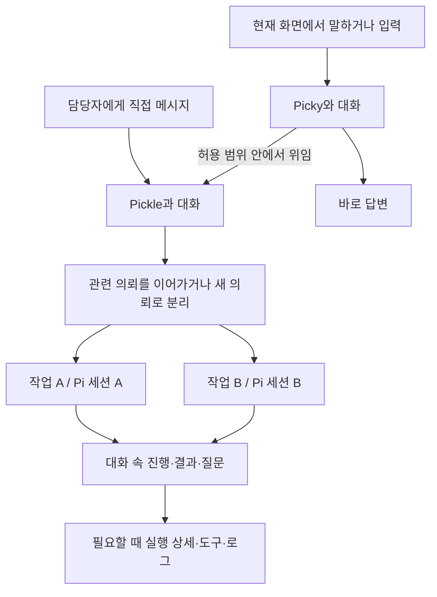

# Picky / Pickle 제품 정의와 봇 중심 MVP 기획서

- 문서 버전: 0.2
- 수정일: 2026-09-12 (KST)
- 상태: 인지부하를 줄이는 방향으로 수정한 제품 제안. 구현 및 출시 승인 문서가 아니다.
- 현재 제품 구현 기준: `ffa046d59`
- 이전 기획 버전: `35701c19b`의 0.1
- 대상: 제품 기획, UX 설계, 구현 범위 산정, 파일럿 검증

이 문서는 Picky를 **현재 하던 자리에서 대화로 일을 맡기는 로컬 AI 팀**으로 발전시키는 방향을 정리한다. 0.2는 사용자가 작업 구조와 실행 설정을 관리하게 했던 0.1에서 Grok Bot의 위임 중심 경험 쪽으로 무게중심을 옮긴다. 새 기능이 이미 구현됐다는 뜻은 아니다. 기존 `AGENTS.md`, 사용자 매뉴얼, 런타임 계약은 이번 문서 작성으로 변경하지 않는다.

## 1. 제품 결정 요약

> Picky에게 말하면, 적절한 Pickle이 맡고, 필요한 판단과 결과만 돌아온다.
> 익숙한 Pickle에게는 동료에게 메시지를 보내듯 바로 말한다.

사용자는 누구와 대화하는지, 무슨 결과를 원하는지, 무엇을 결정해야 하는지만 이해하면 된다. 작업 분리, 세션 생성, 기본 모델·폴더 선택, 내부 위임은 제품이 책임진다. 이름·대화·업무 방식은 지속되지만, 하나의 무한한 모델 컨텍스트를 유지한다는 뜻은 아니다.

### 0.1에서 바꾸는 것

| 0.1의 기본 경험 | 0.2의 기본 경험 |
| --- | --- |
| 담당자 상세에서 새 작업을 만들고 목록으로 이동 | 담당자와 계속 대화. 새 일인지 후속 지시인지 시스템이 구분 |
| Picky가 고른 담당자를 매번 확인 | 기존 허용 범위 안에서는 바로 위임하고 수락 사실을 알림 |
| 프로필 초안을 검토하고 저장해야 재사용 시작 | `앞으로 이 일을 맡아줘`라는 요청으로 담당자와 업무 방식 저장 |
| 모델·폴더·지침이 프로필의 필수 설정처럼 노출 | 기존 설정과 확인된 프로젝트 맥락을 사용. 필요한 정보만 질문 |
| 작업과 담당자가 기본 Dock에서 혼재 | 기본 Dock은 담당자 중심. 작업은 대화의 결과 카드와 상세에서 접근 |
| 작업 방법을 편집 화면에서 저장 | 사용자가 명시한 선호를 대화로 반영하고 변경 내역·되돌리기 제공 |
| 실행과 승인의 상세 구조를 일상 UI에 노출 | 실행은 요약하고, 결과·질문·실패·중요한 외부 변경은 분명히 표시 |

**줄이는 것은 사용자의 운영 판단이다. 실행 권한, 기록, 취소 수단, 오류 가시성을 줄이지 않는다.**

### 성공 질문

사용자가 세션·새 작업·모델·폴더·Skill이라는 개념을 배우지 않고도 일을 맡기고, 중간에 수정하고, 같은 담당자를 다시 쓰고, 필요한 판단을 할 수 있는가?

## 2. 사용자와 해결할 문제

초기 대상은 Mac에서 Pi를 쓰는 개발자·메이커와 여러 업무를 병행하는 개발 리드다. 이들도 모든 업무에서 agent runtime의 운영자가 되고 싶어 하지는 않는다. 초기 설정은 기존 Pi 환경을 재사용하되, 일상 사용에서 그 지식을 요구하지 않는다.

| 하고 싶은 일 | 사용자가 원하지 않는 추가 판단 | 제품의 책임 |
| --- | --- | --- |
| 보고 있는 피드백 조사 | 어느 봇·세션·폴더로 보낼지 선택 | 화면 맥락과 기존 담당 업무를 이용해 접수·위임 |
| 다른 PR도 검토 | 새 작업 생성과 진행 중 세션 관리 | 독립 실행 맥락 분리, 앞선 작업 유지 |
| 방금 결과를 수정 | 이어하기·steer·queue 모드 선택 | 지시가 가리키는 결과와 실행 상태에 맞게 전달 |
| 다음부터 같은 방식 사용 | 지침·Skill·메모리 설정 편집 | 명시적인 선호를 적절한 범위에 저장 |
| 중요한 행동 승인 | 관련 로그를 찾아 결과를 재구성 | 대상·내용·효과를 승인 카드와 함께 표시 |

전사 무감독 자동화, 모바일 중심 사용, 독립 클라우드 worker는 초기 대상이 아니다. 모델 사용이나 외부 도구 접근에 필요한 최초 인증·권한 설정까지 없어진다고 약속하지 않는다.

## 3. 사용자가 보는 개념과 내부 개념

### 사용자가 보는 것

- **Picky:** 기본 대화 상대이자 팀의 접수 창구. 간단한 일은 직접 처리하고, 맞는 담당자가 있으면 위임한다.
- **Pickle:** 역할과 대화가 지속되는 담당자. 이름을 보고 찾아가거나 Picky를 통해 일을 맡긴다.
- **대화 속 결과와 질문:** 문서, 변경안, 조사 결과, 승인 요청. 관련 내용에 답장하거나 상세를 열 수 있다.

작업, 세션, Skill, Routine은 없애는 것이 아니라 기본 사용에 필요한 용어에서 뺀다. 고급 사용자는 기존 제어와 설정에 접근할 수 있다.

### 내부에서 유지할 것

| 내부 개념 | 책임 | 사용자에게 드러나는 순간 |
| --- | --- | --- |
| Pickle 프로필 | 정체성, 역할, 기본값, 지속 지침 | 이름·역할 확인, 대화로 변경, 상세 설정 |
| 담당자 대화 | 메시지·결과·진행·질문의 연속된 타임라인 | 기본 대화 화면 |
| 작업 | 목표, 입력 맥락, 실행 상태, 결과의 독립된 귀속 | 결과 카드의 상세, 진행 중인 일 펼치기 |
| Pi 세션 | 개별 작업 실행, 도구·로그·재개 정보 | 실행 상세, Pi에서 열기 |
| Skill / Routine | 재사용 방법 / 반복 실행 시점 | 방법 검토나 반복 업무를 요청할 때 |

**한 담당자와의 연속된 대화와 하나의 모델 세션은 다른 것이다.** 담당자 대화는 여러 작업의 메시지와 결과를 모아 보여주지만, 모델에는 현재 의뢰에 필요한 지침·관련 맥락만 전달한다. 모든 작업 기록을 매번 붙이지 않는다.

MVP는 작업 하나에 기존 Pi 세션 하나를 대응시킨다. Picky의 짧은 답변에는 작업 생성이 필요 없고, 담당자가 없는 단발성 일도 내부 일반 작업으로 실행할 수 있다. 사용자가 이를 구분할 필요는 없다.

### 지속성과 실행 경계

- 담당자의 정체성과 저장된 업무 방식은 지속된다. Pickle마다 프로세스를 항상 실행하지 않는다.
- 현재 daemon은 앱 생명주기와 연결된다. 앱 종료, Mac 절전·종료, 네트워크 단절 중 작업 완료를 보장하지 않는다.
- local-first는 로컬 저장과 실행 제어다. 선택한 모델이나 외부 도구에 입력이 전달될 수 있으며 데이터 완전 격리나 오프라인 실행을 뜻하지 않는다.

## 4. 시스템이 판단할 것과 사람에게 물을 것

| 판단 | 기본 정책 |
| --- | --- |
| 같은 허용 범위의 어느 담당자가 맡을지 | Pi가 선택해 위임. 라우팅만을 위한 확인창은 띄우지 않음 |
| 새 의뢰인지 후속 지시인지 | 답장 대상·언급된 결과·요청 의미·맥락으로 구분 |
| 기본 모델·추론 수준 | 현재 사용자의 설정과 담당자 기본값 사용. 고급 설정에서 변경 가능 |
| 작업 폴더 | 선택·확인된 프로젝트 맥락 또는 기존 기본값 사용 |
| 명시적인 비민감 선호 저장 | 해당 담당자 범위에 저장하고 무엇이 바뀌었는지 알림 |
| 여러 결과 중 무엇을 뜻하는지 불명확 | 의미 있는 차이가 생기면 결과 이름으로 짧게 질문 |
| 새로운 계정·도구·데이터 접근 | 사용자 승인 또는 필요한 인증 요청 |
| 발송·구매·삭제·배포 등 중요한 외부 효과 | 기존에 승인된 정확한 범위를 확인하고, 범위가 없거나 넓어지면 승인 요청 |
| 실행 여부가 불확실한 외부 작업 재시도 | 먼저 원본 결과 확인. 자동 재실행하지 않음 |

질문은 모델·세션 선택이 아니라 사용자 의사결정의 언어로 한다.

- 묻지 않을 것: `새 세션으로 실행할까요?`, `리뷰 담당에게 위임해도 될까요?`
- 필요할 때 물을 것: `방금 검토한 PR을 수정할까요, 새 PR을 검토할까요?`, `이 메일을 이 수신자에게 발송할까요?`

자동 위임은 이미 허용된 프로젝트·도구·데이터 범위 안의 실행 정리다. 다른 프로젝트의 비밀이나 대화 전체를 새 담당자에게 공유하는 권한은 아니다. 범위가 불분명하면 추측해 실행하지 않는다.

## 5. 핵심 사용자 흐름

### A. 설정 없이 첫 일 맡기기

1. 기존 Pi 환경이 준비된 사용자가 피드백을 보며 Picky를 부른다.
2. `이거 원인 조사하고 수정안까지 정리해줘`라고 말한다.
3. Picky는 필요한 화면 맥락을 받아 직접 처리하거나 기존 담당자에게 맡긴다.
4. 실제 수락 뒤 `피드백 담당이 조사하고 있어요`처럼 짧게 알린다. 사용자의 추가 클릭은 요구하지 않는다.
5. 결과가 준비되면 대화에 나타난다. 중요한 판단이나 막힘이 있을 때만 다시 부른다.

적합한 담당자가 없어도 생성 마법사를 열지 않는다. Picky가 단발성 일로 처리한다. 매 요청마다 새로운 영구 Pickle을 만들지 않는다.

### B. 계속 맡길 담당자 만들기

1. 사용자가 `앞으로 PR 검토는 리뷰 담당이 맡아줘. 보안과 회귀 위험을 먼저 봐줘`라고 말한다.
2. 기존에 같은 담당자가 있으면 지침을 갱신하고, 없으면 담당자를 만든다.
3. 이름·역할·기본값은 요청과 기존 설정에서 채운다. 실행에 필요한 정보가 없을 때만 질문한다.
4. 저장 후 `리뷰 담당이 맡을게요. 보안과 회귀 위험을 먼저 확인하도록 기억했어요`와 변경 내역을 보여준다.
5. 사용자는 새 PR 링크를 보내 같은 담당자를 다시 쓴다.

명시적으로 요청된 생성·비민감 지침 저장에는 다시 저장 승인을 요구하지 않는다. Picky가 먼저 담당자 생성을 제안한 경우에는 사용자가 수락한 뒤 만든다. 같은 이름의 담당자가 여럿이거나 프로젝트 범위가 다르면 자동 병합하지 않고 필요한 구분만 묻는다. 이름·역할·지침은 설정에서 수정할 수 있다. 프로필 생성은 새 도구 설치·인증·접근 권한을 자동 허용하지 않는다.

### C. 같은 담당자와 여러 일을 자연스럽게 진행

1. 리뷰 담당에게 `이 PR 봐줘`라고 보낸다.
2. 검토 중 다른 PR 링크와 함께 `이것도 별도로 봐줘`라고 보낸다.
3. 담당자는 앞선 일을 중단하지 않고 독립된 실행 맥락을 만든다. 수용 한도에 걸리면 대기 상태를 알린다.
4. 첫 결과의 답장으로 `여기서 인증 관련 부분만 더 확인해줘`라고 보낸다.
5. 해당 결과의 작업에만 후속 지시가 들어간다. 두 실행의 상세 기록은 각각 유지된다.

`새 작업`, `follow-up`, `steer` 버튼을 배워야 진행할 수 있는 흐름을 기본값으로 만들지 않는다. 병렬 세션이 같은 파일이나 외부 자원을 안전하게 수정한다는 추가 보장은 하지 않는다.

### D. 대화로 업무 방식을 가르치기

1. 결과를 읽은 사용자가 `앞으로 요약은 세 문장만 쓰고 출처 링크는 남겨줘`라고 말한다.
2. 해당 담당자의 지속 지침에 저장하고 `다음부터 그렇게 정리할게요`와 변경 내역·되돌리기를 제공한다.
3. 다음의 다른 의뢰에도 적용한다. 별도 메모리 편집기를 방문하지 않는다.
4. `이번에는 길게 써줘`는 현재 의뢰에만 적용한다. 지속 지침으로 바꾸지 않는다.

명시되지 않은 선호를 대화에서 추정해 자동 축적하는 기능은 P1이다. 비밀번호·민감한 사실·접근 권한을 일반 선호처럼 저장하지 않는다. 모든 담당자에 적용하려면 범위를 명시해야 한다.

### E. 판단이 필요한 순간만 개입

1. 조사와 초안 작성은 기존 허용 범위 안에서 진행된다.
2. 추가 권한이나 승인되지 않은 외부 발송이 필요하면 완성된 내용과 정확한 대상을 보여준다.
3. 사용자가 승인·거부하거나 내용을 수정한다.
4. 승인은 원래 요청에만 적용한다. 다른 의뢰가 동시에 실행 중이어도 연결이 바뀌지 않는다.
5. 사용자는 같은 대화에서 결과를 받는다. 도구 이력과 전체 근거는 상세에서 확인한다.

## 6. MVP 우선순위

P0는 일상적인 운영 선택을 없애기 위해 함께 필요한 기능이다. P1은 반복 사용 효과를 확인한 뒤 확대한다. 우선순위는 구현 기간의 추정이 아니다.

### P0: 대화로 맡기고 필요한 판단만 하기

| ID | 기능 | 구체 범위 | 완료 기준 |
| --- | --- | --- | --- |
| P0-01 | 담당자 중심 대화 | Picky 기본 대화, Pickle roster, 담당자별 연속 타임라인, 결과 답장 | 작업 목록을 거치지 않고 요청·결과·후속 지시가 연결됨 |
| P0-02 | 보이지 않는 작업 분리 | 새 의뢰·후속 지시 판별, 작업별 Pi 세션, 메시지·결과의 원래 작업 참조 | 같은 담당자의 두 의뢰가 섞이지 않고 사용자는 세션 모드를 선택하지 않음 |
| P0-03 | 허용 범위 안의 자동 위임 | Pi가 기존 담당자 선택, 요청 수락 기록, 짧은 진행 알림 | 분명한 의뢰에 위임 승인창 없이 시작. 범위 확대는 승인 요청 |
| P0-04 | 대화형 담당자·기억 | 요청으로 생성·역할 변경, 명시적 비민감 선호 저장, 기존 기본값 사용, 변경 내역·되돌리기 | 설정 화면 없이 담당자를 다시 쓰고 다음 의뢰에 선호가 반영됨 |
| P0-05 | 조용한 상태와 결과 | 담당자 Dock, 메시지·결과·질문 카드, 실제 활동 표시, 상세 접근 | 사용자가 로그를 지켜보지 않아도 진행·막힘·실패를 알고 결과를 검토 |
| P0-06 | 질문·승인·수정·취소 | 결과 답장, 중요한 외부 효과 승인, 범위가 분명한 중단, 모호할 때 짧은 질문 | 승인이 다른 일에 적용되거나 새 요청이 무관한 작업을 중단하지 않음 |
| P0-07 | 기록·재접속·호환 | 작업/프로필/대화 ID 연결, 중복 방지, 기존 세션·CLI·pin 보존, 고급 제어 | 재접속해도 같은 대화·결과로 복귀. 기존 기록·제어가 유실되지 않음 |

0.1의 데이터·작업 분리는 P0-02·07의 내부 기반으로 유지한다. 자동 위임은 P1에서 P0로 올리고, 지속 지침 저장은 편집 화면 중심에서 대화 중심으로 바꾼다. 대신 프로필 마법사, 별도 작업 관리 화면, 작업별 모델·폴더 선택을 일상 UX의 필수 단계에서 뺀다.

**UI 버튼을 줄이는 것만으로는 MVP가 아니다.** 잘못된 자동 판단을 발견·수정할 수 있는 실행 기록과 관련 결과 참조까지 함께 완성해야 한다.

### P1: 반복 업무와 더 깊은 협업

| 기능 | 추가 내용 | 경계 |
| --- | --- | --- |
| 대화형 Routine | `매일 이 방식으로 정리해줘`로 일정·담당 업무 설정, 중지·실행 이력 | Pi Cron 연동과 실행 생명주기를 검증. 일정 편집기를 첫 화면으로 만들지 않음 |
| 학습된 방식 제안 | 반복 수정에서 지속 지침 후보 제안, 출처와 수락·거부 | 추정을 사실이나 영구 규칙으로 조용히 저장하지 않음 |
| Skill 재사용 강화 | 성공한 작업 방식을 재사용, 필요할 때 방법 확인 | Pi Skill 기반 재사용. 별도 포맷·마켓플레이스 불필요 |
| Pickle 간 직접 협업 | 목표·근거·완료 조건을 가진 제한된 인계 | P0의 Picky 중심 위임 이후 검증. 무제한 자유 대화 금지 |
| 프로젝트 공통 맥락 | 여러 담당자가 허용된 공통 지침·자료 참조 | 공유 범위와 출처 명시 |

### MVP에서 하지 않을 것

- Bot별 클라우드 컴퓨터, 원격 상시 worker, 모바일 앱, Pi 외 여러 agent runtime.
- 새 SaaS 백엔드·계정·결제·SSO·원격 분석.
- 독립 모델 라우터 구축, 사용자가 고른 provider나 비용 범위의 임의 변경.
- 매 요청마다 영구 봇 생성, 자동 조직도, 무제한 재위임, 그룹의 자유 대화.
- 화면 시연 녹화로 Skill 생성, 팀 공유 마켓플레이스, 감정·친밀도 시스템.
- 대화 전체를 전역 기억으로 복사하거나 상시 화면을 감시하는 기능.

기존 Plugins·Memory·Cron은 제거하지 않는다. 이미 설치된 기능이 있다는 이유만으로 담당자별 격리·자동 연결·상시 실행을 보장하지도 않는다.

## 7. 자동 판단의 제품 계약

### 입력·맥락·진행 중 요청

- 입력 시작 시 선택된 **대화 상대와 명시적인 답장 대상**을 고정한다. 입력 중 다른 창·담당자를 클릭해도 이미 시작한 메시지는 바뀌지 않는다.
- 기존 작업 pin이나 일회성 전달은 기존에 적용되는 입력 경로에서만 고정 대상을 유지하며 활성 사실을 계속 표시한다. 다른 담당자 대화에서 명시적으로 보낸 메시지나 결과 답장을 가로채지 않는다. 일반 사용에 pin을 요구하지 않는다.
- 대화 안에서 어떤 작업에 귀속할지는 Pi가 판단한다. 직접 답장한 결과나 명시적으로 지정한 작업은 최근 활동보다 우선한다.
- 분명한 새 의뢰는 별도 맥락을 만든다. 분명한 수정은 관련 실행에 전달한다. 단지 메시지가 새로 왔다는 이유로 진행 중인 다른 일을 중단하지 않는다.
- `그거 멈춰`처럼 둘 이상의 작업을 가리킬 수 있고 잘못 판단하면 영향이 크면 대상 이름으로 질문한다. `전부 멈춰`는 현재 대화에서 맡긴 진행 중인 일에 적용한다. 팀 전체 중단은 `모든 Pickle의 일을 멈춰`처럼 전역 범위가 명시된 경우에만 수행한다. 수락 시 중단 대상과 처리 상태를 알려준다.
- 화면·URL·선택 텍스트·표시 영역은 요청한 순간에만 수집하고 기존 제외·스크린샷 설정을 존중한다. Swift UI는 앱 이름이나 키워드로 의도를 분류하지 않는다.

### 위임과 정정

- Picky는 역할과 허용 범위를 알고 있는 기존 담당자에게 필요한 맥락만 넘긴다. 적합한 담당자가 없으면 직접 처리하며 봇 생성은 강제하지 않는다.
- 위임 안내는 실제 수락 후 보낸다. 준비 중과 실행 중을 구분하고 실패를 성공으로 표시하지 않는다.
- 사용자가 `그건 리뷰 담당 말고 너가 해줘`라고 정정하면 새 지시를 수신하고 기존 실행 상태를 확인한다. 이미 실행된 외부 효과가 취소됐다고 주장하거나 같은 일을 무작정 중복 실행하지 않는다.
- 새 전달·답장·정정은 요청 ID와 확정된 실행 대상에 연결한다. 중복 전송은 기존 수락 결과를 반환한다.
- 명시한 상대나 pin 대상이 사용 불가라면 알린다. 다른 담당자로 조용히 우회하지 않는다. 기본값으로 Picky에게 맡긴 경우와 구분한다.

### 기본값과 기억

- 새 담당자의 폴더·모델·추론 수준은 현재 설정이나 확인된 프로젝트 맥락에서 정한다. 불분명한 프로젝트, 없는 폴더, 사용할 수 없는 모델은 이유와 최소 선택지만 보여준다.
- P0는 별도 모델 라우터 없이 기존 기본값을 이용한다. 수동으로 고정한 모델이나 provider는 그대로 존중하고 상세에서 변경할 수 있게 한다.
- 사용자가 `앞으로`, `항상` 등 지속 의도를 명시한 비민감 작업 지침은 해당 담당자 범위에 저장한다. 불명확한 지시나 민감 정보는 추정 저장하지 않는다.
- 저장 완료 후 무엇을 기억했는지, 어느 담당자에 적용했는지, 되돌리는 방법을 표시한다. 바뀐 지침에는 원래 메시지와 버전을 연결한다.
- 지침 변경은 다음 의뢰에 적용한다. 진행 중인 의뢰까지 수정하려는 명시적 지시는 별도로 전달한다. 되돌리기는 미래 적용을 되돌리는 것이며 과거 외부 실행의 취소가 아니다.
- P0의 지속 지침은 Memory 플러그인 설치 없이도 저장할 수 있어야 한다. 기존 Pi의 사용자·프로젝트 지침은 유지한다.
- 작업별 원본 대화·화면을 프로필에 자동 복사하지 않는다. 기존 Pi 메모리·도구·파일의 공유 범위는 별도로 명시하며 보안 격리를 약속하지 않는다.

### 승인·외부 효과·권한

일반적인 내부 위임과 실행 경계를 보호하는 승인을 구분한다. 프로필의 `발송 전에 물어봐`라는 문구만으로 강제 보안 정책이 구현되는 것은 아니다.

- 새 계정·도구 연결과 접근 범위 확대는 명시적 허용이 필요하다. 봇 생성, 자동 라우팅, 선호 저장으로 권한이 늘어나지 않는다.
- 승인되지 않은 발송·게시·구매·삭제·배포 등 중요한 외부 효과는 대상과 변경 내용을 제시하고 기다린다. 이미 정확한 범위에 대해 받은 승인을 내부 전달마다 반복해서 묻지는 않는다.
- 실행 계층이 실제로 차단·승인을 지원하는 경로에서만 승인 후 실행을 지원한다고 표시한다. 모든 Pi 도구를 포괄하는 독립 위험 판별 엔진을 MVP에 약속하지 않는다.
- 답변·승인은 해당 요청에만 적용한다. 취소·만료된 요청은 거부하고, 처리된 요청은 재접속 후 다시 실행하지 않는다.
- 외부 실행 중 연결이 끊겨 실행 여부를 모르면 `실행 결과 확인 필요`로 멈추고 원본 결과부터 확인한다. 모든 도구의 exactly-once 보장을 가정하지 않는다.
- 파일럿은 읽기·조사·초안·검토 중심이다. 위험한 외부 변경은 검증된 승인 경로나 사용자의 직접 실행으로 제한한다.
- Pickle ID, 폴더, 별도 daemon은 sandbox가 아니다. 로컬 Pi와 공유 credential의 실제 권한은 숨기거나 축소 설명하지 않는다.

## 8. UI 기획

### Design Decision Card

- 사용자 목표: 지금 하던 자리에서 담당자에게 말하고, 필요한 판단과 결과만 확인한다.
- 기본 화면: Picky 또는 Pickle과의 대화. 담당자 roster와 입력창이 진입점이다.
- 첫 시선 정보: 누구와 대화 중인지, 최근 요청이 접수됐는지, 내 응답이나 문제 해결이 필요한지.
- 주요 행동: 메시지 보내기, 결과에 답장하기, 중요한 행동 승인·거부하기.
- 보조 행동: 진행 중인 일 펼치기, 실행 상세, 프로필·모델 설정, 기존 Pi 제어.
- 상태 의미: 담당자 표시는 실제 하위 실행을 요약한다. 결과 읽음·질문 해결·작업 완료는 서로 다른 상태다.
- 디자인 기반: 기존 `DS`, `PickyHUDTypography`, Action Blue와 semantic status 사용. 새로운 토큰·아바타 모션 시스템은 만들지 않는다.
- 접근성: 색·움직임·hover 없이도 상태와 질문을 이해할 수 있어야 한다. VoiceOver, 키보드, IME, light/dark, Reduce Motion을 유지한다.
- 위험: 단순한 타임라인 뒤에서 잘못된 분리·위임이 보이지 않는 것. 관련 결과 참조, 정정, 상세 접근을 함께 제공한다.

### Hub와 대화

Hub의 중심을 담당자 목록과 대화로 옮긴다. Dashboard·Statistics·Plugins·Settings는 유지하되, 일상적인 의뢰를 위해 방문할 필요가 없게 한다. 구현 시 전체 설정 UI를 다시 만들지는 않는다.

- 처음에는 Picky가 준비된 대화 상대로 보인다. 봇 만들기나 필수 프로필 설정을 빈 화면의 관문으로 두지 않는다.
- 각 Pickle에는 이름, 역할 한 줄, 마지막 메시지·실제 상태가 보인다. 상세를 열면 작업 목록보다 대화와 입력창이 먼저 나온다.
- 입력창은 `메시지 보내기`다. `새 작업`, `이어하기`, `steer`를 매번 선택하게 하지 않는다.
- 타임라인에는 사용자 요청, 필요한 진행 요약, 결과 카드, 질문·승인이 섞여 나타난다. 결과의 답장과 상세 열기는 해당 실행에 연결된다.
- 여러 의뢰의 답이 엇갈려 도착하면 짧은 제목이나 원래 메시지 참조를 붙인다. 내부 작업 ID를 일반 메시지에 노출하지 않는다.
- 도구 호출·원시 로그는 상세에 접어 두되 접근 경로를 없애지 않는다. 오류·실패·승인은 접힌 로그에만 남기지 않는다.
- 모델·폴더·기억·진행 중인 일·이전 기록은 보조 화면에서 확인한다. 고급 사용자가 세션을 명시적으로 나눌 수 있는 제어는 유지한다.

### Dock과 커서

- 새 기본 Dock은 Picky와 고정한 Pickle을 표시한다. 작업이 늘어날 때마다 영구 슬롯이 늘어나지 않는다.
- Pickle 클릭은 대화로 연결한다. 여러 작업 목록을 먼저 고르게 하지 않는다. 진행 중인 일은 그 대화에서 펼칠 수 있다.
- 아바타·상태 문구는 실제 실행을 반영한다. 실행 근거 없이 살아 있는 것처럼 보이는 반복 애니메이션은 사용하지 않는다.
- 응답 필요와 실패는 항상 알아볼 수 있게 표시한다. 작업별 상태·취소·결과는 한 단계의 펼침으로 접근한다.
- 커서 근처에는 필요할 때 `맡겼어요`, `확인이 필요해요`처럼 짧게 표시한다. 구체적인 담당자·결과는 대화로 이어진다.
- 입력 대상 변경, 담당자 고정 해제, 결과 도착만으로 다른 작업을 취소·보관하거나 다음 메시지 대상을 바꾸지 않는다.
- 기존 작업별 Dock 배치와 그룹은 마이그레이션에서 보존한다. 사용자가 선택해 쓰는 기존 작업 보기는 고급 경로로 남긴다.

### 진행·알림 정책

| 상황 | 기본 표현 |
| --- | --- |
| 요청 접수 | 수락 후 짧은 확인. 실행 대기라면 대기임을 표시 |
| 정상 진행 | 실제 상태·현재 행동을 가볍게 표시. 매 도구 호출마다 새 알림을 보내지 않음 |
| 의미 있는 변화 | 범위 변경, 오래 걸리는 이유, 막힘 등 필요한 내용만 대화에 전달 |
| 응답 필요 | 질문 또는 정확한 승인 카드. 진행 중 상태에 묻히지 않게 표시 |
| 실패·blocked | 이유와 가능한 다음 행동을 텍스트로 표시. 자세한 근거는 확장 |
| 완료 | 결과와 관련 의뢰 참조. 완성된 결과에 대한 검토·답장 제공 |
| 여러 작업의 상태 공존 | 대표 상태와 필요한 예외를 표시하고 펼치면 개별 상태·취소 확인 |
| 연결 끊김 | 마지막 확인 시각과 연결 끊김 표시. 완료나 계속 실행 중이라고 추정하지 않음 |

Picky를 통해 맡긴 일의 요약은 원래 대화에 돌아오고 담당자의 상세로 연결한다. 직접 담당자에게 보낸 일은 그 대화에서 끝낸다. 같은 결과를 Picky·Pickle·macOS에서 중복 알림으로 소비하게 하지 않으며 기존 알림 선호를 존중한다.

## 9. 데이터·호환성 원칙

| 데이터 | 책임 |
| --- | --- |
| Pickle 프로필 | 안정적인 ID, 역할, 기본값, 지속 지침·버전, 보관 상태 |
| 담당자 타임라인 | 원래 메시지 순서·작성자, 답장 대상, 작업·결과 참조. 모든 실행 대화의 무조건적인 복제본이 아님 |
| 작업과 Pi 세션 | 기존 상태·로그·결과물·질문·재개 정보, 사용한 프로필 스냅샷 |
| 입력·판단·수락 기록 | 요청 ID, 고정된 대화 상대·답장, 최종 작업·위임 대상, 실패·정정 결과 |
| 기억 변경 이력 | 출처 메시지, 적용 범위, 이전·새 버전, 되돌림 상태 |

새 의뢰·후속 지시 해석은 Pi가 맡고, agentd는 확정된 실행의 저장·연결·수락·중복 방지를 소유한다. 앱은 중립적인 입력과 투영된 결과를 다룬다. 앱에 별도 의도 분류기를 만들거나, 내부 작업 ID를 숨긴다는 이유로 추적 정보를 없애지 않는다.

### 기존 사용자 전환

1. 기존 세션 ID, 대화, 로그, 결과물, Pi 파일 경로, 보관 여부를 유지한다. 과거 대화를 소급 분할하거나 세션마다 봇을 만들지 않는다.
2. 기존 세션은 `이전 작업`에서 찾고 그대로 재개한다. 새 담당자 연결은 명시적인 생성·연결 요청으로만 수행하며 과거 실행 설정을 덮어쓰지 않는다.
3. 기존 Dock 배치·그룹·번호 단축키·입력 pin은 보존한다. 담당자 Dock 전환 시 해당 배치를 따로 보존하고 돌아갈 수 있게 한다. 작업 ID를 프로필 ID로 조용히 바꾸지 않는다.
4. 기존 `picky pickle-*` CLI와 Pi handoff는 기존 세션 의미를 유지한다. 새 프로필·대화 명령은 별도 계약으로 설계한다.
5. 프로필 편집은 다음 의뢰에 적용한다. 보관 요청은 진행 중인 일과 미해결 질문이 있으면 처리 방법을 확인하며, 고정 해제와 보관을 혼동하지 않는다. 영구 삭제는 MVP에서 추가하지 않는다.
6. 숨겨지거나 보관된 곳에 유효한 질문이 생겨도 응답 필요 화면으로 접근시킨다. 닫기·읽음은 질문에 답한 것이 아니다.
7. 새 화면을 비활성화해도 연결 정보를 삭제하지 않는다. 이전 앱 버전으로의 downgrade는 별도 검증 없이 보장하지 않는다.

현재 primary/child daemon의 세션 소유권은 유지한다. 지속형 프로필이나 담당자 타임라인을 추가했다고 단일 세션 child에 여러 실행을 밀어 넣거나, 각 봇을 항상 켜진 프로세스로 만들지 않는다. 임시 스크린샷·결과물의 현재 보존 정책도 자동으로 영구 보관으로 바꾸지 않는다.

## 10. 구현 순서와 전제

| 단계 | 범위 | 완료 증거 |
| --- | --- | --- |
| 1. 대화와 실행 분리 | P0-01·02·07의 ID·저장 계약, 결과 답장, 이전 기록 | 한 대화의 두 의뢰가 각 실행·결과·질문에 정확히 연결 |
| 2. 대화로 담당자 재사용 | P0-04, 기본값·역할·명시적 지침 저장과 되돌리기 | 설정 화면 없이 담당자를 만들고 다른 의뢰에 같은 지침 적용 |
| 3. 운영 선택 제거 | P0-02·03·06, 자동 분리·위임, 모호한 지시 확인·정정 | 작업 생성·모델·위임 선택 없이 처리하고 필요한 경우에만 질문 |
| 4. 조용한 기본 화면 | P0-05·06·07, 대화 중심 Hub·담당자 Dock, 질문·결과·상세 | 로그를 지켜보지 않아도 막힘을 알고 정확한 결과에 답장 |
| 5. 파일럿 | 실제 반복 의뢰와 예외 상황 | 아래 인지부하·신뢰 기준 충족 |

자동 판단이 추가되므로 UI 구현량이 줄어도 전체 구현 난도가 반드시 낮아지는 것은 아니다. 입력 의미 판별, 작업 귀속, 실행 정정, 메시지 투영의 책임이 커진다.

구현 전에 확인할 사항은 다음과 같다.

- Pi가 지속형 담당자 대화와 개별 작업 맥락을 어떻게 받아 새 의뢰·후속 지시를 구분할지.
- 기존 지침·Memory의 범위와 담당자 지침 주입·버전·되돌리기 방법.
- 실행 중 정정·취소·재접속에서 이미 일어난 외부 효과를 확인하는 방법.
- 승인 지원 도구의 실제 범위와 자동 위임에 넘길 최소 맥락.
- 기존 CLI·세션 ID와 새 대화·프로필 명령의 호환성.

관련 진입점은 `agentd/src/protocol.ts`, `session-store.ts`, `session-supervisor.ts`, `application/main-agent-coordinator.ts`, Swift protocol/client router, `PickySessionViewModel`, Hub, HUD, Companion/Quick Input이다. 이 목록이 전면 리팩터링의 지시는 아니다. 현재 Pi 실행·저장·질문·도구·플러그인 경로를 재사용한다.

## 11. 수용 기준과 검증

아래는 향후 구현 검증 계획이다. 문서 작성 과정에서 제품 테스트를 통과했다는 의미가 아니다.

| 시나리오 | 관찰할 최종 결과 | 우선 검증 경계 |
| --- | --- | --- |
| 설정 없는 의뢰 | 기존 환경에서 모델·폴더·세션 선택 없이 결과까지 도달 | 실제 Pi를 쓰는 제한된 파일럿 |
| 같은 대화의 별도 의뢰·후속 지시 | 새 의뢰만 독립 실행, 후속 지시·결과 답장은 관련 실행에만 반영 | Pi 의미 판별 평가 + agentd 저장·실행 통합 |
| 입력 중 대화·pin 변경 | 시작 시 고정한 상대·답장·명시 pin 유지, 다른 기록에 입력 없음 | Swift 입력 → protocol → 저장 경로 |
| 범위 내 자동 위임 | 불필요한 승인 없이 한 번 실행. 권한·데이터 범위 확대 시에는 중단·확인 | Pi 위임 판단 + 실행 경계 |
| 잘못된 해석 정정 | 원래 실행 상태를 확인하고 필요한 곳에만 수정. 외부 효과를 되돌렸다고 오인시키지 않음 | 실제 정정 이벤트·runtime 경계 |
| 선호 기억·이번만 변경·되돌리기 | 명시적 지속 지침만 해당 담당자에 적용, 일회성 요청은 영구 저장하지 않음 | 저장·프롬프트 구성·다음 의뢰 |
| 승인·취소·늦은 응답 | 승인 오귀속·중복 실행 없음, 만료 요청 거부 | 질문 bridge·runtime 외부 경계 |
| 실행 결과 불명·재접속 | 확인 필요 상태 유지, 외부 효과 자동 재실행 금지 | 실제 연결·저장·복구 경로 |
| 간결한 UI의 혼합 상태 | 질문·실패가 숨지 않고 원래 결과·전체 로그·취소에 접근 | 실제 이벤트의 Swift projection + UI 확인 |
| 기존 기록·CLI·레이아웃 | 기존 세션 재개, 그룹·pin 보존, 이전 배치로 복귀 | migration·protocol·입력 경로 |

의미 판별 품질과 저장·라우팅의 결정적 계약은 따로 검증한다. fake runtime이 올바른 작업 ID를 반환한다고 실제 모델의 해석이 정확하다고 주장하지 않는다. 대표 발화에는 별도 의뢰, 수정, 모호한 지시, 중단, 권한 확대, 영구·일회성 선호를 포함한다.

- 상태·저장·라우팅 테스트는 실제 정책·orchestration을 사용하고 외부 서비스·runtime 경계만 fake로 둔다. 최종 저장·렌더 결과까지 확인한다.
- protocol 변경은 Swift·TypeScript 모델과 공용 fixture를 함께 검증한다.
- UI는 키보드, IME, light/dark, Reduce Motion, 여러 작업과 멀티 디스플레이를 확인한다. HUD 성능은 측정으로 검증한다.
- 테스트는 임시 데이터와 격리된 runtime을 사용한다. 실행 중인 앱을 임의로 재시작하거나 사용자 계정으로 외부 변경을 실행하지 않는다. WindowServer 자동 검증은 기존 격리 정책을 따른다.

### 파일럿과 출시 판단

제안 규모는 테스터 5명, 각자 반복 업무 1종을 서로 다른 입력으로 3회 수행하는 것이다. 추가로 별도 의뢰·수정·모호한 지시·실패·승인 사례를 관찰한다. 아래 수치는 실측 성과가 아니라 목표다.

| 지표 | 측정 방법 | 초기 목표 |
| --- | --- | --- |
| 운영 선택 수 | 의뢰 시작 후 모델·폴더·세션·담당자·위임 확인을 요구한 횟수 | 맥락과 허용 범위가 분명한 반복 의뢰에서는 0회 |
| 용어 학습 부담 | 세션·steer·Skill 설명 없이 의뢰·수정·결과 확인을 수행하는지 | 5명 중 4명 이상 도움 없이 수행 |
| 재설명 감소 | 폴더·업무 기준·출력 형식의 반복 입력을 1·3회차 비교 | 5명 중 4명 이상 감소 |
| 감독 부담 | 막힘이 없는데 상태를 확인하러 열어 보는 이유·횟수 관찰 | 기다림과 오류를 구별할 수 있고, 확인을 위한 상시 감시가 불필요 |
| 수정·검토 가능성 | 관련 결과를 찾아 답장하고 필요한 근거를 여는지 | 모든 테스터가 의도한 결과를 수정·검토 |
| 안전·보존 | 오귀속, 기록 유실, 중복 외부 실행, 권한 확대 누락 기록 | 출시 차단 사례 0건, 수용 시나리오 충족 |

운영 선택, 의미 확인 질문, 권한 승인을 따로 센다. 필요한 질문·승인을 숨겨 선택 수 목표를 맞추지 않는다. 첫 인증과 정보가 없는 프로젝트는 0회 목표의 전제에 포함하지 않는다.

측정은 기존 로컬 통계와 테스터가 확인한 로컬 기록을 사용한다. 원문 대화·화면을 원격 분석 서비스로 전송하지 않는다. 실제 모델 해석이 불안정하면 자동화 범위를 좁히거나 의미 확인을 추가하고, 문제가 없는 것처럼 조용히 진행하지 않는다.

## 12. 주요 위험과 대응

| 위험 | 대응 |
| --- | --- |
| 숨긴 운영 선택이 잘못된 자동 판단으로 바뀜 | 원래 요청·관련 결과 참조, 모호한 경우 의미 질문, 정정·취소 경로 |
| 연속 대화를 무한한 모델 컨텍스트로 구현 | 담당자 타임라인과 작업 실행 분리, 관련 맥락만 전달 |
| 조용한 UI가 오류나 멈춤을 가림 | 실제 상태·마지막 확인·실패·질문 표시, 전체 근거 접근 유지 |
| 내부 위임 편의가 데이터·권한 확대가 됨 | 같은 허용 범위만 자동화, 필요한 맥락만 전달, 범위 확대 승인 |
| 기억이 임시 지시나 민감 정보로 오염 | 명시적 비민감 선호만 P0, 범위·출처·버전·되돌리기 |
| 대화로 생성하다 담당자가 과도하게 늘어남 | 기존 담당자 재사용, 명시 요청 또는 제안 수락에만 생성 |
| 같은 로컬 자원에 병렬 변경 충돌 | 기존 폴더·실행 정책 유지, 병렬 작업을 격리 보장으로 홍보하지 않음 |
| 기존 파워유저 제어가 사라짐 | 고급 설정·작업 상세·이전 Dock 배치·CLI·Pi 재개 보존 |
| Grok Bot 외형을 따라 범위가 커짐 | 인지부하 감소에 집중, 클라우드·모바일·멀티 런타임은 분리 |

## 13. 참고 자료와 적용 원칙

### 현재 Picky의 근거

- [README](../README.md): 현재 Picky/Pickle 정의와 화면 맥락 진입 경험.
- [User Manual](./user-manual.md): Hub, Dock, 작업 제어, Plugins, Memory·Cron 연결.
- [Protocol](../agentd/src/protocol.ts): 기존 세션과 상태·질문·결과물 모델.
- [Per-Pickle daemon topology](./per-pickle-daemon-topology.md): primary/child 수명과 세션 소유권.
- [Design System](../design/DESIGN.md), [Design Principles](../design/PRINCIPLES.md): Activity first, quiet chrome, explicit state, native behavior.
- [Desktop test isolation](./test-desktop-isolation.md), [HUD profiling](./perf-profiling.md): 향후 구현 검증 제약.

### 외부 제품에서 참고한 것

- [Grok Bot 공식 디자인 글](https://x.ai/news/designing-grok-bot): 지속형 담당자와 대화, 내부 개념 최소화, 필요할 때 실행 상세 공개. 0.2의 주된 UX 참고 자료다.
- [Grok Bot 컴퓨터와 앱 문서](https://docs.x.ai/grok-bot/computer-and-apps): 역할 구분과 실제 컴퓨터·credential 격리는 다르다는 점.
- [OpenMausBot README](https://github.com/milind-soni/OpenMausBot/tree/2f91c462926bee70242c42a4e3443b19d0a13a0c): 로컬 제어와 확장 가능성은 참고하되 설정·모델·실행 환경 선택을 일상 화면의 중심에 두지 않는다.

공개 데모와 기능 목록은 운영 신뢰성의 증거가 아니다. Picky는 사용자가 선택해야 했던 일을 시스템이 정확히 맡아 처리하고, 중요한 판단과 결과를 사용자가 이해할 수 있게 돌려주는지를 검증한다.
