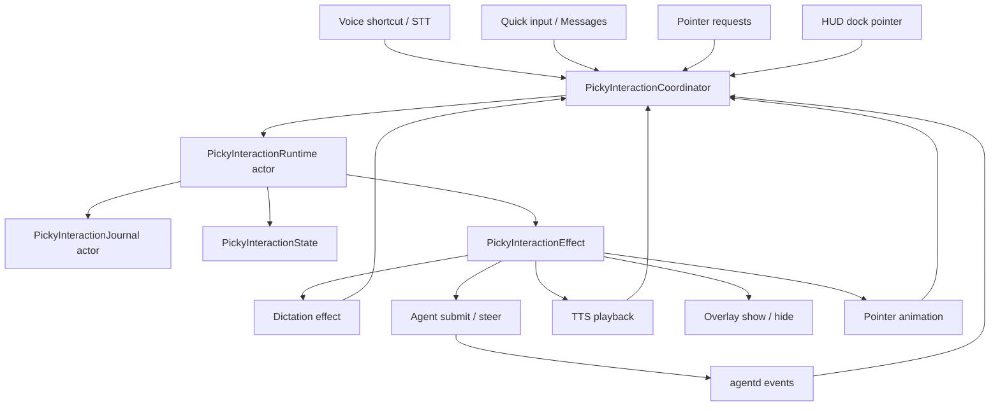

# PickyInteractionCoordinator + Event Sourcing Plan

**Status**: planning only — do not modify source code in this task.  
**Date**: 2026-05-05  
**Scope**: Picky macOS app interaction lifecycle first; agentd changes only when needed for stronger event correlation.  
**Primary files touched later**: `Picky/CompanionManager.swift`, `Picky/Overlay/BlueCursorView.swift`, `Picky/QuickInput/*`, `Picky/PickySessionViewModel.swift`, `PickyTests/*`.

## Goal

Unify Picky's input/output lifecycle into a single event-driven interaction state machine so voice input, text input, quick replies, TTS playback, pointer overlays, transient cursor visibility, and side-agent completion notifications cannot race each other through scattered mutable state.

The implementation should specifically reduce bugs like:

- TTS message not appearing or disappearing too early.
- stale speech completion callbacks setting a new response back to idle.
- stale pointer animation timers clearing a newer pointer target.
- PTT start/release briefly producing idle and hiding the transient overlay.
- typed quick replies accidentally entering the spoken voice response path.
- side-agent completion replies colliding with active voice input.

## References

- Swift `actor`: <https://docs.swift.org/swift-book/documentation/the-swift-programming-language/concurrency/#Actors>
- Swift `MainActor`: <https://developer.apple.com/documentation/swift/mainactor>
- Swift task cancellation: <https://developer.apple.com/documentation/swift/task/cancel()>
- Swift structured concurrency overview: <https://developer.apple.com/documentation/swift/concurrency>

## Current Problem Summary

Today the interaction lifecycle is distributed across several independent state holders:

| Area | Current owner | State examples |
| --- | --- | --- |
| Voice rendering | `CompanionManager` | `voiceState`, `voicePromptBubbleState`, `pendingAgentResponseStartedAt` |
| TTS lifecycle | `CompanionManager` | `activeSpeechID`, `responseStateTask`, `speechPlaybackProvider` |
| Text input | `QuickInputPanelManager`, Messages view, `CompanionManager` | `isSendingDirectMessage`, `directMessageContextIDs` |
| Pointer overlay | `CompanionManager`, `BlueCursorView` | `detectedElementScreenLocation`, local `BuddyNavigationMode`, timers |
| HUD dock pointer | `PickySessionListViewModel`, NotificationCenter, `CompanionManager` | `pendingDockPointerSessionID`, `.pickyPointAtHUDDockSession` |
| Side completion | `agentd/src/session-supervisor.ts`, `CompanionManager.applyAgentEvent` | `quickReply`, session status updates |
| Overlay visibility | `CompanionManager`, `OverlayWindowManager`, `BlueCursorView` | `isOverlayVisible`, transient hide task |

The issue is not that each piece is wrong. The issue is that each piece makes partial lifecycle decisions without a single source of truth or causal id. This produces races whenever a delayed callback from an older interaction fires during a newer interaction.

## Target Architecture

Introduce a `PickyInteractionCoordinator` as the app-side interaction boundary. UI and daemon events enter the coordinator as typed events. The coordinator appends events to a journal, reduces them into a canonical state, publishes a projection back to existing UI-facing properties, and runs side effects that later feed new events back into the coordinator.



### Main design choices

1. `PickyInteractionRuntime` is an `actor` that serializes state transitions.
2. `PickyInteractionCoordinator` is `@MainActor` and is the only bridge that mutates UI-facing published state.
3. Reducer output is pure: `(newState, effects, journalRecord)`.
4. Effects are idempotent and correlation-id aware.
5. Every async callback carries the interaction id it belongs to.
6. Legacy UI APIs stay available during migration, with `CompanionManager` acting as a facade.
7. Each migration phase has an explicit state ownership boundary. Once a field becomes coordinator-owned, legacy code must stop writing it directly.
8. IDs and timestamps are generated outside the reducer by the coordinator/event factory or effect runner, never inside reducer logic.

## Core Types

### Event envelope

```swift
struct PickyInteractionEnvelope: Equatable, Codable, Identifiable {
    let id: UUID
    let occurredAt: Date
    let event: PickyInteractionEvent
    let correlation: PickyInteractionCorrelation
}
```

### Correlation

```swift
struct PickyInteractionCorrelation: Equatable, Codable {
    var inputID: UUID?
    var contextID: String?
    var speechID: UUID?
    var pointerID: String?
    var sessionID: String?
    var source: PickyInteractionSource
}
```

### Quick reply metadata

`quickReply` metadata must separate the user's input origin from the daemon component that produced the reply. A single `source` field is ambiguous because `voice` / `text` describe origin, while `sideCompletion` / `main` describe producer.

```swift
enum PickyQuickReplyOriginSource: String, Codable, Equatable {
    case voice
    case text
    case voiceFollowUp
    case textFollowUp
    case system
    case unknown
}

enum PickyQuickReplyKind: String, Codable, Equatable {
    case main
    case sideCompletion
    case router
    case handoffAck
    case error
    case unknown
}
```

`unknown` is a backward-compatibility fallback only. New daemon events should send explicit metadata where possible.

Swift decoding must be tolerant:

- missing metadata decodes as `.unknown` rather than failing the whole event.
- unknown raw values decode as `.unknown`.
- hyphenated daemon values are accepted: `"voice-follow-up"` maps to `.voiceFollowUp`, `"text-follow-up"` maps to `.textFollowUp`.
- legacy `source` metadata maps best-effort to the new shape: `voice` / `text` become `originSource`, `sideCompletion` / `main` become `replyKind`.

### Event

```swift
enum PickyInteractionEvent: Equatable, Codable {
    case appStarted
    case permissionsChanged(PickyPermissionSnapshot)
    case cursorPreferenceChanged(enabled: Bool)

    case voicePressed(targetSessionID: String?)
    case voiceStartFailed(message: String, inputID: UUID)
    case voiceReleased(inputID: UUID)
    case transcriptFinal(text: String, inputID: UUID)
    case transcriptFailed(message: String, inputID: UUID)

    case textSubmitted(text: String, inputID: UUID)
    case textContextCaptured(inputID: UUID, context: PickyContextPacket)
    case textSubmissionAccepted(contextID: String, inputID: UUID)
    case textSubmissionFailed(message: String, inputID: UUID)

    case voiceContextCaptured(inputID: UUID, transcript: String, context: PickyContextPacket, targetSessionID: String?)
    case agentSubmissionAccepted(contextID: String?, sessionID: String, inputID: UUID?)
    case quickReply(contextID: String, text: String, originSource: PickyQuickReplyOriginSource?, replyKind: PickyQuickReplyKind?, sessionID: String?, inputID: UUID?)
    case passiveAgentSummary(sessionID: String, text: String)
    case sideAgentCompleted(sessionID: String, summary: String?)

    case pointerRequested(PickyPointerTarget)
    case pointerCancelled(pointerID: String, reason: PickyPointerCancelReason)
    case pointerAnimationFinished(pointerID: String)

    case speechStarted(text: String, speechID: UUID, sourceContextID: String?)
    case speechFinished(speechID: UUID)
    case speechFailed(speechID: UUID)
    case minimumDisplayTimerFired(timerID: UUID, speechID: UUID?, inputID: UUID?)

    case overlayShown(reason: PickyOverlayReason)
    case overlayHidden(reason: PickyOverlayReason)
    case transientHideTimerFired(timerID: UUID)
}
```

### State

```swift
struct PickyInteractionState: Equatable, Codable {
    var input: PickyInputPhase
    var output: PickyOutputPhase
    var pointer: PickyPointerPhase
    var overlay: PickyOverlayPhase
    var pendingTextInputs: [UUID: PickyTextInputState]
    var pendingVoiceInputs: [UUID: PickyVoiceInputState]
    var contextOwnership: [String: PickyContextOwner]
    var lastDisplayMessage: PickyDisplayMessage?
}
```

### Input phase

```swift
enum PickyInputPhase: Equatable, Codable {
    case idle
    case voiceListening(inputID: UUID, targetSessionID: String?)
    case voiceFinalizing(inputID: UUID, targetSessionID: String?, transcriptPreview: String?)
    case voiceSubmitting(inputID: UUID, targetSessionID: String?, transcript: String)
    case textSubmitting(inputID: UUID, text: String)
}
```

### Output phase

```swift
enum PickyOutputPhase: Equatable, Codable {
    case idle
    case waitingForAgent(inputID: UUID?, contextID: String?, promptPreview: String?)
    case showingTextReply(contextID: String, text: String, minimumDisplayTimerID: UUID?, minimumDisplayUntil: Date?)
    case speaking(contextID: String?, speechID: UUID, text: String, minimumDisplayTimerID: UUID, minimumDisplayUntil: Date, finishPending: Bool)
    case suppressedReply(contextID: String, text: String, reason: PickyReplySuppressionReason, minimumDisplayTimerID: UUID?, minimumDisplayUntil: Date?)
}
```

### Pointer phase

```swift
enum PickyPointerPhase: Equatable, Codable {
    case idle
    case requested(PickyPointerTarget)
    case navigating(PickyPointerTarget)
    case pointing(PickyPointerTarget)
    case returning(PickyPointerTarget)
}
```

`PickyPointerTarget` must include a stable `id` from the daemon request or generated locally for HUD dock pointers. `BlueCursorView` must never call completion for an untagged pointer.

### Overlay phase

```swift
enum PickyOverlayPhase: Equatable, Codable {
    case hidden
    case visible(reason: Set<PickyOverlayReason>)
    case hiding(timerID: UUID, reason: PickyOverlayReason)
}
```

The overlay remains visible if any active reason requires it:

- cursor preference enabled
- active voice input
- waiting for voice response
- speaking response
- active pointer animation
- transient pointer display

## Reducer Contract

```swift
struct PickyInteractionTransition: Equatable {
    var state: PickyInteractionState
    var effects: [PickyInteractionEffect]
    var journalRecords: [PickyInteractionJournalRecord]
}

enum PickyInteractionReducer {
    static func reduce(
        state: PickyInteractionState,
        envelope: PickyInteractionEnvelope
    ) -> PickyInteractionTransition
}
```

Rules:

1. The reducer performs no async work.
2. The reducer never touches AppKit, SwiftUI, `BuddyDictationManager`, `PickyAgentClient`, or TTS providers.
3. The reducer validates ids before changing state.
4. Stale events produce a journal record and no visible state change.
5. Every effect contains the id needed to validate its completion event.
6. The reducer must not generate `UUID`, `Date`, random values, or wall-clock delays. All `inputID`, `speechID`, `timerID`, `pointerID`, event timestamps, and delay deadlines are supplied by the coordinator/event factory or effect runner.
7. Reducer tests must be deterministic with fixed IDs and fixed timestamps. Event sourcing replay must produce the same state and effects from the same envelope sequence.

## Effects

```swift
enum PickyInteractionEffect: Equatable {
    case startDictation(inputID: UUID)
    case stopDictation(inputID: UUID)
    case captureVoiceContext(inputID: UUID, transcript: String, targetSessionID: String?)
    case recordContextOwnership(inputID: UUID, contextID: String, owner: PickyContextOwner)
    case submitMain(inputID: UUID, transcript: String, context: PickyContextPacket)
    case steerSide(inputID: UUID, sessionID: String, transcript: String, context: PickyContextPacket)
    case captureTextContext(inputID: UUID, text: String)
    case submitText(inputID: UUID, context: PickyContextPacket, text: String)
    case speak(speechID: UUID, text: String, contextID: String?)
    case stopSpeech(reason: PickySpeechStopReason)
    case scheduleMinimumDisplay(timerID: UUID, speechID: UUID?, inputID: UUID?, delay: TimeInterval)
    case showOverlay(reason: PickyOverlayReason)
    case scheduleTransientHide(timerID: UUID, delay: TimeInterval)
    case cancelTransientHide(timerID: UUID?)
    case startPointerAnimation(target: PickyPointerTarget)
    case cancelPointerAnimation(pointerID: String?)
}
```

Effect runner responsibilities:

- `run(_:)` itself is non-async and must not mutate UI state directly.
- It starts async work in `Task`s and returns immediately.
- Convert completion/failure callbacks back into `PickyInteractionEvent`s through `coordinator.accept`, never by mutating projection or legacy fields.
- Check task cancellation and also rely on reducer id validation.
- Effects in one transition are executed in array order. Effects that must be ordered must be emitted in that order, for example `recordContextOwnership` before `submitText`, `scheduleMinimumDisplay` before `speak`, and `stopSpeech` before `speak`.
- Long-running independent effects may run concurrently after they are started, but their completions are serialized by coordinator events.
- If an effect can synchronously fail or immediately call back, it must still re-enter through `accept`; direct callback mutation is forbidden.
- Context capture effects must not chain directly into daemon submit. They emit `.textContextCaptured` / `.voiceContextCaptured`; the reducer records ownership and then emits submit/steer effects.

## Event Sourcing Model

### Runtime actor

```swift
actor PickyInteractionRuntime {
    private var state: PickyInteractionState
    private var sequence: UInt64 = 0
    private var ringBuffer: [PickyInteractionJournalRecord] = []

    func dispatch(_ envelope: PickyInteractionEnvelope) -> PickyInteractionDispatchResult {
        sequence += 1
        let transition = PickyInteractionReducer.reduce(state: state, envelope: envelope)
        state = transition.state
        ringBuffer.append(contentsOf: transition.journalRecords)
        return PickyInteractionDispatchResult(
            sequence: sequence,
            state: state,
            effects: transition.effects,
            journalRecords: transition.journalRecords
        )
    }
}
```

Important actor rule: `dispatch` must not `await` internally. Actor isolation is reentrant at suspension points; introducing an `await` inside dispatch can interleave state transitions. Disk flushing should be outside the critical transition method.

### Journal actor

```swift
actor PickyInteractionJournal {
    func append(_ records: [PickyInteractionJournalRecord]) async
    func recent(limit: Int) async -> [PickyInteractionJournalRecord]
    func exportJSONL() async throws -> URL
}
```

Initial implementation can keep a memory ring buffer plus optional debug JSONL under app support:

`~/Library/Application Support/Picky/interaction-events.jsonl`

The JSONL file is for debugging and replay, not the source of runtime truth on launch. Launch replay can be a later enhancement. Every record includes the runtime sequence. Appends should either run through an ordered append chain or export should sort by sequence before writing, so debugging output preserves transition order even if disk flushes are asynchronous.

## Coordinator Shape

```swift
@MainActor
final class PickyInteractionCoordinator: ObservableObject {
    @Published private(set) var projection: PickyInteractionProjection

    private let runtime: PickyInteractionRuntime
    private let journal: PickyInteractionJournal
    private var eventQueue: [QueuedInteractionEvent] = []
    private var isDraining = false

    func accept(_ event: PickyInteractionEvent, correlation: PickyInteractionCorrelation) {
        eventQueue.append(QueuedInteractionEvent(event: event, correlation: correlation))
        drainQueueIfNeeded()
    }
}
```

The coordinator owns a FIFO on the main actor. This preserves arrival order from UI callbacks before the events enter the runtime actor.

### Drain algorithm

`accept` must enqueue and return quickly. Exactly one drain loop may run at a time. The drain loop order is part of the correctness contract:

1. Pop the next queued event from the main-actor FIFO.
2. Build `PickyInteractionEnvelope` on the main actor using injected clock/id generator.
3. Await `runtime.dispatch(envelope)`. `dispatch` itself must not suspend internally; it only reduces state and returns a transition.
4. Apply the returned projection to `@Published` state on the main actor.
5. Start effect execution only after projection publication. This guarantees response text is published before `speak` can synchronously fail or immediately complete. Actual user-visible rendering is protected separately by the minimum display timer invariant.
6. Append journal records asynchronously after transition publication using sequence-preserving append/export. Journal flush ordering must not affect state transition ordering.
7. Effect completions re-enter through `accept` as new events and must carry the original correlation id.
8. If a projection result has an older sequence than the last published sequence, drop it and journal a stale projection warning.

Pseudo-code:

```swift
func accept(_ event: PickyInteractionEvent, correlation: PickyInteractionCorrelation) {
    eventQueue.append(QueuedInteractionEvent(event: event, correlation: correlation))
    drainQueueIfNeeded()
}

private func drainQueueIfNeeded() {
    guard !isDraining else { return }
    isDraining = true
    Task { @MainActor in
        defer { isDraining = false }
        while !eventQueue.isEmpty {
            let next = eventQueue.removeFirst()
            let envelope = eventFactory.makeEnvelope(event: next.event, correlation: next.correlation)
            let result = await runtime.dispatch(envelope)
            guard result.sequence > lastPublishedSequence else { continue }
            lastPublishedSequence = result.sequence
            projection = PickyInteractionProjection(state: result.state)
            effectRunner.run(result.effects)
            Task { await journal.append(result.journalRecords) }
        }
    }
}
```

### Render visibility guarantee

The plan does not require proving that SwiftUI painted a frame before TTS starts. That would couple the state machine to framework scheduling. The guarantee is state-level: once a response enters the projection, its display text remains in projection for at least the matching minimum display duration unless a newer correlated interaction supersedes it. This is enough to prevent immediate speech completion/failure from erasing the visible response state before the UI has an opportunity to render.

## Projection Back to Existing UI

`CompanionManager` should initially remain the public surface for existing SwiftUI views. It will subscribe to coordinator projection and continue exposing the old properties:

| Existing property | New source |
| --- | --- |
| `voiceState` | `projection.voiceState` |
| `voicePromptBubbleState` | `projection.voicePromptBubbleState` |
| `latestAgentSessionSummary` | `projection.latestDisplayText` |
| `currentAudioPowerLevel` | existing dictation manager, then projection later |
| `detectedElementScreenLocation` | `projection.pointerTarget?.screenLocation` |
| `detectedElementBubbleText` | `projection.pointerTarget?.bubbleText` |
| `isOverlayVisible` | `projection.overlayVisible` |
| `isSendingDirectMessage` | `projection.hasPendingTextSubmission` |

This avoids a large SwiftUI rewrite in the first pass.

## State Machine Invariants

These invariants should be enforced by tests:

1. A `speechFinished(speechID:)` or `speechFailed(speechID:)` event only changes state if `speechID` equals the current output speech id. If the current response has not satisfied its minimum display deadline, the reducer records `finishPending = true` and keeps the display text visible until `minimumDisplayTimerFired`.
2. A `minimumDisplayTimerFired(timerID:speechID:inputID:)` event only clears or advances output state if it matches the current output state's stored `minimumDisplayTimerID`.
3. A `pointerAnimationFinished(pointerID:)` event only clears pointer state if `pointerID` equals the current pointer id.
4. A `transientHideTimerFired(timerID:)` event only hides the overlay if the timer id matches and no visibility reasons remain.
5. A `quickReply(contextID:)` from a text-owned context updates text display only and never starts TTS.
6. A `quickReply(contextID:)` from a voice-owned context starts TTS only if no voice input is currently active.
7. A `quickReply(contextID:)` from a side-completion context is suppressed while voice input is active and can be displayed as text without speech.
8. PTT press cancels or supersedes prior output, but older output callbacks cannot affect the new input.
9. Pointer request B supersedes pointer request A. Any delayed callback from A is ignored.
10. `detectedElementScreenLocation == nil` or pointer cancel causes local pointer animation cancellation, not just manager state clearing.
11. Overlay visibility is derived from reasons, not toggled ad hoc.
12. `contextOwnership[contextID]` is recorded in the `.textContextCaptured` / `.voiceContextCaptured` transition before any `agentClient.submit` / `agentClient.send` effect is emitted. `agentSubmissionAccepted` may confirm or enrich ownership but must not be the first ownership write.
13. Unknown quickReply metadata defaults to text-only display unless local context ownership proves it belongs to a voice interaction.

## Migration Strategy

Use a strangler pattern. The new coordinator first shadows existing state, then gradually becomes the source of truth.

### State ownership matrix

| Phase | Coordinator-owned after phase | Legacy-owned after phase | Direct legacy writes forbidden after phase |
| --- | --- | --- | --- |
| Phase 1 | none in production; reducer/runtime/journal only | all existing `CompanionManager` and view state | none |
| Phase 2 | `isSendingDirectMessage`, text input ids, `contextOwnership` for text contexts, typed quickReply display | voice, TTS, pointer, overlay | `directMessageContextIDs`, text quickReply `latestAgentSessionSummary` writes outside projection |
| Phase 3 | `activeSpeechID`, speech finish/failure handling, response display before speak, `voiceState.responding` for coordinator-owned replies | PTT/STT input start/stop, pointer, overlay | `speakSystemMessage` changing `voiceState` directly; speech callbacks mutating output state directly |
| Phase 4 | `PickyPointerTarget`, pointer id/generation, pointer cancel/finish lifecycle | voice input, text input, TTS already migrated, overlay persistent preference | `detectedElement*` writes and `clearDetectedElementLocation` outside coordinator events |
| Phase 5 | PTT input id, hovered target snapshot, transcript finalization, voice submit/steer, voice context ownership | overlay visibility reasons until Phase 6 | `pendingAgentResponseStartedAt`, `voiceFollowUpSessionIDForCurrentUtterance`, `voicePromptBubbleState` direct writes |
| Phase 6 | overlay visibility reasons and transient hide timers | low-level `OverlayWindowManager` window creation only | `showOverlay`, `hideOverlay`, `fadeOutAndHideOverlay` calls except projection effect runner |
| Phase 7 | quickReply origin/replyKind classification, side completion suppression/spoken policy | agentd side completion scheduling internals | app-side guessing as primary classification path |
| Phase 8 | all interaction presentation state | facade compatibility properties only | all old reducer/task state writes |

Each phase must include a mechanical cleanup pass that removes or guards old direct writes for newly coordinator-owned fields. If old code still needs to expose the property, it must assign from coordinator projection only.

### Phase 0 — Plan and Baseline Tests

**Intent**: capture current bugs and desired invariants before changing behavior.

Files:

- New tests: `PickyTests/PickyInteractionReducerTests.swift`
- New tests: `PickyTests/PickyInteractionCoordinatorTests.swift`
- Update existing tests only to add coverage, not to change expectations yet.

Test cases:

- stale speech finish is ignored.
- stale pointer finish is ignored.
- text quick reply does not start TTS.
- voice quick reply starts TTS after minimum processing delay.
- active voice input suppresses incoming quick reply speech.
- transient hide does not fire while active voice input exists.
- synchronous `speak` failure still publishes response text before returning to idle.
- immediate speech finish callback cannot beat projection publication.
- immediate finish before the next run loop still leaves visible display projection until minimum display timer fires.
- minimum processing delay plus new PTT does not surface stale reply text or speech.
- quickReply arriving before `agentSubmissionAccepted` still routes correctly because context ownership was recorded pre-submit.
- `textContextCaptured` / `voiceContextCaptured` transitions record ownership before emitting submit effects.
- stale minimum display timer is ignored when reply B replaces reply A.
- old daemon/new app and new daemon/old app quickReply decoding remains backward compatible, including invalid enum raw values and legacy `source`.

Acceptance:

- Tests may initially fail if written against new types.
- No production behavior change in this phase if split into a dedicated PR.

### Phase 1 — Add Core Interaction Model

**Intent**: add model, reducer, runtime actor, journal actor, and projection with no UI wiring.

Create:

- `Picky/Interaction/PickyInteractionEvent.swift`
- `Picky/Interaction/PickyInteractionState.swift`
- `Picky/Interaction/PickyInteractionReducer.swift`
- `Picky/Interaction/PickyInteractionEffect.swift`
- `Picky/Interaction/PickyInteractionRuntime.swift`
- `Picky/Interaction/PickyInteractionJournal.swift`
- `Picky/Interaction/PickyInteractionProjection.swift`

Tests:

- `PickyTests/PickyInteractionReducerTests.swift`
- `PickyTests/PickyInteractionRuntimeTests.swift`
- `PickyTests/PickyInteractionJournalTests.swift`

Acceptance:

- Pure reducer tests pass.
- Runtime dispatch has no internal `await` and serializes transitions.
- Journal exports recent events for debugging.
- No existing UI path changes yet.

### Phase 2 — Text Input Through Coordinator

**Intent**: migrate the lowest-risk input path first.

Modify:

- `Picky/CompanionManager.swift`
- `Picky/QuickInput/QuickInputPanelManager.swift` if needed only for event naming.
- `Picky/Companion/CompanionPanelMessagesView.swift` should continue calling `sendDirectMessage` on the facade.

Behavior:

```text
sendDirectMessage
→ coordinator.accept(.textSubmitted)
→ effect captureTextContext
→ .textContextCaptured(inputID, context)
→ contextOwnership[contextID] = .text(inputID) before daemon submit
→ effect submitText
→ .textSubmissionAccepted(contextID) confirms receipt only
→ quickReply(contextID) updates latest display only
```

Acceptance:

- `PickyCompanionDirectMessageTests` still pass.
- overlapping text submits have per-input ids instead of one global boolean.
- typed quick replies do not set `voiceState = .responding`.

### Phase 3 — TTS Output Through Coordinator and Legacy Voice Shadowing

**Intent**: make TTS lifecycle id-safe before migrating voice input fully. This phase must also shadow existing voice submissions into the coordinator so voice-owned contexts are known before quick replies arrive. Without that ownership shadow, quickReply routing remains ambiguous until Phase 5.

Modify:

- `Picky/CompanionManager.swift`
- speech provider callback wiring.

Behavior:

```text
legacy voice context captured
→ .voiceContextCaptured(inputID, transcript, context, targetSessionID)
→ coordinator records contextOwnership[contextID] = .voice(inputID) before daemon submit
→ legacy voice submission accepted confirms receipt only
→ quickReply from voice context
→ coordinator/event factory supplies speechID and minimumDisplay timerID
→ reducer emits scheduleMinimumDisplay + speak(speechID) effects
→ projection publishes visible text and responding state
→ effect speak(speechID)
→ speech provider callback emits speechFinished(speechID)
→ reducer validates speechID and either keeps display until matching minimumDisplayTimerFired or finishes immediately if deadline already elapsed
```

Acceptance:

- old speech completion cannot stop new speech.
- `latestAgentSessionSummary` is set before speech starts so cursor bubble has text.
- `voiceState` remains `.responding` until the current speech id finishes.
- existing tests around quick reply minimum display duration still pass.
- synchronous `speak` failure and immediate finish callback do not skip visible text publication.
- unknown quickReply metadata is text-only by default until explicit ownership is known.

### Phase 4 — Pointer Target Generation and BlueCursorView Wiring

**Intent**: remove the most dangerous stale timer race.

Modify:

- `Picky/CompanionManager.swift`
- `Picky/Overlay/BlueCursorView.swift`
- `Picky/PointerOverlay/PickyPointerOverlayResolver.swift` only if target type needs normalized id.
- `Picky/HUD/PickyHUDView.swift` target notification payload if local HUD pointer ids are needed.

New app type:

```swift
struct PickyPointerTarget: Equatable, Codable, Identifiable {
    let id: String
    let source: PickyPointerSource
    let screenLocation: CGPoint
    let displayFrame: CGRect
    let bubbleText: String?
    let duration: TimeInterval
    let targetFrame: CGRect?
    let highlightKind: PickyDetectedHighlightKind
}
```

`BlueCursorView` changes:

- observe `projection.pointerTarget` or legacy facade fields plus `pointerID`.
- store `activePointerID` locally.
- every timer closure captures `pointerID`.
- every delayed callback checks `pointerID == activePointerID` before mutating local state.
- nil/cancel path invalidates timers and resumes following cursor.
- `finishNavigationAndResumeFollowing` emits `.pointerAnimationFinished(pointerID)` instead of directly clearing global target.

Acceptance:

- Pointer B is not cleared by Pointer A's delayed hold/fly-back callback.
- PTT press cancels pointer animation cleanly.
- multi-screen pointer requests do not let a stale screen clear the active target.

### Phase 5 — Voice Input Through Coordinator

**Intent**: migrate PTT/STT path and remove scattered voice presentation races.

Modify:

- `Picky/CompanionManager.swift`
- `Picky/BuddyDictationManager.swift` only if callbacks need input id propagation.
- `Picky/Context/PickyVoiceContextCaptureCoordinator.swift` if effect runner needs a more explicit source/correlation API.

Behavior:

```text
PTT pressed
→ inputID generated
→ targetSessionID snapshot stored in state
→ stopSpeech + cancelPointer + showOverlay effects
→ startDictation(inputID)

PTT released
→ stopDictation(inputID)

STT final
→ transcriptFinal(inputID, text)
→ waitingForAgent + prompt bubble
→ captureVoiceContext(inputID)
→ submitMain or steerSide

quickReply
→ context ownership determines spoken vs text-only behavior
```

Acceptance:

- hover target snapshot remains stable through release/finalize/submit.
- active voice input prevents overlay hide.
- active voice input suppresses unrelated quickReply speech.
- new voice input aborts current main agent before new routing, preserving existing tests.

### Phase 6 — Overlay Visibility as Derived State

**Intent**: eliminate ad hoc show/hide calls.

Modify:

- `Picky/CompanionManager.swift`
- `Picky/Overlay/OverlayWindowManager.swift` if it needs idempotent show/hide methods.

Rules:

- show overlay when `overlay.reasons` transitions from empty to non-empty.
- hide overlay when reasons becomes empty and optional transient timer fires.
- all transient timers carry `timerID` and are reducible events.

Acceptance:

- `clearDetectedElementLocation` no longer schedules hide directly.
- PTT press cannot schedule a transient hide that fires mid-recording.
- cursor preference enabled remains a persistent visibility reason.

### Phase 7 — Side Completion Correlation

**Intent**: make side-completion replies explicit in app state.

agentd already has strong guards around side completion delivery. App-side coordinator should still classify these replies by context/session.

Protocol metadata is the recommended default, not a last resort. App-side inference from `contextId` may race with `sessionSnapshot` / `sessionUpdated` arrival and should be a fallback only.

Recommended protocol shape for a small backward-compatible optional-field protocol bump:

```ts
{
  type: "quickReply",
  contextId: string,
  text: string,
  originSource?: "voice" | "text" | "voice-follow-up" | "text-follow-up" | "system",
  replyKind?: "main" | "sideCompletion" | "router" | "handoffAck" | "error",
  sessionId?: string,
  inputId?: string
}
```

Rules:

- agentd should set `replyKind: "sideCompletion"` when `deliverSideCompletionToMain` drives a reply.
- agentd should set `originSource` from the originating context packet source when known.
- app text and voice submissions should set local context ownership immediately and still accept daemon metadata when available.
- app-side inference is allowed only when metadata is missing for backward compatibility.
- Swift decoders must map unknown or invalid metadata values to `.unknown` instead of failing the whole event.
- Legacy `source` is accepted and mapped best-effort for old daemons.
- If `inputId` must be echoed by the daemon, a preceding protocol change must add it to the command/context payload; otherwise app-side input correlation remains local-only.

Acceptance:

- side completion quickReply can update cursor bubble/TTS only when no active voice input suppresses it.
- side completion while PTT active becomes visible text or deferred display, not spoken audio.

### Phase 8 — Remove Legacy State Machine Fragments

**Intent**: delete old presentation reducer and redundant tasks only after all flows are coordinator-owned.

Remove or simplify:

- `CompanionVoicePresentationReducer`
- `pendingAgentResponseStartedAt`
- `responseStateTask` as standalone source of truth
- `voicePromptBubbleAutoHideTask` outside coordinator
- `transientHideTask` outside coordinator
- direct `clearDetectedElementLocation` mutation paths from views
- direct TTS state transitions in `CompanionManager`

Acceptance:

- `CompanionManager` is mostly a facade/effect host.
- all interaction state transitions are testable via reducer/runtime tests.

## Detailed Task Breakdown

### Task 1: Add reducer model scaffolding

Files:

- Create `Picky/Interaction/PickyInteractionEvent.swift`
- Create `Picky/Interaction/PickyInteractionState.swift`
- Create `Picky/Interaction/PickyInteractionEffect.swift`
- Create `Picky/Interaction/PickyInteractionReducer.swift`
- Create `PickyTests/PickyInteractionReducerTests.swift`

Steps:

1. Define initial events/states/effects for text, quickReply, speech, pointer, overlay.
2. Write tests for stale id ignored behavior.
3. Implement reducer until tests pass.
4. Run:

```bash
xcodebuild -project Picky.xcodeproj -scheme Picky -destination 'platform=macOS' test -only-testing:PickyTests/PickyInteractionReducerTests
```

Expected: PASS.

### Task 2: Add runtime actor and journal actor

Files:

- Create `Picky/Interaction/PickyInteractionRuntime.swift`
- Create `Picky/Interaction/PickyInteractionJournal.swift`
- Create `PickyTests/PickyInteractionRuntimeTests.swift`
- Create `PickyTests/PickyInteractionJournalTests.swift`

Steps:

1. Add actor dispatch method with no internal suspension.
2. Add in-memory ring buffer journal.
3. Add optional JSONL export method.
4. Test dispatch ordering and journal records.

Expected: PASS for new tests.

### Task 3: Add coordinator facade without wiring production flows

Files:

- Create `Picky/Interaction/PickyInteractionCoordinator.swift`
- Create `Picky/Interaction/PickyInteractionProjection.swift`
- Create `PickyTests/PickyInteractionCoordinatorTests.swift`

Steps:

1. Add `@MainActor` coordinator with FIFO queue.
2. Add projection mapping from state to legacy presentation values.
3. Add no-op effect runner injection for tests.
4. Test ordered delivery and projection updates.

Expected: PASS for new tests.

### Task 4: Migrate typed text path

Files:

- Modify `Picky/CompanionManager.swift`
- Update `PickyTests/PickyCompanionDirectMessageTests.swift`

Steps:

1. Keep `sendDirectMessage(_:)` signature.
2. Internally dispatch `.textSubmitted`.
3. Effect runner captures context and emits `.textContextCaptured`.
4. Reducer stores text context ownership, then emits `submitText`.
5. Route `quickReply` for text-owned contexts to text-only display.

Expected:

- `PickyCompanionDirectMessageTests` pass.
- no TTS for typed quick replies.

### Task 5: Migrate TTS output path

Files:

- Modify `Picky/CompanionManager.swift`
- Update `PickyTests/PickyCompanionManagerTests.swift`

Steps:

1. Convert `finishAwaitingAgentResponse` behavior into reducer events/effects.
2. Generate `speechID` and minimum display `timerID` in the coordinator/event factory before dispatch, not in the reducer.
3. Speech callback emits `.speechFinished(speechID)`.
4. Old speech completion ignored if id stale.
5. Preserve minimum processing and minimum visible display duration with explicit `minimumDisplayTimerFired(timerID:speechID:inputID:)`.
6. Record legacy voice `contextOwnership` in `.voiceContextCaptured` before daemon submit.

Expected:

- TTS bubble appears reliably before speech starts.
- stale speech finish tests pass.
- immediate speech finish before the next run loop does not erase visible display before minimum display duration.
- quickReply before `agentSubmissionAccepted` still routes by pre-submit context ownership.
- stale minimum display timer for an older reply cannot clear the current reply.

### Task 6: Migrate pointer path with generation ids

Files:

- Modify `Picky/CompanionManager.swift`
- Modify `Picky/Overlay/BlueCursorView.swift`
- Update `PickyTests/PickyPointerOverlayResolverTests.swift`
- Add `PickyTests/PickyPointerInteractionTests.swift`

Steps:

1. Introduce `PickyPointerTarget` id-bearing type.
2. Convert pointer request events into state.
3. `BlueCursorView` captures pointer id in every timer and delayed callback.
4. pointer cancel nil path invalidates local timers.
5. animation finish emits event rather than clearing manager directly.

Expected:

- stale pointer finish ignored.
- active pointer not cleared by old screen/view.

### Task 7: Migrate voice input path

Files:

- Modify `Picky/CompanionManager.swift`
- Update `PickyTests/PickyCompanionManagerTests.swift`

Steps:

1. PTT press dispatches `.voicePressed` with target session snapshot.
2. PTT release dispatches `.voiceReleased(inputID)`.
3. STT final dispatches `.transcriptFinal(inputID, text)`.
4. capture/submit/steer become effects.
5. current response cancellation and main abort become explicit effects.

Expected:

- existing voice follow-up tests pass.
- new active voice suppression tests pass.

### Task 8: Migrate overlay visibility

Files:

- Modify `Picky/CompanionManager.swift`
- Possibly modify `Picky/Overlay/OverlayWindowManager.swift`
- Add overlay reducer tests.

Steps:

1. Represent visibility as reasons.
2. Show/hide only on projection changes.
3. Replace `transientHideTask` with timer events.
4. Verify PTT and pointer activity hold overlay open.

Expected:

- no overlay hide during active voice or pointer.

### Task 9: Side completion classification

Files:

- Modify `Picky/CompanionManager.swift`
- Modify `Picky/PickyAgentProtocol.swift` and agentd protocol for backward-compatible optional quickReply `originSource` / `replyKind` metadata.
- Update agentd protocol tests and Swift decoding tests, including old/new compatibility cases.

Steps:

1. Add optional quickReply `originSource` and `replyKind` metadata as the default protocol direction, with backward-compatible decoding.
2. Implement custom Swift fallback decoding for missing, invalid, hyphenated, and legacy `source` metadata.
3. Use app-side context/session ownership only as fallback for old daemons.
4. Ensure side completion during voice active is not spoken.
5. Add tests for quickReply arriving before session snapshot/update and before agent submission receipt.

Expected:

- existing `agentd/src/session-supervisor.test.ts` remains green.
- app-side tests cover side completion quickReply behavior.

### Task 10: Delete legacy state fragments

Files:

- Modify `Picky/CompanionManager.swift`
- Modify tests that referenced old reducer directly.

Steps:

1. Remove `CompanionVoicePresentationReducer` after replacement tests exist.
2. Remove standalone speech/transient/prompt bubble tasks.
3. Keep public properties if UI still reads them, but make them projection-backed.
4. Run full test suites.

Expected:

```bash
xcodebuild -project Picky.xcodeproj -scheme Picky -destination 'platform=macOS' test
cd agentd && npm test
cd agentd && npm run build
```

All PASS.

## Rollout Strategy

Recommended PR slicing:

1. **PR A — model/runtime/journal only**: no production wiring.
2. **PR B — text + TTS output**: fixes typed quick reply and speech id races.
3. **PR C — pointer generation**: fixes stale pointer and local timer races.
4. **PR D — voice input migration**: moves PTT/STT lifecycle into coordinator.
5. **PR E — overlay derived state + cleanup**: removes transient hide races and legacy fragments.
6. **PR F — quickReply origin/replyKind metadata**: optional-field protocol bump for reliable side completion / voice / text classification, unless implemented earlier with Phase 7.

## Non-goals

- Do not add deterministic workflow routing to Picky.
- Do not duplicate Pi skills, MCP bridge, or task intelligence.
- Do not rewrite the HUD UI as part of this plan.
- Do not change agentd's side completion logic unless app-side classification cannot be made reliable.
- Do not persist event sourcing as launch-time recovery in v1; JSONL export is for debugging only.

## Open Questions

1. Should typed quick replies ever show a cursor bubble, or should they remain Messages/Quick Input only?
2. Should side completion replies be spoken when the user is idle, or displayed silently unless the completion came from a voice-initiated handoff?
3. Should pointer requests be queued during active voice input or immediately cancel/supersede the pointer animation?

Default recommendation:

- typed replies: text-only, no TTS.
- side completion replies: TTS only if main interaction is idle and no voice input is active.
- pointer during voice: keep highlight if useful, but cancel buddy flight so waveform/spinner remains cursor-anchored.

## Success Criteria

- Interaction bugs are reproducible as reducer tests before fixes.
- Every async callback has a correlation id.
- All stale callback cases are ignored by reducer tests.
- `CompanionManager` no longer owns independent interaction truth; it projects coordinator state.
- TTS response text is assigned before `voiceState` becomes `.responding`.
- Pointer overlay cannot be cleared by an older delayed callback.
- Overlay visibility is reason-derived and cannot hide during active voice/pointer work.
- Full Swift and agentd tests pass.
