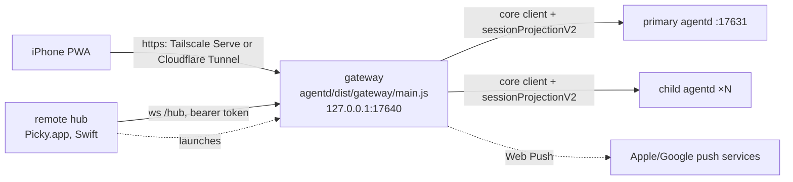

# Remote PWA implementation

Status: implementation spec for the remote PWA in `docs/remote-pwa-plan.md` (stages 1 to 4). The plan owns the product decisions; this document owns how the pieces fit and the rules each piece must keep. Wire contracts are code: `agentd/src/remote/protocol.ts` (PWA and gateway) and `agentd/src/remote/hub-protocol.ts` (hub and gateway), with examples in `contracts/remote/hub/`.

## 1. Topology

Two changes from the plan's "구조" section, both recorded in `.audit/remote-pwa-build.tsv` and plan decisions 8 and 9:

1. **Frames come straight from the daemons.** The gateway connects to every daemon the hub reports as a `core` client that registers `sessionProjectionV2`, so each daemon bootstraps it with snapshots and then streams transactions. The app does not relay frames. Swift drops the raw frame JSON after decoding (`Picky/PickyAgentClient.swift` `decodeFrame`) and its projection types are decode-only, while the daemon broadcaster already supports several subscribers and gates recovery per socket (`agentd/src/server.ts` `registerAppCapabilities`, `application/session-projection-recovery.ts`).
2. **Session commands go straight to the owning daemon.** The HUD's session commands validate and then send one daemon command (`PickySessionViewModel.followUp` sends `followUp {sessionId, text}`). The gateway sends those same commands. What remains in the app is UI side effects the plan says the phone must avoid (`select`, restoring queued text into the Mac composer). The hub handles only actions the app owns: creating a Pickle (child daemon spawn), the main conversation (remote-owned context so the Mac stays silent), unread state, archive, and dictation. CLI entry commands (`submitMainFromExternal`, `createPickleFromExternal`, `controlPickle`) are never used.

Session ownership: every daemon shares one session store, so the primary also lists sessions a child hosts. Frames for session `S` are taken from the child the hub lists for `S`, otherwise from the primary (`docs/per-pickle-daemon-topology.md` 1 and 3).

## 2. Gateway

Node process in the agentd package. Entry `agentd/src/gateway/main.ts`, built to `agentd/dist/gateway/main.js`. It is the only process that accepts input from outside the Mac.

### 2.1 Process

| Env | Meaning |
|---|---|
| `PICKY_GATEWAY_PORT` | Listen port on `127.0.0.1` (default `17640`). Never binds another address. |
| `PICKY_GATEWAY_HUB_TOKEN` | Required. Bearer token the hub presents on `/hub`. |
| `PICKY_APP_SUPPORT_DIR` | App support root. Gateway data lives in `<root>/Remote/`. |
| `PICKY_GATEWAY_WEB_ROOT` | Optional. Directory with the built PWA; defaults to `../web/` next to the compiled entry (`dist/web/`). |
| `PICKY_AGENTD_PARENT_PID` | Parent watchdog, same as agentd (`agentd/src/parent-watchdog.ts`). |

Readiness: print `picky-gateway listening on 127.0.0.1:<port>` once the server listens. SIGINT/SIGTERM close sockets and exit 0.

Data in `<root>/Remote/` (directory mode 0700, files 0600): `devices.json` (devices with token hashes and push subscriptions), `vapid.json`, `audit.jsonl` (rotated at 5 MB, 3 kept), `uploads/` (deleted after 7 days), `tmp/` (dictation recordings, deleted after use).

### 2.2 HTTP routes

| Route | Auth | Purpose |
|---|---|---|
| `GET /`, `/room/*`, `/pair`, `/settings`, static assets | none | PWA shell; unknown non-API paths serve `index.html` |
| `GET /sw.js`, `/manifest.webmanifest` | none | Service worker at root scope, manifest |
| `GET /api/me` | cookie optional | `RemoteMeResponse` |
| `POST /api/pair` | none, rate limited | `RemotePairRequest`; sets the device cookie |
| `POST /api/unpair` | cookie | Removes this device |
| `GET /api/ws` | cookie | WebSocket upgrade, `RemoteClientMessage` / `RemoteServerMessage` |
| `POST /api/uploads` | cookie | Raw image body, `RemoteUploadResponse` |
| `GET /api/uploads/:id` | cookie | Thumbnail/original of an upload for the composer chip |
| `GET /api/files/meta` | cookie | `RemoteFileMetaResponse` for a path referenced by a session |
| `GET /api/files/raw` | cookie | Bytes of a referenced image, PDF, HTML or SVG |
| `POST /api/dictation` | cookie | Raw audio body, `RemoteDictationResponse` |
| `GET /api/push/key` | cookie | `{ publicKey }` |
| `POST /api/push/subscription` / `DELETE` | cookie | Save or remove this device's subscription |
| `POST /api/push/test` | cookie | Sends a test notification to this device |
| `GET /hub` | hub bearer token, loopback peer only | Hub WebSocket |

### 2.3 Security rules

- **Device token.** 32 random bytes, base64url. Cookie `picky_remote`: `HttpOnly; SameSite=Lax; Path=/; Max-Age=31536000`, plus `Secure` when the request is https (section 2.4). Only `sha256(token)` is stored.
- **Pairing.** Only while the hub has started pairing (`hub.pairing.start`). Code: 8 characters from `23456789ABCDEFGHJKMNPQRSTVWXYZ`, shown `XXXX-XXXX`, case- and dash-insensitive, single use, 5 minutes, one active code. Five wrong guesses end the code (`gateway.pairing.ended` reason `exhausted`).
- **Lockout.** Per client IP: 5 failures (wrong pairing code, or a cookie that matches no device) in 10 minutes block the IP for 15 minutes with 429. Client IP is `CF-Connecting-IP` (Cloudflare overwrites it at the edge), else the right-most `X-Forwarded-For` entry (the one the local tunnel appended; earlier entries come from the client), else the socket address.
- **Same origin.** The WebSocket upgrade and every non-GET `/api` request must carry an `Origin` whose host equals the request host (`X-Forwarded-Host` when present, else `Host`). A `Sec-Fetch-Site` other than `same-origin` or `none` is rejected.
- **Revocation.** Removing a device closes its sockets at once (close code 4401) and its cookie stops working.
- **Headers on every response:** `X-Content-Type-Options: nosniff`, `Referrer-Policy: no-referrer`, `Cross-Origin-Opener-Policy: same-origin`, `Permissions-Policy: camera=(self), microphone=(self), geolocation=()`.
- **CSP on the app shell:** `default-src 'self'; script-src 'self'; style-src 'self'; img-src 'self' blob: data:; media-src 'self' blob:; connect-src 'self' wss://<host> ws://<host>; worker-src 'self'; manifest-src 'self'; frame-src 'self'; frame-ancestors 'self'; object-src 'none'; base-uri 'none'; form-action 'self'`.
- **Mac files** (`/api/files/*`, plan "파일 미리보기"): the requested path is resolved like the HUD (`Picky/HUD/Conversation/Bubbles/PickyMarkdownLinkHandler.swift`: relative to the session `cwd`, `~` is home, standardized), then `realpath`. It must equal the realpath of a path the session references: markdown link targets in messages, string `path`/`file_path`/`filePath`/`paths` arguments of tool calls, artifact paths, changed file paths (relative to `cwd`), and tool image paths. Images are sniffed by magic bytes and capped at 20 MB. HTML and SVG get `Content-Security-Policy: sandbox; default-src 'none'; img-src data:; style-src 'unsafe-inline'; font-src data:` and are shown in a sandboxed iframe. Text previews return the first 1 MB.
- **Limits.** JSON bodies 1 MB, uploads 20 MB, dictation 15 MB, WebSocket inbound frames 1 MB (`REMOTE_LIMITS`).
- **Audit log.** One JSON line per pairing attempt, revocation, command (type, session, text length; the full command line for `!` shell messages), file access, upload and push subscription. Message text, recordings and transcripts are not logged.

### 2.4 Request scheme

The gateway only listens on loopback, so a request whose host is not `localhost`/`127.0.0.1` came through Tailscale Serve or a tunnel and is https. `X-Forwarded-Proto: https` also counts. Plain http on localhost is the local test path: the cookie has no `Secure`, and `RemoteMeResponse.insecure` is true so the PWA can say push is unavailable.

### 2.5 Daemon links

For each daemon in `hub.daemons`: connect with `Authorization: Bearer <token>`, wait for `hello`, send `registerAppCapabilities { capabilities: ["sessionProjectionV2"], profile: "core" }` (command `id` doubles as the bootstrap id), then fold `sessionProjectionSnapshot` / `sessionProjectionTransaction` with `agentd/src/domain/session-projection-reducer.ts`. The primary link also sends `listMainMessages` and follows `mainMessageAppended`, `mainActivityUpdated`, `mainExtensionUiRequested`, `mainExtensionUiCancelled`, `mainTurnSettled`. Reconnect with backoff (0.5 s doubling to 10 s). Commands carry `protocolVersion` from `agentd/src/protocol-base.ts` and resolve on `ack` or `error` with the same `commandId` (10 s timeout).

When a client opens a room the gateway sends the newest snapshot it holds; if that snapshot is incomplete it first asks the owner with `getSessionProjectionSnapshot`. Afterwards it forwards each accepted transaction. An owner switch or epoch change sends a fresh snapshot.

### 2.6 Rooms

The room list is rebuilt (debounced 150 ms) from projections plus `hub.overlay`: the main room first (`MAIN_ROOM_ID`, title "Picky"), then sessions in `activeSessionIds` and `archivedSessionIds` (without an overlay: every session, archived by the projection flag). Order: pinned, then `updatedAt` descending. `preview` prefers a pending question prompt, then `lastSummary`, then the last assistant message. Status presentation uses `agentd/src/remote/status-presentation.ts`.

### 2.7 Commands

| `RemoteCommand` | Goes to | Daemon command / hub request |
|---|---|---|
| `session.send` | owner daemon | `steer` or `followUp` `{ sessionId, text }` |
| `session.schedule` | owner daemon | `scheduleMessage` |
| `session.abort` | owner daemon | `abort { scope }` |
| `session.answer` | owner daemon | `answerExtensionUi` (cancel is `{ cancelled: true }`, as `PickySessionViewModel.cancelExtensionUi`) |
| `session.queue.*`, `session.scheduled.*` | owner daemon | `removeQueuedInput`, `editQueuedFollowUp`, `sendQueuedFollowUpNow`, `clearQueue`, `cancelScheduledMessage`, `sendScheduledMessageNow`, `editScheduledMessage` |
| `session.setModel` / `setThinking` / `setFast` / `setNotify` | owner daemon | `setSessionModel`, `setSessionThinkingLevel`, `setSessionFastMode`, `setNotifyMainOnCompletion` / `setNotifyMacOSOnCompletion` |
| `session.markRead`, `session.archive` | hub | same-named `HubRequest` |
| `pickle.create` | hub, then owner daemon | `pickle.create`; when `text` is set, the gateway waits up to 15 s for the session to appear and sends `followUp` |
| `main.send`, `main.abort`, `main.answer` | hub | same-named `HubRequest` |

Text with uploads is built like `PickyConversationComposerView.submissionText`: attachment paths joined by newlines after the trimmed draft, and a leading space when the result starts with `!` (so attachments never become `!` shell arguments). `commandId`s are remembered per device (last 1000); a repeat returns the first result instead of running again. Commands for a room fail with `macOffline` while the hub is disconnected.

### 2.8 Push

VAPID keys (P-256) are created on first start. Payloads use `aes128gcm` (RFC 8291) and VAPID JWTs (RFC 8292) with Node `crypto`, no dependency. The subject is `hub.config.publicUrl`; without it, push is off. Endpoints must be on `fcm.googleapis.com`, `*.push.apple.com`, `updates.push.services.mozilla.com` or `*.notify.windows.com`. At most 5 subscriptions per device; a 404 or 410 deletes the subscription.

Triggers (per device; skipped while that device has the room open and visible): a room gains a pending question; a session becomes `completed`; a session becomes `failed` or `blocked`; a main reply arrives within 30 minutes of a `main.send` from that device. One notification per room per 10 seconds. The badge counts rooms with a pending question.

## 3. Remote hub (Swift)

Lives in `Picky/Remote/`; the settings UI in `Picky/Hub/Settings/`. Responsibilities:

1. **Gateway process.** While remote access is on: launch `node <agentdRoot>/dist/gateway/main.js` with the env of 2.1, resolving Node and the agentd root the same way `PickyAgentDaemonLauncher` does. Logs go to `Logs/gateway.stdout.log` / `gateway.stderr.log`. Restart with backoff if it exits while enabled; stop when turned off or when the app quits.
2. **Hub socket.** `ws://127.0.0.1:<port>/hub` with the bearer token, reconnecting. Send `hub.hello`, `hub.daemons`, `hub.overlay`, `hub.config` on connect and again when they change (overlay throttled to 300 ms, sent only when different). Subscribe to narrow publishers; never re-render HUD views (`docs/perf-profiling.md`).
3. **Requests.** `pickle.create` (`createEmptyPickleSession(cwd:)` without opening or selecting the card on the Mac), `main.send` (context without screen capture, registered first as a new `PickyContextOwner` case `.remote` that shows no cursor bubble and plays no voice), `main.abort`, `main.answer`, `session.markRead` (`markSessionRead`), `session.archive`, `dictation.transcribe` (decode the file to PCM buffers, feed a session from `BuddyTranscriptionProviderFactory.makeDefaultProvider()`, delete the file). Never open a system permission prompt for a remote request.
4. **Settings UI** "원격 접속": on/off, status, entrance (Tailscale Serve with on/off buttons that run `tailscale serve`, Cloudflare Tunnel URL, or local only), connect-a-phone sheet with QR (`<publicUrl>/#pair=<code>`) and code, device list with revoke, keep-awake toggle, and the speech recognition pre-grant from plan "폰 받아쓰기".

## 4. PWA

Source `agentd/web/`, built by `agentd/web/build.mjs` (esbuild) into `agentd/dist/web/`. Preact + TSX, `@preact/signals` for state, `marked` (lexer only) for markdown, `jsqr` for the in-app QR scanner. The session reducer is imported from `agentd/src/domain/session-projection-reducer.ts`, wire types from `agentd/src/remote/protocol.ts`.

- **Same look as the HUD.** Port the reviewed prototypes in `docs/prototypes/picky-remote-pwa/` (tokens, base, room list, header, chat bubbles, presence and activity, question, composer). `tokens.css` is generated from the Swift design system by the prototype tool and copied verbatim.
- **Copy** comes from `Picky/Resources/Localizable.xcstrings` (keys extracted at build time), plus phone-only keys in `agentd/web/i18n/remote-strings.json` (ko and en, reviewed with `.agents/skills/picky-ux-writing/SKILL.md`).
- **Bundle hygiene.** Browser code imports runtime values only from `agentd/src/remote/constants.ts`, `agentd/src/remote/status-presentation.ts` and `agentd/src/domain/session-projection-reducer.ts` (about 3.5 KB gzip together). `agentd/src/protocol.ts` and `agentd/src/remote/protocol.ts` are `import type` only: their runtime values pull in zod and every daemon schema (about 100 KB gzip).
- **No HTML strings.** Markdown and agent output render to VNodes; `dangerouslySetInnerHTML` and `innerHTML` are banned outside the sandboxed preview iframe. Links: `http(s)` open in the browser, local paths open the file preview, anything else is plain text.
- **Routes.** `/` room list, `/room/<id>` conversation (`main` for Picky), `/settings`, `/pair` (also `#pair=<code>` on any route).
- **Service worker** (`/sw.js`): caches the shell for offline start, network-only for `/api`, shows push notifications, opens `/room/<id>` on click, sets the app badge.
- **Demo mode.** `?demo=1` swaps the gateway transport for an in-browser fixture transport so every screen renders without a Mac.

## 5. Dev harness and tests

`pnpm --dir agentd run dev:remote` starts a mock-runtime primary agentd (temporary app support dir, port 17732), the gateway (port 17741) and a Node stand-in for the hub that reports the mock daemon, a small overlay, and answers hub requests (`pickle.create` and `main.send` through the mock daemon, `dictation.transcribe` with fixed text). It starts pairing and prints the URL and code. It never touches the user's running Picky or `~/Library/Application Support/Picky`.

Tests: gateway units and an end-to-end test over real sockets (gateway, mock daemon, stand-in hub, WebSocket client) in `agentd/src/gateway/*.test.ts`; shared rules in `agentd/src/remote/*.test.ts`; Swift Testing suites `PickyTests/PickyRemote*Tests.swift` that decode `contracts/remote/hub/` and drive the request handler with fakes; browser checks at 390 pt in light and dark from the demo mode and the dev harness. `pnpm --dir agentd run check:web-taps` (web/tools/hit-test.mjs, needs Chrome) checks that every visible control on the demo screens receives a tap at its center; screenshots cannot show a transparent layer that swallows taps.

## 6. Packaging

`agentd/package.json` `build` compiles TypeScript and then runs the web build, so `dist/gateway/` and `dist/web/` ship inside `Picky.app/Contents/Resources/agentd` through `scripts/package-agentd-runtime.sh`. Remote access is off by default and nothing listens until the user turns it on.
