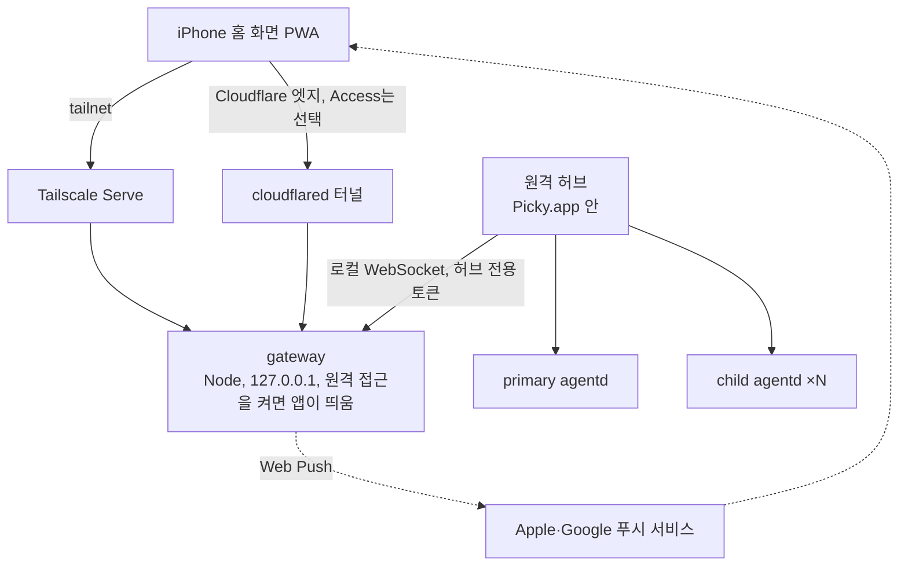

# 원격 PWA 접근 계획

_상태: 결정 확정, 구현 전 · 작성일: 2026-10-04_

Picky와 Pickle 세션은 지금처럼 내 맥에서 실행하고, 밖에서는 폰(iPhone 홈 화면 PWA)으로 보고 조작한다. 실행 위치는 옮기지 않는다. Picky가 운영하는 서버는 두지 않고, 사용자가 고른 망과 맥 앱이 발급한 기기 인증으로만 연결을 연다.

## 범위

- 한다: 세션 목록·상세·진행 상황 실시간 보기, follow-up·steer·중단·질문 응답, Pickle 생성, 메인 대화, 알림, 사진 첨부, 산출물 열람.
- 안 한다: 클라우드·VM 런타임, 세션 이전, Linux 패키징, Picky가 운영하는 중계 서버, 네이티브 iOS 앱.

## 결정 (2026-10-04)

| # | 결정 | 이유 |
|---|---|---|
| 1 | 접속 망은 Tailscale Serve와 Cloudflare Tunnel을 모두 지원하고 사용자가 고른다 | Tailscale은 한 기기가 동시에 tailnet 하나만 쓸 수 있다([문서](https://tailscale.com/kb/1225/fast-user-switching)). 회사 tailnet을 쓰는 사람은 개인 tailnet을 함께 붙일 수 없다 |
| 2 | 원격 권한은 셸을 포함해 전부 허용한다. 폰은 HUD와 같은 권한을 가진다 | 에이전트가 어차피 bash를 실행하므로 `!` 직접 실행만 막아도 얻는 것이 적다. 대신 기기 토큰이 곧 맥 셸 열쇠가 되므로 페어링과 기기 해제가 핵심 방어선이다 |
| 3 | 원격 입력용 프로토콜 출처 값을 새로 만들지 않는다. 허브는 HUD가 쓰는 앱 내부 명령을 그대로 호출한다 | 데몬이 HUD 입력과 똑같이 받으므로 경험이 같아진다. CLI 진입 명령을 쓰면 경험이 달라진다([경험 동일성 규칙](#경험-동일성-규칙)) |
| 4 | local-first 규칙을 좁혀서 고친다 | Picky 운영 백엔드와 계정 인증은 계속 두지 않는다. 원격 접속은 기본 꺼짐이고, 사용자가 고른 망과 앱이 페어링한 기기로만 연다. `AGENTS.md`와 `ARCHITECTURE.md`에 반영했다 |

## 구조

- **PWA:** 정적 SPA와 서비스 워커로 만든다. 세션 상태는 `agentd/src/domain/session-projection-reducer.ts`로 계산한다. `contracts/projection/conformance/` 시나리오가 Swift reducer와 같은 결과를 보장한다.
- **gateway:** agentd 패키지에 별도 entry로 둔다. 하는 일은 PWA 파일 제공, 페어링과 기기 토큰 발급, 허용 목록 API, 명령 id 중복 제거, Web Push 발송, 감사 로그다. 외부 입력을 받는 코드는 이 프로세스에만 둔다.
- **원격 허브:** 앱이 gateway에 클라이언트로 접속한다. 앱에는 서버 코드를 두지 않는다.
  - 목록: 레지스트리 읽기 모델을 쓴다.
  - 상세: 소유권 원장이 승인한 v2 프레임을 그대로 중계한다.
  - 명령: HUD와 같은 앱 내부 명령(`Picky/HUD/Conversation/PickySessionCommands.swift`)으로 실행한다.
- **agentd 데몬:** 바꾸지 않는다.

허브를 앱 안에 두는 이유는 두 가지다.
- child 세션의 실시간 상태와 소유권 판정(`Picky/Sessions/Projection/PickyProjectionOwnershipLedger.swift`)이 앱에만 있다.
- 데몬은 앱이 꺼지면 같이 꺼진다(`agentd/src/main.ts`의 parent watchdog). 그래서 원격 접속 중에도 앱은 어차피 켜져 있어야 한다.

맥이 잠들거나 앱이 꺼지면 폰에서 접속할 수 없다.

## 보안

전제는 원격 권한이 곧 맥 셸 권한이라는 점이다(결정 2).

**두 경로 공통 (gateway)**
- 페어링은 맥 앱에서 등록 모드를 켤 때만 가능하다. 맥 화면에 QR을 띄우고, 설치한 홈 화면 앱 안에서 스캔한다. 코드는 한 번만 쓸 수 있고 몇 분 뒤 만료된다.
- iOS 홈 화면 앱은 Safari와 쿠키·저장소가 분리되어 있다([WWDC23](https://developer.apple.com/videos/play/wwdc2023/10120/)). Safari에서 페어링하면 인증이 앱에 남지 않으므로 반드시 앱 안에서 한다.
- 기기 토큰은 추측할 수 없는 길이의 난수로 만들고, gateway 출처의 HttpOnly 쿠키에 담는다. 짧은 숫자 코드를 쓰게 되면 시도 횟수 제한이 반드시 있어야 한다.
- 인증 실패가 반복되면 IP와 기기 단위로 차단한다. 인증 없이 열리는 것은 PWA 정적 파일과 페어링 엔드포인트뿐이다.
- 기기 목록과 해제는 맥에서 한다. 해제하면 그 기기의 연결은 즉시 끊긴다. 원격 명령은 감사 로그에 남긴다.

**Tailscale 경로**
- Serve는 tailnet 멤버만 접근할 수 있고 공개 인터넷에 노출되지 않는다([문서](https://tailscale.com/docs/features/tailscale-serve)). 아이폰도 같은 tailnet에 들어가 있어야 한다.

**Cloudflare 경로**
- 터널은 맥에서 밖으로만 연결하므로 맥에 열린 포트가 없다([문서](https://developers.cloudflare.com/cloudflare-one/networks/connectors/cloudflare-tunnel/)).
- 모든 플랜에 DDoS 방어가 기본으로 들어 있다([문서](https://developers.cloudflare.com/ddos-protection/about/)).
- 무료 플랜의 레이트 리밋은 규칙 1개, IP 기준, 집계·차단 모두 10초다([문서](https://developers.cloudflare.com/waf/rate-limiting-rules/)). 세밀한 조정은 어렵다.
- Access는 선택 계층이다. Access 정책을 통과한 사용자만 맥까지 오고, `access.required`를 켜면 cloudflared가 Access JWT 없는 요청을 거부한다([문서](https://developers.cloudflare.com/cloudflare-one/networks/connectors/cloudflare-tunnel/configure-tunnels/origin-parameters/)). Access 일회용 코드의 시도 횟수 제한은 공식 문서에서 찾지 못했다.
- 공개 호스트네임을 쓰려면 Cloudflare에 올린 도메인이 필요하다. Quick Tunnel은 테스트용이라 쓰지 않는다([문서](https://developers.cloudflare.com/tunnel/setup/)).

## 경험 동일성 규칙

허브는 CLI 진입 명령(`submitMainFromExternal`, `createPickleFromExternal`, `controlPickle`)을 쓰지 않는다. 쓰면 다음처럼 달라진다.

- 폰에서 보낸 메인 대화의 답을 맥이 커서 말풍선과 음성으로 낸다. `cli` 출처는 `.cli` 소유자로 바뀌고, 이 소유자는 커서 표시와 음성을 쓴다(`Picky/Interaction/PickyInteractionReducer.swift`의 `applyQuickReply`, `Picky/Interaction/PickyInteractionState.swift`의 `usesCursorResponsePresentation`).
- Pickle이 HUD에서 만들 때처럼 전용 child 데몬에 생기지 않고 primary 데몬에 생긴다. 제목과 지시도 반드시 필요하다(`agentd/src/protocol.ts`의 `createPickleFromExternal`, `docs/per-pickle-daemon-topology.md`).
- steer, follow-up, 중단 말고는 할 수 없다(`agentd/src/protocol.ts`의 `controlPickle`).

맥 쪽에서 생기는 차이는 앱이 처리한다.

- 폰 메인 대화는 화면 캡처 없이 컨텍스트를 만든다. 허브가 그 context id를 앱 내부의 원격 소유로 먼저 등록해서 맥 말풍선과 음성을 끈다. 프로토콜 변경은 없다.
- 폰 조작이 맥 HUD에서 선택된 세션을 바꾸지 않게 한다. 지금 `PickySessionViewModel.followUp`은 `select`를 호출한다.
- `abortRestoringQueuedInputs`는 대기 입력을 맥 composer에 되돌린다. 폰에서 중단할 때는 폰 쪽으로 되돌리는 처리가 따로 필요하다.

`remote` 출처 값은 모델이 "사용자가 맥 앞에 없다"는 것을 알아야 하는 문제가 3단계에서 확인될 때만 추가한다. `docs/telegram-remote-main-mvp-plan.md`도 같은 이유로 `remote`를 제안해 두었으므로, 추가하게 되면 함께 진행한다.

## 단계와 통과 기준

1. **맥 안에서 읽기 전용 (외부 노출 없음)**
   - 만들 것: gateway와 원격 허브, 목록·상세·진행 상황·메인 대화 보기.
   - 통과 기준:
     - mock 런타임에서 HUD로 만든 child Pickle의 진행이 localhost 브라우저에 실시간으로 보인다.
     - child 해제나 앱 재연결 뒤에도 웹 reducer 상태가 HUD와 같다.
     - 인증되지 않은 연결은 거부된다.
2. **밖에서 접속·설치**
   - 만들 것: 입구 2종, 앱 안 QR 페어링, 기기 목록과 해제, 실패 반복 차단, manifest와 서비스 워커.
   - 통과 기준:
     - 두 입구 모두에서 아이폰 홈 화면 앱이 페어링 후 목록을 본다.
     - 해제한 기기의 연결은 즉시 끊긴다.
     - iOS 홈 화면 앱에서 Access 로그인이 유지되는지 실기기로 확인한다.
3. **폰에서 제어**
   - 만들 것: HUD 명령 재사용(입력, 중단, 질문 응답, `!` 셸, Pickle 생성, 메인 대화), 명령 id 중복 제거, 맥 말풍선·음성 끄기.
   - 통과 기준:
     - 재연결 뒤 같은 명령 id를 다시 보내도 follow-up은 한 번만 들어간다.
     - 폰에서 질문에 답하면 Pickle이 이어서 진행한다.
     - 폰에서 보낸 메인 대화에 맥이 말하지 않는다.
4. **알림·첨부·가용성**
   - 만들 것: Web Push(질문 대기, 완료, 실패), 사진 첨부, 산출물 열람, 잠자기 방지 옵션, 감사 로그.
   - 통과 기준:
     - 잠긴 폰에 질문 대기 알림이 온다.
     - 산출물 목록에 없는 경로를 요청하면 거부된다.

## 열린 확인 사항

- iOS 홈 화면 앱에서 Access 로그인이 유지되는지 확인한다(2단계 실기기). 범위 밖 링크는 Safari View Controller로 열리므로, 로그인 뒤 쿠키가 앱에 남는지 확실하지 않다. 안 되면 Cloudflare 경로는 Access 없이 gateway 인증과 엣지 방어로 운영한다.
- 허브가 요청한 복구 스냅샷이 앱 자신의 projection 처리와 섞이는지 확인한다(1단계 첫 작업). 복구 프레임에는 `requestId`가 붙어 있다.
- 앱 메인 스레드의 중계 비용을 측정한다. 원격에서 연 세션만 중계하고, 측정은 `docs/perf-profiling.md` 방식으로 한다.
- 홈 화면 앱 안에서 카메라로 QR을 스캔할 수 있는지 확인한다(2단계). 안 되면 코드 입력 방식에 시도 횟수 제한을 둔다.
- 텔레그램 원격 계획과의 관계를 정한다. 같은 원격 감독 수요를 다루므로 둘 다 진행할지 결정해야 한다.
