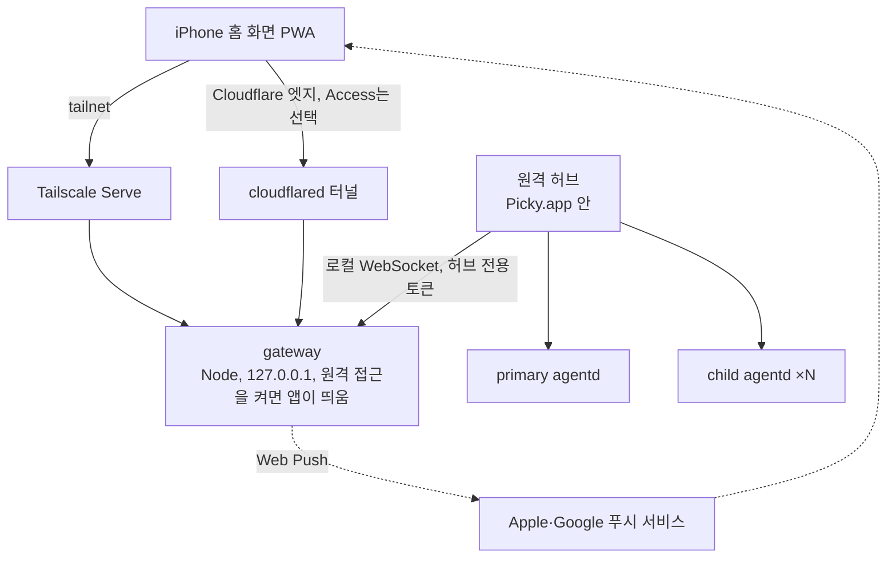

# 원격 PWA 접근 계획

_상태: 결정 확정, 구현 전 · 작성일: 2026-10-04_

Picky와 Pickle 세션은 지금처럼 내 맥에서 실행하고, 밖에서는 폰(iPhone 홈 화면 PWA)으로 보고 조작한다. 실행 위치는 옮기지 않는다. Picky가 운영하는 서버는 두지 않고, 사용자가 고른 망과 맥 앱이 발급한 기기 인증으로만 연결을 연다.

## 범위

- 한다: 세션 목록·상세·진행 상황 실시간 보기, follow-up·steer·중단·질문 응답, Pickle 생성, 메인 대화, 알림, 사진 첨부, 산출물 열람.
- 안 한다: 클라우드·VM 런타임, 세션 이전, Linux 패키징, Picky가 운영하는 중계 서버, 네이티브 iOS 앱, 다른 앱에서 공유해 보내기(Web Share Target은 iOS Safari가 지원하지 않는다, [MDN](https://developer.mozilla.org/en-US/docs/Web/Progressive_web_apps/Manifest/Reference/share_target#browser_compatibility)).

## 결정 (2026-10-04)

| # | 결정 | 이유 |
|---|---|---|
| 1 | 접속 망은 Tailscale Serve와 Cloudflare Tunnel을 모두 지원하고 사용자가 고른다 | Tailscale은 한 기기가 동시에 tailnet 하나만 쓸 수 있다([문서](https://tailscale.com/kb/1225/fast-user-switching)). 회사 tailnet을 쓰는 사람은 개인 tailnet을 함께 붙일 수 없다 |
| 2 | 원격 권한은 셸을 포함해 전부 허용한다. 폰은 HUD와 같은 권한을 가진다 | 에이전트가 어차피 bash를 실행하므로 `!` 직접 실행만 막아도 얻는 것이 적다. 대신 기기 토큰이 곧 맥 셸 열쇠가 되므로 페어링과 기기 해제가 핵심 방어선이다 |
| 3 | 원격 입력용 프로토콜 출처 값을 새로 만들지 않는다. 허브는 HUD가 쓰는 앱 내부 명령을 그대로 호출한다 | 데몬이 HUD 입력과 똑같이 받으므로 경험이 같아진다. CLI 진입 명령을 쓰면 경험이 달라진다([경험 동일성 규칙](#경험-동일성-규칙)) |
| 4 | local-first 규칙을 좁혀서 고친다 | Picky 운영 백엔드와 계정 인증은 계속 두지 않는다. 원격 접속은 기본 꺼짐이고, 사용자가 고른 망과 앱이 페어링한 기기로만 연다. `AGENTS.md`와 `ARCHITECTURE.md`에 반영했다 |
| 5 | PWA는 새 메신저 기획으로 만든다. Picky와 Pickle을 방 목록에 방처럼 보여 주고, 방 안은 HUD 대화 카드와 똑같이 보여 준다 | 폰에서 익숙한 구조다. HUD 대화 카드는 이미 메신저형(날짜 구분선, 전송 시각, 작업 중 표시)이고 최소 폭 360pt까지 지원해 iPhone 폭에 들어간다. 메신저 B 명세(`docs/picky-b-messenger-ux-spec.md`)와는 별개라서 중단 버튼 제거와 steer 단일화는 적용하지 않는다 |

## 구조

- **PWA:** 정적 SPA와 서비스 워커로 만든다. 세션 상태는 `agentd/src/domain/session-projection-reducer.ts`로 계산한다. `contracts/projection/conformance/` 시나리오가 Swift reducer와 같은 결과를 보장한다.
- **gateway:** agentd 패키지에 별도 entry로 둔다. 하는 일은 PWA 파일 제공, 페어링과 기기 토큰 발급, 허용 목록 API, 명령 id 중복 제거, Web Push 발송, 감사 로그다. 외부 입력을 받는 코드는 이 프로세스에만 둔다.
- **원격 허브:** 앱이 gateway에 클라이언트로 접속한다. 앱에는 서버 코드를 두지 않는다.
  - 목록: 레지스트리 읽기 모델을 쓴다.
  - 상세: 소유권 원장이 승인한 v2 프레임을 그대로 중계한다.
  - 명령: HUD와 같은 앱 내부 명령(`Picky/HUD/Conversation/PickySessionCommands.swift`)으로 실행한다.
- **agentd 데몬:** 바꾸지 않는다.

허브를 앱 안에 두는 이유는 두 가지다.
- child 세션의 실시간 상태와 소유권 판정(`Picky/Sessions/Projection/PickyProjectionOwnershipLedger.swift`)이 앱에만 있다.
- 데몬은 앱이 꺼지면 같이 꺼진다(`agentd/src/main.ts`의 parent watchdog). 그래서 원격 접속 중에도 앱은 어차피 켜져 있어야 한다.

맥이 잠들거나 앱이 꺼지면 폰에서 접속할 수 없다.

## 보안

전제는 원격 권한이 곧 맥 셸 권한이라는 점이다(결정 2).

**두 경로 공통 (gateway)**
- 페어링은 맥 앱에서 등록 모드를 켤 때만 가능하다. 맥 화면에 QR을 띄우고, 설치한 홈 화면 앱 안에서 스캔한다. 코드는 한 번만 쓸 수 있고 몇 분 뒤 만료된다.
- iOS 홈 화면 앱은 Safari와 쿠키·저장소가 분리되어 있다([WWDC23](https://developer.apple.com/videos/play/wwdc2023/10120/)). Safari에서 페어링하면 인증이 앱에 남지 않으므로 반드시 앱 안에서 한다.
- 기기 토큰은 추측할 수 없는 길이의 난수로 만들고, gateway 출처의 쿠키(`HttpOnly`, `Secure`, `SameSite=Lax`)에 담는다. 맥에는 토큰의 해시만 저장한다. 짧은 숫자 코드를 쓰게 되면 시도 횟수 제한이 반드시 있어야 한다.
- WebSocket 업그레이드와 상태를 바꾸는 요청은 자기 출처에서 온 것만 받는다(`Origin`, `Sec-Fetch-Site` 확인). 다른 사이트의 페이지가 사용자의 쿠키를 빌려 명령을 보내지 못하게 한다.
- 인증 실패가 반복되면 IP와 기기 단위로 차단한다. 초기값은 같은 IP에서 10분에 5회 실패하면 15분 차단, 페어링 코드는 5회 틀리면 폐기다. Cloudflare 경로의 실제 접속 IP는 `CF-Connecting-IP`에서 읽는다. 인증 없이 열리는 것은 PWA 정적 파일과 페어링 엔드포인트뿐이다.
- 맥에 있는 파일(도구가 읽은 이미지, 산출물, 대화 속 파일 링크)은 그 세션의 메시지와 산출물에 기록된 경로만, 실제 경로로 정규화한 뒤 제공한다. 이미지는 확장자와 파일 첫 바이트로 형식을 확인하고 크기 상한을 둔다. SVG와 HTML 산출물은 CSP `sandbox`로 스크립트를 막거나 다른 출처로 격리해 연다.
- 기기 목록과 해제는 맥에서 한다. 해제하면 그 기기의 연결은 즉시 끊긴다. 원격 명령은 감사 로그에 남긴다.

**Tailscale 경로**
- Serve는 tailnet 멤버만 접근할 수 있고 공개 인터넷에 노출되지 않는다([문서](https://tailscale.com/docs/features/tailscale-serve)). 아이폰도 같은 tailnet에 들어가 있어야 한다.
- tailnet IP에 http로만 열면 보안 컨텍스트가 아니라서 서비스 워커와 Web Push가 동작하지 않는다. pi-pocket도 알림에는 https가 필요하다며 `tailscale serve`를 앞에 두라고 안내한다. 그래서 처음부터 Serve를 쓴다.

**Cloudflare 경로**
- 터널은 맥에서 밖으로만 연결하므로 맥에 열린 포트가 없다([문서](https://developers.cloudflare.com/cloudflare-one/networks/connectors/cloudflare-tunnel/)).
- 모든 플랜에 DDoS 방어가 기본으로 들어 있다([문서](https://developers.cloudflare.com/ddos-protection/about/)).
- 무료 플랜의 레이트 리밋은 규칙 1개, IP 기준, 집계·차단 모두 10초다([문서](https://developers.cloudflare.com/waf/rate-limiting-rules/)). 세밀한 조정은 어렵다.
- Access는 선택 계층이다. Access 정책을 통과한 사용자만 맥까지 오고, `access.required`를 켜면 cloudflared가 Access JWT 없는 요청을 거부한다([문서](https://developers.cloudflare.com/cloudflare-one/networks/connectors/cloudflare-tunnel/configure-tunnels/origin-parameters/)). Access 일회용 코드의 시도 횟수 제한은 공식 문서에서 찾지 못했다.
- 공개 호스트네임을 쓰려면 Cloudflare에 올린 도메인이 필요하다. Quick Tunnel은 테스트용이고([문서](https://developers.cloudflare.com/tunnel/setup/)) 실행할 때마다 주소가 바뀐다. 홈 화면 앱과 Web Push 구독은 주소(출처)에 묶이므로 주소가 바뀌면 앱을 다시 설치하고 알림을 다시 허용해야 한다. pi-pocket은 Quick Tunnel이 이벤트 스트림을 붙잡아 두는 문제 때문에 롱폴링으로 자동 전환한다. 그래서 쓰지 않는다.

## 경험 동일성 규칙

허브는 CLI 진입 명령(`submitMainFromExternal`, `createPickleFromExternal`, `controlPickle`)을 쓰지 않는다. 쓰면 다음처럼 달라진다.

- 폰에서 보낸 메인 대화의 답을 맥이 커서 말풍선과 음성으로 낸다. `cli` 출처는 `.cli` 소유자로 바뀌고, 이 소유자는 커서 표시와 음성을 쓴다(`Picky/Interaction/PickyInteractionReducer.swift`의 `applyQuickReply`, `Picky/Interaction/PickyInteractionState.swift`의 `usesCursorResponsePresentation`).
- Pickle이 HUD에서 만들 때처럼 전용 child 데몬에 생기지 않고 primary 데몬에 생긴다. 제목과 지시도 반드시 필요하다(`agentd/src/protocol.ts`의 `createPickleFromExternal`, `docs/per-pickle-daemon-topology.md`).
- steer, follow-up, 중단 말고는 할 수 없다(`agentd/src/protocol.ts`의 `controlPickle`).

맥 쪽에서 생기는 차이는 앱이 처리한다.

- 폰 메인 대화는 화면 캡처 없이 컨텍스트를 만든다. 허브가 그 context id를 앱 내부의 원격 소유로 먼저 등록해서 맥 말풍선과 음성을 끈다. 프로토콜 변경은 없다.
- 폰 조작이 맥 HUD에서 선택된 세션을 바꾸지 않게 한다. 지금 `PickySessionViewModel.followUp`은 `select`를 호출한다.
- `abortRestoringQueuedInputs`는 대기 입력을 맥 composer에 되돌린다. 폰에서 중단할 때는 폰 쪽으로 되돌리는 처리가 따로 필요하다.

`remote` 출처 값은 모델이 "사용자가 맥 앞에 없다"는 것을 알아야 하는 문제가 3단계에서 확인될 때만 추가한다. `docs/telegram-remote-main-mvp-plan.md`도 같은 이유로 `remote`를 제안해 두었으므로, 추가하게 되면 함께 진행한다.

## 화면

결정 5를 따른다. 대화방은 HUD를 옮기는 작업이고, 방 목록만 새로 설계한다.

### 방 목록 (기본안, 목업 검수에서 확정)

- 맨 위에 Picky 방(메인 대화)을 고정하고, 그 아래 Pickle 방을 최근 활동 순으로 둔다. 고정한 Pickle은 Picky 방 바로 아래에 둔다.
- 행에는 제목, 상태(아이콘과 글자를 함께 써서 색만으로 구분하지 않는다), 마지막 요약 한 줄, 시각, 읽지 않음 표시를 둔다.
- Dock 그룹은 목록 위 필터로 보여 준다. 보관한 Pickle은 목록 맨 아래 "보관함"에서 연다.
- 읽음 상태는 맥과 공유한다. 단일 출처는 앱의 `PickySessionViewModel.unreadSessionIDs`이고, 폰에서 방을 열면 맥 Dock의 읽지 않음 표시도 꺼진다.
- 새 Pickle은 최근·고정 폴더 중에서 골라 만든다(3단계). 폰에서 맥 폴더를 탐색하지 않는다.

### 대화방

- HUD 대화 카드(`Picky/HUD/Conversation/PickyConversationCardView.swift`)의 머리줄, 말풍선 목록, 실행 중 작업 줄, 입력창을 그대로 옮긴다. 말풍선 종류는 `Picky/HUD/Conversation/Bubbles/`에 있는 것(사용자, 에이전트, 질문, 오류, 서브에이전트, 도구 활동, 날짜 구분선, 작업 중 표시)을 따른다.
- HUD 카드는 기본 폭 446pt, 최소 폭 360pt를 지원한다(`Picky/App/Settings/PickySettings.swift`의 `PickyHUDCardSize`). iPhone 세로 폭 375~440pt에서 같은 레이아웃이 다시 배치된다.
- Picky 방도 같은 대화방 구성으로 메인 대화를 보여 준다. 맥에서는 Hub 대화 화면과 커서 말풍선에 나오는 내용이다.
- 폰에서 바뀌는 것:
  - hover로만 보이던 것(말풍선 전송 시각, 보고서로 열기 아이콘, 작업 중 경과 시간)은 탭이나 길게 누르기로 보인다.
  - Option+Return(답 끝나면 보내기) 같은 단축키는 보내기 메뉴에서 고른다.
  - 한글 조합 중 Return은 보내지 않는다(웹 `isComposing`).
  - 누를 수 있는 영역은 44pt 이상으로 둔다.
  - 입력창 마이크는 폰 마이크로 받아쓴 글을 입력란에 넣고, 보내지는 않는다. 맥은 esc로 취소하지만 폰은 듣는 중 줄 끝의 취소 버튼으로 취소한다.
  - 설정 칩 시트(모델, 생각 수준, Fast, 완료 알림)에서 단축키 안내(⌃P, ⌘N)를 뺀다.
  - 백그라운드 작업이 도는 Pickle을 멈추면 HUD처럼 "응답만 중단"과 "백그라운드 작업도 함께 종료"를 묻는다. 웹은 선택지를 넣은 시스템 알림을 띄울 수 없어서 같은 선택지를 직접 그린다.
  - 작업 패널은 결과물·변경사항 탭만 연다. 터미널 탭은 뺀다.
- 도구가 읽은 이미지와 대화 속 파일 링크는 저널에 맥 경로만 있다. 폰에서는 gateway가 썸네일과 원본을 대신 보여 준다(보안 절의 맥 파일 규칙).
- 폰에서 빼는 것: 음성 follow-up, 화면 컨텍스트 지정, 내장 터미널, Pi 터미널 동기화, Dock 드래그. 모두 맥 앞에 있어야 의미가 있는 기능이다.

### 동일성 유지 장치

HUD는 SwiftUI, PWA는 웹이라 공유하는 화면 코드가 없다. 그대로 두면 HUD가 바뀔 때마다 PWA가 뒤처진다. 대상마다 출처를 하나로 두고 차이를 잡는 장치를 붙인다.

| 대상 | 단일 출처 | 장치 |
|---|---|---|
| 세션 상태 | v2 projection | `agentd/src/domain/session-projection-reducer.ts`와 `contracts/projection/conformance/` 시나리오(완료) |
| 문구 | `Picky/Resources/Localizable.xcstrings` (`hud.*` 595개) | 빌드할 때 PWA가 쓰는 키만 JSON으로 추출한다 |
| 색·간격·글꼴 | `Picky/DesignSystem.swift`, `Picky/HUD/PickyHUDTypography.swift` | CSS 변수를 생성하고, 두 값이 어긋나면 실패하는 가드를 둔다 |
| 표시 정책 | 상태 라벨·톤, 도구 요약, 산출물 배지 같은 Swift 정책(`Picky/HUD/PickySessionStatusPresentation.swift` 등) | TS로 옮길 때 언어 중립 fixture로 양쪽을 함께 검증한다. 1-c conformance와 같은 방식이다 |
| 겉모습 | HUD 렌더 갤러리 | 같은 fixture의 HUD PNG와 PWA 스크린샷을 나란히 놓고 비교한다. 글꼴 렌더링이 달라 픽셀 일치는 요구하지 않는다 |

### 출력 렌더링 보안

맥은 마크다운을 SwiftUI `AttributedString`으로 그려 스크립트가 실행되지 않는다. PWA는 에이전트가 읽은 웹페이지나 저장소 내용을 HTML로 그린다. 이 출처의 요청에는 셸 권한 기기 쿠키가 자동으로 붙으므로, 스크립트가 하나라도 실행되면 `!` 명령을 보낼 수 있다. 에이전트 출력은 HTML 정화(sanitize) 후 그리고, CSP로 인라인 스크립트와 외부 스크립트를 막는다. 1단계부터 적용한다.

### 검수 순서

1. 토큰 CSS와 컴포넌트 HTML을 파트별 파일로 만들고, HUD 렌더 갤러리 PNG 옆에 놓고 검수한다. 시안은 `docs/prototypes/picky-remote-pwa/`에 둔다.
2. 검수가 끝나면 화면 목업(방 목록, 대화방, 페어링)을 만든다.
3. 목업 검수 뒤 1단계 구현에 적용한다. 시안은 프레임워크 없이 HTML·CSS로 만들어 구현으로 옮기기 쉽게 둔다.

## 단계와 통과 기준

1. **맥 안에서 읽기 전용 (외부 노출 없음)**
   - 만들 것: gateway와 원격 허브, 방 목록과 대화방 보기(Picky 방 포함), 도구 이미지 썸네일(세션에 기록된 경로만).
   - 통과 기준:
     - mock 런타임에서 HUD로 만든 child Pickle의 진행이 localhost 브라우저에 실시간으로 보인다.
     - child 해제나 앱 재연결 뒤에도 웹 reducer 상태가 HUD와 같다.
     - 인증되지 않은 연결은 거부된다.
2. **밖에서 접속·설치**
   - 만들 것: 입구 2종, 앱 안 QR 페어링, 기기 목록과 해제, 실패 반복 차단, manifest와 서비스 워커.
   - 통과 기준:
     - 두 입구 모두에서 아이폰 홈 화면 앱이 페어링 후 목록을 본다.
     - 해제한 기기의 연결은 즉시 끊긴다.
     - iOS 홈 화면 앱에서 Access 로그인이 유지되는지 실기기로 확인한다.
     - Cloudflare 경로에서 WebSocket이 프록시에 막히거나 늦게 전달되지 않는지 실기기로 확인한다. 막히면 pi-pocket처럼 SSE와 POST 조합으로 바꾼다.
3. **폰에서 제어**
   - 만들 것: 대화방 입력창(HUD와 같은 보내기 방식, 중단과 중지 선택, 예약 전송, 설정 칩), 질문 응답, `!` 셸, Pickle 생성, Picky 방 입력. 모두 HUD 명령을 재사용한다. 명령 id 중복 제거, 맥 말풍선·음성 끄기. 받아쓰기는 방식을 정한 뒤 넣는다.
   - 통과 기준:
     - 재연결 뒤 같은 명령 id를 다시 보내도 follow-up은 한 번만 들어간다.
     - 폰에서 질문에 답하면 Pickle이 이어서 진행한다.
     - 폰에서 보낸 메인 대화에 맥이 말하지 않는다.
4. **알림·첨부·가용성**
   - 만들 것: Web Push(질문 대기, 완료, 실패), 사진 첨부, 산출물 열람, 잠자기 방지 옵션, 감사 로그.
   - Web Push 규칙: 그 방을 보고 있는 동안에는 보내지 않는다. 홈 화면 아이콘 배지에 답을 기다리는 방 수를 표시한다. 구독 주소는 알려진 푸시 서비스(Apple, Google, Mozilla, Microsoft)만 받아서 gateway가 임의 주소로 요청을 보내지 않게 한다. 기기당 구독 수에 상한을 두고, 404·410 응답이 오면 구독을 지운다. VAPID subject는 입구의 https 주소로 한다.
   - 통과 기준:
     - 잠긴 폰에 질문 대기 알림이 온다.
     - 산출물 목록에 없는 경로를 요청하면 거부된다.
     - 알림을 누르면 그 방이 열린다.

## 참고한 구현: pi-pocket

[pi-pocket](https://github.com/TannerMidd/pi-pocket)(커밋 `c3c55f3`, 2026-10-04)은 Pi를 자체 서버에서 직접 돌리는 모바일 웹 앱이다. Pi Durable과 SQLite에 세션을 저장하고, 같은 서버가 PWA를 제공한다. Picky는 맥 앱이 세션을 가지므로 구조는 다르지만, 원격 접속과 알림 부분은 겹친다. 가져온 것과 가져오지 않은 것을 남긴다.

| 항목 | pi-pocket | 이 계획 |
|---|---|---|
| 실시간 전송 | SSE를 쓰고 막히면 롱폴링으로 바꾼다. 다시 연결하면 전체 상태를 새로 받는다 | WebSocket과 v2 projection의 revision 복구를 유지한다. 2단계 실기기에서 막히면 SSE로 바꾼다 |
| 명령 중복 | 요청 id로 같은 메시지를 두 번 보내지 않는다 | 같은 방식(명령 id 중복 제거) |
| 인증 | 소유자 토큰은 해시로 저장하고 1년짜리 쿠키에 담는다. 초대 코드는 15분짜리 1회용이고, 실패 차단은 없다 | 쿠키 속성과 해시 저장을 가져온다. 기기별 토큰, 즉시 해제, 실패 차단은 유지한다 |
| 다른 사이트 요청 차단 | `Sec-Fetch-Site`로 다른 사이트에서 온 로그인·초대 요청을 거부한다 | WebSocket과 상태를 바꾸는 요청 모두에 출처 확인을 둔다 |
| 접속 방식 | local, LAN, Quick Tunnel, tailnet IP(http) | Tailscale Serve와 도메인 있는 Cloudflare Tunnel만 쓴다. https가 있어야 서비스 워커와 푸시가 동작한다 |
| Web Push | 의존성 없이 직접 구현한다. 푸시 서비스 주소 허용 목록, 기기 10대, 보고 있는 방은 알리지 않기, 아이콘 배지 | 4단계 규칙으로 가져온다 |
| 알림에서 허용·거절 | 알림 버튼으로 답한다. 호출 전체가 한 줄에 보일 때만 허용 버튼을 준다 | iOS에서 안 되므로 열린 확인 사항으로 둔다 |
| 다른 앱에서 공유 | Web Share Target(Android) | iOS에서 안 되므로 범위 밖이다 |
| 파일과 산출물 | 확장자와 파일 첫 바이트로 이미지를 확인하고, SVG와 산출물은 CSP `sandbox`로 연다 | 보안 절의 맥 파일 규칙으로 가져온다 |
| 여러 사람 참여, 지속 런타임, 포크, 계획 모드 | 있다 | 해당 없다. 혼자 쓰고, 런타임은 맥 앱이 가진다 |

## 열린 확인 사항

- iOS 홈 화면 앱에서 Access 로그인이 유지되는지 확인한다(2단계 실기기). 범위 밖 링크는 Safari View Controller로 열리므로, 로그인 뒤 쿠키가 앱에 남는지 확실하지 않다. 안 되면 Cloudflare 경로는 Access 없이 gateway 인증과 엣지 방어로 운영한다.
- 허브가 요청한 복구 스냅샷이 앱 자신의 projection 처리와 섞이는지 확인한다(1단계 첫 작업). 복구 프레임에는 `requestId`가 붙어 있다.
- 앱 메인 스레드의 중계 비용을 측정한다. 원격에서 연 세션만 중계하고, 측정은 `docs/perf-profiling.md` 방식으로 한다.
- 홈 화면 앱 안에서 카메라로 QR을 스캔할 수 있는지 확인한다(2단계). 안 되면 코드 입력 방식에 시도 횟수 제한을 둔다.
- 텔레그램 원격 계획과의 관계를 정한다. 같은 원격 감독 수요를 다루므로 둘 다 진행할지 결정해야 한다.
- 방 목록 기본안(Picky 방 고정, 최근 활동 순, 그룹 필터, 읽음 공유)을 목업 검수에서 확정한다.
- PWA 구현 프레임워크를 1단계 구현 전에 정한다.
- 폰 받아쓰기 방식을 3단계 전에 정한다. 폰에서 녹음해 맥의 받아쓰기 설정으로 바꾸면 맥과 같은 음성 인식·언어 설정을 쓰지만 음성을 올려야 한다. 브라우저 음성 인식은 iOS 홈 화면 앱에서 되는지부터 확인해야 한다. 마이크 권한 거부 문구는 HUD 문구가 맥 시스템 설정을 안내하므로 그 뒤에 정한다.
- 대화 속 로컬 파일 링크를 폰에서 눌렀을 때 읽기 전용 미리보기를 보여 줄지, 맥에서 열지 정한다.
- 알림에서 바로 답하기(확인·선택 질문)는 Android Chrome에서만 된다. iOS Safari는 알림 버튼(`actions`)을 지원하지 않는다([MDN](https://developer.mozilla.org/en-US/docs/Web/API/ServiceWorkerRegistration/showNotification#browser_compatibility)). 넣는다면 pi-pocket처럼 질문 전체가 알림에 다 보일 때만 버튼을 준다.
